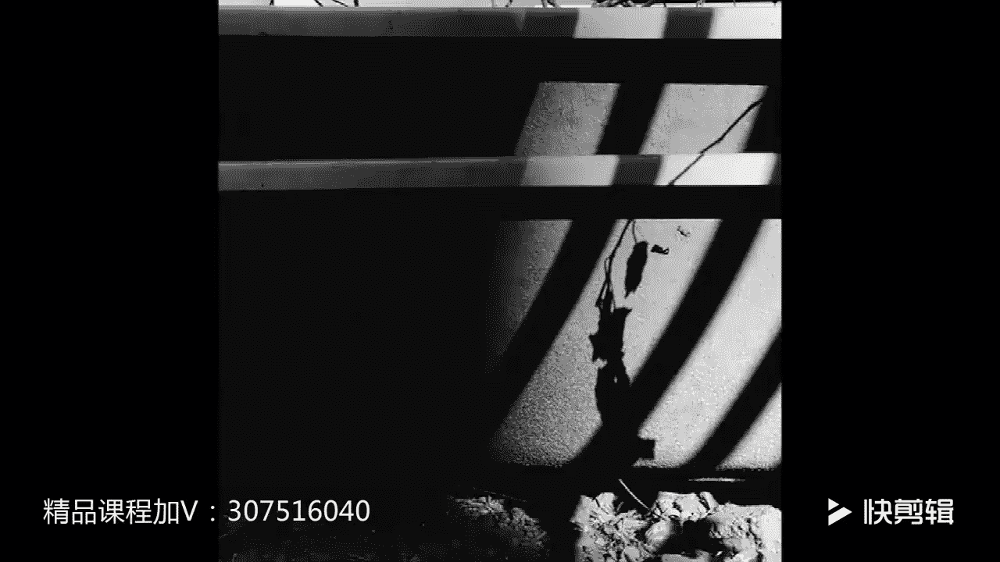

# 贾树森-手机摄影高手（完结）：3：【高手】24种生活场景模拟拍摄训练：第6讲 怎样拍好全家福？📸

## 概述
在本节课中，我们将学习如何拍好一张全家福。全家福是家庭影集中不可或缺的照片，其拍摄背后有许多实用技巧。我们将从背景选择、光线运用、设备准备、人员安排、服装搭配到创意构思，系统地讲解拍摄要点。最后，我们还将通过一个真实的拍摄案例，学习如何应对拍摄中最常见的挑战——引导不配合的孩子，并分享一些确保拍摄顺利的注意事项。

---

## 背景与光线的选择
上一节我们概述了课程内容，本节中我们来看看拍摄全家福的第一步：选择背景和光线。

拍摄全家福时，背景的选择至关重要。无论在室内还是室外，都应尽量选择干净的背景，或是对家庭有特殊纪念意义的背景。

在光线的选择上，应尽量采用**顺光**或**略侧一点的光线**。如果在室内拍摄，要选择光线明亮的地方，并确保每个人的脸部都能获得均匀的照明。

---

## 拍摄设备与附件
了解了环境的选择后，我们来看看需要准备哪些工具。

拍摄全家福一个必要的附件是可以当作三脚架使用的自拍杆。如果带有遥控快门功能则更为理想。

以下是两种常见的拍摄方式：
*   **使用三脚架或自拍杆**：这是最稳定和理想的方式，便于构图和遥控拍摄。
*   **应急方法**：如果没有三脚架，有时甚至需要借助镜子等物品来完成拍摄，但这通常不够稳定。

一种两用的自拍杆比较灵活实用，特别适合在旅途中或无法架设三脚架的小范围场景下使用，例如拍摄一家三口的合影。此时通常使用手机的前置摄像头，便于从屏幕上观察和调整表情与动作。

**注意**：手持自拍杆的人不要离手机镜头太近，否则容易产生严重的透视变形，使人显得过大或过胖。

---

## 人员安排与构图技巧
准备好设备后，我们需要安排人物的位置。

如果家庭成员较多，需要提前规划每个人的站位。例如，可以按照小家庭为单位进行排列。同时，要特别注意是否有人被前排的人挡住。

如果家庭成员较少，可以尝试更有创意的排列方式，例如从前往后排成一列。

**对焦技巧**：此时，对焦一定要对在**最前面这个人**的脸上，并且**锁定焦点**（锁定焦点的方法在前面的课程中已讲解）。同时，将曝光调整到合适的位置。

---

## 服装与创意构思
安排好人员后，我们来看看如何让照片更具特色和纪念意义。

拍摄全家福时，最好大家都能盛装出席。穿着有特色的服装（如唐装）或亲子装效果更佳。如果没有，大家尽量穿着相对漂亮、整洁的服装即可。

当然，拍全家福最重要的是人都在场，这就是最幸福和开心的。

如果觉得传统的站立合影缺乏新意，可以尝试改变策略，加入一些创意。

以下是几种创意拍摄思路：
*   **设定情境抓拍**：例如，设定一个玩耍的场景（如踩水），在过程中进行抓拍，能捕捉到自然开心的瞬间。
*   **尝试特殊角度**：例如，把手机放在地面上向上**仰拍**，可以获得独特的视角。
*   **拍摄局部特写**：更大胆一点，可以只拍摄身体的某个局部，例如一家三口的脚或拖鞋，甚至可以用三片心形的叶子来象征一家三口。
*   **借鉴他人灵感**：如果暂时没有好点子，也可以从别人的优秀作品中汲取灵感。

---

## 实战案例：引导不配合的孩子
学习了各种前期准备和创意后，本节我们通过一个实战案例，来看看拍摄中可能遇到的最大挑战——如何引导不愿意拍照的孩子。

案例背景是在三亚酒店泳池边拍摄全家福。选好顺光、背景（泳池、酒店、椰子树、蓝天白云）优美的位置后，架好三脚架，对焦并锁定曝光，安排好其他家庭成员的位置。

**遇到的问题**：孩子（小树）正玩得高兴，不愿意过来拍照。

**解决方案一：耐心引导**
首先，大人们都看向相机，并尝试耐心引导孩子也看向相机方向。**切记不要强迫或斥责孩子**，否则容易引发逆反心理，导致孩子情绪低落，拍摄失败。此时家长可以分工，一人引导，另一人伺机抓拍。

**解决方案二：互动打破僵局**
引导效果有限后，可以改变策略。例如，将孩子抱起来玩耍。动态的互动能打破僵局，在此过程中容易抓拍到生动的瞬间。本案例中由树妈负责抓拍。

**解决方案三：利用好奇心**
查看已拍摄的照片，并表现出惋惜（如“小树没在照片里太可惜了”），利用孩子的好奇心，引导他主动参与到拍摄场景中。

**核心要点**：面对孩子，家长需要极大的耐心，通过游戏和互动，一步步将其引入拍摄状态。这个过程本身也能抓拍到许多自然、有趣的瞬间，这些是摆拍难以获得的。

---

## 重要注意事项
在案例的最后，有两个关键细节需要大家特别注意。

**1. 注意室外光线的变化**
在室外拍摄时，需随时注意光线变化。特别是当空中有云被风吹动时，光线可能忽明忽暗。由于拍摄全家福时我们通常**锁定了曝光**，相机不会自动调整，因此需要手动重新调整曝光值，避免曝光失误。

**2. 确保三脚架稳定**
在室外使用小型三脚架时，务必将其放稳。可以找一个较重的物体压住三脚架的支脚，防止其被风吹倒或碰倒，避免手机损坏（如掉入水中或草丛中）。

---

## 总结
本节课中，我们一起学习了拍摄一张优秀全家福的完整流程。我们从干净的背景和均匀的光线开始，准备了自拍杆或三脚架等设备，学习了如何安排人员站位和锁定对焦。接着，我们探讨了通过服装和创意构思提升照片趣味性的方法。最后，通过一个详细的实战案例，重点掌握了如何耐心引导不配合的孩子，并记住了在室外拍摄时注意光线变化和确保三脚架稳定这两个关键细节。希望这些技巧能帮助你为家庭留下更多温馨美好的回忆。