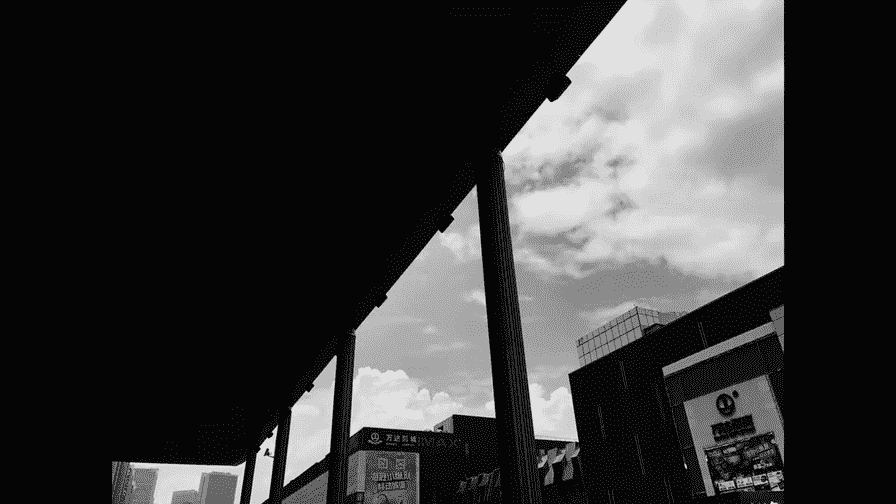

# 手机摄影高手：3.7：如何在恶劣天气下拍好照片？（2）

在本节课中，我们将继续学习在阴天、雨天、雪天等恶劣天气下的拍摄技巧。我们将探讨如何利用这些天气的独特条件，通过色彩、倒影、细节和后期处理等手段，创作出富有表现力和艺术感的照片。

上一节我们介绍了恶劣天气下拍摄的基本思路，本节中我们来看看具体的拍摄手法与构图技巧。

## 利用色调对比增强画面立体感 🌫️

在阴天拍摄时，由于光线柔和、反差较低，画面容易显得平淡。此时，可以通过安排深浅色调的景物来形成对比，从而增强照片的影调层次，使画面更加立体和丰富。

## 为画面注入鲜艳色彩 🌈

同样因为阴雨天气光线平淡，可以主动为画面增加鲜艳的色彩元素，以打破沉闷，让照片生动起来。

以下是几种增加色彩的方法：
*   为拍摄对象（如孩子）换上颜色鲜艳的服装。
*   使用颜色鲜艳的道具或工具。
*   在画面中有意纳入色彩鲜艳的环境元素，如柱子、花朵或树木。

## 巧妙利用积水与倒影 💧

雨天产生的积水是绝佳的创作元素。可以利用小水坑、车辙甚至桌面上的积水拍摄有趣的倒影照片。拍摄后，将照片旋转180度，往往能获得意想不到的视觉效果。

## 聚焦玻璃上的水珠与雨滴 🔍

玻璃上的水珠非常适合表现特定的氛围和情绪。可以靠近并对焦在水珠上，此时玻璃外的景物会变得虚幻，营造出梦幻的感觉。

## 尝试留白构图 ☁️

在阴雨天或雪天拍摄时，可以借鉴国画中的“留白”手法，在构图中刻意保留大面积的天空或雪地。这种构图能给人留下丰富的想象空间。

## 使用黑白模式强化情绪 ⚫⚪

当景物色彩不够出彩或比较单一时，可以尝试使用黑白模式进行拍摄或后期处理。黑白影调能剥离色彩的干扰，更纯粹地突出景物的形态、质感和你想要表达的情绪。

## 捕捉闪电的瞬间 ⚡

雷雨天气可以尝试拍摄闪电。以下是两种基础方法：
*   **使用连拍功能**：将手机对准可能出现闪电的天空区域，使用连拍模式持续拍摄，以增加捕捉到瞬间的几率。
*   **录制视频后截图**：录制一段视频，事后回放并截取闪电出现的那一帧画面。
> 更专业的拍摄方法（如使用特定软件）将在夜景拍摄章节中介绍。

## 关注细节与特写 📸

恶劣天气下，大场景之外，细节往往更具感染力。可以靠近拍摄水滴、雪地里的枯草、栏杆上的雪花、飘雪的空景，甚至是雪地上的足迹。这些特写镜头能传达更强烈的情感和信息。

## 把握雨雪过后的绝佳时机 🌤️

雨过天晴和雪后初霁是拍照的黄金时间。此时空气通透，景物焕然一新，光线质量极高。

*   **雨后**：万物被洗涤一新，天空可能出现彩虹，是拍摄清新、生动照片的好时机。

*   **雪后**：阳光下的雪地反光能提供良好的照明，且天气相对暖和。无论是顺光、侧光还是逆光，都能拍出光影效果出色的照片。

## 总结

本节课中我们一起学习了在恶劣天气下拍好照片的一系列进阶技巧。核心在于转变思维，将天气的“劣势”转化为创作的“优势”：
1.  通过**色调对比**和**鲜艳色彩**增强画面表现力。
2.  利用**积水倒影**和**玻璃水珠**创造独特视角。
3.  运用**留白构图**和**黑白模式**提升照片意境。
4.  主动捕捉**闪电瞬间**和**细节特写**。
5.  牢牢把握**雨雪过后**的最佳拍摄时机。

总而言之，即使在不太理想的天气里，只要用心观察和发掘，同样能拍摄出令人印象深刻的优秀作品。

