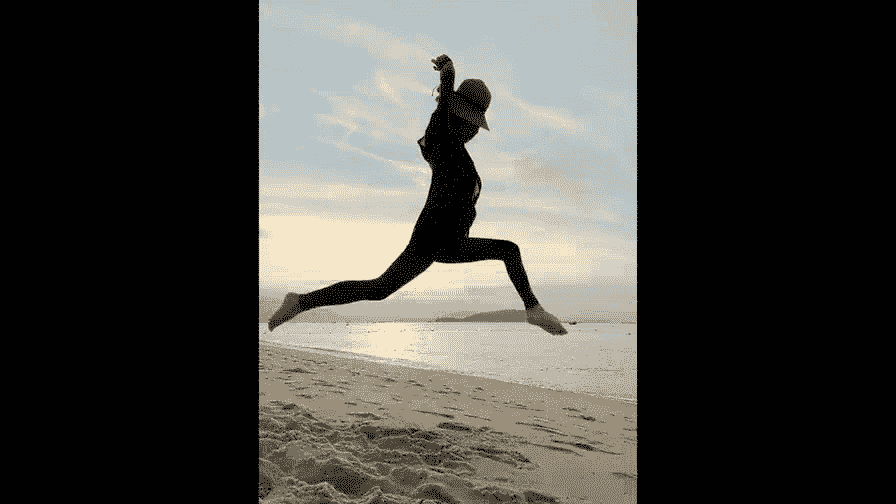

# 贾树森-手机摄影高手（完结）：3：【高手】24种生活场景模拟拍摄训练：第8讲 如何在汽车、火车、飞机上给孩子拍照片？

在本节课中，我们将学习如何在移动的交通工具（如汽车、火车和飞机）内，利用有限的光线和环境条件，为孩子拍摄出精彩的照片。我们将探讨光线运用、构图技巧以及如何应对动态环境带来的挑战。

## 汽车内拍摄

上一节我们介绍了课程概述，本节中我们来看看如何在汽车内进行拍摄。汽车内部空间有限，光线多变，是练习抓拍和用光的好场景。

### 利用车内光源

在光线不足时，可以巧妙利用车内现有光源进行补光。例如，阅读灯就是一个很好的照明工具。

以下是利用阅读灯的两个要点：
*   **顺光照明**：让阅读灯从正面照亮孩子的脸部。
*   **逆光照明**：利用另一侧的阅读灯为孩子勾勒出发丝光，增加照片的层次感。

### 使用辅助照明

当孩子活动范围变大、动作幅度增加时，仅靠阅读灯光线可能不足。此时可以使用手机手电筒作为辅助光源。**核心操作是：打开手机手电筒功能，对准拍摄主体进行补光。**

在车辆行驶中拍摄时，光线更不稳定。在不妨碍他人的前提下，使用手机手电筒补光可以获得更清晰的照片。此时需注意：
*   **端稳手机**：因为车辆颠簸，需要格外注意手持稳定。
*   **选择瞬间**：避免拍摄动作过快的瞬间，优先选择相对静止或动作缓慢的时刻。

### 白天拍摄与座位选择

白天光线充足，拍摄难度降低。重点在于把握光线方向和抓拍精彩瞬间。

在旅游大巴等大型车辆上，座位选择影响拍摄角度。以下是推荐的座位选择策略：
*   选择过道对面的座位。
*   选择孩子侧前方错开一个的座位。
这样便于获得更好的拍摄视角和构图空间。

## 火车上拍摄

在汽车上我们学习了利用光源和选择座位，接下来我们进入空间更宽敞的火车车厢。火车上拍摄面临杂物多、孩子易无聊等挑战。

### 整理环境与安排活动

拍摄前，尽量清理小桌板上的杂物，保持画面简洁。

孩子感到无聊时，可以安排一些活动，这既是亲子互动，也为拍摄提供了机会。以下是几种可行的活动安排：
*   **观看动画片**：控制好时间和距离，趁孩子专注时，从多角度进行抓拍，并可尝试利用前景构图。
*   **准备零食**：孩子吃东西时的表情和动作非常生动，是绝佳的抓拍时机。
*   **亲子互动与阅读**：家长陪伴玩耍，或准备与旅行相关的书籍（如《火车揭秘》），边看边实地探索，劳逸结合。
*   **探索车厢**：带孩子到车厢连接处等地方，满足他们的好奇心。

### 把握光线与构图

火车上的光线因窗外景物和隧道明暗变化而难以预测。我们需要快速调整曝光以适应光线变化。**核心操作是：在手机拍摄界面，点击屏幕对焦后，上下滑动旁边的太阳图标以调整曝光补偿。**

同时，构图时需注意避开过多无关乘客，以免打扰他人。

## 飞机上拍摄

结束了火车上的旅程，现在让我们登上飞机。飞机舱内空间紧凑，光线来源更为复杂。

### 窗边座位拍摄技巧

靠近舷窗的座位是首选，但通常会面临逆光问题。

以下是应对逆光的两种曝光策略：
*   **保证人脸明亮**：点击屏幕对孩子脸部对焦，并**向上滑动增加曝光**，防止脸变黑。
*   **表现窗外景物**：**向下滑动减少曝光**，让窗外景色清晰呈现。

### 利用舱内光源与角度

飞机阅读灯亮度高，但需注意光位。让孩子仰头看灯可获得顺光；如果灯光从头顶直射脸部，则会产生难看的顶光效果。

孩子初次坐飞机通常很兴奋，会好奇地触摸舷窗，这是值得记录的瞬间。

拍摄角度可以灵活选择。以下是几种有效的拍摄机位：
*   **同排相邻座位**：最理想的拍摄位置，互动和抓拍都方便。
*   **前后排缝隙**：利用手机小巧的优势，通过座椅缝隙进行抓拍。建议**关闭快门声音，使用静音模式**，更易捕捉自然瞬间。

### 改善中间座位光线

如果坐在没有舷窗的中间座位，光线会很暗。可以尝试以下方法改善：
*   打开前方椅背的屏幕，利用其光线。
*   打开阅读灯，并调整孩子或自身的角度，找到合适的光照方向。
*   请邻座乘客打开舷窗遮阳板，引入自然光。

飞机上拍摄综合考验对光线把握和瞬间抓拍的能力，需要多加练习。

## 拍摄窗外景色的技巧

在交通工具上，我们不仅拍摄孩子，有时也想记录窗外的风景。无论是静止还是行进中，拍摄窗外景色都有一些通用技巧。

当车辆静止时，拍摄窗外景物相对简单。一旦车辆开动，拍摄就会面临挑战。

以下是车辆行进中拍摄窗外景色的注意事项：
*   **防止抖动模糊**：车辆抖动容易导致照片模糊，需尽量稳住手机。
*   **理解动态模糊**：拍摄侧面景物时，近处的物体会被拉成线状虚影，距离越近虚化越严重。可以选择拍摄远处的景物，或近处没有大物体的场景。
*   **飞机舷窗拍摄要点**：
    1.  **避免眩光**：不要让阳光直射镜头。
    2.  **消除反光**：将手机镜头紧贴舷窗玻璃。
    3.  **精准对焦**：由于玻璃较厚，需仔细点击屏幕对焦，并手动调整曝光。

本节课中我们一起学习了在汽车、火车和飞机上给孩子拍照的全套策略。核心在于主动利用和创造光源（阅读灯、手机补光），巧妙安排活动以捕捉自然瞬间，并根据不同交通工具的特点灵活调整拍摄角度与曝光设置。记住，拍摄的本质是记录亲子关系与快乐时光。多加练习，你也能在旅途中留下珍贵的影像记忆。

