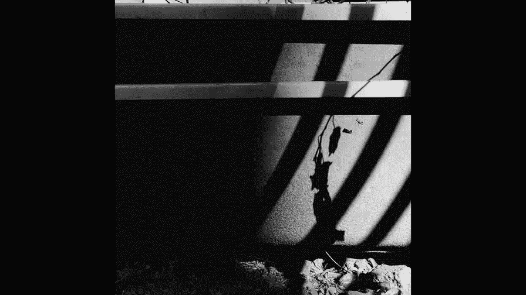
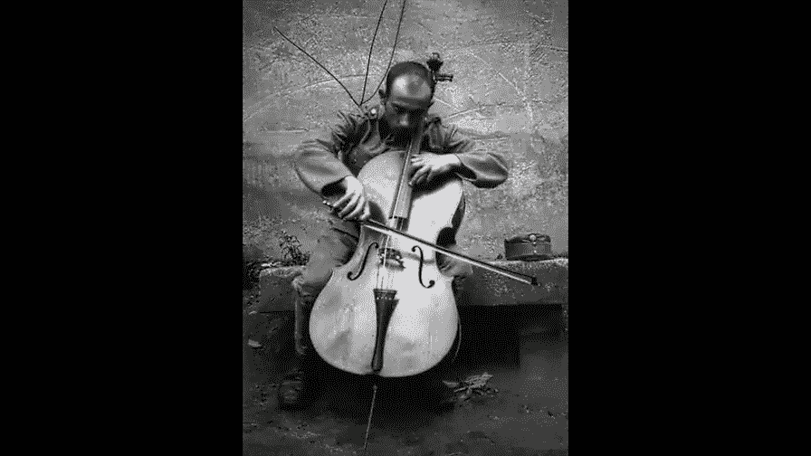
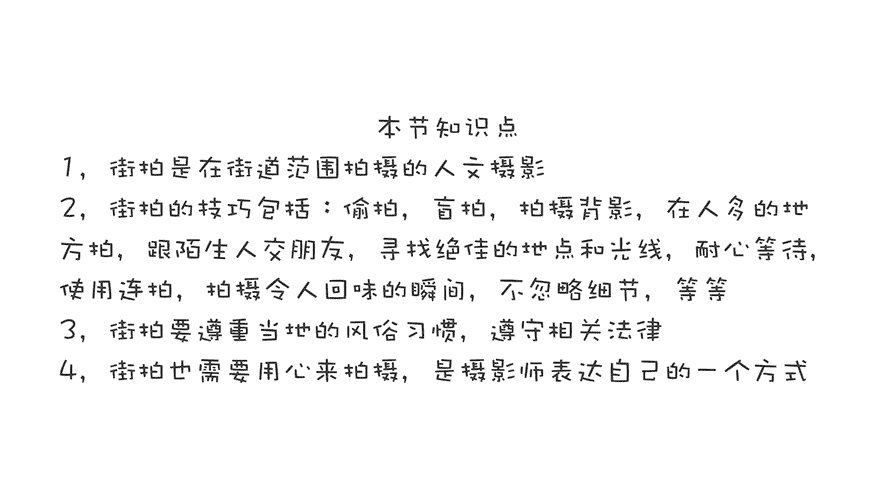

# 贾树森-手机摄影高手（完结）：3：【高手】24种生活场景模拟拍摄训练：第9讲 怎样在拥挤的街头抓拍？

在本节课中，我们将要学习如何在拥挤的街头进行抓拍。街拍是一种记录真实生活、捕捉动人瞬间的摄影形式。我们将从理解街拍的本质开始，逐步介绍一系列实用技巧，帮助你克服在公共场合拍摄的胆怯，并拍出富有故事感的作品。

## 理解街拍的本质 🧐

上一节我们介绍了课程概述，本节中我们来看看街拍的核心定义。

街拍的英文是“Street Snap”。“Street”指街道，代表我们走过的、看到的普通环境。“Snap”一词有快闪、仓促、突然以及“咔嚓”声的含义。

因此，“Street Snap”意味着在街道上快速、灵活地移动并猛然获取镜头。从这个名字中，我们可以理解街拍的两层核心含义：一是拍摄场地在街头，二是获取影像的方式是快速抓取。

街拍是一种以街道为基地的人文摄影。其作品具有强烈的真实感与生活氛围，优秀的街拍作品往往能轻易打动观者。

## 核心技巧：隐蔽与偷拍 📱

理解了街拍是什么之后，我们来看看如何具体操作。手机街拍的最大优势在于其隐蔽性。

以下是利用手机进行隐蔽拍摄的几个关键方法：

1.  **使用替代快门**：偷拍时不应使用屏幕上的大快门按钮。应改用手机的音量键或耳机线作为快门，这样动作更小，不易被察觉。

2.  **伪装动作**：可以将手机放在耳边，假装打电话，一边通话一边自然走过并拍摄。也可以将手机放在腰部位置，不看屏幕进行拍摄。

3.  **关闭快门声音**：在整个街拍过程中，务必关闭手机的快门声音。发出“咔咔”声等于明确告诉别人你在拍摄。

## 进阶技巧：盲拍与利用环境 🎯

掌握了基本的隐蔽方法后，我们可以尝试更进阶的技巧。

**盲拍**是偷拍中的一个特殊技巧，指完全不看屏幕，抬起手就拍。因为你看屏幕的动作很容易暴露意图。进行盲拍需要对手机镜头的取景范围有大致了解，这需要通过练习来掌握。

**利用视觉盲区**可以让我们更从容地拍摄。例如，坐在咖啡馆或餐厅的窗内拍摄窗外的人，对方通常难以察觉。玻璃的反光有时还能为画面增添有趣的元素。

**寻找掩护**是另一个有效策略。可以用家人、朋友作为掩护，一边拍摄他们，一边偷偷抓拍周围感兴趣的目标。这样不太容易被单独注意。

## 安全与伦理：拍摄策略与沟通 🤝

在街头拍摄他人时，尊重与安全至关重要。本节我们来看看如何在遵守伦理的前提下进行拍摄。

以下是几种相对安全且尊重被摄者的拍摄策略：

1.  **拍摄背影**：拍摄人物的背影相对安全，但要注意保持距离，避免被误认为跟踪者。
2.  **选择人多场合**：在公交站、十字路口、繁华商业区等人流密集处，人们忙于自己的事，很少会留意拍摄者。但即便如此，拍摄者自身也应尽量低调，不引人注目。
3.  **征得同意**：最稳妥的方法是上前沟通，征得被摄者的同意。即使语言不通，也可以通过手势（指指对方、指指手机）进行友好示意。很多时候，对方会欣然同意。
4.  **心照不宣的默许**：在拍摄街头艺人、表演者等公众场合的人物时，如果对方没有明确拒绝周围人的拍摄，通常可视为一种默许。但若条件允许，给予一些小额赞赏是很好的礼节。
5.  **保持距离，减少侵扰**：即使对方默许，也应保持适当的拍摄距离，不要凑得过近，以免给对方带来压迫感。可以通过后期裁剪来获得更紧凑的构图。
6.  **尝试交流与沟通**：如果有机会，可以先与被摄者聊天，了解他们的故事。建立初步联系后，拍摄会变得更自然，作品也可能更有深度。

## 提升作品质量：时机、视角与准备 ⏱️

解决了“怎么拍”和“拍谁”的问题后，我们来看看如何让街拍作品更出彩。

**学会等待**：当你发现一处绝佳的光影或背景时，可以预先构好图、对好焦，等待合适的人物进入画面，然后果断按下快门。在光线复杂的地方，预先调整好曝光参数尤为重要。

**改变视角**：尝试从非常规的角度拍摄，如过街天桥上俯拍公交站、从地面低角度仰拍、或从高楼向下拍摄。独特的视角容易带来新鲜的视觉感受。

**时刻准备**：让自己始终保持拍摄状态。有时在拍摄一个场景时，余光瞥见另一个精彩瞬间，要能迅速反应，调转镜头抓拍。

**寻找光与影**：在日出后或日落前的一两个小时（黄金时刻），光线柔和，角度低，适合拍摄。可以寻找有趣的光束或利用人物、物体投射的长长影子进行创作。

## 创作理念与心态 🧠

技巧是骨架，理念则是灵魂。让我们看看街拍大师们是如何思考的。

**多使用连拍**：对于快速移动的场景，如奔跑的小孩，使用连拍模式有助于捕捉到最精彩的瞬间。

**拍摄令人回味的瞬间**：街拍不是胡乱拍摄。要有选择地捕捉那些能打动人、引发思考或会心一笑的瞬间。

**关注细节**：不要只盯着高楼和行人。马路上的水洼倒影、墙上的斑驳痕迹、地上的特殊图案等细节，都是值得记录的素材，需要用心观察。

**核心原则：尊重与不打扰**：街拍的一个基本原则是尽量不打扰被摄者，最好能获得对方的默许或同意。要尊重当地的风俗习惯，遵守关于肖像权的相关法律法规。

最后，让我们用几位摄影大师的话来总结街拍的精神：

*   “摄影是观察的艺术，在平凡的地方找到有趣之处。”
*   “比按下快门更重要的是沟通。拍摄的意义在于获得故事。”
*   “按下快门之前，最重要的是去了解你拍的是什么。”
*   “决定性瞬间”：摄影是捕捉短暂创造性时刻的艺术，需要凭直觉按下快门。
*   “仅仅观察是不够的，你需要去感受你所拍摄的对象。” 即用心去拍摄，而不仅仅是用眼睛。

本节课中我们一起学习了街头抓拍的完整方法。我们从理解街拍的定义出发，学习了利用手机隐蔽性进行偷拍和盲拍的技巧，探讨了在人多场合、利用掩护等安全拍摄策略，以及征得同意、保持尊重的重要性。接着，我们提升了技巧层面，学会了等待时机、改变视角、时刻准备以及捕捉光影。最后，我们领悟了街拍的核心在于用心观察、感受并讲述故事，同时始终秉持尊重被摄者的伦理原则。记住这些要点，带上你的手机，勇敢而礼貌地去记录街头那些鲜活的故事吧。

