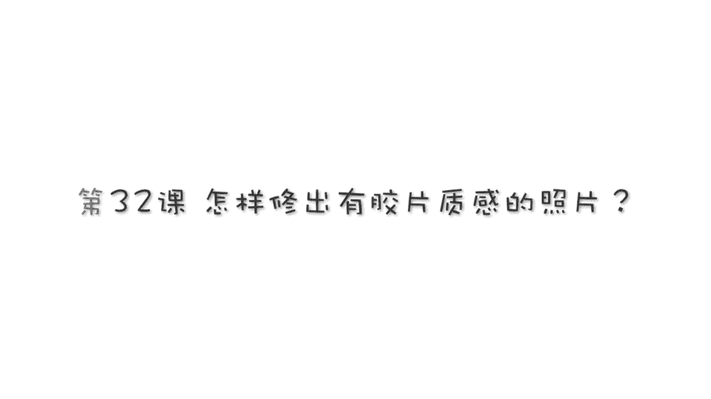
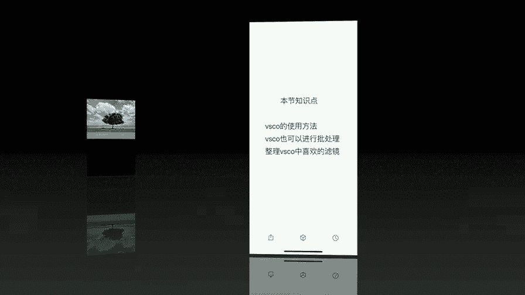

# 贾树森-手机摄影高手（完结）：4：【大神】超详细的后期修图软件教程：第1讲 怎样修出有胶片质感的照片？

在本节课中，我们将要学习如何使用VSCO这款手机应用，为照片添加独特的胶片质感。课程将从软件的基础操作开始，逐步讲解如何导入照片、应用滤镜、进行精细调整，并最终导出成品。无论你是苹果还是安卓用户，都能找到适合自己的观看和操作方法。

## 📱 课程观看设置

上一节我们介绍了课程主题，本节中我们来看看如何设置最佳的课程观看方式，以确保能看清所有操作细节。

以下是针对不同手机系统的设置步骤：

*   **苹果手机**：
    1.  在课程播放界面，点击画面中红色箭头所指的标志。
    2.  再次点击新出现的红色箭头所指的标志，即可切换到竖屏满屏状态。
*   **安卓手机**：
    1.  在课程播放界面，点击画面右上角的三个点。
    2.  在弹出的菜单中选择“画面比例”。
    3.  选择“放大裁切”选项，即可基本切换到全屏状态。

调整完成后，确保示例图片在您的手机上能够全屏显示。个别安卓品牌的操作可能略有不同，但核心目标是找到并切换到竖屏全屏模式。

## 🎨 VSCO 软件简介与准备

设置好观看方式后，我们正式进入修图环节。首先来认识今天的主角——VSCO。

VSCO 是一款主打胶片风格滤镜的修图应用。其基础功能免费，但部分高级滤镜和工具需要订阅。建议初学者先使用免费版本，试用期内如不打算付费，请记得及时取消订阅以避免自动扣费。

打开VSCO后，你会看到一个图片库界面。要修改照片，首先需要将照片导入到VSCO的相册中。

以下是导入照片的步骤：
1.  点击界面底部的加号（`+`）按钮。
2.  从弹出的手机相册中选择目标照片。你可以浏览所有相册，或像我一样，习惯先将精选照片放入“个人收藏”文件夹以便快速查找。
3.  点击照片进行选择（选中后会有黄框提示），可以多选。
4.  选择完毕后，点击底部的“导入”按钮。

这样，照片就成功导入到VSCO的相册中了。

## 🖼️ 核心修图流程：从滤镜到细节

照片导入后，点击任意一张即可开始编辑。为了更清晰地展示功能，我选择了一张构图稍有瑕疵的照片作为示例。

### 1. 应用与调整滤镜

进入编辑界面后，首先点击底部工具栏中间的两个横杠图标。下方会滑出一系列滤镜缩略图，每个都代表一种独特的胶片模拟风格。

以下是选择和应用滤镜的步骤：
1.  **选择滤镜**：浏览并点击一个你认为适合当前照片风格的滤镜缩略图（例如，偏红的、黑白的）。
2.  **调整强度**：选中滤镜后，其缩略图会放大。用手指在放大的缩略图上左右滑动，可以调整该滤镜的应用强度。公式可以理解为：`最终效果 = 原始照片 × 滤镜强度`。
3.  **微调参数（部分滤镜特有）**：有些滤镜（如示例中的“Kodak Portra”）还提供“强度”、“字符”、“温暖度”等额外滑块，可以进一步微调色彩倾向。调整完毕后点击对勾（`✓`）确认。

### 2. 基础参数调整

应用滤镜后，点击底部最左侧的图标，进入详细的参数调整面板。用手指上下滑动可以看到所有选项。

以下是主要的基础调整项目：
*   **曝光**：调整画面整体亮度。滑块向左变暗，向右变亮。
*   **对比度**：调整画面明暗反差。向左滑动降低对比度（画面变灰），向右滑动增加对比度（明暗对比更强烈）。通常可略微增加以增强质感。
*   **裁剪与拉直**：用于二次构图和校正水平。
    *   点击“裁剪”图标，可以选择固定的画幅比例（如3:2、16:9），或进行自由裁剪。
    *   “拉直”功能通过旋转照片来校正水平线。
    *   “倾斜”功能用于校正透视变形，包含X轴（水平）和Y轴（垂直）两个方向的调整。例如，要校正歪斜的楼房，主要调整Y轴滑块。
*   **锐化与清晰度**：两者都用于增强画面细节，但“清晰度”的影响更强烈，需谨慎使用，避免过度。
*   **饱和度**：控制色彩的鲜艳程度。向左滑动降低饱和度（趋向黑白），向右滑动增加饱和度。
*   **色调**：包含“高光”和“阴影”两个子项。
    *   **高光**：调整画面中最亮区域（如天空、白色物体）的明暗。
    *   **阴影**：调整画面中最暗区域（如阴影、深色部分）的明暗。提亮阴影过多会使画面发灰，通常需要结合“对比度”再次微调。
*   **白平衡**：包含“色温”和“色调”两个子项。
    *   **色温**：控制画面偏暖（黄）或偏冷（蓝）。
    *   **色调**：控制画面偏绿或偏洋红。初学者可先保持不动。
*   **肤色**：微调画面中皮肤颜色的倾向（偏红或偏黄）。
*   **暗角**：使照片四角变暗，突出中心主体。不建议调整过度。
*   **颗粒**：添加噪点颗粒，模拟胶片质感。可根据喜好轻微添加。
*   **褪色**：为照片添加一种灰蒙蒙的“过期胶片”效果。

### 3. 高级色彩工具（熟练后使用）

对于更进阶的用户，VSCO 还提供了以下工具，但它们会较大程度地改变滤镜的原始风格，建议熟悉基础操作后再尝试。

*   **色调分离**：可以分别为照片的“阴影”和“高光”部分添加独立的色彩色调。
*   **HSL（色相、饱和度、亮度）**：可以针对红、橙、黄、绿等单一颜色进行独立调整，而不会影响其他颜色。例如，代码逻辑类似于 `HSL(‘蓝色’).saturation += 10`，表示只增加画面中蓝色的饱和度。
*   **边框**：为照片添加不同颜色和宽度的边框。

**核心提示**：即使免费滤镜不多，通过深入调整上述各项参数，你也能创造出丰富多样的色彩风格。

## 💾 保存与导出作品

调整满意后，必须完成以下两步才能将修好的照片保存到手机系统相册中：

1.  点击右上角的“保存”按钮。这一步会将图片保存在 **VSCO的内部相册**里。
2.  返回VSCO主界面（相册库），点击照片右下角的三个点（`···`），选择“保存到设备相册”，并选择“实际尺寸”。这一步才将图片保存到你的 **手机系统相册**。

务必完成第二步，否则在手机自带的照片应用中将找不到修好的图片。

## ⚡ 效率技巧：批处理与滤镜收藏

最后，分享两个能提升修图效率的小技巧。

### 批处理相同场景的照片

在同一光线和场景下拍摄的多张照片，可以使用“复制编辑”功能快速统一风格。

以下是操作步骤：
1.  修好第一张照片后，在其预览页点击右下角三个点（`···`），选择“复制编辑”。
2.  进入另一张待处理的同场景照片，同样点击三个点（`···`），选择“粘贴编辑”。
3.  粘贴后，照片会应用相同的滤镜和参数（**但裁剪、拉直、倾斜等几何校正无法粘贴**）。你可以在此基础上进行微调，然后保存。

### 收藏常用滤镜

面对众多滤镜，可以将常用的标记为收藏，方便快速选取。

操作方法是：在滤镜选择界面，点击任意滤镜缩略图右上角的五角星（`★`）图标。被收藏的滤镜会集中显示在列表最前端。

## 📝 课程总结

本节课中我们一起学习了如何使用VSCO为照片添加胶片质感。我们从课程观看设置开始，逐步掌握了软件的导入、核心修图流程（滤镜应用、基础与高级调整）、成果保存与导出，以及批处理和滤镜收藏两个实用效率技巧。

VSCO 是一款相对容易上手的软件，真正的难点在于对色彩感觉的把握。提升审美没有捷径，需要多看优秀作品，并用自己的照片多做尝试，通过不断调整参数来积累经验，最终形成自己的色彩风格。

