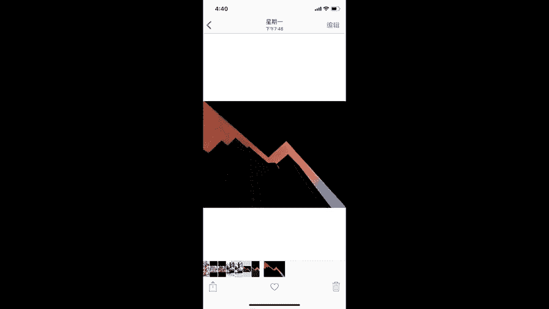
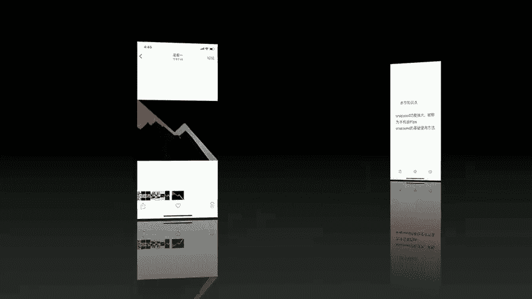
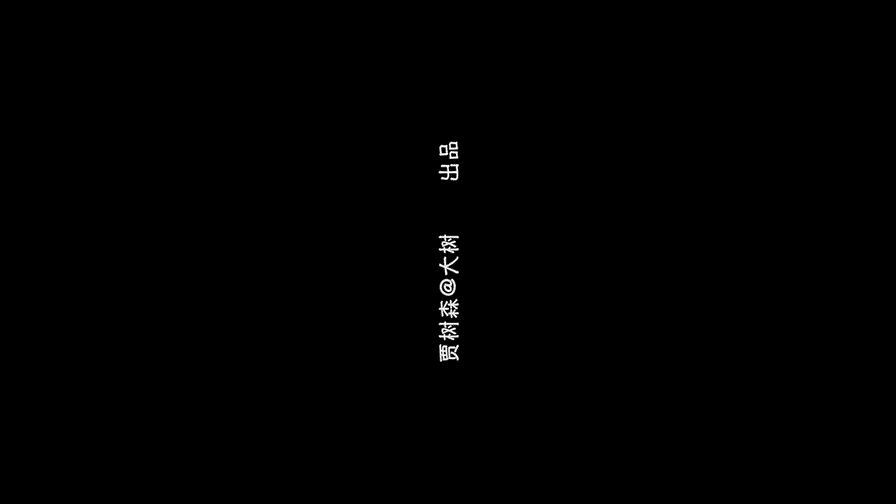

# 贾树森-手机摄影高手（完结）：4：【大神】超详细的后期修图软件教程：第2讲 为什么Snapseed被称为手机版的PS？

在本节课中，我们将要学习Snapseed这款强大的手机修图软件。我们将了解它为何被称为“手机版Photoshop”，并详细讲解其核心功能、基本设置以及一个完整的修图流程。课程内容简单直白，适合初学者上手。

## 课程准备与软件简介

在正课开始之前，需要将手机切换到竖屏全屏状态播放课程。切换方法上节课已详细说明，苹果与安卓手机操作不同，但目标都是全屏显示。

Snapseed在苹果系统上就叫Snapseed，在安卓系统中搜索可能显示为“指划修图”。这款软件由谷歌开发，功能全面且专业。

它被称为手机版Photoshop，主要是因为其功能繁多，类似于在电脑上用Photoshop修图的体验。Snapseed受到重视，除了功能强大专业，还因为其全部功能目前都是免费的。

## 软件设置与基本操作

在桌面上找到Snapseed图标，点击打开。首先说明设置问题，点击右上角三个点。

设置中，“保存到Snapseed相册”选项保持默认即可。最重要的是“导出和分享”选项。

第一项“调整大小”要选择“不要调整大小”。在“格式和画质”中，选择JPEG或PNG格式，画质选择100%，不改变任何画质。

接下来是如何打开一张图片。点击“打开”，通常选择“设备上的图片”。进入后，所有相册排列在此，例如所有照片或个人收藏。选择一张图片打开。

## 核心修图工具详解

图片打开后，点击“工具”。所有工具都列在这里。以下按照一个常规的修图顺序来介绍这些工具。

首先，观察图片是否存在问题，例如是否歪斜。如果图片歪了，需要使用“旋转”或“透视”工具进行调整。

### 旋转与透视调整

“旋转”工具点开后，软件会自动进行调整。如果自动调整后仍不正，可以用手指在屏幕上左右滑动进行微调。

如果水平调直后竖线条还不直，说明不仅仅是水平旋转能解决的，这时需要使用“透视”调整。

透视工具中，“倾斜”功能与上节课讲的VSCO里的倾斜一样，可以调整X（水平）和Y（垂直）方向。这里也有旋转功能。

在进行这些调整时，图片四角可能会出现黑色空缺，Snapseed会自动填充这些角落，这是它与VSCO不同的地方。填充效果有时很好，有时可能稍有问题，有问题的地方之后可以裁剪掉。

### 裁剪图片

调整好透视后，接下来看边缘是否需要裁剪。进入“工具”中的“剪裁”。

第一项是自由裁剪，可以推动任意一个角进行裁剪。也可以选择其他有固定比例的模式，如原图比例、正方形等。根据实际情况决定是否裁剪。

### 基础色彩与光影调整

接下来使用“调整图片”工具。点开后，用手指上下滑动可以选择不同的调整项目，如亮度、对比度、饱和度、氛围、高光、阴影、暖色调等。

选中一个项目（如饱和度）后，在屏幕上左右滑动即可进行调整。这就是“指划修图”名称的由来。

例如，如果图片稍暗，可以提亮亮度。但提亮后，天空或白墙可能失去层次，这时可以调整“高光”将其压暗。调整“阴影”可以提亮暗部。“对比度”可以增加或减少明暗反差。

“氛围”调整会影响照片整体的感觉，包括明暗分布和颜色。“暖色调”调整的是照片的色温，向右滑动变黄（暖），向左滑动变蓝（冷）。

### 白平衡与局部调整

Snapseed有专门的“白平衡”工具来调整色温和着色，功能与VSCO类似。

如果觉得人物脸部特别暗，可以使用“局部”工具。点开“局部”，在蓝色加号状态下，在需要修改的部位（如脸部）点一下，会出现一个“亮”字。

在屏幕上左右滑动可以调整该区域的亮度。用两根手指在屏幕上做开合动作，可以控制调整区域（红色显示部分）的大小。上下滑动屏幕，还可以切换调整“对比度”、“饱和度”、“结构”等项目。

### 结构与锐化

“突出细节”工具里包含“结构”和“锐化”。“结构”类似于VSCO里的“清晰度”，能让照片变得更清楚，但不宜调整过多，一般10-15即可。向左调整会使照片变模糊，可用于皮肤柔化。

“锐化”对照片影响相对较小，可以略微多调一些。

### 画笔工具

“画笔”是Snapseed里常用的工具。点开后，有加光减光、曝光、色温、饱和度四个选项。

加光减光和曝光调整的是同一性质，但曝光程度更强，通常使用加光减光即可。色温和饱和度可以局部作用于照片。

选择强度（如“5”），然后在需要调整的区域涂抹。如果不满意，可以选择“橡皮擦”擦除修改。可以放大图片进行精细涂抹，例如提亮面部、帽子边缘或阴影中的腿部。

### 修复与滤镜工具

“修复”工具用于去除画面中的杂物。用手指在需要去除的物体上涂抹即可。对于简单物体或远离边缘的区域效果较好；靠近边缘时修复效果可能不理想。

“HDR”工具包含自然、人物、精细、强等模式，对图片影响较大，容易使图片失真。使用时需注意将“滤镜强度”调低，并可以同时调整亮度和饱和度。它能在一定程度上找回层次，但效果有限。

“戏剧效果”工具对图片影响也很大，包含戏剧1、戏剧2、明亮等预设。其默认滤镜强度很高，使用时通常需要调低强度，并可能需将降低的饱和度加回来。

### 曲线工具

“曲线”是Snapseed里比较好用的工具之一。它提供“中性”、“柔和对比”、“强烈对比”等预设。如果原图素质好，使用“柔和对比”可能就能解决大部分问题。

也可以手动调整曲线，但相对复杂，需要多加练习。

### 镜头模糊与晕影

“镜头模糊”工具可以模拟背景虚化效果。默认是圆形虚化，可以移动、缩放虚化圈，并调整模糊强度和过渡区域的大小。过渡区域不宜过小，否则虚化会不自然。该工具还可以直接添加晕影（四角变暗）。

还有单独的“晕影”工具，可以调整晕影的大小、位置和强度。

### 文字工具

“文字”功能比较简单，有具体文字提示，操作起来没有难度。

## 修图流程与样式应用

关于工具的使用顺序，可能会让初学者感到困惑。通常的修图顺序是：
1.  先使用“透视”和“旋转”调整，解决照片的歪斜问题。
2.  然后进行“剪裁”。如果先剪裁再做透视旋转，画质可能会受损。
3.  接着使用“调整图片”等进行色彩光影修正。
4.  最后进行“锐化”等细节处理。

“样式”菜单中，“上次修改”可以将上一张图片的大部分修图操作应用到当前图片上。但有些操作如裁剪、旋转、透视、局部调整等不会生效。

样式里也提供了一些预设滤镜（英文字母显示），但无法调整滤镜强度。

## 导出与总结

修图完成后，点击“导出”，选择“保存副本”，图片就会保存到手机相册中。

本节课中，我们一起学习了Snapseed被称为手机版PS的原因，掌握了其基本设置、核心工具的使用方法以及一个标准的修图流程。通过调整透视、裁剪、基础调色、局部处理、应用滤镜等步骤，我们可以显著提升手机照片的质量。下方是使用Snapseed修图前后的对比示例。

今天的分享就到这儿，我们下次再见。

