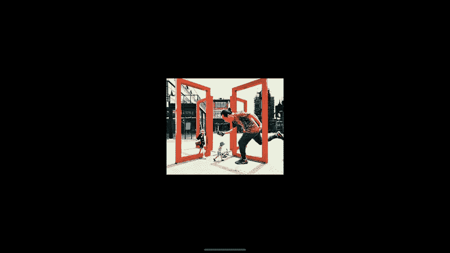
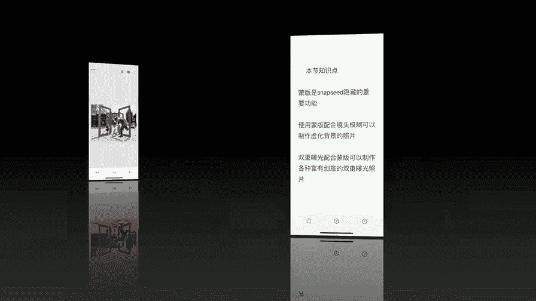

# 手机摄影高手：4.3：Snapseed蒙版功能详解 🎨

在本节课中，我们将要学习Snapseed中一个强大但隐藏的功能——蒙版。蒙版并非一个独立的工具，而是需要与其他工具结合使用，它能让你将修图效果精确地应用到照片的特定区域，从而实现更精细、更专业的后期调整。

---

## 概述

蒙版功能允许你控制某个修图工具的效果只作用于照片的某一部分，而不是整张图片。这就像给照片的某些区域“戴上面具”，保护它们不受调整的影响，或者只让调整效果出现在你指定的地方。接下来，我们将通过几个具体案例，一步步学习蒙版的基础和进阶用法。

---

## 蒙版基础：选择性应用HDR效果

上一节我们介绍了蒙版的核心概念，本节中我们来看看如何实际应用。我们首先学习如何用蒙版控制HDR工具的效果范围。

1.  **打开图片并应用工具**：在Snapseed中打开一张风景照片。首先使用 **“HDR景观”** 工具（选择“自然”样式），将滤镜强度调整为`29`。此时可能天空部分效果过强，而地面景物效果合适。
2.  **进入蒙版编辑界面**：点击右上角的 **“图层编辑”** 图标（或“查看修改内容”）。在历史操作列表中，找到“HDR景观”步骤，点击中间的 **“画笔”图标**。这就进入了蒙版编辑模式。
3.  **使用画笔擦除效果**：我们的目标是保留地面（山和树木）的HDR效果，但消除天空的过强效果。因此，我们需要**擦除**天空区域的效果。
    *   将图片放大，以便精细操作。
    *   使用手指在天空区域涂抹。被擦除的区域将显示为红色（表示效果被隐藏）。
    *   仔细处理天空与山峦的交界处，确保过渡自然。
4.  **调整效果强度**：如果希望天空保留部分HDR效果，可以调整画笔的**不透明度数值**（位于屏幕底部）。例如，将数值设为`50`，然后在天空区域涂抹，这样该区域将只应用50%的HDR强度。
5.  **完成并退出**：涂抹完成后，点击右下角对勾，然后再次点击对勾退出蒙版编辑。现在，HDR效果就只精确地应用在了你希望的区域。

**核心操作公式**：`应用工具` → `进入“查看修改内容”` → `选择工具步骤的画笔图标` → `用画笔（可调不透明度）涂抹以显示/隐藏效果`。

---

## 进阶应用一：制作背景虚化（景深）效果

了解了基础用法后，我们可以利用蒙版实现更复杂的效果，例如为人像照片模拟出单反相机的大光圈虚化背景。

以下是制作背景虚化效果的步骤：

1.  **校正图片**：首先使用 **“透视”** 和 **“旋转”** 工具将照片调正。
2.  **应用镜头模糊**：进入 **“镜头模糊”** 工具。将模糊的“圆圈”调小，并将“过渡”参数调到最低，使模糊效果集中在人物主体周围。此时整个人物也会被虚化，这没关系，先点击对勾确认。
3.  **使用蒙版恢复人物清晰度**：进入“查看修改内容”，找到“镜头模糊”步骤并点击其画笔图标。
4.  **精细擦出人物**：现在，我们需要**擦除**人物身上的模糊效果，让其变清晰。
    *   将图片放大，小心地沿着人物边缘涂抹，将人物主体完全擦出（显示为红色）。
    *   这是精细活，需要耐心以确保边缘处理干净，避免重影。
5.  **创建渐变虚化**：为了让虚化效果更真实（模拟景深渐变），我们可以调整画笔不透明度。
    *   设置`75`的不透明度，在紧贴人物背后的区域画一道。
    *   设置`50`的不透明度，在稍远的背景画一道。
    *   设置`25`的不透明度，在最远处的背景轻微涂抹。
    *   这样就能形成“人物清晰 -> 背景逐渐模糊”的自然过渡效果。
6.  **最终微调**：退出蒙版后，可以再用 **“局部”**、**“曲线”**（选择“柔和对比”）等工具对人物进行提亮和增强，最后进行裁剪。

---

## 进阶应用二：创意双重曝光合成

蒙版同样是实现创意双重曝光合成的关键。我们将学习如何将两张照片的人物自然地融合在一起。

以下是实现创意双重曝光的步骤：

1.  **选择并叠加图片**：打开一张背景照片（例如一扇门）。进入 **“双重曝光”** 工具，点击添加图标，选择第二张人物照片。
2.  **调整叠加元素**：添加后，可以移动、缩放或旋转第二张图片，将其放置在合适位置（例如让人物看起来正从门中走出）。选择一种叠加模式（如“默认”），并将**不透明度调到最高（100）**，然后点击对勾。
3.  **用蒙版“擦”出人物**：进入“查看修改内容”，找到“双重曝光”步骤并点击画笔图标。
4.  **精细合成**：
    *   此时画面上第二张图片暂时消失。我们需要用画笔（不透明度100）将人物部分仔细地“擦出来”。
    *   这是最关键的一步：需要处理人物与背景的遮挡关系。例如，人物腿部在门框后的部分**不应该被擦出来**，而门框则需要保留。这需要放大图片进行像素级的精细涂抹。
    *   如果擦多了，可以将画笔不透明度调为`0`，去擦除多余的部分。
5.  **添加创意细节（可选）**：合成后，你可以复制人物图层，将其翻转、压暗并降低不透明度，为其在地面上制作一个投影，以增强立体感和真实感。

---

## 总结

本节课中我们一起学习了Snapseed蒙版功能的强大之处。我们掌握了：
1.  **蒙版的核心逻辑**：通过“查看修改内容”中的画笔，选择性应用或隐藏任何工具的效果。
2.  **三个核心应用场景**：
    *   **局部调整**：精确控制如HDR、滤镜等效果的生效范围。
    *   **模拟景深**：结合“镜头模糊”工具，为人像制作专业的背景虚化。
    *   **创意合成**：实现复杂的双重曝光图像融合。
3.  **成功的关键**：**耐心和精细的边缘处理**。放大图片进行操作是获得自然、无痕迹效果的必要步骤。

蒙版是提升手机摄影后期水平的分水岭工具，它赋予了你的创作极大的精确度和灵活性。多加练习，你就能轻松驾驭它，将你的创意完美地呈现出来。