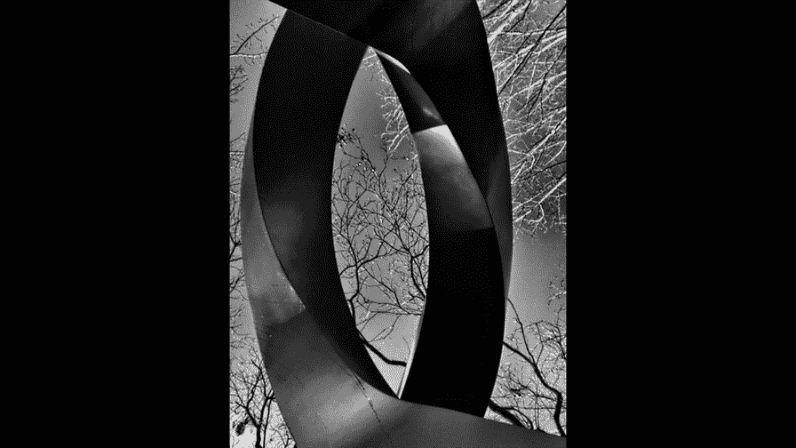
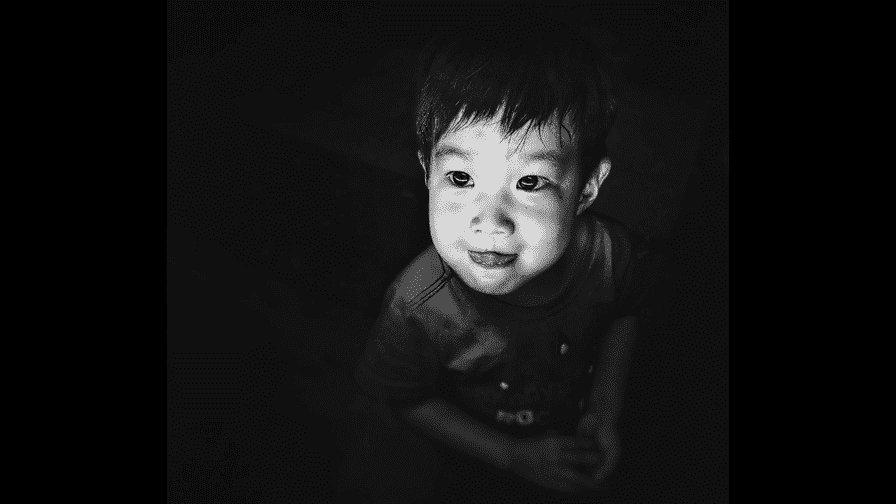

# 贾树森-手机摄影高手（完结）：4：【大神】超详细的后期修图软件教程：第4讲 照片怎样调黑白

在本节课中，我们将要学习如何将彩色照片转换为黑白照片，并探讨哪些类型的照片适合进行这种转换。我们还将介绍使用Snapseed软件进行黑白转换的具体步骤和技巧。

---

我们常听到一种说法：将照片转为黑白可以提升艺术感。但并非所有照片都适合转为黑白。彩色照片讲究色彩搭配，而黑白照片则强调**对比**。许多彩色照片的问题不在于拍摄本身，而在于画面中某些元素的色彩过于跳跃，干扰了主体表达。将这些照片转为黑白，可以有效减少色彩干扰，引导观众的视线聚焦于主体。

那么，究竟什么样的照片适合转为黑白呢？以下是几种典型情况。

### 适合转为黑白的照片类型

以下是四种适合将彩色照片转换为黑白的情况。

1.  **阴影占比大、明暗对比强烈**：当照片中有大面积的阴影，且明暗对比特别强烈时，转为黑白可以加强照片的视觉冲击力。
2.  **需要摆脱色彩干扰**：在户外拍摄时，有时会遇到难以改变的背景，其颜色过于喧宾夺主。转为黑白能让主体受到更少的干扰。
3.  **需要突出纹理与图案**：当拍摄主体涉及丰富的纹理（如砖瓦、线条）时，转为黑白可以强化这些纹理和图案的视觉效果。
4.  **需要表达特定情绪**：在拍摄人物或需要传递强烈情感的照片时，转为黑白可以摒弃复杂的色彩，更突出人物的表情、细节和眼神，从而强化情感表达。

在决定是否将一张照片转为黑白之前，我们可以问自己几个问题。

### 转为黑白前的四个自问

在转换前，通过回答以下四个问题，可以帮助我们做出更明智的决定。

1.  **色彩是否必需？** 观察照片最大的看点是颜色还是其他因素（如构图、光影）。如果色彩反而影响了主题表现，那么黑白就是一个很好的选择，它能削弱杂色，突出主题。
2.  **光影对比是否有趣？** 转为黑白后，颜色对比被弱化，**黑白灰的对比**得到加强。这能更纯粹地表现光和影的魅力。
3.  **纹理和轮廓是否独特？** 转为黑白后，照片中的纹理（如木头、金属、皮肤）会通过细微的层次调整得到强化，从而增强照片的冲击力。
4.  **想要表达何种情感？** 根据自己想要传递的情绪，决定是否转为黑白。黑白影调能营造安静、平和的氛围，让观众更专注于画面元素和主题。

黑白摄影是将五彩的现实世界抽象为黑、白、灰的影调。它剥离了色彩，却以独特的方式呈现真实，给人以更多的想象空间。

---

上一节我们探讨了黑白照片的适用场景，本节中我们来看看如何实际操作。你可以在拍摄时直接使用手机的黑白模式，但更推荐先拍摄彩色照片，再通过后期软件转换为黑白。这样可以在转换过程中进行更多调整和控制。

有多种手机修图软件可以实现黑白转换，例如VSCO、MIX等。本节课重点介绍使用**Snapseed**进行黑白转换的方法，因为它提供了更精细的控制选项。

### 使用Snapseed转换黑白的步骤

以下是使用Snapseed将彩色照片转换为黑白照片的详细操作流程。

1.  **打开Snapseed并选择照片**：启动Snapseed，从相册中选择一张想要处理的彩色照片。
2.  **进入黑白工具**：点击底部的`工具`，在列表中找到并选择`黑白`。
3.  **选择滤镜模式**：进入后，可以看到多种预设模式，如`对比`、`明亮`、`昏暗`、`胶片`等。可以逐一尝试，选择喜欢的基调。
4.  **调整亮度、对比度和颗粒**：点击中间的`调整`图标（通常是一个曲线或滑块符号），可以分别对`亮度`、`对比度`和`颗粒感`进行微调。上下滑动选择项目，左右滑动调整数值。
5.  **应用彩色滤镜（核心步骤）**：点击`彩色滤镜`图标（通常是一个圆形色轮），这里有**红、橙、黄、绿、蓝**五种滤镜。这是调整黑白影调关系的关键：
    *   **原理**：滤镜会让与其颜色相同或相近的部分在黑白照片中变得更亮。例如，选择`红色`滤镜，画面中红色的部分会变亮；选择`绿色`滤镜，绿色的部分会变亮。
    *   **作用**：利用这个原理，可以改变画面中不同颜色区域的明暗关系，从而突出或弱化某些部分，增强层次感。
6.  **结合其他工具优化**：完成黑白转换后，可以退出黑白工具，再利用`戏剧效果`、`调整图片`（氛围、高光、阴影）或`突出细节`（结构、锐化）等工具对整体影调和细节进行进一步优化。
7.  **保存导出**：调整满意后，点击`导出`保存照片。

### 操作实例演示

以一张风景照为例：
*   首先，使用`工具` -> `戏剧效果`适当增加画面反差和云的层次，并保留一定饱和度。
*   然后，进入`黑白`工具，选择`中性`模式。
*   接着，尝试不同的彩色滤镜，例如`黄色`滤镜可能让秋天的树木更明亮，`蓝色`滤镜可能让天空更深沉。选择效果最符合预期的一个。
*   之后，微调亮度、对比度。
*   最后，使用`突出细节`工具适当增加`结构`和`锐化`，让纹理更清晰。
*   对比原图，可以看到转为黑白后，云的层次和树木的纹理都得到了显著加强。

---

本节课中我们一起学习了黑白摄影的核心理念与后期技巧。我们了解到，适合转为黑白的照片通常具有强烈的明暗对比、需要摆脱色彩干扰、拥有独特纹理或旨在表达特定情绪。通过Snapseed的`黑白`工具，尤其是巧妙运用其**彩色滤镜**功能，我们可以主动控制画面中不同区域的明暗关系，将彩色照片转化为富有层次感和感染力的黑白作品。记住，黑白并非色彩的缺失，而是另一种更专注、更强烈的表达方式。