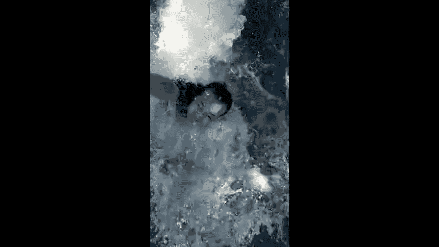

# 贾树森-手机摄影高手（完结）：4：【大神】超详细的后期修图软件教程：第5讲 为什么MIX被称为滤镜大师

在本节课中，我们将要学习MIX滤镜大师这款修图软件。MIX以其丰富的滤镜和强大的编辑功能著称，我们将详细介绍它的界面布局、核心功能以及具体操作方法，帮助你快速上手。

## 软件概览与初始设置 🛠️

MIX自称“滤镜大师”，其滤镜库非常庞大，官方宣称超过130款。虽然部分滤镜现已需要付费，但其免费资源依然相当丰富。更重要的是，经过多次更新，MIX已从一个单纯的滤镜应用，发展成一个功能全面的图片编辑工具。

与其他软件一样，首先需要在手机桌面找到MIX图标并点击打开。

进入软件后，你会看到主界面包含多个项目。**编辑**、**局部修整**、**艺术滤镜**和**照片海报**这四项是核心的编辑功能。**学院**栏目提供拍照和修图技巧，**商店**用于购买滤镜等商品，**我的**则是个人设置中心。

在开始使用前，建议先进行一些重要设置。点击右上角的**设置**图标。

以下是关键设置项：

*   **保存超高品质的图片**：建议勾选此项，以保证输出画质。
*   **保存图片时覆盖原片**：**切勿勾选**，以免误操作覆盖原始照片。
*   **将所有工具放入到编辑工具箱**：建议不勾选，以保持界面清晰。

完成设置后，我们就可以开始探索MIX的核心功能了。

## 核心编辑功能详解 ✨

上一节我们介绍了软件概览和初始设置，本节中我们来看看最核心的“编辑”功能。点击主界面的**编辑**按钮，即可从相册中选择照片进行编辑。

### 强大的滤镜系统 🎨

选择照片后，首先进入的是滤镜界面。MIX的滤镜系统是其核心优势，分为内置滤镜、自定义滤镜和收藏滤镜。

内置滤镜库按类别组织，例如“彩色反转片”、“拍立得”、“电影色调”等。每个类别下又包含多款具体滤镜。点击任意滤镜即可实时预览效果。选中滤镜后，界面下方会出现一个半透明滑块，用于**调整滤镜的应用强度**，这与VSCO的操作逻辑相似。

在众多滤镜中，**魔法天空**功能尤为突出。它能为平淡的天空替换成各种绚丽的效果，如晚霞、星空甚至极光，实现“一秒换天”。该功能的强度同样可以自由调节。

### 全面的调整工具 🔧

应用滤镜后，我们可以使用下方的调整工具进行精细处理。**调整**选项卡里包含了基础的图像参数。

以下是**调整**选项卡中的主要工具：

*   **亮度**：控制整体曝光。
*   **对比度**：增强或减弱明暗反差。
*   **高光/阴影**：分别调整画面亮部和暗部的细节。
*   **层次**：功能类似于Snapseed中的“氛围”，用于优化照片的整体影调分布。
*   **中心亮度**：提亮照片中心区域，效果上与添加暗角相反。

### 丰富的效果与纹理 🌈

**效果**选项卡提供了更多风格化选项，如胶片质感、美肤、天空特效等。这些效果种类繁多，建议逐一尝试以了解其特性。

**纹理**选项卡则用于添加特殊质感。

以下是**纹理**中的主要类别：

*   **眩光**：模拟镜头光晕效果。
*   **渐变/漏光**：添加色彩渐变或模拟胶片漏光。
*   **颗粒**：为照片增加胶片颗粒感。
*   **雨滴/天气**：模拟下雨、下雪等天气效果。
*   **舞台灯光**：添加各种光线效果。

这些纹理的效果强度、角度等参数大多可以调整，只需点击效果图标上的设置按钮即可进入详细调节界面。

### 进阶调整与剪裁工具 ⚙️

在工具列表的后半部分，是几项相对专业的调整工具，包括**虚化**、**曲线**、**色相/饱和度**、**色调分离**和**色彩平衡**。对于初学者，建议先熟练掌握基础功能，再逐步尝试这些进阶工具。

*   **虚化**：提供三种虚化方式，可用双指在屏幕上开合来调整虚化范围和强度。
*   **曲线**：与Snapseed中的曲线工具类似，可通过控制点调整影调，也提供了一些预设。
*   **色相/饱和度**：类似于VSCO的HSL工具，可以针对每种颜色单独调整其色相、饱和度和明度。

**剪裁**工具功能全面，不仅限于裁剪。

以下是**剪裁**工具内的主要功能：

*   **调整水平**：通过滑块校正倾斜的照片。
*   **长宽比**：提供多种预设比例或自由裁剪。
*   **旋转/翻转**：旋转图片或进行水平/垂直翻转。
*   **纵向/横向透视**：校正因拍摄角度导致的透视变形，分别对应Y轴和X轴方向的调整。
*   **拉伸**：可横向或纵向拉伸图像，用于微调人物身形（需谨慎使用，避免失真）。

## 其他功能模块探索 🚪

编辑完成后，点击右上角的三个点，除了保存图片，还有两个重要选项：**保存滤镜**和进入**局部调整**或**照片海报**。不过，更直接的方式是从软件主界面进入这些独立模块。

### 局部修整功能 🖌️

从主界面点击**局部修整**，可以选择照片进行局部处理。

该模块包含以下工具：

*   **涂抹**：可添加马赛克、荧光笔或各种图形（如星星）。
*   **去污点**：与Snapseed的“修复”功能类似，用于去除瑕疵。
*   **调整笔刷**：类似于Snapseed的“画笔”功能，可以局部调整曝光、色温等参数，并能调整笔刷大小、硬度和不透明度。
*   **渐变镜**：模拟摄影中的渐变滤镜效果（部分需付费）。

### 艺术滤镜与照片海报 🖼️

从主界面进入**艺术滤镜**，可以将照片转换为绘画风格的效果，如油画、素描等。应用后同样可以调整效果强度。

无论是从编辑界面还是局部修整、艺术滤镜界面，都可以便捷地跳转到**照片海报**功能。在这里，可以为照片添加文字、图形、边框等元素，制作成简易海报。模板中的文字可以双击编辑，并自由移动位置、更改字体和颜色。

需要注意的是，MIX的**编辑**、**局部修整**、**艺术滤镜**和**照片海报**这几个功能模块相对独立。例如，在“艺术滤镜”中编辑后，只能跳转到“照片海报”，若想使用“局部修整”，则需要先保存图片，再重新从主界面进入。这是软件设计上的一个小特点。

## 效果展示与总结 📝

以下是使用MIX修图后的效果对比，供大家参考。

本节课中，我们一起学习了MIX滤镜大师软件的基础使用方法。我们了解了其丰富的滤镜系统，特别是“魔法天空”等特色功能；探索了全面的调整、效果和纹理工具；也介绍了局部修整、艺术滤镜和照片海报等附加模块。MIX功能强大但层级较多，需要一定时间熟悉。掌握它的最佳方式就是多尝试、多摸索，根据实际需求灵活运用各项工具。

