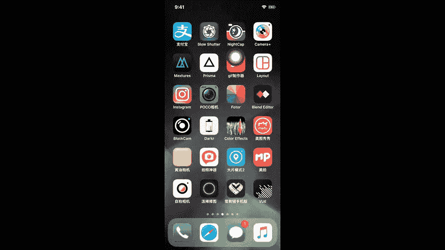
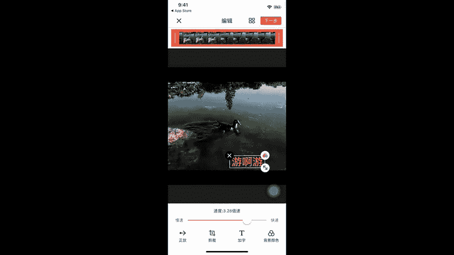
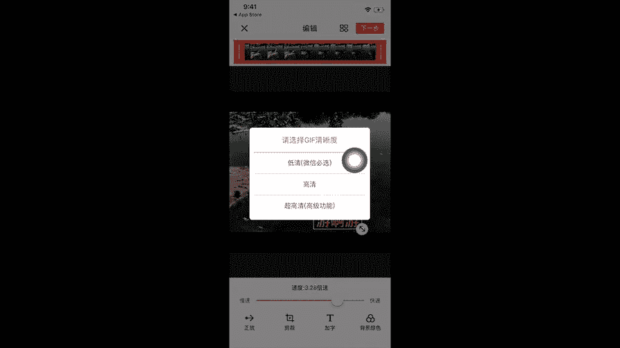
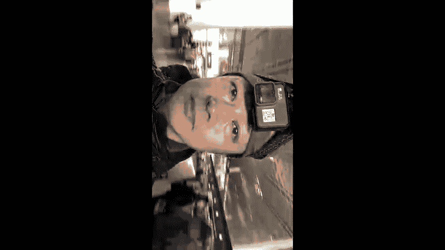

# 手机摄影高手：4：【大神】超详细的后期修图软件教程：第6讲 怎样做海报和动图(2) 🎨

在本节课中，我们将继续学习如何使用手机软件制作海报和动图。我们将重点讲解海报制作中“元素”功能的详细操作，以及如何使用另一款软件将连拍照片制作成可在微信中分享的动态表情包。

---

## 海报制作：元素功能详解

上一节我们介绍了模板和布局，本节中我们来看看海报制作中的“元素”功能。元素功能可以为你的图片添加文字、贴纸等装饰，让海报更具个性。

### 添加与编辑“花字”

以下是添加和编辑“花字”的步骤：

1.  点击“元素”功能中的“花字”选项。
2.  从提供的多种样式中选择一个。
3.  点击添加的“花字”，可以更改其文字内容、位置和大小。例如，双击文字区域即可重新输入。
4.  通过双指在屏幕上开合，可以调整文字的大小。

### 添加与编辑“文字”

除了花字，我们还可以添加普通文字。

1.  点击“文字”选项，双击文本框输入内容。
2.  点击字体选项，可以更换文字的字体样式。
3.  点击颜色选项，可以更改文字的颜色，例如红色、绿色或粉色。
4.  同样，使用双指开合调整文字大小，并拖动以改变其位置。

### 文字的高级样式设置

文字添加后，可以进行更细致的样式调整。

1.  点击透明度调节按钮（通常以“-”和“+”号表示），可以降低或提高文字的透明度。
2.  点击“A”图标（代表阴影、描边等功能），可以为文字添加阴影效果。
3.  点击“描边”选项，可以为文字添加轮廓边。
4.  点击“背景”选项，可以为文字添加一个底色背景。

### 添加与编辑“贴纸”

贴纸能为海报增添趣味性。

1.  在“贴纸”选项中，“基础图形”通常是免费使用的。
2.  选择喜欢的贴纸添加到画面中。
3.  点击贴纸，可以调整其大小、位置和旋转角度。
4.  点击颜色选项，可以更改贴纸的颜色，使其更醒目。

完成所有编辑后，点击保存按钮，即可将制作好的海报保存至手机。

---

## 动图制作：使用“GIF制作器”

制作动图我使用一款名为“GIF制作器”的软件。这款软件广告较多，但功能实用。

### 导入照片

以下是制作动图的第一步：

1.  打开软件，点击加号（+）按钮。
2.  选择“拼接照片”功能。建议选择使用手机连拍功能拍摄的一系列照片，这样制作出的动图会更流畅。
3.  从相册中选中多张连拍照片，点击完成导入。

### 调整动图效果

照片导入后，可以进行效果调整。

1.  速度调整：默认速度为1倍速。可以拖动滑块加快或减慢播放速度，通常稍快一些效果更好。
2.  播放顺序：可以选择正放、倒放或先倒后正等播放模式。
3.  裁剪图片：如果需要对画面进行裁剪，可以使用裁剪工具。

### 为动图添加文字

可以为动图添加自定义文字。

1.  点击“加字”按钮。
2.  输入想要的文字内容，点击确认。
3.  通过双指开合调整文字大小，拖动调整位置。
4.  点击调色板图标（红黄蓝圆圈），可以更改文字的颜色。

### 保存与分享至微信

这是将动图变为微信表情的关键步骤。

1.  编辑完成后，点击“下一步”。
2.  在保存页面，**务必**在画质选项中选择“**低清微信必选**”版本，否则无法在微信中分享。
3.  点击保存。保存后，在软件的作品列表中找到刚做好的动图。
4.  点击分享，选择“微信”。
5.  在微信聊天窗口中发送该动图。
6.  长按动图，在弹出的菜单中选择“**添加到表情**”。
7.  这样，自制的动图就保存到你的微信表情包中了。你可以在微信表情面板中，通过不断向右滑动找到“我的表情”收藏夹，里面就有你刚添加的动图。

---

本节课中我们一起学习了海报设计中元素（花字、文字、贴纸）的添加与深度编辑方法，并掌握了使用“GIF制作器”将连拍照片制作成微信动态表情包的完整流程。通过灵活运用这些工具，你可以轻松为照片增添创意，并制作出个性化的动态图片与朋友分享。

今天的分享就到这儿，我是大叔，我们下次再见。😊