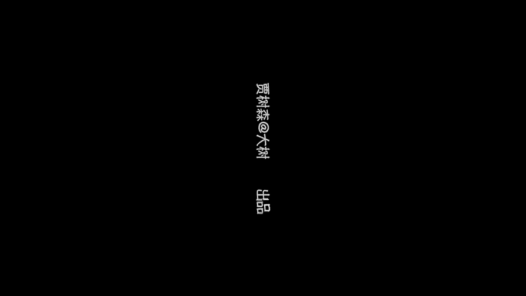

# 贾树森-手机摄影高手（完结）：4：【大神】超详细的后期修图软件教程：第7讲 如何去掉照片中的路人甲？

在本节课中，我们将学习如何使用一款名为 **Touch Retouch** 的专业修图软件，来高效、精准地移除照片中不需要的元素，例如路人、杂物和线条。

## 软件介绍与获取

上一节我们介绍了常规修图工具的局限性。本节中我们来看看一款功能更强大的专业工具。

拍摄照片时，背景中常会出现无法避开的干扰物，例如路人、塑料袋、电线或摄像头。对于这类复杂情况，普通修复工具难以处理。**Touch Retouch** 软件能有效解决这些问题。

以下是软件获取方式：
*   **苹果手机用户**：在 App Store 搜索 **“Touch Retouch”** 下载。该软件为付费应用。
*   **安卓手机用户**：在应用市场可能搜不到。可尝试通过“搜狗手机助手”等平台搜索 **“抠图大师”** 进行下载安装。安卓版本通常免费，安装时按提示授权即可。

## 核心工具详解

成功安装并打开软件后，我们从相册导入需要处理的照片。界面下方有一排核心功能按钮，我们将逐一详解。

### 1. 删除物体工具 🧹

此工具用于移除独立的物体。
*   **操作方式**：提供**画笔**和**套索**两种模式。用画笔涂抹或套索圈选需要删除的物体，选区会变为绿色。
*   **精细调整**：可使用**橡皮擦**修正多选的区域。处理边缘时，可放大图片进行精细擦除。
*   **执行删除**：编辑完成后，点击 **“Go”** 按钮，软件会自动计算并移除所选物体。

### 2. 快速修复工具 ⚡

此工具适用于快速点除小瑕疵。
*   **操作方式**：直接用手指点击或轻划需要移除的小型物体（如远处的小人、小杂物）。
*   **效果说明**：效果可能因物体复杂程度而异，有时需要多次尝试。

### 3. 线条删除器 🧵

此工具是处理照片中线条（如电线、绳索）的利器。
*   **操作方式**：选择“线条删除器”，在需要移除的线条上涂抹即可。软件会自动识别并清除整条线段。
*   **模式选择**：针对**连续长线**使用“线条删除器”；针对**短线段**可使用“线段删除器”。
*   **画笔粗细**：可调整画笔粗细以匹配不同粗细的线条。

### 4. 克隆图章工具 🖌️

这是进行精细修复和二次创作的核心工具，原理是复制图像的一部分来覆盖另一部分。

其设置包含三个关键参数，可用绘画来类比理解：
*   **大小 (Size)**：相当于画笔的粗细。公式表示为：`画笔直径 = 设定值`。
*   **硬度 (Hardness)**：相当于画笔边缘的软硬程度。硬度高边缘清晰，硬度低边缘柔和便于融合。
*   **不透明度 (Opacity)**：相当于颜料浓度。不透明度100%时完全覆盖，降低则呈现半透明叠加效果。

**操作步骤**：
1.  选择克隆图章工具，调整好参数。
2.  **取样**：在图像中你想复制的源区域点按一下（例如干净的天空）。
3.  **修复**：在需要覆盖的目标区域（如杂物处）涂抹，源区域的内容就会被复制过来。
4.  **技巧**：修复时务必留意左上角的预览放大镜，并随时根据修复区域重新取样，以保证修复效果自然。

## 实战修复流程

现在，我们综合运用以上工具来完成一张照片的修复。

**第一步：移除大件干扰物**
使用 **“删除物体”** 工具，圈选或涂抹照片中较大的、独立的干扰物（如躺卧的人），点击“Go”移除。

**第二步：处理线条杂物**
使用 **“线条删除器”**，轻松涂抹掉画面中的电线等线性杂物。

**第三步：精细修复与融合**
对于删除后留下的瑕疵、不自然的边缘或复杂背景，使用 **“克隆图章”** 进行精细修复。
*   修复边缘时，需**放大图片**，并**降低画笔硬度与不透明度**，使过渡更自然。
*   不断在附近相似区域**重新取样**，避免出现重复的图案。

**第四步：创意应用（镜像克隆）**
克隆图章的“镜像”模式可用于创意合成。例如，选择“水平镜像”后取样，可以在画面另一侧复制出一个镜像的人物，实现有趣的二次创作。多余部分可用橡皮擦工具擦除。

## 保存与设置

修复完成后，点击保存按钮。建议在设置中进行以下调整，以保证输出质量：
*   **格式**：通常选择 **JPEG** 即可。如需极高精度可选 TIFF。
*   **质量**：将 JPEG 质量设置为 **100%**。
*   **尺寸**：选择“原始”尺寸以保留最高分辨率。

## 效果对比与总结

本节课中我们一起学习了如何使用 **Touch Retouch** 软件。我们掌握了四大核心工具：
1.  **删除物体工具**用于移除独立物体。
2.  **快速修复工具**用于点除小瑕疵。
3.  **线条删除器**是清理电线杂物的神器。
4.  **克隆图章工具**是进行精细修复和创意合成的关键，其效果由 **大小、硬度、不透明度** 三个参数共同决定。

通过合理的工具组合与耐心操作，你可以有效清理照片中的任何干扰元素，让画面变得干净、专业。