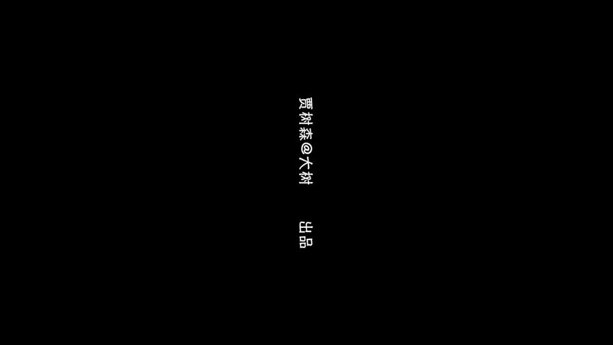

# 贾树森-手机摄影高手（完结）：4：【大神】超详细的后期修图软件教程：第8讲 后期软件能把照片修成虚化效果吗？

在本节课中，我们将要学习如何使用一款名为 **After Focus** 的手机软件，在后期为照片制作出媲美单反的虚化效果。我们将从软件获取、基础操作到高级虚化调整，一步步进行讲解。

## 软件获取与介绍

上一节我们介绍了其他修图工具，本节中我们来看看这款专门用于制作虚化效果的软件。

**After Focus** 是目前体验过的最好用的背景虚化软件之一，其效果可以媲美单反。苹果用户可以在 App Store 中搜索 “After Focus” 进行下载，其图标是一个类似小光圈的图案。该软件在苹果系统上为付费应用，价格约为12元。

安卓用户可能在应用商店中无法直接搜索到。经测试，可以通过手机浏览器搜索 “After Focus 汉化版” 进行下载安装。安装过程中可能会出现安全警告，选择继续安装即可，其好处是免费版本可用。

## 基础操作：制作静态虚化

打开软件后，我们首先学习如何为一张静态照片添加虚化效果。

在软件主界面点击中间按钮，从相册中选择一张照片导入。示例照片使用 iPhone X 前置摄像头拍摄，虽然手机自带虚化功能，但效果有时不理想、拍摄速度慢且对距离有要求。通过后期软件制作则更为简便。

以下是制作虚化效果的核心步骤：

1.  **划定清晰区域（焦点）**：进入编辑界面后，默认选中“焦点”模式（图标为铅笔）。在照片上人物或任何你想要保持清晰的地方涂抹，软件会以**白线**标记这些区域。
2.  **划定虚化区域（背景）**：涂抹完清晰区域后，点击切换到“背景”模式。此时照片整体会变红，未被红色覆盖的区域即为待虚化区域。你需要用画笔仔细涂抹背景，软件会以**黑线**标记。
3.  **精细处理边缘**：这是关键步骤。需要放大图片，仔细处理人物与背景的交界处，如发丝、衣物边缘。软件对复杂结构的识别可能不准确，需要手动修补。
4.  **使用魔法棒工具**：如果边缘有毛刺或过渡不自然，可以点击“魔法棒”工具。选择“背景”或“焦点”模式后，用画笔在过渡区域涂抹，软件会进行智能平滑。画笔大小可以调整。
5.  **撤销与重做**：如果某一步操作失误，可以点击撤销箭头进行后退，然后重新修补。

处理满意后，点击右下角的对勾进入下一步。

## 虚化效果调整

在上一部分我们完成了选区划分，现在来调整虚化的视觉效果。

点击水滴状图标，进入虚化效果调整界面。这里有两个主要控制项：

*   **虚化强度**：第一个滑块控制虚化的程度，数值越大背景越模糊。
*   **虚化模式**：第二个选项用于选择虚化类型。默认是**镜头虚化**，模拟相机光圈效果。另一种是**运动虚化**，可以模拟物体移动的动感模糊效果。

另一个重要设置是**渐变过渡**。使用默认模式时，背景可能 uniformly 模糊。点击切换按钮后，虚化会呈现从焦点到背景的渐变过渡，效果更接近真实单反拍摄，更为自然。通常建议启用此功能，并将虚化强度调整到适中水平，避免失真。

## 其他调整与特效

完成虚化调整后，软件还提供一些额外的编辑功能。

*   **基础调整**：可以应用少量滤镜，并微调曝光和对比度。
*   **特效（FX）**：点击 FX 图标，提供四项功能：
    1.  **暗角**：为照片四周添加暗角效果。
    2.  **色彩蒙版**：使焦点区域保留彩色，背景变为黑白。
    3.  **贴纸**：为照片添加装饰性贴纸。
    4.  **锐化**：提高画面清晰度。

这些效果均可点击开关进行启用或取消。

## 高级案例：制作动态虚化效果

之前我们处理了静态虚化，现在尝试用“运动虚化”模式制作追拍般的动感效果。

选择一张主体清晰、背景静止的照片（例如拍摄运动物体）。前期制作选区的步骤与静态虚化完全相同：用白线仔细勾勒出想要保持清晰的主体（如车辆、人物），然后用黑线涂抹背景。

由于动感照片边缘通常更复杂，需要更精细地处理交界处。可以使用手指涂抹模式使边缘更光滑。

选区制作完成后，进入虚化调整界面。关键一步是将虚化模式从“镜头虚化”切换为“**运动虚化**”。然后调整虚化强度滑块，观察背景是否出现方向性的模糊线条，从而模拟出物体高速移动的效果。如果发现边缘处理有瑕疵，可以返回上一步继续修改。

## 输出设置与总结

所有调整满意后，即可保存照片。在保存前，建议点击齿轮图标进入设置菜单。

在设置中，将输出尺寸设置为“最大”，以保证画质。其他选项如编辑模式等，保持默认或根据提示选择即可。设置完成后点击确认，再执行保存操作。

本节课中我们一起学习了如何使用 **After Focus** 软件为照片添加后期虚化效果。我们掌握了从获取软件、划分清晰与虚化区域、精细处理边缘，到调整虚化强度与模式（包括静态镜头虚化和动态运动虚化）的全流程。记住，精细的边缘处理是效果逼真的关键，而适度的渐变虚化能让效果更加自然。通过这款工具，你可以轻松弥补手机直接拍摄虚化的不足，创造出更具专业感的作品。

