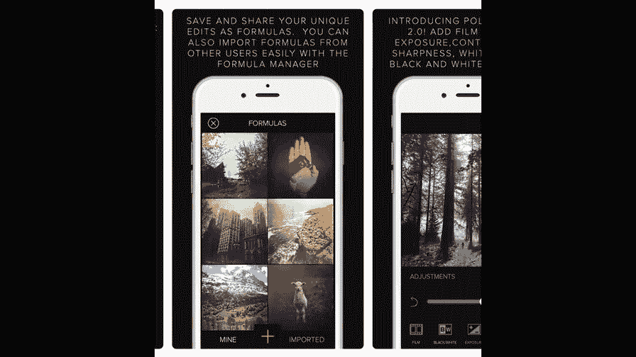
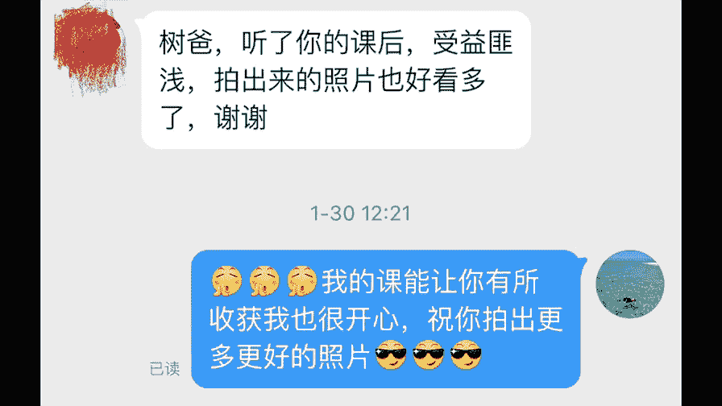
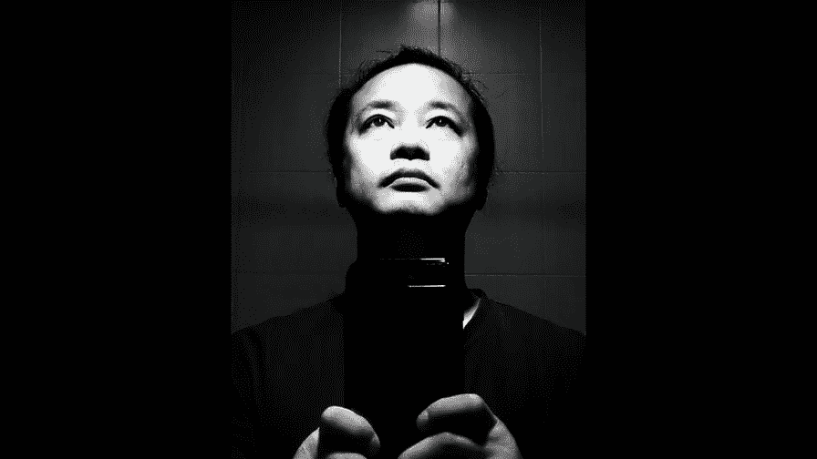
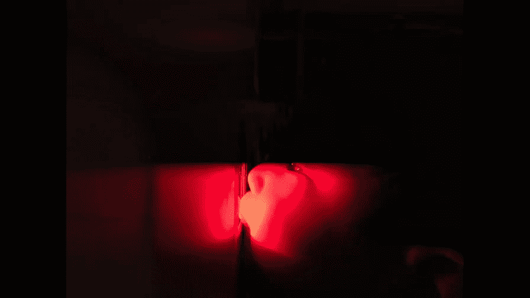
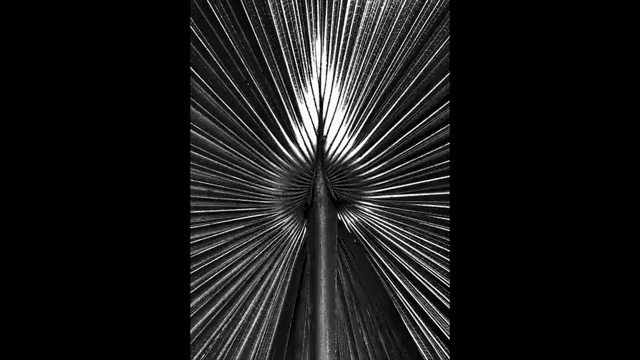
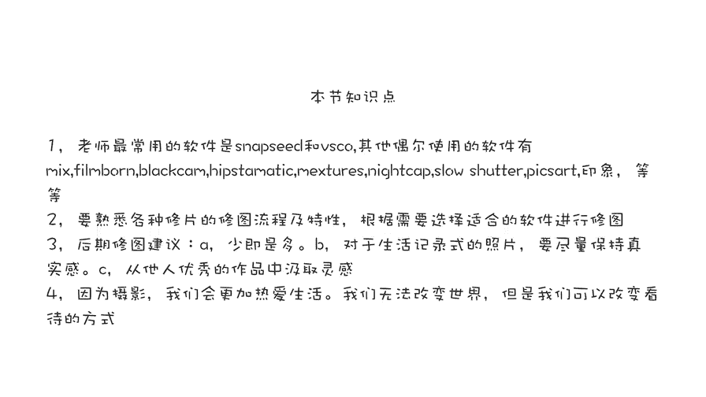
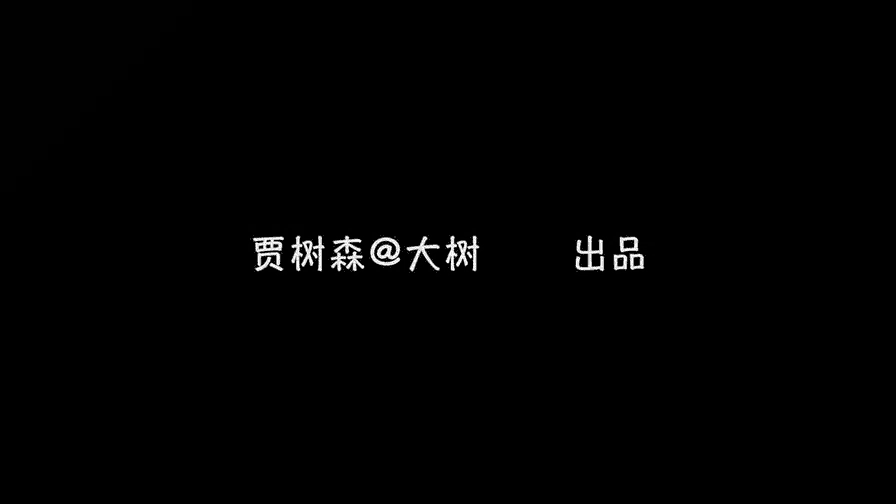

# 贾树森-手机摄影高手（完结）：4：【大神】超详细的后期修图软件教程：第9讲 后期修图的标准是什么？📱

在本节课中，我们将要学习后期修图的核心标准与个人经验。课程将首先介绍常用的修图软件，然后探讨如何选择和使用这些软件，最后重点讲解修图时应遵循的原则和心态，帮助你建立自己的修图标准。

## 常用修图软件介绍 🛠️

上一节我们介绍了后期修图的基本概念，本节中我们来看看有哪些实用的工具。了解软件是掌握修图的第一步。

我经常使用的修图软件包括 **Snapseed**、**VSCO**、**MIX**、**TouchRetouch** 以及 **Afterlight**。在处理黑白照片时，我常用 **Filmborn** 和 **BlackCam**。此外，**Hipstamatic** 是一款能模拟胶片和LOMO风格的相机兼修图软件。**Mextures** 则擅长添加胶片划痕、漏光等特效滤镜。

在拍摄方面，**NightCap** 和 **Slow Shutter** 是苹果手机上用于拍摄慢门、夜景和流水拉丝效果的工具。**PixArt** 偶尔用于制作特殊效果，但因其广告较多，使用频率不高。**印象** 也常用于套用滤镜。

然而，我最常用的软件是 **Snapseed** 和 **VSCO**，它们的使用频率占90%以上。对于软件的使用，我的观点是：**不求多，要求精**。

## 如何选择与使用软件 🔍

软件太多有时并非好事，容易让人在选择时感到困惑。我的建议是，选择几款容易上手且自己喜欢的软件，熟练掌握它们。

你需要了解每款软件的“脾气”和功能边界。拿到一张照片后，先分析需要修改的地方，再从你熟悉的工具库中挑选合适的软件。初期难免会花费更多时间进行尝试。我曾对一张照片修改过三十多个版本，这有助于比较不同效果，并深刻理解每款软件的能力。

随着经验积累，你会逐渐形成直觉。看到一张照片，就能立刻想到哪个工具（如Snapseed、VSCO或MIX）最适合处理某个特定问题。

修图时，我们不一定只使用一款软件。每款软件都有其特长。例如，可以先用 **TouchRetouch** 去除杂物、让画面更干净，再将照片导入 **Snapseed** 进行其他处理，最后用 **MIX** 或 **VSCO** 进行调色。当然，如果能用一款软件完成所有工作是最好的，因为在不同软件间导来导去可能会损失画质。

## 后期修图的核心标准与原则 🎯

我们已经学会了软件的使用方法，但常常不知道从何下手，也不清楚修到什么程度才算好。后期修图很难有统一标准，因为它不是标准化生产，没有固定公式。然而，知道“修到什么时候停”至关重要。

摄影是私人的表达，往大了说是艺术创作。虽然无法给出ISO式的统一标准，但我可以分享几点个人对修图的认识和经验。

以下是修图时需要牢记的几个核心原则：

**第一，牢记“少即是多”**。千万不要把照片修得面目全非。知道何时停止非常重要。对于初学者，可以尝试对同一张照片进行不同程度的修改。例如，分别将某个工具的效果强度设置为100%、50%和25%，然后将不同版本的照片放在一起比较，或隔几天再看。这能帮助你逐渐找到“恰到好处”的感觉。

**第二，尽量保持照片的真实性**。当然，创意类作品可以天马行空。但对于记录生活、街拍、家人朋友的照片，建议在保持真实的基础上进行美化。

**第三，多看优秀作品并模仿**。多欣赏获奖照片，从中汲取灵感。你可以直接找类似照片进行模仿练习，尝试调出相近的色调。许多获奖作品在拍摄和处理上都做得非常好。模仿的过程能让这些技巧内化于心，并在未来的实践中促使你思考“他为什么这样处理？”，这正是你成长的过程。

## 摄影对生活的改变与意义 🌈

在课程中，很多同学关注了我的微博并积极互动，非常感谢大家的支持。我也特别感谢大家在众多课程中选择了我的课。制作这套课程我投入了极大的心血，是真正的“走心之作”，课程提纲密密麻麻，并做了大量注解，只为用最接地气的方式将知识分享给大家。

在第三课中，我们探讨过“什么样的照片才是好照片”，其中提到最高的标准是 **拍出情感**。同时，我们也讲了要锻炼“摄影眼”。经过前面课程的学习，相信大家的观察力已得到很大提升。

我们拍摄的看似是外部世界，但真正记录的是自己的生活。一张张照片串联起来，就是你的生活史。镜头是我们记录和观察世界的工具。

如今，摄影已无处不在。经过学习，大家可能掌握了一些构图、光影的基础知识。摄影，已成为我们生活中不可分割的一部分。

那么，摄影具体给我们的生活带来了哪些改变呢？以下是摄影带来的一些积极变化：

首先，我们变得更开朗，更善于与陌生人交流。因为拍摄常常需要与被摄对象沟通，这锻炼了沟通技巧和胆量。

其次，生活变得更加丰富。空闲时总想出去拍照，长假也更愿意旅行拍摄。生活有了更多期盼，审美水平也随之提高，更愿意去看影展、画展或电影，从中学习构图和用光。

你也可能开始探索以前从未去过的地方，如菜市场、小巷或高楼顶层。你因此见识了不同的人生，与人搭讪也变得更简单。

此外，你的拍照水平提高后，另一半和朋友都更愿意让你拍照，聚会旅行也喜欢带上你。你也能为自己拍出好看的照片。当然，学好技术主要是为了给女朋友拍照。

摄影还能培养耐心，因为好画面常常需要等待。它也会让你像孩子一样，对有趣场景充满惊喜，迅速抓拍，并获得成就感。摄影让你变得更酷，虽然有时也可能像“神经病”，看到反光物就想自拍。

通过摄影，你能结识志趣相投的朋友，甚至可能将爱好变为职业。在寻找拍摄场景时，你不知不觉多走了很多路，身体也更加强壮。

从取景框中，我们能感悟世界。作为父母，我们陪伴孩子的时间更长，因为总想记录他们成长的点点滴滴。摄影让我们更加珍惜当下，开始留意曾经忽略的细节，寻找生活中的美，并从中找到乐趣。

归根结底，摄影改变了我们感受生活的方式，让我们更加热爱生活。我们无法改变世界，但可以改变看世界的方式。

生活总是琐碎的，而情感就存在于这些琐碎之中。用不同的态度去观察和体验，你就会得到完全不同的生活和人生。对于热爱生活的记录者来说，善于从日常中发现并记录喜怒哀乐，仿佛是一种与生俱来的能力。任何人都需要打开内心，真正融入生活，才能发现平凡中的美好。

你会发现，每一张照片都是有温度的。那是家人爱的体温，是生活情感的传递。

我们全部四十节课到这儿就结束了。制作课程虽然辛苦，但此刻却有些不舍。

希望大家多去记录生活，记录生活中的美好，多拍照片，拍好照片。祝愿大家都能成为生活的记录者，因为摄影而更加热爱生活。

---

本节课中我们一起学习了后期修图的标准与心法。我们从常用软件工具入手，探讨了如何精炼地选择和使用它们，并重点阐述了“少即是多”、保持真实、模仿学习三大修图原则。最后，我们升华了主题，探讨了摄影如何改变我们观察世界的视角，并让生活变得更加丰富和热爱。记住，修图没有绝对公式，但拥有正确的原则和热爱生活的心，你的作品自然会充满温度和情感。