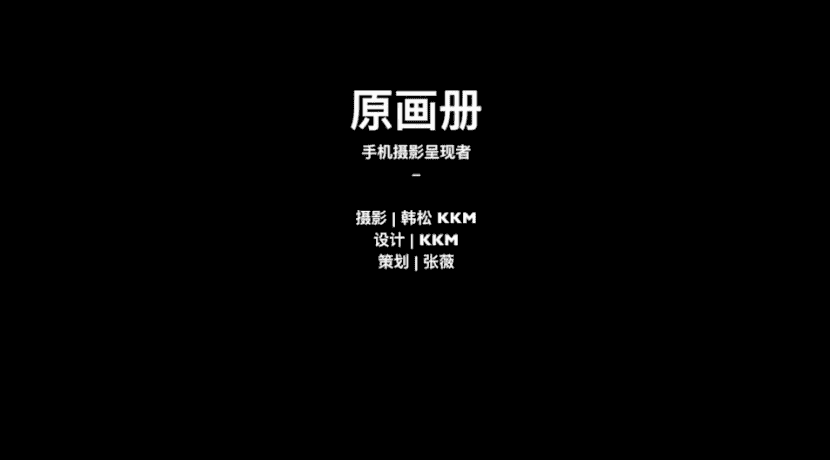

# 韩松-跟全球iPhone摄影大赛冠军学手机摄影，随手惊艳朋友圈（完结）：课时02.学习准备与基础操作

## 📱 课程概述

在本节课中，我们将学习手机摄影前的准备工作，并掌握智能手机摄影中最核心、最基础的几项操作。这些知识和技能是拍出好照片的基石，能让你在拍摄和后期处理时事半功倍。

---

## 🎒 第一部分：器材准备

上一节我们了解了课程的整体框架，本节中我们来看看拍摄前需要做哪些具体的准备。首先是硬件器材的准备。

一张照片展示了传统单反摄影师的沉重装备，包括单反相机、各种镜头、三脚架和充电设备。对于手机摄影爱好者而言，大部分装备都可以省略。

以下是精简后的手机摄影核心装备：
*   外置镜头
*   手持稳定器
*   手机与充电器
*   三脚架

实际上，装备还可以进一步精简。我自己日常出门通常只携带四样物品：充电宝、手机、耳机和三脚架。使用这样简单的装备，同样能够拍摄出非常出色的照片。

---

## 📲 第二部分：软件准备

说完了硬件的准备，我们再来看一下软件的准备。后期处理软件是手机摄影创作的重要工具。

我平时主要使用四款后期处理软件：Retouch、Snapseed、VSCO和SKRWT。这几款软件会在后续课程中详细介绍。

我之所以不使用更多软件，基于两点建议：第一，将精力集中在少数几款软件上，精通它们。第二，我认为后期处理最重要的是理解原理。因此，我选择了最优质且自己最熟练的软件，它们是我从众多软件中筛选出来的。

---

## 🧠 第三部分：心理准备

学习这套课程，还需要做好心理准备。本课程包含大量实用技巧，能让你获得强烈的收获感。同时，也有一部分需要深入理解的理论知识，这部分内容可能有些烧脑，但一旦理解，将对你的摄影水平产生巨大提升，请务必留意。

---

## 🎯 第四部分：核心基础操作

接下来，我们进入今天的核心部分：掌握当今智能手机中90%最重要的摄影操作。学会这些操作，能让你的拍摄和后期处理效率大幅提升。

以下是三项最核心的基础操作介绍。

### 1. 对焦

对焦，就是让画面中我们想要表现的特定点变得最清晰。

在大部分情况下，手机会自动选择焦点。例如在这个场景中，系统自动将焦点对准了前面那本较大的书，导致背景的书变得模糊。

我们也可以主动控制焦点。只需点击屏幕上你希望清晰的位置即可。例如，点击后面那本书上的字母，焦点就会转移到后方，使后方的字母变清晰，而前景的字母变模糊。

**总结：对焦就是点击屏幕上任意你想要表现的点，使该点变得清晰。**

相信大家已经理解了对焦的原理。我们来看这张照片。

通常情况下，体积较大、离镜头较近的物体会被自动识别为焦点。但在这张照片中，我想要表现的是后面纽约曼哈顿的高楼群，因此我使用了手动对焦，将对焦点设置在远处。于是，前景中经过的路人被自然地虚化掉了。

### 2. 调节曝光

接下来我们看看另一个非常重要的操作：调节曝光。所谓曝光，就是指画面的明暗程度。

一般情况下，手机会根据场景自动给出一个它认为正常的曝光值。但我们也可以手动调节。

操作方法是：点击屏幕上任意一点后，在屏幕上下滑动。向上滑动，画面变亮（曝光增加）；向下滑动，画面变暗（曝光减少）。手动调节曝光能让我们对画面效果拥有更大的自主控制权。这项操作在所有智能手机上都是相同的。

举一个简单的例子。这张照片拍摄于纽约曼哈顿的傍晚。我通过滑动屏幕降低曝光，获得了这种带有欧美调色感的昏暗场景。

为什么需要这个操作？因为当时天色较暗，手机会自动测光并提高曝光，那样就会完全失去昏暗的氛围。所以我重复一遍操作：滑动屏幕，调低曝光。

### 3. 曝光与对焦锁定

最后，我们学习一个非常实用的操作：曝光与对焦锁定。它是指将画面的焦点和曝光值长期锁定在某个物体上。

来看这个场景。首先，我点击后面的书作为焦点，前景的书是模糊的。当我移动手机时，系统会重新对焦，将焦点对到前面的书上。

在苹果手机中，如果需要锁定，只需长按屏幕，直到上方出现“自动曝光/自动对焦锁定”的黄色方框提示。锁定之后，再次移动手机，系统的焦点和曝光都不会再改变，始终锁定在最初设定的物体上。

这个操作应用非常广泛，具体的应用案例我将在后续课程中详细讲解。

来看这张为我朋友民谣歌手陈鸿宇在呼伦贝尔拍摄的照片。我将焦点对准远处的人物（陈鸿宇）并进行了锁定。

为什么要这样做？请看前景。因为照片前景是草原，草非常多。如果我不将对焦点锁定在远处人物身上，焦点可能会被干扰，跑到前面的草上，导致人物模糊。因此，我需要将对焦点锁定在人物身上，让前景的草处于虚化状态，从而保证主体人物突出。

另一个案例是在城市中，天色将暗时，我们可以利用这个技巧拍摄模糊的霓虹景色。方法是：先靠近一个前景物体（如栏杆）并对焦锁定，然后移动手机，将镜头对准远处的城市背景。这样，前景物体会保持清晰，而背景的城市灯光则会形成美丽的光斑。我们还可以调整曝光，使其变暗一些，让城市效果更摩登。等待车辆或行人经过画面，能为照片增添动感和故事性。

---

## 📝 本节总结

本节课我们一起学习了手机摄影的准备工作与核心操作。

我们来总结一下本段的要点：
*   对我个人而言，90%的拍摄操作都离不开**对焦**、**变焦**和**曝光调节**，它们极大地便利了我的拍摄体验。
*   手机会自动测光，我们可以通过**改变对焦点**或**调节曝光滑块**来获得自己想要的画面明暗程度。这也会让后期处理变得更加方便。

今天的内容就是这些，我们下一堂课再见。