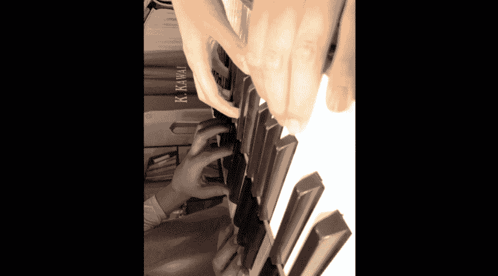
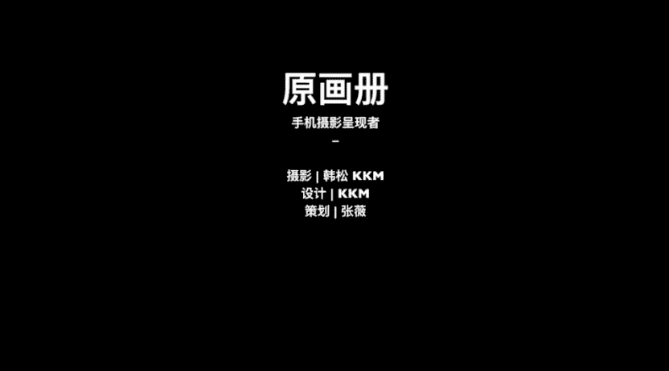

# 手机摄影大师课：03：手机摄影附加和辅助功能

在本节课中，我们将学习手机摄影中几个关键的附加和辅助功能。这些功能能帮助我们更精准地构图、更灵活地拍摄，并处理复杂的光线环境，从而显著提升照片质量。

## 一、网格辅助线：精准构图的基石

上一节我们介绍了相机的基础操作，本节中我们来看看如何利用辅助工具让构图更精准。网格辅助线是帮助我们实现横平竖直构图的重要工具。

以下是开启网格辅助线的方法：

*   **苹果手机**：打开“设置”应用，进入“相机”选项，开启“网格”功能。返回相机界面，即可看到由两条横线和两条竖线组成的九宫格。
*   **安卓手机（以华为为例）**：在相机拍摄界面，从右向左滑动，进入设置菜单，找到“参考线”选项，选择“九宫格”。返回拍摄界面，九宫格便会显示。

利用网格线，我们可以进行两项关键操作：
1.  **对齐线条**：拍摄具有明显线条的物体（如琴键、地平线、建筑）时，将线条与网格线对齐，可以确保画面横平竖直。
2.  **检查水平**：观察画面中心的十字交叉点，确保其水平，这能帮助判断手机是否处于水平状态。

掌握这两点，就能轻松拍出构图工整的照片，再进行黑白处理，往往能获得出色的效果。

## 二、快门触发：捕捉瞬间的多种方式

了解了构图辅助，接下来我们看看如何更灵活地触发快门。掌握多种快门方式，能帮助我们在不同场景下快速抓拍。

以下是三种常见的快门触发方法：

1.  **屏幕快门按钮**：直接点击相机界面右侧的圆形快门按钮。这是最基础的方式。
2.  **物理音量键**：按下手机侧面的音量“+”或“-”键。这个功能在街拍或单手操作时非常实用，能更快速、隐蔽地触发快门。
3.  **耳机线控**：连接耳机后，按下耳机线上的音量“+”或“-”键，同样可以拍摄照片。

此外，前两种方法（长按屏幕快门按钮或长按物理音量键）还可以启动**连拍模式**。连拍速度通常可达每秒10张以上，非常适合拍摄运动物体。

连拍后，进入相册，点击“选择”按钮，可以浏览所有连拍照片，挑选最满意的一张进行保留，其余删除，以节省手机存储空间。

安卓手机的操作逻辑与苹果手机基本一致，同样支持使用屏幕按钮、音量键进行单拍和连拍，连接耳机线控也可触发快门。

## 三、HDR模式：平衡大光比场景

当画面中明暗对比非常强烈时，例如逆光人像或室内有窗户的场景，就需要HDR（高动态范围）功能来帮忙。

在明暗反差大的场景中，如果对焦在亮部，暗部会失去细节；如果对焦在暗部，亮部则会过曝。HDR功能通过快速拍摄多张不同曝光的照片并合成一张，从而保留亮部和暗部的细节。

**操作流程**：在相机设置或拍摄界面中打开HDR功能，然后正常对焦并拍摄即可。对比开启与关闭HDR的照片，可以明显看到开启后画面的高光和阴影细节都更加丰富。

## 四、双摄与人像模式：简化背景与突出主体

最后，我们来看看利用手机多摄像头系统简化背景、突出主体的方法。

**双摄变焦**：许多手机配备了两个不同焦距的摄像头。点击拍摄界面的焦距切换按钮（如“1x”和“2x”），可以使用长焦端（如2倍变焦）进行拍摄。这能拉近景物，排除杂乱背景，让画面更简洁纯净，在街头摄影中尤为常用。

**人像/大光圈模式**：此模式通过算法模拟专业相机的大光圈浅景深效果，虚化背景以突出主体。
*   **苹果手机**：直接在模式中选择“人像”模式。当人物主体距离手机大约1.2米至2.5米时，效果最佳。
*   **安卓手机（如华为）**：在普通拍摄模式下，选择“大光圈”或“人像”模式即可激活背景虚化。

使用此模式后，通过后期调色，可以轻松获得质感出色的人物肖像。

## 课程总结

本节课中我们一起学习了手机摄影中四个核心的辅助功能：

1.  **网格辅助线**是保证构图横平竖直的基础工具。
2.  **多种快门触发方式**（特别是音量键和连拍）能帮助我们更灵活、快速地捕捉决定性瞬间。
3.  **HDR模式**是解决大光比场景、保留画面细节的利器。
4.  **双摄与人像模式**能有效简化背景、突出拍摄主体。

请注意，人像模式的背景虚化是算法实现的，在背景复杂（尤其是存在规则线条）时可能出现瑕疵。因此，拍摄后务必仔细检查照片边缘。同时，记住人像模式的最佳拍摄距离通常在1.2米到2.5米之间。

熟练掌握这些简单而强大的功能，并加以恰当运用，你就能用手机拍出令人惊艳的作品。

