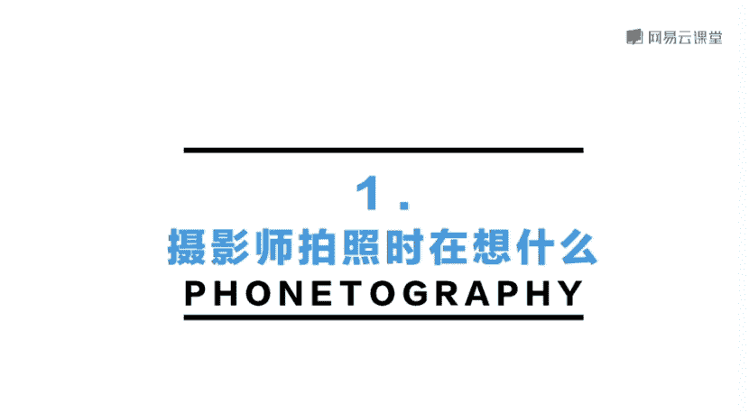
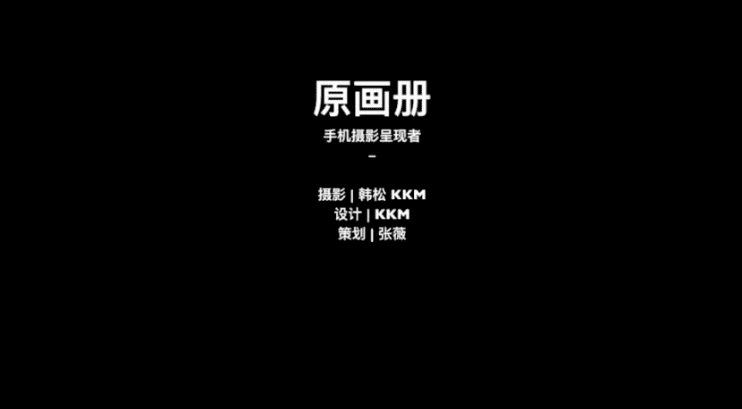

# 手机摄影：05：摄影师拍照时在想什么

在本节课中，我们将学习摄影师在拍摄时的核心思考过程，重点关注构图与取景。通过分析多个真实拍摄案例，我们将理解如何在实际场景中进行选择、取舍与创造，并掌握支撑这些决策的美学规律。

上节课我们学习了手机摄影的基本操作。本节中，我们将关注与观察力密切相关的构图和取景。为了帮助大家更好地掌握知识，我将带来大量实拍案例，让大家在真实场景中感受拍照时应如何选择、取舍和创造。请特别注意本课的第二部分“美学规律”，这是对取景构图的理论总结，理解后将对你的摄影水平产生质的提升。本节课的许多拍摄场景来自旅行，也让我们一起感受在路上拍摄的体验。

首先，我将分享一个小短片，其中记录了我拍摄几个具体场景的全过程。你可以观察在拍摄时，我在思考什么，以及如何进行取景。

## 案例一：确定主体

在曼哈顿混杂的街头，我看到一位女士牵着一条狗。我首先将对焦点放在他们身上，并使用连拍模式捕捉他们在车辆之间穿行的动态。通过连续拍摄多张照片，最终我选出了主体最为突出的一张进行展示。在这个场景中，我的核心动作是**确定主体**。

## 案例二：调整焦距与比例

同样在曼哈顿街头，人来人往，车水马龙。我选择从上往下的角度观察一个街边烤肉摊。最初，我使用**1倍焦距**拍摄，但发现人物比例较小，周围车辆环境过于复杂。于是，我将焦距调整到**3倍**，使人物在画面中的比例增大，主体更为突出。但我觉得3倍有些过近，最终认为**2倍焦距**最为合适。此时，人物在画面中比较突出，烤肉摊也占据了画面主要位置。我通过多拍几张，等待到了一个合适的瞬间。成片中人物的姿态也非常理想。这个过程中，我主要在**比较主体在画面中的比例**，并通过多拍来抓住最有意思的瞬间。

## 案例三：利用环境制造形式

在同一场景中，我找到一块发光的玻璃。我将手机放在玻璃上，捕捉到了下方人物在玻璃反射中形成的对称结构。利用街头这个小物件，可以拍到许多有趣的照片。在最终的照片中，我是在**制造一种对称的形式**，以营造画面的美感。

## 案例四：简化与平衡画面

在这个场景中，我想拍摄远处的桥，但近处的人行横道线、马路和树木非常复杂，容易分散注意力。因此，我直接靠近那座桥，并使用**2倍焦距**进行拍摄。我轻微移动手机，让桥与近处向远方延伸的木桩之间形成一种平衡的关系。这样，画面看起来更加美观、得当。继续移动位置后，我得到了干净美观的画面。这个过程中，我在思考**如何规避画面中多余、不需要的元素**。

## 案例五：制造元素对应关系

在法国罗纳河边，我看中了一个灯柱。它向上的直线与弯曲的曲线聚集在一起，形成了独特的美感。为了记录它，我向上移动手机，去除河面部分，将电线杆干净地置于画面中，并等待一个人经过。在这个过程中，电线杆的直线与人物形成的点状，构成了完美的点线元素搭配。最终成片中，人物可以出现在右侧，也可以等待其走到两个电线柱中间。在这张照片中，我是在**制造画面元素的对应关系**。

相信看完这些案例，你会明白在取景时，我通常会关注以下几件事：

以下是摄影师取景时的五个核心关注点：
1.  画面是否平衡。
2.  画面中的元素比例是否合适。
3.  画面的色彩是否和谐。
4.  我想要表达的内容是否通过画面有效传达。
5.  在拍摄时，是否有必要打破上述任何原则？

因此，本节课的第一个核心观点是：**摄影构图和取景无非关注两个问题：形式美和内容美。形式美可以基于接下来要介绍的形式美学规律进行学习。同时，在拍摄时要保有打破规则的勇气，这有助于形成你独特的审美。**

本节课中，我们一起学习了摄影师在拍摄时的思考过程，包括如何确定主体、调整比例、利用环境、简化画面以及制造元素关系。记住，构图是服务于表达的，既要学习规律，也要勇于创新。

我是原画册的韩松，谢谢大家。