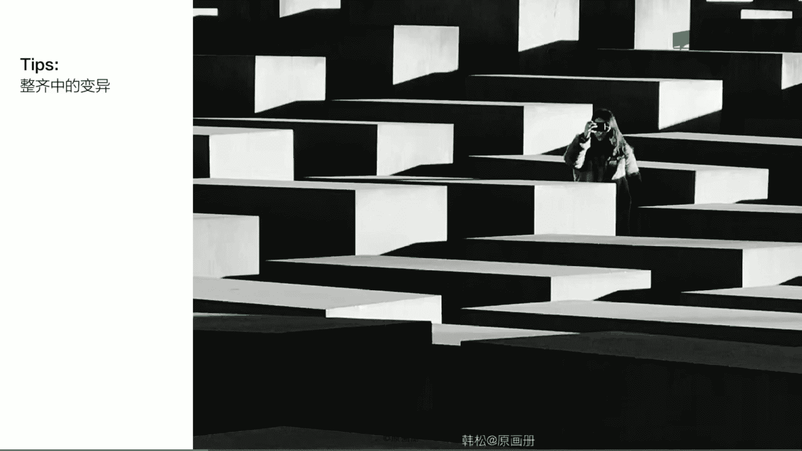
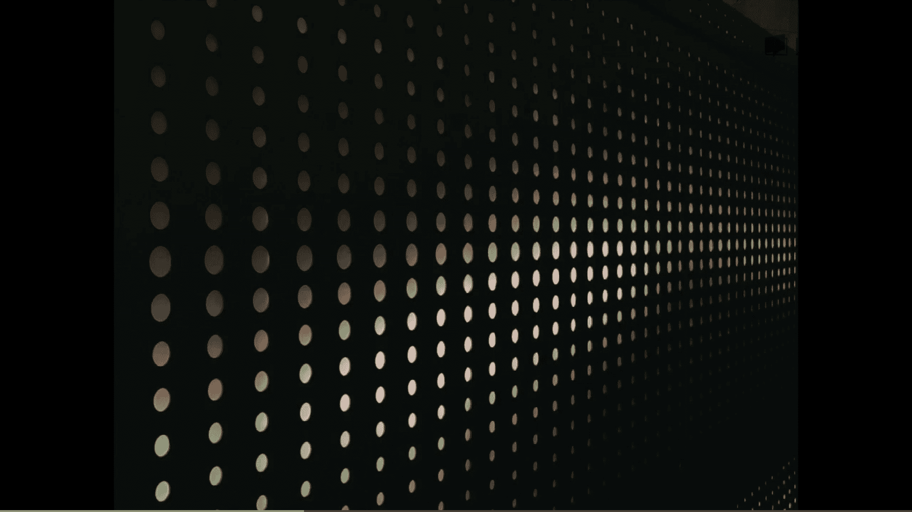

# 手机摄影美学：06：取景构图的形式美学规律

在本节课中，我们将学习取景构图的六项核心形式美学规律。理解并运用这些规律，可以帮助你构建更具美感和视觉冲击力的照片。

形式美的照片通常给人三种视觉感受：画面元素在某些方面趋于统一；具有清晰明快的结构特征；以及包含有意义的对比与冲突。接下来，我们将逐一探讨达成这些视觉感受的具体规律。

## 规律一：单一纯粹

单一纯粹是最基础的规律，旨在通过突出画面中唯一的核心元素，达到引人注目的效果。

以下是运用此规律的两个实例：

*   **冰岛照片**：背景是嶙峋的山峰，前景中的小木屋是绝对的视觉中心。
*   **何帆的雾景照片**：朦胧的城市与河面背景，使得画面中央轮廓清晰的小船（及其桨、桅杆和倒影）成为唯一焦点，手法单一纯粹。

**实践应用**：在纽约中央公园的午后，场景略显杂乱。通过应用“单一纯粹”原则，将焦点对准一个跑动的小孩，以其为主体构建画面，同时纳入远处建筑以增强场景氛围感。

## 规律二：整齐与变异

整齐是指通过大量相似元素的重复排列，形成整齐划一、具有视觉震撼力的效果。

以下是此规律的几种表现：

*   **古斯基的货架照片**：远距离拍摄使商品形成整齐的重复排列，产生震撼效果。
*   **电影《春之祭》剧照**：男女角色的依次排列，形成有动感的整齐效果。
*   **柏林体育馆照片**：一排排椅子从近处向远方延展，营造出高度统一的震撼感。

在整齐的基础上，可以引入“变异”来打破完全一致，从而更突出主体。

以下是两个“整齐中的变异”实例：

*   **柏林犹太人纪念碑**：纪念碑形成整齐的几何明暗交替背景，一个拍照的小女孩成为视觉中心，构成变异美感。
*   **何帆的油桶照片**：背景是整齐排列的油桶，前景喝水的小孩形成了变异，有效突出了主体。

**实践应用**：在夜晚的成都太古里，发现电梯下方排列的圆形光点。通过调整焦距，使下方的线条与上方的圆点形成强烈的重复美感，捕捉容易被忽略的细节趣味。

## 规律三：对称与均衡

对称与均衡是营造画面平衡感的两个关键词。对称指画面两部分完全对等，产生统一稳定的美感；均衡则指画面中不对等的各部分，构成一种活泼而微妙的重量平衡。

**对称的实例**：

*   **建筑对称照片**：左右建筑物、中间两人及天空一鸟，共同构成强烈的对称美感与视觉冲击。
*   **陈宏宇的枯枝人像**：利用两边完全对称的枯枝及上方形成的圆拱，将人物置于其中，构成天然对称美景。
*   **濑户内海照片**：左边的女孩、右边的男孩和中间的小鹿，三个元素形成强烈的对称结构。

**均衡的理解**：可以将其类比为物理学的天平平衡。并非左右元素完全相同，而是通过视觉重量的分配达到平衡。

以下是均衡的实例与分析：

*   **椅子与影子**：前景的亮椅子与背景的暗影子，通过大小、明暗的对比形成巧妙对话与均衡。
*   **英国街头照片**：画面右侧较大的“黑人问号脸”角色，与左侧较大的男性角色、右侧较小的女性角色，共同构成了左、中右、右的视觉重量均衡。
*   **街头列车与电线杆**：左侧较大的列车与右侧垂直的电线杆，通过形态与位置，增添了画面右侧的重量感，达成均衡。
*   **雪景照片**：左侧清晰的大树与右侧模糊的小房子，形成清晰与缥缈、大小与前后的均衡之感。

## 规律四：对比与调和

对比指画面中相互矛盾的元素相互对抗，形成刺激的美感；调和则指画面各部分具有统一或相似的性质，放在一起形成和谐的效果。

**对比的几种类型**：

*   **色彩对比**：如天津夜景中，天空的浪漫蓝色与地面亮起的红灯，形成红与蓝、冷与暖的对比。
*   **疏密对比**：如巴黎街头，左边整齐密集的行道树与右边空旷的天空，形成疏密对比。
*   **明暗对比**：如下午斜射的阳光在窗台形成的光影，一张获得大奖的作品正是利用了下明上暗的强烈明暗对比。

**调和的实例**：

*   **颜色调和**：巴黎博物馆中，莫奈《睡莲》的画作色彩与前景女生的毛衣颜色完美融合，仿佛人物走入画中，形成巧妙的视觉调和。

对比与调和带来不同的视觉感受，但都能增强形式美感。何帆的一张照片中，高大的佛牌与两边的人物形成了高矮对比。

**实践应用**：在新泽西夜晚，想拍摄远处发光的窗户。通过构图，将上方窗户置于画面靠右，下方窗户也纳入画面，形成了**位置对比**、**色彩对比**与**明暗对比**。经过简单后期，得到一张主体明确、对比强烈的照片。

## 规律五：尺度与比例

尺度是绝对概念，比例是相对概念，二者都关注画面中元素间的相互关系，不同的比例能带来各异的美感。

*   **小比例**：人物相对于巨大建筑显得非常渺小，产生人景对比的张力，常用于表现环境氛围。例如巴黎国家图书馆中，右下角极小的人物反衬出建筑的高大；柏林冬景中，远处小小的人和狗活泼了画面，也反衬出前景树木的挺拔；何帆的照片也使用小比例突出墙壁的斑驳与高大。
*   **大比例**：人物在画面中占据显著位置，突出具体表情和动作，常用于人物肖像。

**技巧提示**：多尝试小比例拍摄，拉开人物与环境元素的比例，能获得更具张力的照片。

## 规律六：节奏与韵律

节奏指画面元素按一定规律循环往复产生的美感；若这种循环伴有渐强、渐密等变化，则形成韵律。

*   **节奏实例**：从左到右依次排开的小木屋，形成清晰的视觉节奏；何帆拍摄的街头黄包车，也是利用多辆车依次排列形成节奏感。
*   **韵律实例**：斜角度拍摄的椅子，从近处较大向远处逐渐变小，形成渐变的韵律；层层递进的街头乌云，或巴黎街头光影回廊由近及远的递进与地面影子，都加强了空间的渐变韵律之美。

**技巧提示**：有时不捕捉单一个体的表情，而是利用群体元素的排列来表现节奏与韵律，能获得独特效果。

## 课程总结

本节课我们一起学习了构成形式美的六大核心规律：

1.  **单一纯粹**：美学规律的基石，通过突出唯一主体吸引视线。
2.  **整齐与变异**：整齐带来震撼，在整齐中寻求变异能有效突出主体。
3.  **对称与均衡**：营造画面的视觉重量感与平衡感。
4.  **对比与调和**：为画面注入更强的情绪与表现力。
5.  **尺度与比例**：通过调整元素间的大小关系，让画面更具张力。
6.  **节奏与韵律**：与音乐相通的规律，让画面元素产生有序的动感与美感。

最后需要牢记，这些规律是指导创作的**工具而非铁律**，灵活运用并根据实际场景巧妙组合，才是提升构图能力的关键。

我是原画册的韩松，我们下节课再见。

