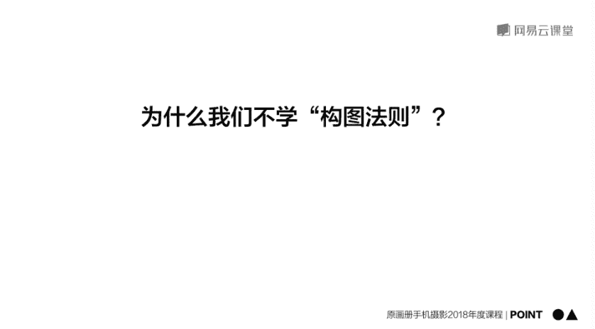

# 韩松-跟全球iPhone摄影大赛冠军学手机摄影，随手惊艳朋友圈（完结）：课时07.摄影师拍照取景案例

在本节课中，我们将通过分析几个具体的拍摄案例，学习如何在实际场景中运用美学规律进行取景和构图。我们将看到，优秀的照片往往源于对场景的耐心观察和对美学原则的灵活运用，而非死记硬背构图法则。

---

## 🏖️ 案例一：里斯本海滩

上一节我们介绍了美学规律，本节中我们来看看如何在实际场景中应用“单一纯粹”的原则。

第一个案例是在葡萄牙里斯本的海边拍摄的。观察这张照片，在一个广阔的海滩大场景中，前景有一个正在玩沙的小女孩。这个小比例的人物在画面中形成了一个**单一的视觉中心**，这正是“单一纯粹”原则的体现。

以下是原场景存在的问题分析：

*   **多余元素**：画面右侧出现了石头和其他无关人物，干扰了视觉焦点。
*   **色彩冲突**：天空与地面的色彩不协调，亮度不足，导致画面不通透。

因此，要捕捉到理想的画面，需要做到以下两点：
1.  **耐心等待**：等待小女孩单独出现在画面中的时机。
2.  **调整曝光**：调高曝光，让整体色彩更明亮、通透。

---

## 🚃 案例二：里斯本电车

接下来，我们分析一个营造氛围的案例。这张在里斯本电车上拍摄的照片，旨在表现一种**欧美暗调**的浪漫美感。

我想要捕捉的是情侣依偎在一起的大特写感觉，柔和的光线能营造出浪漫氛围。

原片效果不佳的原因如下：

*   **曝光过度**：女孩脸部明显过曝，破坏了暗调的美感。
*   **元素杂乱**：画面下方出现了过多其他元素，破坏了画面的纯粹性。

拍摄时，我采用了以下方法：
1.  **使用变焦**：使用**二倍焦距**以获得更近的特写构图，排除干扰。
2.  **手动控制曝光**：在拍摄时向下滑动屏幕，**调低曝光**，让画面显得更加柔和、幽暗。

---

## 🚇 案例三：莫斯科地铁

现在，让我们观察一个运用“节奏与韵律”规律的场景。这是在莫斯科地铁中拍摄的。

画面中的人物从左到右依次排开，形成了**节奏感**。其中，一位坐姿较高、表情严肃的老人，成为了画面中强烈的**视觉中心**。

这张照片的原片效果平庸，因为：
*   **人物重叠**：人物相互重叠，破坏了原本有韵律的结构分布。

因此，要捕捉到出色的照片，需要**多次尝试和耐心等待**，直到抓拍到最具戏剧性的那个瞬间。

---

## 🏛️ 案例四：里斯本街头建筑

最后，我们来看一个关于建筑与光影的案例。葡萄牙馆这个建筑通透，阳光下的几何美感极强。

我的目标是表现建筑光影的**结构感**，同时让一个人物出现在画面中，以体现建筑的**尺度**。

原片失败的原因在于：
*   **破坏节奏**：画面右侧的天空和远处的海，破坏了建筑本身的节奏感。

为了改善，我做了以下调整：
1.  **裁剪构图**：去除多余部分，只保留中间具有光影效果的建筑回廊。
2.  **等待时机**：等待人物走入画面，以衬托出建筑的宏大尺度。

经过这些调整，照片的效果得到了显著提升。

---

## 🖼️ 实战演练：博物馆场景分析

以上我们分析了几个静态案例，下面将通过动态场景，进一步演示如何灵活运用美学规律。

以下是结合具体场景的分析：

**1. 大都会博物馆中庭**
*   **对称原则**：古典建筑中庭通常对称，可采用最正中的角度拍摄。
*   **单一纯粹**：将手机抬高，拍摄天花板的几何圆形天窗。
*   **线条对比**：将手机向右下移动，利用画面中的弧线线条进行构图。
*   **节奏感**：利用柱廊从近处向远处延伸产生的节奏感进行拍摄。

**2. 古根海姆博物馆中庭**
*   **韵律感**：利用建筑螺旋上升的弧形结构自然形成的韵律进行构图。
*   **单一纯粹**：拍摄建筑完整的圆形穹顶。
*   **人物与线条结合**：将各层楼的人物与建筑的弧线线条组合，形成对应关系。
*   **对称与单一结合**：采用对称构图，并利用人物形成单一的视觉焦点。

---

## 📝 总结与作业

本节课中，我们一起学习了如何在实际拍摄中运用美学规律。

核心要点在于：构图取景注重的不是死记硬背的构图法则，而是灵活运用**美学规律**。本课重点介绍了六种形式美规律：
1.  **单一纯粹**
2.  **整齐**
3.  **对称与均衡**
4.  **对比与调和**
5.  **尺度与比例**
6.  **节奏和韵律**

这些原理初次理解可能有些抽象，建议大家多体会课程中的案例，平时**多观察、多拍摄**，必定会取得进步。

**课后作业**：
找一栋建筑，尝试拍摄6张照片，分别运用上述6种形式美的规律，探索各种构图的可能性。

我是摄影师韩松，我们下节课再见。