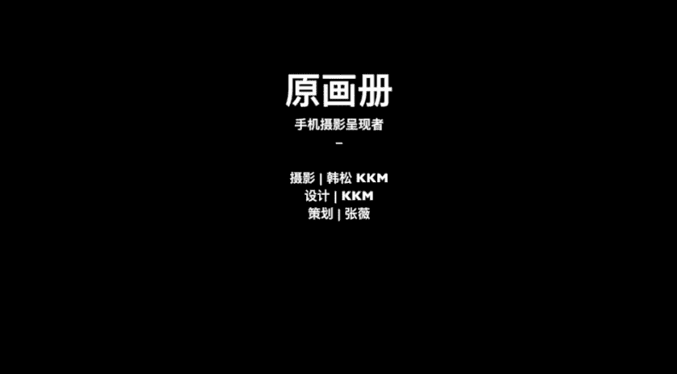

# 手机摄影后期：08：Snapseed调色操作与基本术语

在本节课中，我们将系统学习手机摄影后期调色的基本原理与核心操作。课程将围绕影调、色彩和校正三大基石展开，并使用Snapseed软件进行实践演示。通过本节课，你将能够理解并应用亮度、对比度、饱和度等关键参数，掌握照片调整的基本流程，并初步了解蒙版等进阶功能，为后续深入学习打下坚实基础。

## 影调调整：控制照片的明暗关系

上一节我们概述了后期处理的三大基石。本节中，我们来看看如何调整照片的“影调”，即照片的明暗层次关系。

一张照片的影调大致可分为三个区域：
*   **高光**：画面中最亮的区域。
*   **中间调**：画面中亮度适中的区域。
*   **阴影**：画面中最暗的区域。

在Snapseed中，我们可以通过以下参数来精细控制影调：

以下是调整影调的核心参数及其作用：

1.  **亮度**
    *   **作用**：同时提亮或压暗画面中的**高光、中间调、阴影**所有区域。
    *   **操作**：在Snapseed的“调整图片”中，上下滑动选择“亮度”，左右滑动调整数值。

2.  **对比度**
    *   **作用**：增加时，让亮部更亮、暗部更暗，画面反差**增大**；减少时，亮部变暗、暗部变亮，画面反差**减小**，可能显得“灰蒙蒙”。
    *   **公式**：`高对比度 = 高光更亮 + 阴影更暗`

3.  **高光**
    *   **作用**：**仅调整**画面中最亮的**高光**区域，对中间调和阴影影响很小。可用于恢复过曝天空的细节，或让高光更明亮。
    *   **代码逻辑**：`调整(高光)` -> `仅影响(画面最亮区域)`

4.  **阴影**
    *   **作用**：**仅调整**画面中最暗的**阴影**区域，对高光和中间调影响很小。可用于提亮暗部以展现更多细节，或压暗阴影以增强氛围。
    *   **代码逻辑**：`调整(阴影)` -> `仅影响(画面最暗区域)`

5.  **氛围**
    *   **作用**：Snapseed的特色功能。增加此参数可同时智能提升画面整体层次感与细节，常用来让灰蒙蒙的照片变得更通透、更有精神。

理解了如何控制照片的明暗关系后，我们接下来进入色彩的领域。

## 色彩调整：赋予照片情绪与风格

影调决定了画面的骨架，而色彩则为照片注入灵魂与情绪。本节我们来学习如何调整色彩。

在Snapseed的“调整图片”中，与色彩相关的核心参数如下：

以下是控制色彩的两个关键参数：

1.  **饱和度**
    *   **作用**：控制色彩的鲜艳程度。增加饱和度，色彩更浓烈；减少饱和度，色彩更朴素。降至-100时，照片变为黑白。
    *   **建议**：通常增加饱和度不宜超过30%，否则容易导致色彩失真溢出。

2.  **暖色调（色调）**
    *   **作用**：控制画面的整体色温偏向。向正值（右）调整，画面偏黄、偏暖，给人温暖、怀旧的感觉；向负值（左）调整，画面偏蓝、偏冷，给人清凉、宁静的感觉。
    *   **应用**：通过调整色调，可以快速为照片赋予不同的情绪基调。

掌握了影调与色彩的调整，一张照片在视觉上已基本成型。最后，我们需要通过校正功能来完善它的构图与形态。

## 画面校正：完善构图与透视

即使前期拍摄再用心，照片也可能存在构图不完美或线条歪斜的情况。本节我们学习如何使用校正功能进行最后的优化。

在Snapseed中，校正功能主要通过以下工具实现：

以下是三大校正工具及其用途：

1.  **剪裁**
    *   **作用**：重新构图，去除画面多余元素，突出主体。Snapseed提供多种比例，如1:1（正方形）、4:3（原图）、16:9（宽荧幕）等。
    *   **常用比例**：正方形（画面平稳）、原图比例（保持相机原始视角）。

2.  **旋转**
    *   **作用**：校正水平线或垂直线。软件通常会自动检测并微调，你也可以手动精确旋转，确保建筑、地平线等横平竖直。

3.  **透视（自由变换）**
    *   **作用**：最灵活的校正工具。可以分别在水平（X轴）和垂直（Y轴）方向拉伸或挤压画面，用于校正因拍摄角度导致的透视变形（如建筑物倾斜），让线条回归横平竖直。

以上三大基础调整——影调、色彩、校正，构成了照片后期处理的基石。熟练掌握它们，你就能应对绝大多数常规的照片优化需求。

## 进阶功能：局部调整利器——蒙版

在掌握了全局调整的基础后，本节我们来看一个非常强大的进阶功能——**蒙版**。它允许我们对照片的**特定区域**进行精准的参数调整。

**蒙版原理**：可以理解为两张图层的叠加。我们对上层图片（如调整后的全黑白照片）进行“涂抹擦除”（即创建蒙版），被擦掉的部分就会露出下层图片（如原始彩色照片）的内容，从而合成一张新的图片。

以下是通过蒙版实现“局部留色”效果的操作步骤：

1.  **全局去色**：导入照片后，进入“调整图片”，将**饱和度**降至-100，使整张照片变为黑白。点击“√”确认。
2.  **进入蒙版**：点击右上角“图层编辑”图标（叠放的方形带箭头），选择“查看修改内容”。点击当前“调整图片”步骤中间的“画笔”图标，即进入蒙版操作界面。
3.  **涂抹目标区域**：默认蒙版效果为100（即完全应用之前的黑白调整）。此时，用手指**涂抹**你希望**恢复彩色**的区域（如案例中的红色可乐瓶）。被涂抹的区域会显示为红色高亮，这代表蒙版生效（此处恢复了彩色）。
4.  **精细修改**：如果涂错，可将底部参数调至0，再涂抹即可擦除蒙版效果。通过双指放大画面进行精细涂抹，确保边缘准确。
5.  **完成**：涂抹完成后点击“√”，即可得到主体彩色、背景黑白的突出效果。

本节课中，我们一起学习了手机后期调色的核心知识。我们从**影调**（亮度、对比度、高光、阴影、氛围）入手，学会了控制画面的明暗层次；接着探讨了**色彩**（饱和度、暖色调），掌握了赋予照片情绪的方法；然后通过**校正**（剪裁、旋转、透视）功能完善了构图。最后，我们还初步了解了强大的**蒙版**功能，它能实现局部精准调整。这些是使用Snapseed乃至其他后期软件的基础，熟练掌握后，你便能轻松让照片变得更加干净、通透、富有表现力。