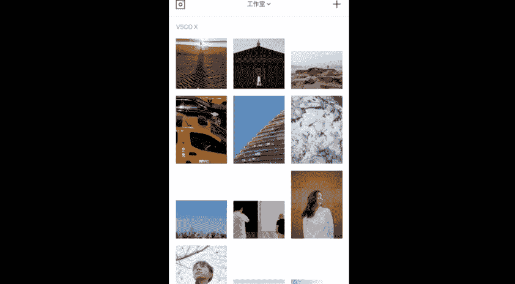
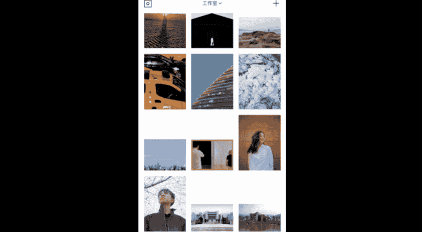
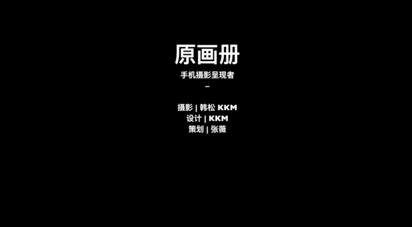

手机摄影后期：课时10：VSCO滤镜使用导则

在本节课中，我们将学习VSCO应用中几款常用滤镜的具体应用场景和效果。通过分析不同场景下的原片与调整后的对比，你将了解如何选择合适的滤镜来提升照片的氛围与质感。

---

上一节我们介绍了后期调色的基本概念，本节中我们来看看VSCO滤镜的具体运用。接下来，我会推荐几款我平时最常使用的VSCO滤镜。在演示中，每款滤镜的强度参数都调整至最大值，你在日常使用时可以根据自己的需要进行调整。

以下是第一款滤镜的介绍。

**A4滤镜**
A4滤镜非常适合用于表现日出或日落时的阳光氛围。
原片可能显得过黄、颜色有些脏。应用A4滤镜后，画面会立刻呈现出一种柔和、复古的金色调，加上浅浅的暗角，能有效烘托画面氛围。
演示中滤镜强度设置为最强，你可以根据需要进行调整。

A4滤镜也适用于阴天、带有暗调与复古感的城市场景。
例如，在拍摄阴天的城市时，原图可能显得灰蒙蒙。使用A4滤镜后，天空会变得更灰绿，地面颜色则呈现复古的金色质感，为画面注入极佳的情绪氛围。调整后的照片明显比原图更精神。

---

我们了解了适合暖色调场景的A4滤镜，接下来看看如何用黑白滤镜简化画面。

**B4滤镜（黑白）**
B4是一款高对比度的黑白滤镜，适合表现极简的剪影和线条。
当原片灰暗，你想突出剪影状态时，可以使用B4滤镜。它能将画面元素转化为极简的黑白对比，突出前景人物或物体的线条感。在B系列黑白滤镜中，我选择了对比度最高、色调最深的B4来强化氛围。

---

黑白滤镜能强化结构，而色彩滤镜则能改变画面的情绪基调。下面我们来看一组专门用于调整黄色的滤镜。

**C系列滤镜（针对黄色）**
C系列滤镜非常适合用于调整和提升画面中的黄色。
在表现黄色物体（如出租车）时，C1、C2、C3各有特点。原片的黄色可能显得有些脏。相比之下：
*   **C3** 使黄色更鲜明、精神。
*   **C2** 的黄色更偏向橙色色调。
*   **C1** 的暗部会微微偏绿，非常适合营造欧美街头的暗调氛围，在欧洲或美国拍照时可考虑使用。

---

除了调整特定颜色，我们有时也需要让画面的整体色彩变得更干净通透。

**AL1滤镜**
AL1滤镜能有效让颜色变得更加通透、干净。
在拍摄蓝天时，原图可能感觉灰暗、不够通透。使用AL1滤镜后，蓝色会更加突出和透亮。
在室内拍摄白墙或浅色物体时，原片可能偏黄偏脏。应用AL1滤镜可以消除多余的黄色调，让背景墙和衣物恢复洁白。
在拍摄人像时，AL1能提亮肤色，消除偏黄，并添加淡淡的暗角，为人像肖像照烘托出特殊的氛围。

---

让画面变通透后，我们再来学习如何为特定天气场景添加情绪色彩。

**A5滤镜**
A5滤镜适合为雪景添加冷色调，营造忧郁氛围。
在拍摄雪景（如雪山）时，原片可能显得普通。使用A5滤镜后，画面会融入浅浅的蓝色调，使黑色部分也带有蓝韵，让整体氛围更加清冷、精神。

---

夜晚的灯光需要温暖的色调来衬托，下面这款滤镜就能起到这个作用。

**C7滤镜**
C7滤镜适合用于表现夜间灯光，能营造温暖的氛围。
在拍摄夜景灯光时，原片可能很普通。加入C7滤镜后，黄色灯光会偏向橙色，整体色调更暖，让画面显得更有精神。

---

最后，我们来看一款能强化人像立体感和精神的滤镜。

**A6滤镜**
A6滤镜能加强对比度，提亮肤色，使人像更立体、精神。
在阴天拍摄人像时，原片可能肤色偏黄、五官显得扁平。使用A6滤镜后，它能增强画面对比度（如下巴阴影），使五官更立体；同时提亮面部亮度，让肤色变白，整个人像显得更加精神。

---

本节课中我们一起学习了多款VSCO滤镜的适用场景：**A4** 用于复古暖调，**B4** 用于高对比黑白，**C系列** 用于调整黄色，**AL1** 用于通透色彩，**A5** 用于冷调雪景，**C7** 用于暖调夜景，以及 **A6** 用于立体人像。大家可以根据拍摄主题和想要的氛围，自由探索和组合这些滤镜，以达到最佳的后期效果。

我是原画册的韩松，感谢大家参加我的课程。