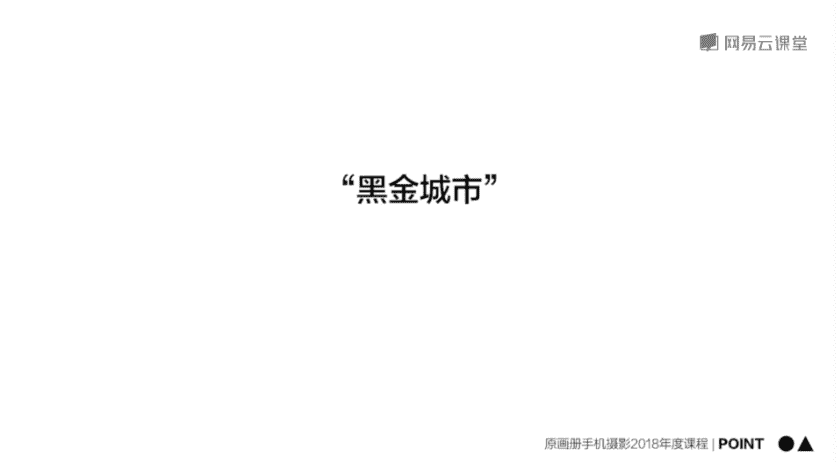
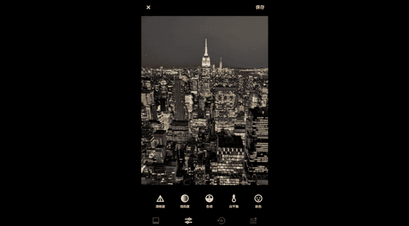
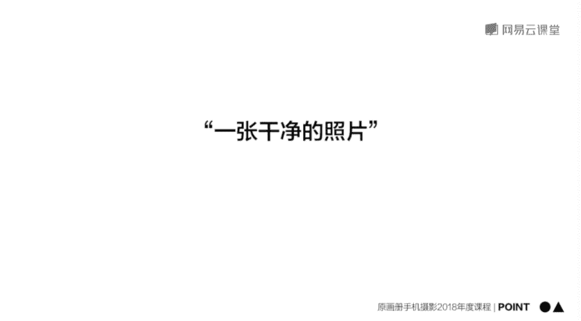
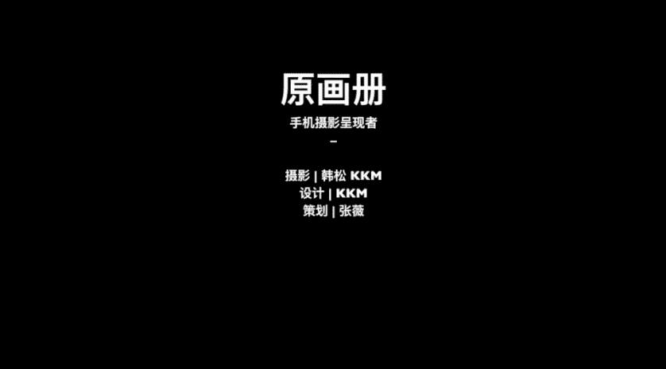

# 手机摄影后期教程：11：日系、黑金与干净通透风格后期实战

在本节课中，我们将学习如何使用手机后期软件，为照片赋予三种流行的风格：日系清新、黑金城市和干净通透。我们将通过具体的操作步骤，理解曲线、HSL等核心工具的使用方法，并掌握每种风格的关键调整思路。

---

## 🎨 第一部分：日系风格调色

上一节我们介绍了后期调色的基本操作，本节中我们来看看如何调出日系风格的照片。提到日系风格，通常会联想到高亮度、低对比度、低饱和度的画面，给人一种干净、舒适的感觉。

我们使用 **Snapseed** 软件进行演示。原图背景是蓝天与海面，前景是绿草，本身具有日系的色彩基础，但亮度不足，通透感较差。我们将使用**曲线**功能进行调整。

首先，点击工具栏的“曲线”按钮。曲线图从左到右、从下到上，分别代表画面从最暗到最亮的像素分布。

以下是调整日系风格曲线的具体步骤：

1.  **提升整体亮度**：在曲线中间取一个点，向上拉动。这会使画面整体变亮，曲线从直线变为向上的弧线。亮度提升后，画面的通透感会增强。
2.  **降低对比度**：将曲线左下角的点（代表最暗部）向上拉动。这会让暗部变亮，从而有效降低画面的整体对比度，营造出朦胧、柔和的写意感。
3.  **微调高光**：有时可将曲线右上角的点（代表最亮部）稍微向下拉一点，以抑制过亮的高光，让对比度更柔和。
4.  **调整色彩倾向**：点击曲线界面下方的通道按钮，选择**蓝色通道**。将蓝色曲线向上拉，可以为画面（尤其是天空部分）增加蓝色调，增强夏日清凉的氛围。接着，选择**红色通道**，将曲线稍微向下拉，减少红色，使色调更清爽。
5.  **降低饱和度**：完成曲线调整后，在“调整图片”工具中，将饱和度降低10%-20%。这是日系风格的常见操作。

调整完成后，长按屏幕对比原图，可以看到画面的空气感和清新氛围得到了显著增强。

**核心概念总结**：曲线工具能精确控制画面从阴影到高光各部分像素的亮度和色彩。日系风格的关键在于 **高亮度、低对比度、低饱和度**，并可通过色彩曲线为画面添加轻微的色偏来传达情绪。

---

## 🌃 第二部分：黑金风格调色

接下来，我们学习第二种流行风格：黑金城市夜景。这种风格酷炫、富有科技感，其核心是只保留画面中的金黄色调，将其他颜色全部去除。

我们使用 **VSCO** 软件，并利用其 **HSL（色彩分离）** 功能来实现。HSL 是调整色彩的强大工具：
*   **H (Hue)**：**色相**，指色彩的种类，如红、绿、蓝。
*   **S (Saturation)**：**饱和度**，指色彩的鲜艳程度。
*   **L (Lightness)**：**亮度**，指色彩的明暗程度。

以下是创建黑金风格的具体步骤：

1.  **打开HSL工具**：在VSCO中打开一张灯火璀璨的城市夜景照片，进入调整模块，找到HSL工具。
2.  **消除非黄/金色**：黑金效果的目标是只保留黄色和金色。因此，我们需要将其他颜色的饱和度全部降为0。
    *   选择**红色**，将其饱和度降至0。
    *   选择**绿色**，将其饱和度降至0。
    *   选择**蓝色**，将其饱和度降至0。
3.  **二次构图与微调**：调整色彩后，可以使用裁剪工具进行二次构图，将主体（如标志性建筑）置于画面中心。同时，利用“调节”工具提亮主体，压暗无关的暗部区域。
4.  **应用滤镜强化色调**：VSCO中C系列（如C1、C2、C3、C7、C8）滤镜对黄色调有很好的强化作用。可以选择一个合适的滤镜（如C3），并调整其强度。
5.  **最终微调**：最后，可以适当提高一点整体饱和度，并将白平衡的色温向暖色（黄色）方向微调，使金色更加突出。

对比原图，调整后的照片呈现出强烈的未来感和统一的色彩情绪。

**核心概念总结**：**HSL工具**允许我们针对特定颜色进行精准调整。实现黑金风格的关键思路是：**保留黄/金色的色相、饱和度和亮度，同时将其他所有颜色的饱和度降为零**。

---

## 🧼 第三部分：干净通透风格调色

最后，我们来学习如何让一张看起来杂乱、灰蒙蒙的照片变得干净、通透。我们将继续使用 **VSCO** 软件。

原片拍摄于日本海边，问题在于元素杂乱、色彩显脏、整体亮度不足。调整思路是：先做减法（裁剪），再统一并提亮色调。

以下是打造干净通透风格的具体步骤：

1.  **裁剪与构图（做减法）**：使用裁剪工具（如1:1方形构图）去除画面中多余的元素（如电线、杂乱背景），只保留核心人物及其关系。同时，确保海平面等线条水平，使画面看起来稳定、舒适。
2.  **应用基础滤镜定调**：选择一款能营造干净、怀旧或统一色调的滤镜。例如，**A4滤镜**能添加淡淡的金色/复古色调，有助于统一画面色彩。
3.  **大幅提升曝光**：这是让画面“通透”最关键的一步。大幅度增加曝光值，画面会立刻摆脱灰暗、沉闷的感觉，变得明亮、清爽。
4.  **调整白平衡修正色偏**：如果提亮后人物肤色或其他部分颜色偏黄或不正，可以进入白平衡调整。将**色温**向负值（蓝色）方向微调，能中和过多的黄色，让色调更干净，有时还能增添一丝清新的蓝调氛围。
5.  **微调饱和度**：最后，根据画面情况适当降低整体饱和度，可以进一步抑制杂色，让视觉焦点更突出，画面更显高级。

对比原片，调整后的照片主题鲜明、色调统一、明亮通透，给人以自然舒适的感受。

**核心概念总结**：干净通透的风格源于 **简洁的构图、充足的曝光和统一的色调**。滤镜能快速定调，但核心调整仍依赖于基础的曝光、白平衡和饱和度工具。应谨慎使用颗粒、暗角等夸张特效，确保后期为画面主题服务。

---

## 📝 课程总结

本节课中，我们一起学习了三种流行照片风格的后期实战：
1.  **日系风格**：使用Snapseed的**曲线工具**，通过**提亮、降对比、微调色偏、降饱和度**来实现。
2.  **黑金风格**：使用VSCO的**HSL工具**，通过**保留黄/金色，消除其他颜色**来实现。
3.  **干净通透风格**：通过**裁剪构图做减法、使用滤镜定调、大幅提升曝光、校正白平衡**这一系列操作来实现。

请记住，无论使用何种软件，后期调整都离不开 **影调（明暗）、色彩和校正（构图、水平）** 这三大板块。理解每个参数如何影响照片，需要大量的练习。

**课后练习**：请找一张自己拍摄的照片，尝试将其调整为日系风格，实践本节课所学的曲线与色彩调整原理。