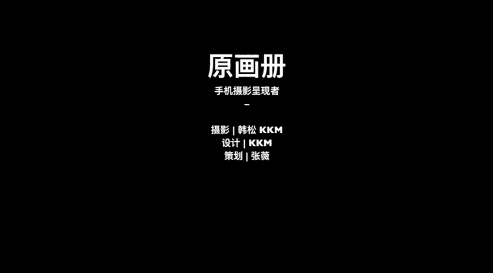

# 手机摄影教程：12：人像摄影拍摄前如何准备

在本节课中，我们将学习手机人像摄影的拍摄前准备工作。我们将探讨如何选择拍摄环境、模特着装以及利用光线，为拍出自然和谐的人像照片打下基础。

人像摄影是手机摄影中最常见的题材之一。拍摄出好的人像作品，不仅需要掌握拍摄技巧，还与拍摄环境、模特着装以及与模特的互动交流密切相关。本节课，我们邀请到演员熊迪作为模特，为大家示范手机拍摄人像的要领。

人像摄影有多种风格，例如欧美棚拍、日系小清新或复古古装风格。然而，使用手机拍摄人像最适合的风格是简单纯粹的。在环境中，我倾向于选择轻松的自然光或场景光。模特通常画淡妆，采用最简单、最自然的日常姿势进行拍摄。后期处理也力求简单明快。

上一节我们提到了手机人像摄影的整体思路，本节中我们来看看拍摄前具体的准备工作。

## 模特与环境选择

今天的模特是我的好朋友，演员熊离。在拍摄环境上，我选择了一家日系风格的咖啡馆。该咖啡馆内饰留白较多，色彩淡雅，为拍摄提供了简洁的背景。

## 服装搭配与色彩和谐

在服装选择上，模特提供了两套衣服：一套是米色（贴近肤色），另一套是墨绿色。我最终选择了与环境和谐的米色套装。

为了更直观地理解色彩搭配，我们可以进行色彩分析。将左边米色衣服与右边咖啡馆环境的主要色彩提取出来，可以得到一组色卡。

```
色卡示例：[米白, 浅棕, 暖灰, 淡黄]
```

色卡显示出的是一组偏暖、偏米色的自然色调。这体现了人物与环境的和谐。因此，我选择了左边的米色衣服。

当然，拍摄也存在其他可能性。例如，背景中的红墙与前景中模特的白色衬衫和牛仔裤搭配，可以衬托出英姿飒爽的感觉。另一种可能是色彩撞色，例如在冷色调背景中穿着红色大衣，也有其独特的美感。但本次拍摄主要以融合的色调为主。

以下是关于服装配色的一些建议：

为了辅助服装配色，我推荐一个实用的工具：**Color.adobe.com**。这个网站可以自动抓取照片中的颜色并生成一组色卡。你可以根据这组色卡来搭配着装。

例如，选择一张《海街日记》的剧照导入该网站，它便会自动提取出如下色卡，方便你进行后续的色彩搭配参考。

## 光线的选择与运用

在拍摄光线上，我认为自然的散射光和场景光非常适合手机人像拍摄。

以下是几种推荐的光线类型：

1.  **阴天光线**：光线非常均匀柔和，能自然地打在人物脸部，避免生硬的光影。
2.  **窗口光**：阳光从室外通过窗口射入室内，为人物提供柔和的光线照射。
3.  **环境反射光**：光线经过墙壁、天花板等环境的二次反射和散射后，会变得更加柔和。

这些光线的运用都能为人像照片增色不少。


## 核心要点总结

本节课中我们一起学习了手机人像摄影的拍摄前准备。以下是两个核心要点：

1.  **光线选择**：手机人像摄影最合适的光线是自然散射光，它简单纯粹，易于掌控。
2.  **场景与着装**：日常手机拍摄不同于摄影棚拍摄。选择明亮、与环境融合的着装和场景，更容易拍出好效果。

今天的内容就是这些。我是原画册的韩松，感谢大家参加我的课程。



