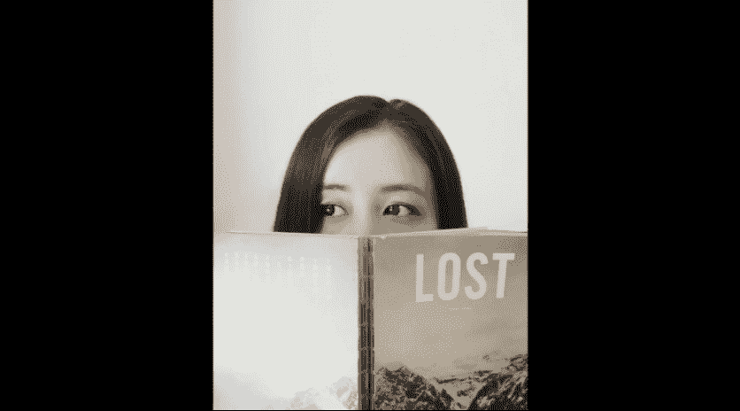

# 手机摄影：13：人像拍摄要领

在本节课中，我们将学习如何通过不同的拍摄姿势和技巧，捕捉自然、生动的人像照片。课程将分为站姿、坐姿、人物与环境结合以及逆光人像四个部分，每个部分都包含具体的操作步骤和核心要点。

## 站姿拍摄技巧

上一节我们介绍了课程的整体结构，本节中我们来看看如何拍摄站姿人像。站姿拍摄是基础，关键在于引导模特放松并捕捉自然瞬间。

以下是站姿拍摄的具体步骤：

1.  **选择合适背景与光线**：示例场景为咖啡厅室外的一堵白墙。阴天的散射光配合白墙的二次反射光，能使人物肌肤显得柔嫩。
2.  **引导模特放松**：模特最初可能紧张。通过聊天和引导其进行跳跃、左右摇摆等幅度较大的运动，可以缓和面部表情，使其更自然。
3.  **使用连拍捕捉表情**：当模特状态放松后，使用手机的连拍功能记录其自然的表情和动作。
4.  **尝试不同景别与姿势**：
    *   **拉近镜头**：使用二倍焦距拍摄特写肖像。
    *   **引导姿势**：让模特尝试转头、挠头、低头闭眼等动作，这些姿势有助于表现自然感。
5.  **运用道具与转身**：使用与环境搭配的布袋作为道具。让模特先背对镜头，在转身回眸的瞬间进行连拍，捕捉自然生动的表情。
6.  **利用头发修饰**：侧身拍摄时，用头发遮住部分脸部，可以起到显瘦的效果。注意不要完全遮挡。
7.  **手动调整曝光**：如果环境较暗，可以手动调高曝光，使模特面部肌肤更明亮柔嫩。
8.  **锁定曝光与对焦**：在拍摄一组照片时，长按屏幕锁定曝光和对焦，可以保持画面亮度一致，方便后续拍摄。

## 坐姿拍摄技巧

上一节我们学习了站姿拍摄，本节中我们来看看坐姿拍摄的要点。坐姿更侧重于肖像和细节的捕捉。

以下是坐姿拍摄的具体步骤：

1.  **利用窗口光**：选择靠窗的位置，自然光能形成绝佳的轮廓光和背景虚化效果。
2.  **从小动作开始引导**：让模特从双手托腮、闭眼等小幅度的柔和姿势开始，有助于放松。
3.  **逐步尝试大动作**：模特放松后，可以引导其做侧脸、捋头发、挠头等动作，并使用连拍捕捉。
4.  **运用手部动作修饰脸型**：用头发遮住半张脸并用手托住，可以让脸型看起来更小。
5.  **眼神引导**：引导模特与镜头互动，或让其眼神聚焦于画面外的某一点（如窗外的树），以捕捉有神的“眼神光”。
6.  **使用道具辅助**：水杯、书本等日常道具可以帮助模特缓和表情，让拍摄更自然。
    *   **用水杯**：引导模特或看镜头，或凝视他处。
    *   **用书本**：用书遮住部分脸部可制造神秘感，也有显瘦效果。此时需手动调高曝光以保证脸部亮度，并锁定对焦在眼睛上。
7.  **拍摄特写要点**：使用二倍焦距拍摄特写时，确保对焦在眼睛上。轻微移动手机，将室外光线引入眼睛，可以形成漂亮的眼神光。
8.  **姿势细节**：拍摄时，可引导模特下巴微收，使头部线条更协调。

## 人物与环境的结合

上一节我们探讨了坐姿肖像，本节中我们来看看如何将人物与环境有机结合，创作更有故事感的画面。

以下是人物与环境结合的拍摄方法：

1.  **人物比例与侧重点**：
    *   **人物比例大（肖像）**：重点在于人物的动作与表情。
    *   **人物比例适中**：重点在于人物与环境的结构关系，如利用对称、几何线条等构图。
    *   **人物比例小**：重点在于环境的呈现，人物作为点缀，形成大小对比的张力。
2.  **引导人物动作**：在宽松环境中，引导模特伸懒腰、跳跃等动作，可以表现轻松氛围并让身形更舒展。
3.  **显高小技巧**：拍摄全身照时，让模特脚尖绷直并置于画面底部边缘，可以在视觉上拉长腿部线条。
4.  **利用环境元素**：寻找水洼等可以形成倒影的场景，拍摄人物与建筑的对称画面，增强画面趣味性和美感。
5.  **动态捕捉**：对于跳跃等动作，使用连拍功能，并配合“3、2、1”的口令引导，可以完整捕捉过程，便于后期选出最佳瞬间。

## 逆光人像拍摄

上一节我们学习了人物与环境的搭配，本节中我们来看看如何在逆光条件下拍摄出彩的人像照片。

以下是逆光人像的拍摄步骤：

1.  **理解逆光**：逆光指光源（如太阳）位于模特背后，正对镜头。这种光线能为人物勾勒出明亮的轮廓。
2.  **使用人像模式**：在日落或日出时分拍摄。打开手机的人像模式（或类似功能），在光线效果中选择“轮廓光”选项。
3.  **寻找光线位置**：移动手机，让阳光处于人物轮廓的边缘，最容易捕捉到金色的轮廓光。
4.  **确保对焦清晰**：逆光拍摄时自动对焦容易失效。每拍一张前，都需要手动点击屏幕，重新对焦在人物面部，确保主体清晰。
5.  **尝试遮挡太阳**：让模特完全遮挡住太阳，阳光会从其身体边缘透出，形成强烈的轮廓光效果。

本节课中我们一起学习了人像拍摄的核心要领：**引导重于摆拍**。通过让模特做一些小动作来化解僵硬，大量使用**连拍**来捕捉自然瞬间，并始终确保**对焦在眼睛**上。无论是站姿、坐姿，还是与环境结合或逆光拍摄，关键在于观察光线、引导情绪，并利用手机功能锁定曝光、选择合适模式，从而提升出片率。记住，捕捉真实自然的瞬间，比设计完美的姿势更重要。