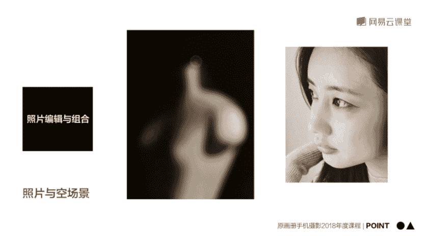
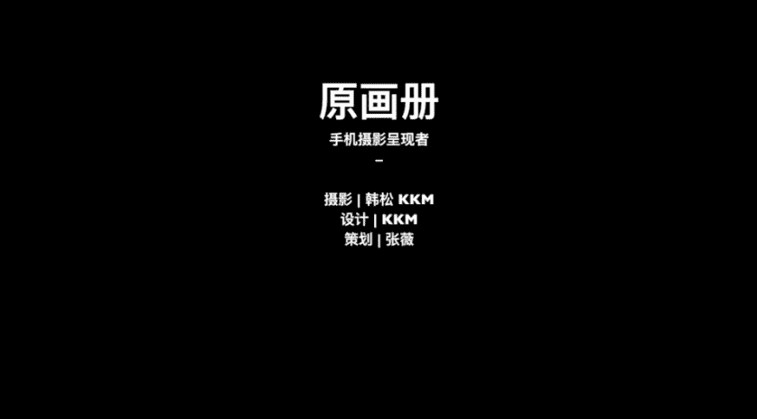

# 韩松-跟全球iPhone摄影大赛冠军学手机摄影，随手惊艳朋友圈（完结）：课时14：手机人像摄影后期处理

在本节课中，我们将要学习如何使用手机软件对拍摄的人像照片进行后期处理，包括瑕疵修复、局部调整、色调优化以及照片的拼接组合，最终获得清新、自然且富有情绪感的成片。

## 🧹 第一步：瑕疵修复与背景清理

上一节我们介绍了人像拍摄的要点，本节中我们来看看如何通过后期处理优化照片。首先，我们需要处理照片中的瑕疵，例如杂乱的背景和人物细节问题。

我们以一张站姿人像照片为例。观察原片可以发现两个主要问题：背景墙壁显得有些脏污、发黄；模特的头发被风吹得较为散乱。此外，模特的面部肤色也偏暗，需要进行局部提亮。我们的整体调色思路是将其调整为日系广告般的清新风格。

我们将使用 **Retouch** 这款软件进行初步修复。这款软件擅长移除画面中不需要的元素。

以下是使用 Retouch 的操作步骤：

1.  **快速修复背景**：导入照片后，选择“快速修复”功能。点击并涂抹背景中脏污的部分，软件会自动将其清除。这个过程需要耐心，确保所有瑕疵都被处理干净。
2.  **克隆印章处理复杂区域**：对于散乱的头发，使用“快速修复”容易产生不自然的痕迹。此时应切换到“克隆印章”功能。首先，在头发附近干净的背景处取样，然后在杂乱的头发区域进行涂抹，用干净的背景覆盖它们。可以放大画面进行精细操作。

处理完成后，保存副本，进入下一步。

## ✨ 第二步：面部优化与局部调整

在清理了背景之后，我们将使用 **Snapseed** 对人物的面部进行精细优化，核心是提亮肤色并实现自然的磨皮效果。

Snapseed 的“局部”功能是调整人像的利器。它允许我们对画面的特定区域进行精确的参数控制。

以下是使用 Snapseed 局部功能的步骤：

1.  **创建调整点**：导入上一步保存的照片，选择“工具”菜单中的“局部”功能。在模特面部点击，创建一个调整点。
2.  **控制调整范围**：用两根手指在屏幕上缩放，将红色的调整范围精确控制在面部区域。
3.  **调整参数**：选中调整点后，屏幕上会出现“亮、对、饱、结”四个参数，分别代表亮度、对比度、饱和度和结构。
    *   **提亮肤色**：向上滑动，选择“亮”度并提高数值，使面部变亮。
    *   **柔化皮肤**：选择“结”构并降低数值，这能平滑皮肤纹理，实现类似磨皮的效果，且比直接使用美颜滤镜更自然。
4.  **柔化整体背景**：最后，可以使用“突出细节”工具，将“结构”参数整体拉低一些，让背景墙壁更加柔和平顺。

调整满意后，保存副本，准备进行最终的色调处理。

## 🎨 第三步：整体色调与风格塑造

现在，照片已经变得干净、明亮。最后一步，我们将使用 **VSCO** 为照片赋予独特的色彩风格，塑造日系清新的整体氛围。

我们的目标是调出略带复古感的清新色调。VSCO 丰富的滤镜和细致的调整工具非常适合完成这一步。

以下是使用 VSCO 调色的步骤：

1.  **应用基础滤镜**：导入照片，选择 **A4** 滤镜。这个滤镜能为画面增添一层温和的暖黄色调。
2.  **微调滤镜强度**：如果觉得 A4 滤镜的黄色过重，可以适当降低滤镜的强度。
3.  **调整基础参数**：
    *   **提高曝光**：轻微提高整体曝光，确保画面没有死黑区域，显得通透。
    *   **降低对比度**：稍微降低对比度，可以营造出朦胧、柔和的氛围。
    *   **调整高光**：如果背景高光过亮，进入“色调”选项，降低“高光”数值，让白色背景更柔和。
    *   **校正白平衡**：如果觉得画面偏黄，进入“白平衡”选项，将色温向蓝色方向微调（例如 -1.2）。
    *   **降低饱和度**：最后，轻微降低整体饱和度，让色彩更淡雅、高级。

经过以上步骤，照片与原片相比已焕然一新，呈现出干净、淡雅的日系风格。最后，可以使用“调节”工具进行二次构图，将人物置于画面更合适的位置。

## 🖼️ 第四步：组照处理与创意拼图

上一节我们处理了单张照片，本节中我们来看看如何将一组照片进行统一处理并组合，形成更有故事感的组照。

我们以四张在室内拍摄的、表情俏皮可爱的近景肖像为例。这四张照片状态连贯，非常适合组合在一起。

以下是处理组照并拼图的步骤：

1.  **统一构图**：在 VSCO 中同时导入四张照片。为了营造复古的拍立得感觉，将所有照片裁剪为 **1:1 的正方形构图**。裁剪时注意保留人物最生动的部分（如眼神、手势），并将主体置于画面显眼位置。
2.  **统一调色**：选择其中一张照片进行调色。使用 **04号** 滤镜增加对比度和复古感。然后进行微调：提高一点曝光，降低一点饱和度，并将白平衡向冷色调微调。
3.  **创建并应用配方**：调色完成后，点击屏幕下方从左往右第三个按钮（“复制编辑”），选择“创建配方”并保存。这个配方记录了你所有的调整步骤。然后，将其余三张照片选中，应用这个配方，即可一键完成统一风格的调色。
4.  **创意拼图**：将处理好的四张照片保存。使用 **Layout** 这款拼图软件，选择“四宫格”模板，将照片拼接在一起。可以适当调整边框，让拼图看起来更紧凑。这样，四张独立的瞬间就串联成了一个有情绪流动的小故事。

## 💡 核心要点总结与作业

本节课中我们一起学习了手机人像后期的完整流程。最后，我们来总结几个核心要点，并布置一个小作业。

**人像后期三大核心要点：**

1.  **处理要克制**：尤其在皮肤处理上，切忌过度磨皮，保留自然的皮肤质感更为高级。
2.  **曝光可微增**：对大多数人像照片来说，稍微提高一点曝光是让画面显得干净、通透的有效方法。
3.  **组照易成型**：同一场景、同一组连拍、采用统一后期风格的照片，很容易通过拼图形成富有表现力的组照。

**技术要点回顾：**
干净的背景和明快的着装是人像拍摄的有利条件。如果拍摄对象不是专业模特，引导其保持自然状态是核心。拍摄时，可以引导模特做一些转头、托腮等小动作，并**多用连拍**来捕捉最满意的瞬间。后期时，务必记住“克制”原则，避免过度美颜。

**课后作业：**
请尝试拍摄一组类似课程中示范的四宫格人像照片，并运用本节课所学的软件和步骤进行后期处理与拼图。

今天的内容就是这些，我是原画册的韩松。谢谢大家参加我的课程。