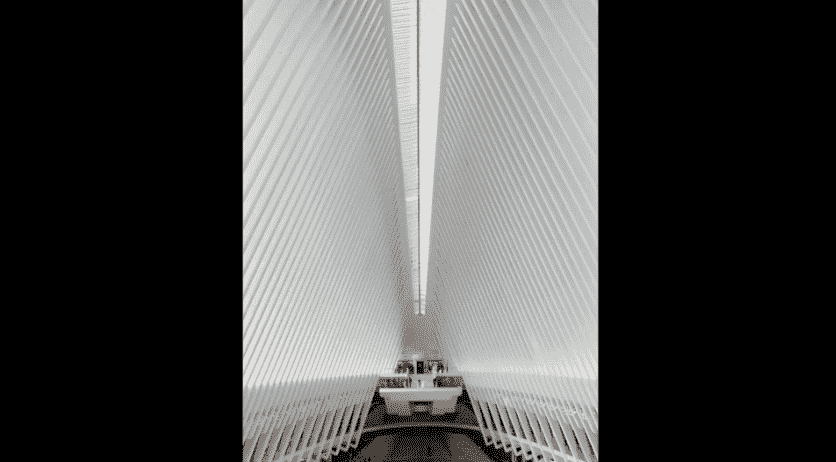

# 韩松-跟全球iPhone摄影大赛冠军学手机摄影，随手惊艳朋友圈（完结）：课时16：建筑与空间 🏙️

在本节课中，我们将学习如何拍摄城市建筑与空间，掌握处理透视、构图以及人物与建筑关系的核心技巧，并了解如何通过后期调整获得理想的视觉效果。

## 透视的修正：从三点到两点

上一节我们介绍了城市建筑摄影的概况，本节中我们来看看如何处理建筑拍摄中最常见的问题——透视变形。

当我们站在地面仰视较高的建筑时，拍摄出的照片通常会产生三点透视效果，即建筑的线条会向中间倾斜汇聚。而我们希望得到的是两点透视效果，让建筑呈现出垂直挺拔的感觉。

**三点透视** 与 **两点透视** 的核心区别在于垂直线条是否平行。通过后期软件（如Snapseed、Lightroom）的“透视”或“变形”工具，可以将倾斜的线条拉直，从而将三点透视修正为两点透视。

## 人物与建筑的构图比例

在表现建筑与人的关系时，如果建筑是主体，人物的比例不宜过大。

以下是关于人物比例与位置的具体建议：
*   **人物比例**：人物在画面中的比例最好不超过五分之一（`人物面积 < 1/5 画面面积`）。
*   **人物作用**：适当的人物可以为建筑空间增添生机与尺度感。
*   **位置选择**：将人物放置在画面的终点或三分点等关键位置，可以使视觉感受更加平衡与舒适。

## 实战案例一：简化与提炼

现在，我们通过具体案例来应用上述原则。观察林肯中心广场对面的建筑，其线条纵横交错，极具几何美感。

为了突出这种美感，我采取了以下步骤：
1.  调高焦距（使用变焦），排除背景中杂乱的元素。
2.  等待人物进入简洁的构图区域，使画面干净。
3.  当广场场景较为杂乱时，直接对准建筑本身，利用其线条与下方行人形成大小对比。

在构图上，可以打开手机的九宫格辅助线。将人物置于右下方的焦点处，能使构图更饱满，人物位置更顺眼。最终得到的照片，线条由近及远延伸，充分展现了几何结构之美。

## 实战案例二：多角度探索几何之美

接下来观察世贸中心附近的一个商业建筑，其流线型外观极具几何美感。

我采用了两种思路来表现它：
1.  **简化结构**：使用大变焦，聚焦于建筑的局部流线线条，避开其他部分。拍摄时需要稍微抬高镜头，舍弃下方的人行道，突出建筑上方的形态。
2.  **融入人物**：将镜头下移，纳入人物。建筑立面的几何之美与动态的人物形成有趣的对比与互动。

通过这两种方法，我们可以得到展现建筑纯粹几何美感、建筑与环境关系、以及建筑与人互动的不同照片。

## 深入建筑内部：线条与对称

接下来我们进入建筑内部。其内部空间同样充满了整齐排列的线条，富有节奏与韵律感。

以下是内部拍摄的几个有效方法：
*   **对称构图**：将焦点对准画面正中央。许多建筑内部是左右对称的，这种构图极具仪式感，能带来整齐的美感。公式可以表示为：`画面左侧元素 ≈ 镜像翻转(画面右侧元素)`。
*   **改变画幅**：除了横向构图，尝试纵向构图，以展现空间在垂直方向上的结构之美。
*   **聚焦韵律**：将焦距调整为2倍，捕捉线条由近及远的分布，能强化画面的节奏感。
*   **仰拍天花板**：从下往上仰拍，有时能发现天花板独特的结构线条，获得意想不到的角度。

## 拍摄技巧与视觉语言

在拍摄建筑时，可以主动运用以下摄影视觉语言：
*   **形式美**：寻找建筑本身的重复、节奏、韵律、雕塑感和几何感。
*   **独特视角**：多从地面、天花板或细节处寻找拍摄灵感。

当拍摄浅色调内饰的建筑时，一个小技巧是：点击屏幕对焦后，向上滑动手指以拉高曝光。这样操作能使浅色建筑显得更加通透、白皙。

## 实战案例三：人物与空间的点睛之笔

在建筑中游走时，要持续观察线条与行人的关系。例如，发现对面露台上有一位女士，其位置背景干净，与建筑融为一体。

此时，我的操作是：
1.  拉近对焦，确保主体和背景都清晰干净。
2.  随时观察人物动作，等待最佳瞬间。
3.  适当拉高曝光，让背景更通透。
4.  微调角度，最终捕捉到满意的照片。

## 进阶实战：图书馆的内外之美

最后，我们以天津滨海图书馆为例，学习更综合的技法。

**室外拍摄**：
*   **时机**：选择傍晚“蓝色时刻”，建筑内部亮起暖黄色灯光，与天空的蓝色形成强烈的 `黄蓝对比色`。
*   **角度**：正对对称式建筑拍摄，能最大程度展现其宏伟气势。

**室内拍摄**：
1.  **利用倒影**：对于大理石等反光地面，可将手机倒置，镜头朝下贴近地面。这样能拍出建筑的倒影，让几何美感翻倍。等待人物经过时使用连拍，最后筛选出人物姿态与倒影结合最佳的照片。
2.  **突出比例**：使用变焦拉近远处整齐的书架作为背景，将人物点缀在画面的三分之一处。利用人与空间的巨大比例反差来制造视觉美感。
3.  **仰拍天花板**：抬头拍摄天花板，往往能避开地面杂乱的人群，捕捉到建筑顶部最漂亮的结构线。

## 核心要点总结

本节课中我们一起学习了建筑与空间摄影的核心技巧，现在让我们回顾一下重点：

*   **透视处理**：拍摄高大建筑时，应通过后期修正，尽量制造两点透视，获得垂直效果。
*   **人物运用**：人物不是建筑的妨碍，运用得当可为照片加分。人物比例宜小，并以有序方式分布，成为建筑的“配角”。
*   **寻找形式美**：主动发现并利用建筑的重复、节奏、韵律等形式美规律。
*   **聚焦结构**：寻找建筑和空间中的主要结构线，这是拍摄建筑的要点。

通过掌握这些方法，你将能更从容地用手机捕捉建筑的空间美感与几何魅力。