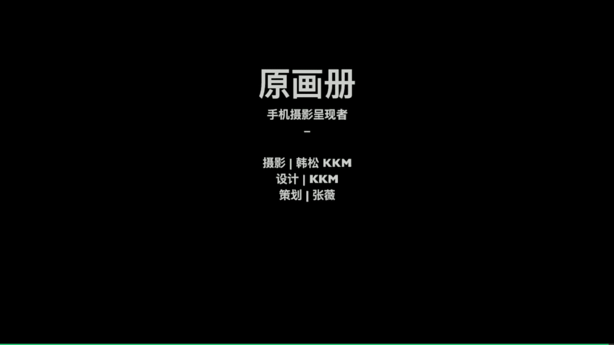

# 韩松-跟全球iPhone摄影大赛冠军学手机摄影，随手惊艳朋友圈（完结）：课时18：后期案例

在本节课中，我们将学习城市建筑风景摄影的后期处理技巧。我们将通过几个具体的案例，详细讲解如何使用手机软件矫正建筑透视、调整室内色调以及为风景照片渲染特定氛围。

## 矫正建筑透视

上一节我们介绍了建筑摄影的构图要点，本节中我们来看看如何通过后期处理矫正建筑的透视变形。当从地面仰拍高层建筑时，由于镜头向上倾斜，建筑线条会向上汇聚，形成三点透视，使建筑看起来歪斜。我们可以通过后期软件将其调整为垂直挺拔的两点透视。

有两款软件可以实现此功能：**Snapseed** 和 **SKRWT**（后者为苹果手机独享应用）。我们将分别演示操作步骤。

### 使用 SKRWT 矫正透视

首先，我们使用 SKRWT 进行调整。

1.  打开 SKRWT 并载入需要处理的照片。这是一张典型的仰拍建筑照片，建筑呈现三点透视的歪斜状态。
2.  软件底部有6个按钮，最重要的功能是**从左往右数第四个按钮**（图标为带有四个空格的方框）。点击它。
3.  点击后，画面四角会出现四个控制点。触碰任意一点，该点会变为蓝色表示被选中。
4.  **第一步：左右拉动，调整垂直。**
    *   选中左上角的点，**向右**（画面内侧）水平拖动，直到建筑最左侧的线条变为垂直。
    *   选中右上角的点，**向左**（画面内侧）水平拖动，直到建筑最右侧的线条变为垂直。
    *   此步骤可能需要反复微调几次，直到建筑整体看起来完全垂直。
5.  **第二步：上下拉动，恢复比例。**
    *   同时选中上方两个控制点中间的方法，此时两个点会同时被选中。
    *   将选中的点**向上**拖动，使刚才因矫正而被压扁的建筑恢复原始的视觉比例。

至此，使用 SKRWT 矫正建筑透视的步骤完成。核心流程是：**先左右拉直，再上下恢复比例**。

### 使用 Snapseed 矫正透视

接下来，我们使用 Snapseed 完成相同的操作。

1.  打开 Snapseed 并导入同一张照片。
2.  选择底部的 **“工具”**，然后在工具列表中选择 **“透视”** 功能。
3.  进入透视调整界面后，首先点击右上角的 **“自由”** 模式。同样，画面四角会出现四个控制点。
4.  **第一步：左右拉动，调整垂直。**
    *   操作与 SKRWT 类似：拖动左上角和右上角的控制点，分别向画面内侧水平移动，直到建筑左右两侧的线条垂直。
5.  **第二步：缩放画面，恢复比例。**
    *   完成垂直矫正后，点击底部工具栏中**从左往右数的第二个按钮——“缩放”**。
    *   在缩放界面中，**向上**拖动画面，即可将被压扁的建筑拉伸，恢复其正常比例。

通过以上演示可以看出，无论是 SKRWT 还是 Snapseed，矫正建筑透视的**核心步骤是相同的**：**首先通过左右移动控制点将建筑拉直，然后通过缩放或拉伸功能恢复建筑的正确比例**。

## 调整室内白平衡

在室内拍摄白色建筑时，手机相机拍出的白墙常常会偏黄，显得不够干净。接下来，我们以天津滨海图书馆的照片为例，学习如何修正这种色偏，还原干净、清爽的白色色调。

我们将使用 Snapseed 进行处理，以下是具体步骤：

1.  **应用滤镜抑制黄色**：首先，使用 **A6** 号滤镜。这个滤镜能有效抑制画面中的暖黄色调，让白色显现出来。
2.  **微调基础参数**：应用滤镜后，需要进行细致的参数微调，以优化画面效果。
    *   **增加曝光**：为了让室内显得更明亮，通常需要大幅增加曝光值。本例中增加了 **+4** 的曝光。
    *   **降低高光**：增加曝光后，画面亮部可能过曝。接着调整“色调”中的 **“高光”** 参数，适当降低高光（向左滑动），让过亮的部分恢复细节，画面更柔和。
    *   **调整白平衡**：此时观察照片，背景可能仍有轻微泛黄。进入 **“白平衡”** 工具，将 **“色温”** 滑块向**蓝色**方向（左侧）拖动，即可完全抑制黄色，使整体色调呈现干净的白色。

经过以上调整，原本发黄的室内白墙变得干净清爽。此方法在处理建筑室内白墙时非常有效。

### 批量处理相似照片

当一组照片在相同的光线和环境下拍摄时，我们可以使用“复制编辑”功能快速批量处理，以下是操作方法：

1.  完成第一张照片的所有调整后，点击右下角的 **“✓”** 保存修改。
2.  在 Snapseed 的主编辑界面，点击右上角的 **“...”** 菜单，选择 **“复制编辑”**。
3.  返回相册，**选中其他需要处理的同组照片**，再次点击 **“...”** 菜单，选择 **“粘贴编辑”**。
4.  这样，第一张照片的所有调整步骤（包括滤镜和参数）都会被应用到选中的照片上。

**注意**：由于每张照片的细微差异，粘贴编辑后可能仍需对单张照片进行微调（例如，再次微调白平衡）。此方法能极大提升处理一组相似照片的效率。

## 渲染风景照片氛围

后期处理不仅能修正问题，还能为照片注入特定的情绪。我们以一张在冰岛黑沙滩拍摄的阴天照片为例，学习如何通过后期渲染忧郁、宁静的氛围。

原片色彩平淡，未能充分表现阴天场景的情绪。我们将使用 Snapseed 为其添加蓝调。

1.  **选择氛围滤镜**：Snapseed 的 **A7、A8、A9** 滤镜都能为画面添加非常自然的蓝调，并带有轻微暗角，适合营造特定氛围。本例中选择 **A8** 滤镜。应用后，画面整体色调由偏黄转为偏蓝，氛围立刻改变。
2.  **进行精细微调**：应用滤镜后，通过微调让氛围更突出。
    *   **降低曝光**：稍微降低曝光，让海面与黑色沙滩的分界线更加清晰、突出。
    *   **增加对比度**：适当增加一点对比度（约 **+1**），强化画面的明暗关系，但注意不要过度。
    *   **调整色温**：进入白平衡工具，将色温再向蓝色方向微调一点，进一步加强整体的冷调忧郁氛围。
3.  **尝试二次构图**：有时，裁剪可以强化照片的情绪表达。对于这张照片，可以尝试裁掉上方的部分天空，只保留海面和沙滩。这种构图消除了尺度感，带来一种更抽象、更富想象空间的朦胧美感。

你可以根据喜好，选择保存原图比例或裁剪后的版本，两者表达了不同的视觉感受。

## 后期核心要点总结

本节课中我们一起学习了建筑与风景摄影的多个后期案例。最后，为大家总结几个重要的后期要点：

*   **透视矫正至关重要**：对于建筑摄影，利用 Snapseed 或 SKRWT 的透视矫正功能，可以轻松将歪斜的建筑调整得横平竖直，使画面更显挺拔、规整。
*   **善用参考线对齐**：在后期裁剪或矫正时，务必开启软件中的**参考线**（如九宫格、水平仪），确保建筑线条的对称与横平竖直。建筑摄影对形式感要求很高，精确的对齐是基础。
*   **化繁为简，突出主体**：建筑空间本身具有强烈的形式感。后期时应注意去除画面中**多余、杂乱的元素**（如无关的行人、杂物），让观者的注意力集中在建筑结构与光影上。
*   **尝试黑白影调**：黑白是建筑和空间摄影的绝佳解决方案。它能**剥离色彩的干扰**，让观众更专注于画面的**线条、结构、质感和明暗对比**，往往能获得更纯粹、更有力量感的作品。

## 课程总结与作业

通过今天的学习，相信大家对城市建筑与风景的拍摄及后期都有了更深入的认识。我们来总结一下关键思路：

*   拍摄大场景时，在画面中**找到明确的主要结构和视觉主体**至关重要。
*   拍摄建筑时，多运用**对称、节奏、韵律、重复**等形式美法则。
*   不要把人物单纯视为遮挡建筑的负面元素，多观察和寻找**建筑与人的互动关系**，能为作品增添生气与故事性。

**课后作业**：
做一次“爬楼党”，用手机拍摄一张你所在城市最壮观的鸟瞰图，并运用本节课学到的后期技巧进行处理。

今天的课程就到这里。我是原画册的韩松，感谢大家参加我的课程。