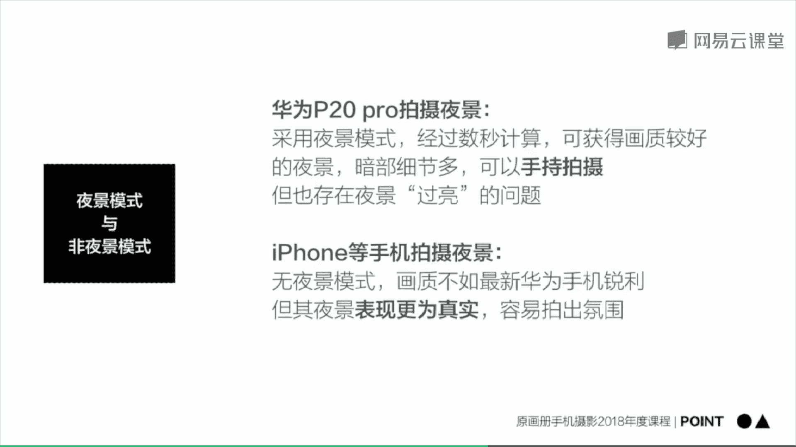

# 手机摄影：19：夜景拍摄技巧


在本节课中，我们将学习如何利用手机拍摄夜景。摄影是用光的艺术，这对手机摄影同样适用。我们将介绍几种与光线和夜景相关的拍摄方法，帮助大家利用日常光照条件拍出有氛围的照片。

## 夜景模式与非夜景模式

上一节我们提到了夜景拍摄的核心是光线控制，本节中我们来看看两种主要的拍摄模式：夜景模式和非夜景模式。

以下是两种模式的操作与特点：

*   **华为P20 Pro的夜景模式**：在普通拍照界面，向左滑动两格即可切换到夜景模式。按下快门后，手机会自动进行数秒的曝光并合成一张照片。此模式能有效抑制噪点，保留丰富的亮部和暗部细节，且支持手持拍摄。
*   **iPhone等手机的非夜景模式**：操作与白天拍摄相同，直接对焦、测光并拍摄。这种方式拍出的夜景可能不如夜景模式锐利，暗部细节也可能有损失，但画面往往更真实，更容易保留夜景的暗调氛围感。

## 专业模式与创意拍摄


了解了基础拍摄模式后，我们可以尝试更具创意的拍摄手法。本节中我们来看看如何使用专业模式拍摄动态模糊效果。

以华为P20 Pro为例，将拍摄模式切换到“专业”模式。通过手动设置较长的曝光时间（例如0.5秒），可以捕捉运动物体的拖影效果。

以下是具体操作步骤：

1.  切换到专业模式。
2.  设置曝光时间（快门速度）为0.5秒左右。
3.  将手机稳定放置（如使用三脚架或放在地面）。
4.  对焦并拍摄移动的物体（如行人、车流）。



**代码示例（概念性描述）**：
```
模式：专业模式
快门速度：0.5秒
ISO：自动或较低值
对焦：手动或自动对焦于场景
```
这样拍摄出的照片，移动的物体会产生模糊的拖影，与清晰的静态背景形成动静对比，增加画面的抽象感和动感。

## 夜景拍摄要点总结

本节课我们一起学习了手机夜景拍摄的几种方法和核心要点。

以下是三个关键的拍摄要点：

*   **手持与噪点**：智能手机为便于手持，通常会压缩曝光时间，但这可能导致暗部产生较多噪点。
*   **算法利弊**：具备夜景模式的手机通过算法合成来抑制噪点，但有时会导致夜景过亮，失去原有的氛围感。
*   **对焦与曝光**：拍摄时，焦点不要对准画面中最暗的区域，否则手机系统会自动提亮整体曝光，导致夜景氛围失控。应将焦点对准画面中亮度适中的区域。

通过合理运用夜景模式、专业模式，并注意对焦与曝光的控制，你就能用手机捕捉到迷人且富有感染力的夜景画面。


