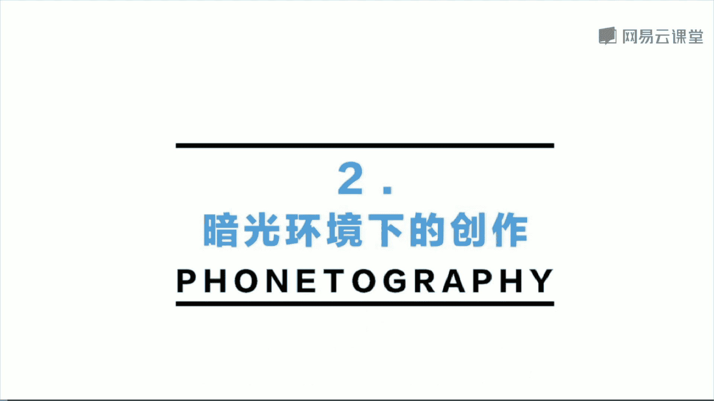
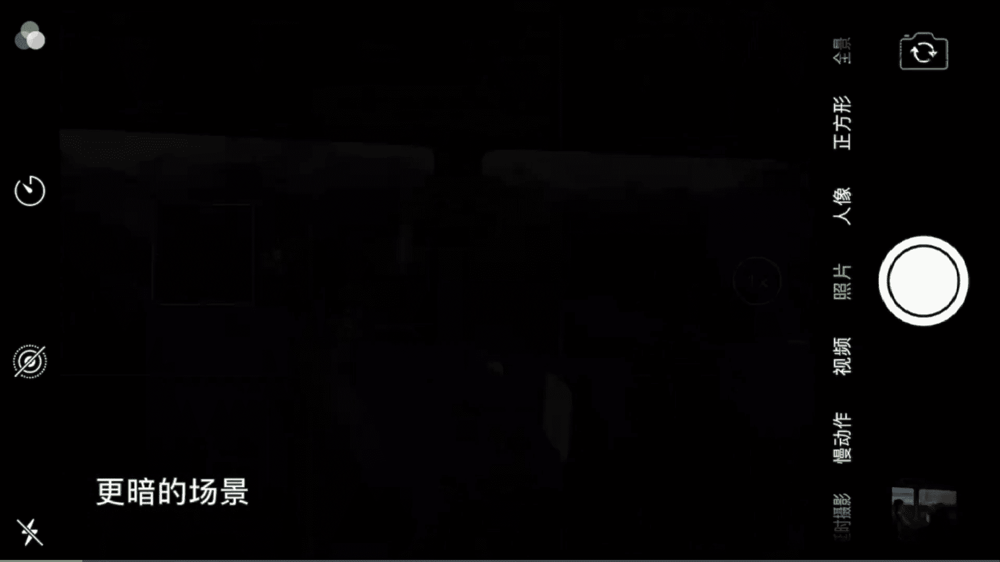
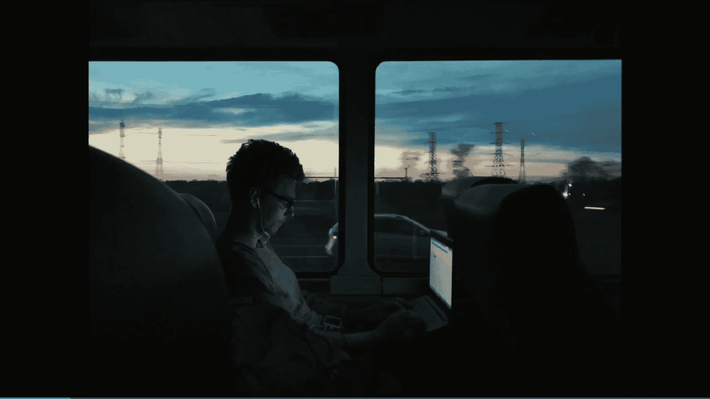
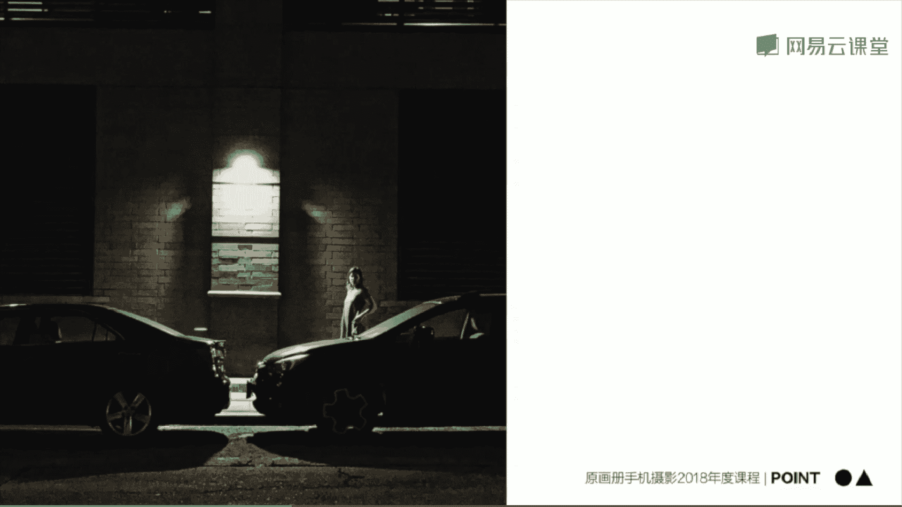
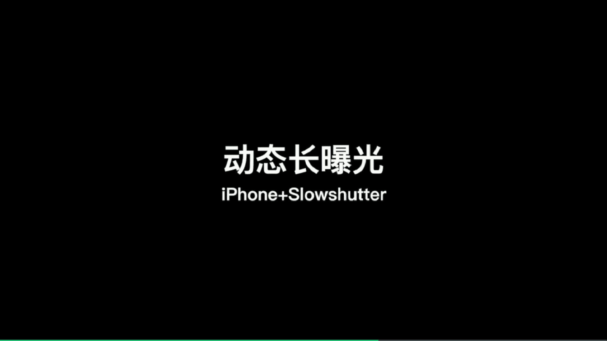
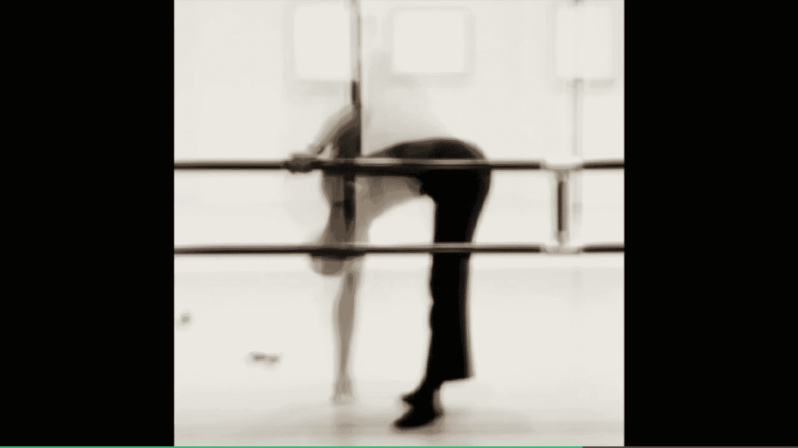
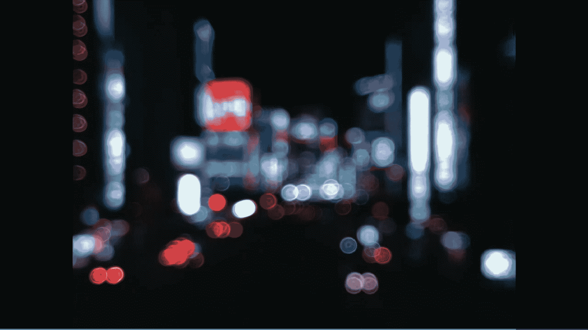
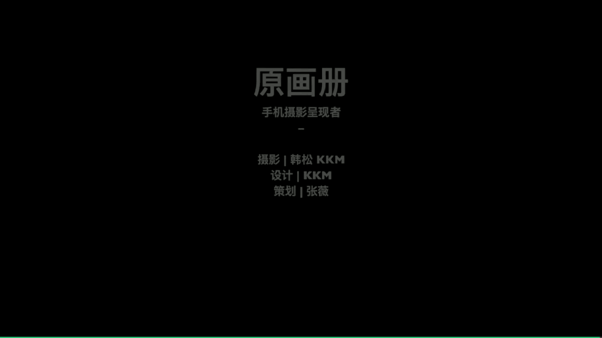

# 手机摄影大师课：课时20：暗光环境与长曝光创作

在本节课中，我们将学习如何在暗光环境下进行创作，并掌握使用长曝光技术拍摄出具有时间感和艺术感的照片。我们将通过具体场景案例，了解拍摄思路、操作要点以及后期处理技巧。

---

## 第一部分：暗光环境下的创作

上一节我们介绍了课程概述，本节中我们来看看如何在光线不足的场景下进行拍摄。暗光环境并不意味着无法拍照，相反，它提供了独特的氛围和创作机会。

### 1. 利用环境光与反射

在夕阳下的车厢内，光线较暗。此时可以寻找环境中的反射光源作为拍摄主体。

*   **操作步骤**：发现人物笔记本屏幕反射出夕阳，将焦点对准笔记本屏幕。
*   **参数调整**：使用二倍焦距构图，并手动拉低曝光补偿，以突出笔记本内反射的夕阳与窗外天空的对比关系。
*   **效果**：得到一张光影关系模糊而美妙的照片。

进一步放大笔记本的局部，可以强化屏幕内夕阳的暖色与背景环境冷色调之间的色彩对比。

### 2. 人物与背景的曝光平衡

在车窗边拍摄人物时，需要在人物面部细节和窗外景色之间做出选择。

以下是两种对焦和曝光策略：

1.  **对焦在人物**：需手动大幅拉低曝光，以确保窗外背景（如彩虹）不过曝，保留细节。人物会呈现为剪影。
2.  **对焦在窗外**：可使用相机自动曝光，此时窗外景色曝光正常，人物同样为剪影。

两种方法的核心都是**保证窗外重要景物的细节完整**。最终得到一张以绚丽彩虹为背景的人物剪影照片。

### 3. 利用人造场景光

当环境更暗时，可以主动利用场景中的人造光源，如电脑屏幕光，来照亮主体，营造氛围。

将焦点对准人物，利用其电脑屏幕的光线照亮面部。这样拍摄出的照片，人物面部有光，背景环境暗，故事感和氛围感更强。

### 4. 霓虹灯色彩的运用

霓虹灯是夜景拍摄中极具氛围感的元素，它能将场景渲染成鲜明的色块。

*   **拍摄对称场景**：在霓虹灯招牌前，采用对称构图，平视拍摄。等待车辆或行人进入画面时使用连拍，最终筛选出动静结合、色彩饱满的照片。
*   **拍摄人物剪影**：靠近霓虹灯招牌，对其测光并锁定曝光。此时霓虹灯曝光正常，前景中经过的行人会自然变为剪影。等待一个姿态有趣的行人经过时连拍，可获得富有戏剧感的照片。

### 5. 极致暗光下的拍摄

现代手机在极致暗光下也能拍摄。关键在于**手动控制曝光**，避免手机自动提亮画面导致噪点增多和氛围丧失。

在美国新泽西州完全黑暗的街头，对准一家24小时便利店的招牌拍摄。
*   **操作**：使用普通拍照模式，对焦后手动拉低曝光，确保天空保持纯净的黑色。
*   **要点**：注意持稳手机（或使用三脚架），即使使用三倍长焦也能获得清晰画面。这张照片因其独特的氛围入选了国际影展。

### 6. 发现暗光中的趣味元素

暗光环境中充满了值得拍摄的对比与关系。

*   **冷暖对比**：阴雨天的灰绿色调中，一扇亮着暖光的窗户，形成了强烈的冷暖对比。
*   **实体与投影**：昏暗室内，一把椅子及其在墙上的投影，仿佛在进行对话，渲染出静谧氛围。
*   **单一光源与构图**：黑暗环境中唯一的人造光源，结合对称构图和点缀的人物，强化了街头氛围。
*   **光线的层次**：郊区夜景中，车的前灯与远处的暗光形成层次，营造出萧瑟、寂寞的感觉。

---

## 第二部分：暗光拍摄要点总结

在学习了多个暗光拍摄案例后，我们来总结一下核心要点。

以下是暗光环境下拍摄的五个关键点：

1.  **寻找光源关系**：本质是发现并利用人造光（灯光、屏幕光等），使其与人物、影子或环境产生互动。
2.  **手动控制曝光**：时刻检查并手动控制手机测光，避免自动提亮导致画面过曝、噪点增多和氛围丢失。
3.  **观察特殊角落**：在窗口、街角等缝隙处，光线往往更富戏剧性，容易出彩。
4.  **保持镜头洁净**：拍摄灯光前确保镜头干净，避免产生难看的光晕。
5.  **善用撞色对比**：霓虹灯题材中，红、紫、蓝等强烈的撞色块出现在同一画面中，效果往往非常出众。

---

## 第三部分：利用长曝光进行创作

上一部分我们探讨了静态暗光拍摄，本节中我们来看看如何利用长曝光技术，将时间维度融入照片，创造动态模糊效果。这里推荐使用 **Slow Shutter** 这款软件，它通过图像堆栈实现长曝光。

### 1. 水面长曝光：营造平静丝滑感

长曝光能使流动的水面变得雾化或丝滑，非常适合表现宁静感。

**拍摄步骤（以Slow Shutter为例）**：

1.  **固定手机**：使用三脚架稳定手机，这是画质清晰的关键。
2.  **构图**：确定画面元素位置（如前景木栈道和远处天际线）。
3.  **软件设置**：打开Slow Shutter，选择 **“低光模式”**，快门速度设为 **“B门”**（手动控制曝光时间）。
4.  **拍摄**：点击快门开始曝光，观察水面变化，待效果满意后（通常约10秒）再次点击快门结束。
5.  **保存**：务必点击保存，照片将存入相册。

**构图技巧**：可以尝试三分法（将灯塔置于画面上1/3处），或对称构图（将主体置于画面中央），不同构图能传达不同情绪。

### 2. 动态主体长曝光：捕捉运动轨迹

长曝光也能用于拍摄运动物体，如舞者，将动态过程融合在一张照片中，产生抽象美感。

*   **设置**：同样使用Slow Shutter的 **“低光模式”** 和 **“B门”**。
*   **拍摄**：对准运动中的人物（如舞者），曝光时间较短（1-2秒即可）。
*   **效果**：人物动作被虚化和拉长，形成动态模糊，比静态瞬间更能体现动感和时间流逝。

### 3. 车灯轨迹长曝光：描绘城市流光

拍摄夜晚街道的车流是长曝光的经典应用。

*   **选址**：天桥或高处是理想位置。
*   **设置**：在Slow Shutter中选择 **“灯光轨迹模式”**，快门设为 **“B门”**。
*   **拍摄**：按下快门，等待来往车灯的光轨在画面中交织得比较饱满时（通常需要10秒或更久），结束曝光。

### 4. 城市虚焦：创造光斑效果

除了长曝光软件，用手机原生相机也能创作类似效果。

1.  对准近处景物对焦并长按屏幕锁定对焦/曝光。
2.  然后将手机转向远处灯光密集的夜景，画面会因失焦而变成斑斓的光斑。
3.  手动拉低曝光，能让背景更暗，光斑更突出。

---

## 第四部分：长曝光要点与作品赏析

最后，我们来系统总结长曝光的操作分类，并欣赏一些成片效果。

### 长曝光操作分类

1.  **水面/瀑布长曝光**：
    *   **工具**：Slow Shutter
    *   **模式**：低光模式 + B门
    *   **时间**：约10秒
    *   **效果**：丝滑、雾化水面。

2.  **车灯轨迹长曝光**：
    *   **工具**：Slow Shutter
    *   **模式**：灯光轨迹模式 + B门
    *   **时间**：10秒或以上
    *   **效果**：动态光轨。

3.  **安卓手机用户**：大部分机型自带“流光快门”、“车水马龙”等模式，可直接拍摄车轨、光绘等。

### 长曝光作品赏析

*   **冰岛瀑布**：人物手持气球站立，3秒曝光，瀑布如丝绸般顺滑。
*   **海滩与湖泊**：10秒以上曝光，海水和湖水呈现梦幻的奶蓝色或雾化效果，意境抽象。

### 长曝光核心要点总结

以下是长曝光创作的三个核心原则：

1.  **理解本质**：长曝光是通过一段时间内的图像堆栈，形成模糊效果以记录时间感。
2.  **稳定优先**：拍摄静止背景+动态主体（如水面、车轨）时，**必须使用三脚架**保证背景清晰。拍摄全局动态模糊（如舞者）时可手持，但仍需尽量稳定。
3.  **善用工具**：iPhone推荐Slow Shutter，安卓手机可探索自带流光快门功能。

---

## 课程总结

本节课中，我们一起学习了在暗光环境下进行摄影创作的多种方法，以及利用长曝光技术拍摄动态场景的技巧。关键在于**主动观察光源、手动控制曝光、耐心等待时机**，并善用三脚架等辅助工具。希望你能将这些技巧运用到实践中，用手机捕捉那些独特的光影瞬间。

