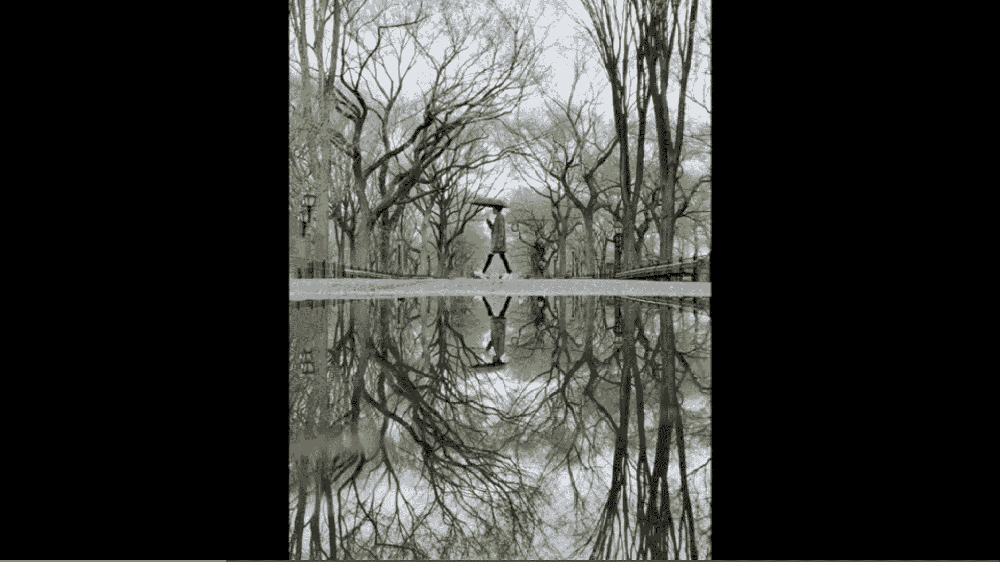
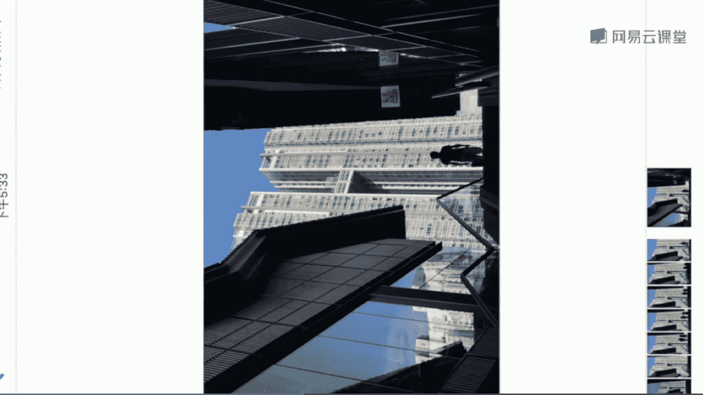

# 手机摄影大师课：课时21：倒影、剪影与光影构图

在本节课中，我们将学习如何利用光线创作出富有戏剧性的照片。我们将重点探讨三种高级拍摄技巧：倒影的捕捉、剪影的塑造以及利用光线和影子进行构图。掌握这些技巧，能让你的照片瞬间提升艺术感和故事性。

## 倒影的拍摄

上一节我们介绍了光线的基础运用，本节中我们来看看如何利用反射面拍摄倒影。倒影能为画面带来对称美感和抽象趣味。

倒影拍摄是我长期收集的一个项目，即在全球各地拍摄具有当地特色的倒影，并将它们集合成组。例如，在纽约街头，雨后的人行道边缘会形成积水。

此时，可以利用积水拍摄出完美的建筑倒影。最关键的一点是：**必须将手机镜头紧贴水面**。手机镜头需要倒置，然后将焦点对准远处的建筑，即可获得清晰的倒影。

我们来看第二个场景。同样在纽约曼哈顿街头，远处高楼具有强烈的几何节奏感。利用一个小水洼，将手机倒置在水面上方，就能拍摄到倒影照片。由于此处人来人往，需要耐心等待。

拍摄时需注意，**将手机调整至与地面保持垂直**，这样才能确保倒影界面是完全垂直的状态。在等待行人或车辆经过时，可以使用连拍模式进行抓拍，以便后期筛选出最满意的一张。

例如，等待一个骑自行车的人经过，能为画面增添动感和趣味。下图就是我最终筛选出的照片。

接下来看第三个场景，位于纽约中央公园的一条小道上。道路两旁树木茂密，并向中间收拢，形成一种将人包裹其中的视觉效果，非常有趣。

我让朋友打着伞走过这个画面。当他经过时，我全程使用手机的连拍功能记录整个过程，这非常有利于后期筛选。最终拍摄到的照片效果如下。

以下是更多倒影拍摄的实例分享：

*   第一张摄于葡萄牙里斯本街头，同样是通过小水洼和等待的方式拍摄。
*   第二张在法国图书馆前，朋友与背景线条组合形成了有趣的倒影。
*   第三张在纽约街头，使用手机镜头紧贴水面，并等待人物经过，拍出了极具动感的倒影。
*   倒影技巧也可用于夜景拍摄，与剪影结合，能最大化两种手法的效果。

实现倒影拍摄的媒介有很多：

*   **水面**：如积水、河流。
*   **玻璃面**：如街头的橱窗。
*   **玻璃幕墙**：建筑的玻璃外墙等。

拍摄成功倒影的核心要点如下：

1.  **镜头紧贴反射面**：这是最重要的步骤，即使很小的积水也能拍出很大的倒影。公式可表示为：**清晰倒影 ≈ 镜头无限接近反射面**。
2.  **水面越纯净，倒影越清晰**。
3.  **倒影能有效整理杂乱场景**，让画面形成对称结构，增强美感。

## 剪影的拍摄

了解了如何捕捉倒影后，我们进入另一种运用光线的经典题材——剪影。剪影是指画面中的主体（如人物）完全没有细节，只呈现黑色轮廓，而背景通常比较明亮广阔。

这种大小与明暗的对比，能让主体更加突出，并为画面带来神秘的叙事感。

以下是拍摄剪影的秘诀：

首先，必须确保**背景亮度远大于剪影主体**（如人物）。拍摄时，要注意适当降低曝光，以强化人物的剪影属性。操作上，可以在手机拍摄界面点击主体对焦后，向下滑动旁边的**小太阳图标**以降低曝光值，让人物黑得更彻底。

我们以成都太古里的街头场景为例。阳光照射在地面形成一小块光斑，可以利用它来捕捉剪影效果。走在光斑中的人会完全变暗，非常适合营造剪影氛围。

拍摄步骤如下：

1.  **构图**：调整手机，将光斑置于画面正中。
2.  **对焦与测光**：点击屏幕**对焦在光亮处**，这会使周围环境变暗。
3.  **降低曝光**：对焦后，**向下滑动曝光补偿（小太阳图标）**，让周围光线进一步变暗，消除杂乱场景，突出中间的人物剪影。代码逻辑可简化为：`setExposureCompensation(-value)`。
4.  **锁定设置**：长按屏幕锁定曝光和对焦，便于多次抓拍。
5.  **等待时机**：等待一个合适的人物走入光斑，按下快门。

拍摄完成的成片展示如下。

以下是更多剪影照片分享：

*   第一张摄于北京，夕阳从背后射来，近处的树木呈现完全的剪影状态。
*   第二张是我非常喜欢的获奖作品，摄于里斯本，利用背光拍出了极具动态的人物剪影。
*   第三张中，阳光从室外射入室内，在门框处形成了明显的剪影。

总结拍摄剪影的条件与要点：

*   **核心条件**：主体光线要比背景暗很多。
*   **对焦与曝光**：如果对焦在主体上，画面容易过亮，此时请拉低曝光。**对焦在背景光亮处更容易获得明显的剪影效果**。
*   **操作口诀**：**对亮处，压曝光**。

## 光线参与构图

最后，我们来看看如何主动利用光线和影子本身来构图，为画面增添故事感和戏剧性。

在下面这个场景中，下午三四点的阳光斜射穿过建筑，在地面上形成一道细长的光带。这种光线是我经常运用的手法。

这道光线本身就是一个极具戏剧性的拍摄背景。我们依然采用老方法：**对焦在光亮处，拉低曝光，并锁定曝光和对焦**，这非常有利于进行连拍。然后，耐心等待车辆或行人走进这道光线即可。

拍摄完成的照片如下，充满了动感和戏剧性。

再看第二个场景。在葡萄牙里斯本的一个街头，我从上往下观察，看到两个人走过。我利用他们与阳光产生的**长长影子**进行构图，这也是让画面更加生动的有效办法。拍摄完成的照片如下。

第三个场景在纽约林肯中心前。夕阳西下，阳光从背后射来，将人物的影子拉得非常细长。这有些类似于剪影状态。

我首先对焦在人物上并拉低曝光，让人物和影子更黑。然后等待他们走到画面正中、影子最具戏剧性的时刻按下快门。整个过程中，我使用了锁定焦点的功能，以便进行良好的连拍。最终成片如下。

以下是更多利用光影构图的实例：

*   第一张照片中，人物的影子和剪影状态成为画面的强大亮点。
*   第二张摄于下午四点，人物的影子被拉得非常长。
*   第三张照片中，人物的影子几乎填满了画面下方三分之一的位置，此时影子是表达情绪的强大工具。

关于利用光影构图的要点总结如下：

1.  **光线和影子是“软材料”**：容易营造画面的故事感。
2.  **选择时机**：影子较长时（如清晨、傍晚）更容易拍出戏剧性效果。
3.  **构图手法**：利用细长的影子给画面构图是非常棒的组织手法。
4.  **寻找光线**：在门窗、柱廊、街巷等间隙处，利用光线从室外射入室内或街道地面形成的光带进行构图。
5.  **拍摄设置**：**不要对焦和测光在阴影处**，否则画面会变亮。**对焦在光亮处**效果往往更好，能让画面保持一种深邃的暗调状态。
6.  **最佳地点**：建筑密集或街道狭窄的城区，是利用光影摄影的绝佳场所，建议大家多加尝试。

本节课中，我们一起学习了三种提升照片质感的高级用光技巧：倒影的捕捉、剪影的塑造以及光影构图。光线是摄影的灵魂，这些技巧如剪影、慢门、多重曝光等都是非常酷的玩法，能显著为你的照片增色。

请大家务必根据课程中教授的方法，多多尝试和练习。

**课后作业**：请寻找身边的河流或小溪，使用上节课提到的慢门软件（如Slow Shutter），或利用iPhone自带的“实况照片”功能，尝试拍摄一张流水的慢门曝光照片。

今天的课程就到这里，我是韩松，感谢大家参加我的课程。

