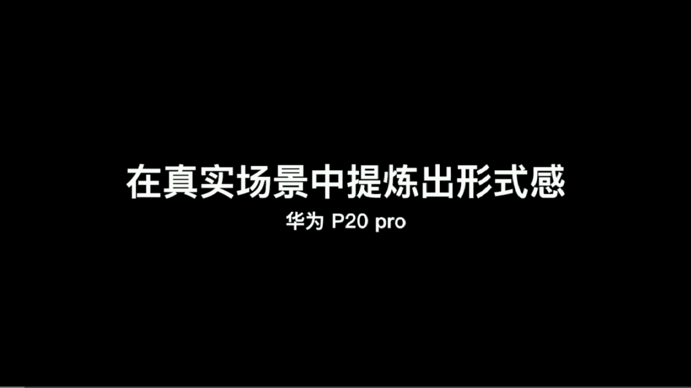
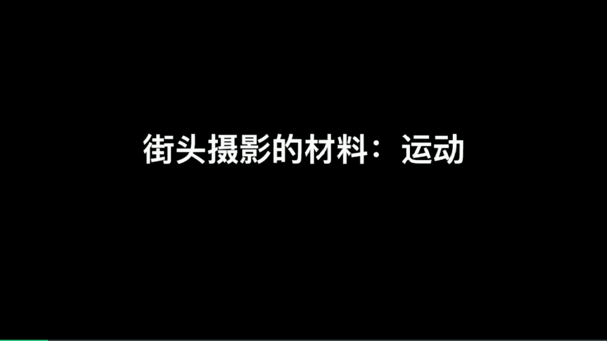
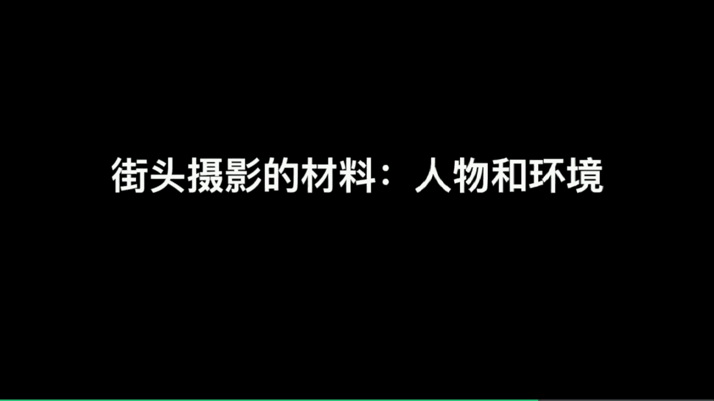
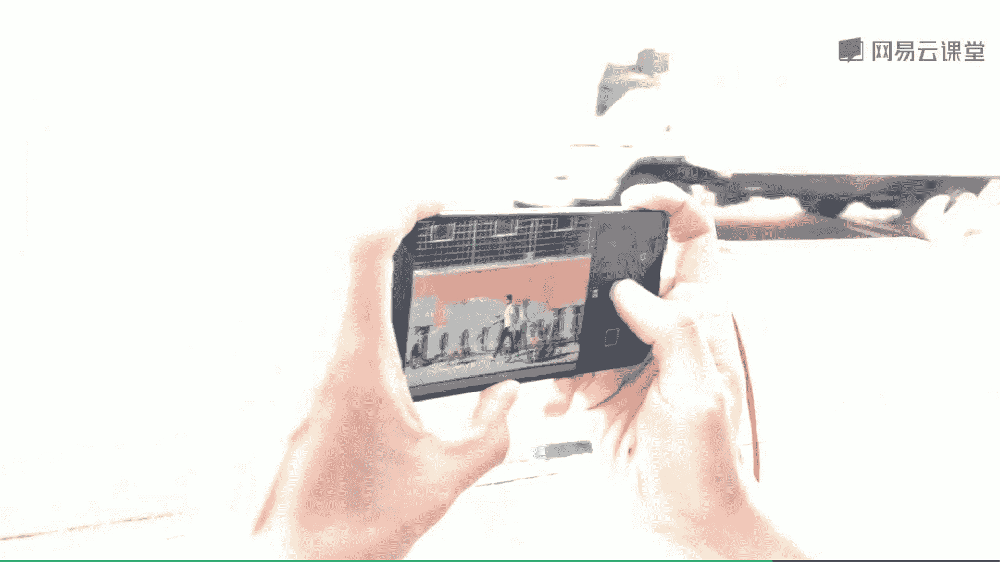

# 韩松-跟全球iPhone摄影大赛冠军学手机摄影，随手惊艳朋友圈（完结）：课时23：街头摄影实例解析 🏙️

在本节课中，我们将通过一系列真实的拍摄案例，学习如何在复杂的街头环境中提炼出具有形式美感的照片。我们将解析如何利用色彩、光影、动静对比等元素，以及如何通过“场景+等待”的公式，捕捉到精彩的街头瞬间。

---

## 一、 从杂乱场景中提炼形式感

上一节我们介绍了街头摄影的基本理念，本节中我们来看看如何在真实杂乱的场景中，提炼出画面的形式感。

**案例一：MOMA美术馆的窗户**
在MOMA美术馆的免费开放日，室内人非常多，画面元素杂乱。此时，我将手机对准室外的窗户进行观察。

*   **色彩与结构**：近处窗户的黄色与远处的蓝色形成了**色彩对比**，同时它们之间也存在**几何结构关系**。
*   **等待与捕捉**：我等待一个人经过这个结构区域，最终捕捉到一张构图简洁、色彩对比鲜明的照片。

---

## 二、 捕捉动态与动静结合

理解了静态构图后，我们来看看如何捕捉街头动态的场景，并利用动静结合增强画面表现力。

**案例二：地铁站台的动静对比**
在纽约地铁站，远处有列车驶入，近处有人站立。我想捕捉人的静止与车的运动之间的对比关系。

*   **对焦与连拍**：在列车速度未完全减下时，我持续对焦在静止的人物上。
*   **使用连拍**：通过**连拍**方式，捕捉人物静止与列车运动相结合的瞬间。

---

## 三、 构建与等待：光影舞台

动态场景考验抓拍能力，而光影则是构建舞台、等待主角的绝佳材料。本节我们学习如何利用光影构建拍摄场景。

**案例三：地铁出口的光影**
在纽约一个地铁出口，阳光透过建筑缝隙洒在地上，形成清晰的光影分界，极具氛围感。

*   **前期搭建**：
    1.  使用**2倍焦距**构图。
    2.  对焦在亮部。
    3.  **拉低曝光**以增强画面轮廓感。
    4.  **锁定曝光和对焦**，方便后续连拍。
*   **核心公式**：这种 **`搭建光影场景 + 等待人物进入`** 的方法是街头摄影中最常见、最易操作的公式之一。
*   **执行与捕捉**：搭建好这个“舞台”后，只需耐心等待人物走入。当人物出现时，立即使用**连拍**捕捉其运动瞬间，便于后期筛选最佳照片。

---

## 四、 利用特殊材料：烟雾

除了自然光影，街头的一些特殊“道具”也能极大增强画面情绪。下面我们看看如何利用烟雾营造电影感。

**案例四：街头的烟雾**
纽约街头的井盖冒出烟雾，这是一个非常好的拍摄道具，能带来模糊、柔软的意象。

以下是几种利用烟雾的拍摄方法：
*   **作为主体**：用长焦距捕捉烟雾细节及其与背景的关系。
*   **作为前景**：靠近烟雾，以其为前景。夜晚车辆的暖色灯光在烟雾中产生折射，能营造强烈的**电影感**。
*   **低角度构图**：将手机放低，让车灯在画面中更明显，强化光线质感。
*   **纳入人物剪影**：将镜头转向行人，烟雾中的光和人物会形成有趣的**剪影关系**。

---

## 五、 其他实用拍摄技巧

掌握了核心的构建与等待方法后，我们再补充几种实用的街头摄影技巧。

**1. 倒影拍摄**
其本质仍是 **`场景（水洼）+ 等待`**。将手机倒置贴近水洼表面，等待有人经过时按下快门即可。

**2. 追焦拍摄**
用于表现速度感。以下是使用华为专业模式进行追焦的步骤：
*   将**快门速度**设置为 **`1/30秒`**。
*   当目标车辆（如黄色出租车）经过时，按下快门的同时，手要随着车的运动方向**同步移动**。
*   要点：保持手机移动方向与车速一致。手机追焦成功率较低（约10%），需要耐心多尝试。

**3. 长曝光拍摄**
用于在杂乱场景中营造动感与秩序对比。
*   **设备与软件**：使用三脚架，配合iPhone及**Slow Shutter**这款长曝光软件。
*   **参数设置**：选择 **`低光模式 (Low Light)`** + **`B门曝光 (Bulb)`** 组合。
*   **效果**：静止的人物保持清晰，运动的人物变得模糊，从而在混乱的街头提炼出动态的秩序感。

**4. 人物与环境的结合**
这同样是 **`设定场景 + 等待人物`** 公式的应用。
*   **案例一**：在一个极具光影感的场景中，等待牵狗的人经过，并用连拍捕捉。
*   **案例二**：在窗前等待一位老太太整理衣服的瞬间。
*   **案例三**：在成都街头，捕捉行人走入一小撮夕阳光影中的瞬间。由于背景杂乱，后期使用了VSCO软件，选用**B系列黑白滤镜**进行调色，并稍作裁剪和旋转，使人物主体更突出。

---

## 六、 本章总结

本节课中我们一起学习了多个街头摄影的实拍案例与核心技巧。

1.  **做减法**：在杂乱场景中，**大胆截取**需要的部分，是街头摄影非常重要的手法。
2.  **善用材料**：**烟雾、动态、光影**等都是营造街头情绪的良好材料。学会将它们组合运用。
3.  **核心方法**：掌握 **`搭建场景（利用光影、结构、色彩等）+ 耐心等待`** 这一核心拍摄公式。
4.  **培养敏感度**：培养对空间、色彩、事件的敏感度至关重要，这可以通过多阅读优秀摄影作品来提升。

通过以上方法和持续的练习，你也能在复杂的街头环境中，捕捉到那些充满故事感和形式美感的瞬间。

