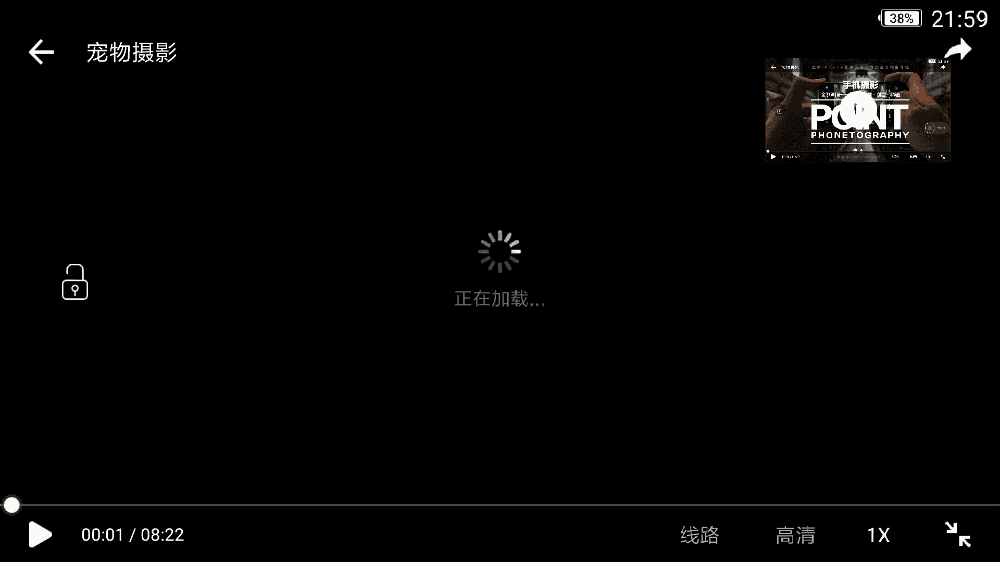

# 手机摄影：25：宠物摄影

在本节课中，我们将回归生活场景，学习如何拍摄常见的题材。我们将从拍摄一只猫开始，探讨宠物摄影的技巧。同时，课程也会涉及生活中的其他小细节，例如静物、花朵、美食等题材的拍摄。

生活琐事包罗万象，我们无法在一次课程中面面俱到。因此，这里介绍一种好方法：抽象练习。这不仅是一个很好的拍摄题材，也是一种十分奏效的摄影训练方式。

相信通过这次课程的学习，大家日常朋友圈照片的“颜值”都会有所提升。

## 第一部分：宠物摄影 🐱

很多朋友家里都养了猫或狗，视若珍宝。本节我们来看如何用手机记录好它们的生活。

首先，我们通过一个视频来演示如何拍摄一只名叫“冰粉”的可爱猫咪。

宠物往往难以控制。在拍摄冰粉时，它要么表现得像多动症，不停地挠、咬、动；要么完全不动，不理睬你，不配合拍摄。这是拍摄宠物的一个特点。

因此，我们需要利用它们喜欢的东西。例如，猫咪非常喜欢毛球、小鱼竿或长条状的物品。我们可以利用这些道具与它们玩耍、主动互动，在互动过程中捕捉满意的照片。

例如，这里我用一个小黑色毛球吸引它。首先放低，然后抬高，它很容易就会扑过来。它扑咬的过程非常生动。这时，我完全采用从上往下的拍摄角度，并用连拍方式抓拍。

这里需要注意，我还使用了**锁定对焦和锁定曝光**。因为既然要连拍，如果不锁定对焦和曝光，后续拍摄的照片很容易出现曝光过度等问题。

拍摄完成后，我们可以从连拍的照片中筛选出非常生动形象的照片。

有时猫咪也会安静下来，像一个小天使。这些安静的时刻也要利用好。例如，它玩累了，躲在鞋盒背后。这时，我们可以耐心抓拍。我仍然使用了曝光和对焦锁定，并降低曝光值来控制画面，最终拍出满意的照片。

## 第二部分：宠物拍摄角度与要点 📐

上一节我们介绍了与宠物互动和抓拍的基础，本节我们来看看哪些拍摄角度比较出彩。

以下是几个值得尝试的拍摄角度：

*   **俯视拍摄**：当宠物在地上玩耍时，可以直接从上往下拍摄。注意自己的脚不要入镜。这样可以拍到极具全局感的照片。俯视时还可以顺带拍摄局部，例如不停摆动的尾巴。通过不断拍摄，可以抓拍到各种动作，并筛选出局部特写照片。
*   **利用镜子反射**：可以利用家里的镜子进行反射拍摄。例如，虽然现实中看不到宠物在某个角度，但它出现在了镜子里。利用镜子反射能分隔出两块区域，给人更加魔幻、奇幻的感觉。也可以利用反射抓拍到它活泼的瞬间。
*   **仰视拍摄**：除了俯视，从下往上的仰视角度也很新奇。例如，当宠物坐在板凳上时，可以蹲在地上，手机直接从下往上进行盲拍。这样拍出的照片可能有些虚焦，但虚化效果也很可爱。如果事先对好焦再从下往上拍，就能得到清晰的宠物照片，有种“霸道总裁”的视觉效果，非常有特点。

## 第三部分：捕捉细节与场景 🎯

除了角度，捕捉生动的细节和利用环境同样重要。

以下是一些捕捉细节的方法：

*   **抓住行为细节**：例如宠物口渴喝水时，抓住这个细节会很有意思。在它安静的片刻，我们有可能使用背景虚化效果来拍摄。可以靠近拍摄，捕捉喝水的细节，例如只拍可爱的小舌头。
*   **利用环境道具**：家里的小摆件也是拍摄宠物的绝佳道具。例如，一个小圆桌的圆形几何线条，加上猫咪身体拱成的弧线，能在画面中形成漂亮的构图。
*   **局部特写**：再次利用局部拍摄手法，例如抓拍宠物尾巴下垂的场景，同样非常可爱。

## 第四部分：技巧总结与成片展示 📸

相信大家看完演示后都有所体会。以下是宠物摄影的核心技巧总结：

*   **动态相处与连拍**：拍摄宠物不要期待控制它，而是要与它动态相处。在相处过程中，用**连拍方式**去抓拍。同时，利用好宠物安静的那一瞬间进行捕捉非常重要。
*   **多角度挖掘**：表现宠物时，拍摄重点不要只放在它们的头部或全身。像**仰视、俯视**等特殊视角，都值得我们去挖掘和尝试。

最后，我们来欣赏一些拍摄成片：例如抓拍冰粉准备跳过椅子的全过程，非常生动；或是它“迷之凝视”的表情；在垫子背后张望的样子；以及眼睛、玩具等细节特写。

本节课中，我们一起学习了宠物摄影的核心技巧：包括如何与宠物互动并利用连拍抓拍动态瞬间，如何运用俯视、仰视、反射等多角度进行创作，以及如何捕捉细节和利用环境道具。希望这些方法能帮助你用手机记录下宠物的可爱瞬间。