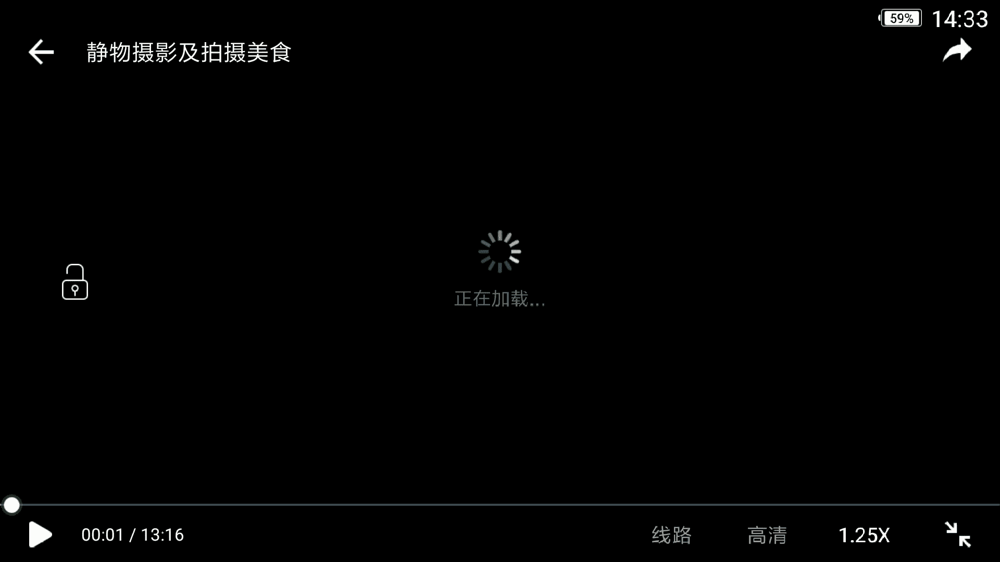
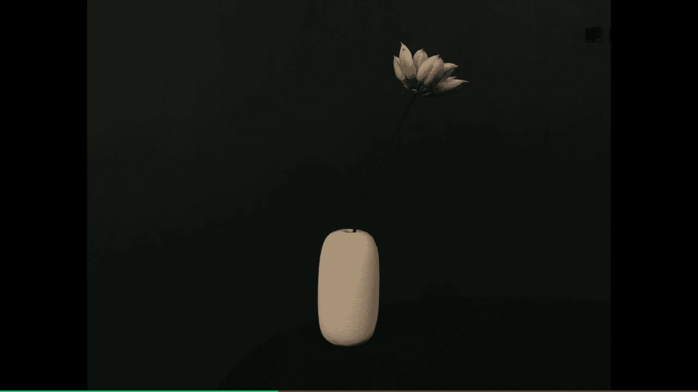

# 手机摄影：课时26：静物与美食摄影

在本节课中，我们将学习如何拍摄具有高级感的静物照片以及如何捕捉令人垂涎的美食。课程将分为静物摄影和美食摄影两部分，通过分析案例和实操演示，帮助你掌握核心技巧。

## 静物摄影：营造高级感

上一节我们介绍了课程的整体内容，本节中我们来看看如何拍出具有高级感的静物摄影。我们将通过分析两个著名案例来总结规律。

### 案例一：无印良品广告

无印良品的广告摄影是明亮、简洁风格的典范。以下是其特点分析：

*   **色调明亮**：背景多为白墙或浅色、有质感的表面，前景主体也常为浅色。
*   **线条简洁**：主体设计极具流线感，造型简单。
*   **整体感觉**：营造出干净、温暖、明亮的视觉效果。

### 案例二：上田义彦作品

日本摄影大师上田义彦的作品则代表了另一种暗调风格。以下是其特点分析：

*   **色调暗沉**：整体画面比较暗，色彩（如绿色）运用得深沉。
*   **光影对比**：利用黑暗背景衬托主体，使主体边缘产生微光，质感强烈。
*   **整体感觉**：营造出深沉、静谧、富有质感和情绪的氛围。

**核心概念**：静物摄影的高级感常体现在对光线极致的运用上，即追求 **“极致的亮”** 或 **“极致的暗”**。

## 实操演示：一物两拍

理解了明暗两种风格后，我们通过一个实际拍摄练习来巩固。我们将用同一个白色花瓶进行拍摄。

1.  **暗调拍摄**：
    *   **场景**：将花瓶置于钢琴上，以深色墙壁为背景。
    *   **操作**：对焦在白色花瓶上，锁定曝光和对焦后，**向下滑动屏幕降低曝光**，使背景更暗。
    *   **效果**：获得一张背景深暗、主体突出的照片，呈现欧美暗调风格。

2.  **亮调拍摄**：
    *   **场景**：将花瓶放到饭桌上，以白色墙壁为背景。
    *   **操作**：对焦在花瓶上，锁定曝光和对焦后，**向上滑动屏幕增加曝光**，让白墙更白。
    *   **效果**：获得一张背景明亮、整体通透的照片，呈现日系明亮风格。

## 后期处理：强化风格

拍摄完成后，我们可以通过后期软件进一步强化照片的风格。这里以VSCO为例。

*   **暗调照片后期**：
    *   使用 **`A6`** 滤镜。
    *   **微调参数**：`曝光 +`， `饱和度 -`。
    *   **目标**：强化简洁、沉静的暗调风格。

*   **亮调照片后期**：
    *   首先使用软件工具调整画面水平。
    *   使用 **`AL1`** 滤镜（偏蓝调，能让白墙更白）。
    *   **微调参数**：`曝光 +`， `对比度 +`， `饱和度 -`。
    *   **目标**：让画面更加通透、干净、明亮。

通过对比，可以看到经过后期处理的一暗一明两张照片，所传达的情绪截然不同。

## 静物摄影要点总结

基于以上学习和练习，以下是拍摄好静物的三个关键点：

*   **把握图地关系**：精心考虑主体与背景之间的互动与关系。
*   **善用摄影语言**：除了虚化，应更多思考**色彩**和**光线**的运用。
*   **尝试光线极端**：多考虑**极亮**或**极暗**的光线效果，易于营造高级感。

## 美食摄影：角度与光线

上一节我们掌握了静物摄影的要点，本节中我们来看看如何拍摄美食。光线和角度是美食摄影的灵魂。

### 理想光线：自然散射光

在自然散射光下拍摄食物最容易成功。例如，通过天窗进入室内的柔和光线，不会产生生硬阴影，能让食物看起来更可口。

### 核心拍摄角度

以下是几种最常用且出片的美食拍摄角度：

*   **俯拍**：**强调摆盘与桌布的关系**。适合摆盘精致、平面设计感强的食物。拍摄时需注意调整曝光，并避开手机或手的投影。
*   **45度角拍摄**：**强调食物与环境的关系**。这个角度能带入更多背景环境，讲述更丰富的场景故事。
*   **平拍**：**强调食物的质感与层次**。适合侧面漂亮、堆叠层次丰富的食物（如汉堡、蛋糕），能凸显其立体感和结构美感。

### 进阶技巧与原则

除了基本角度，还有一些技巧能让你的美食照片更出色：

*   **靠近拍摄细节**：让食物充满画面，展现糖霜、光泽等细节，能极大提升食物的诱惑力。
*   **运用构图原则**：如**左右平衡**、**对角线构图**，能让画面更稳定或更具动感。
*   **使用人像模式**：在背景杂乱时，使用手机的**人像模式**（或“摄影室灯光”效果）可以虚化背景，突出主体。
*   **局部拍摄原则**：不拍全整盘菜，给人以“丰盛”的暗示，往往比展现全部更具吸引力。

## 美食摄影要点总结

最后，记住以下几个拍摄美食的实用原则：

*   **“饭前拍摄”原则**：上菜后10分钟内是最佳拍摄时间，此时食物光泽和状态最好。
*   **善用局部**：在非专业布光摆盘时，拍摄局部特写更容易传达丰盛可口的意象。
*   **寻找柔和光线**：**自然的散射光**是手机拍美食最易掌握的光线，务必避免生硬阴影。
*   **调整角度避影**：俯拍时若出现投影，可尝试拉远变焦或稍微调整拍摄角度来避免。

本节课中我们一起学习了静物摄影中通过控制明暗来营造高级感的方法，以及美食摄影中关于光线选择、拍摄角度和实用技巧的核心知识。掌握这些要点，你就能用手机随手拍出惊艳朋友圈的照片了。