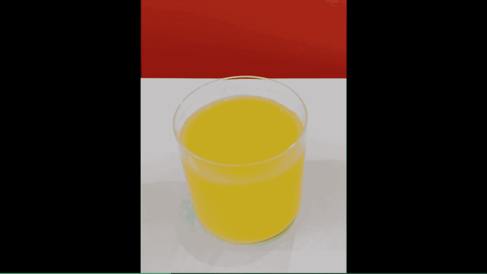
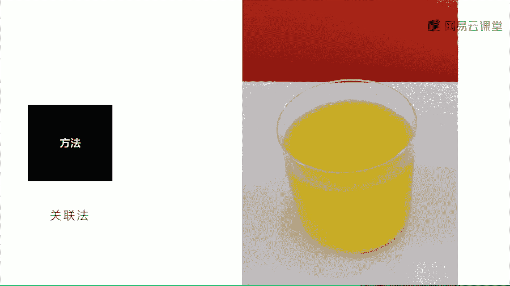
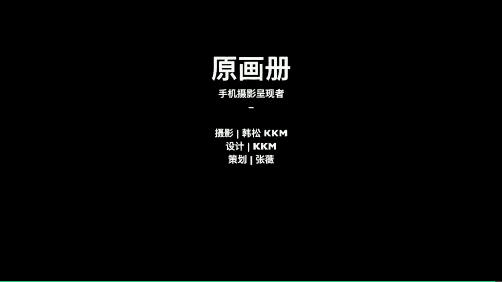

# 手机摄影大师课：课时27：抽象形式与思考方式 🎨

在本节课中，我们将学习如何观察和拍摄抽象形式的照片。抽象摄影的核心在于从平凡场景中提取出几何形态、色块或光影，从而创造出具有美感和陌生感的影像。我们将通过具体案例，了解抽象场景的来源、拍摄方法以及背后的思考方式。

---

上一节我们探讨了具体的拍摄题材，本节中我们来看看如何将现实场景转化为抽象的视觉语言。抽象的场景往往源于我们细致的观察和主动的提取过程。

以下是一种推荐的观察练习方法：
*   在日常生活中，主动寻找场景中的**几何图形**（如圆形、方形、三角形）。
*   关注**色块**的组合与对比，忽略物体的具体含义。
*   留意**光影**形成的图案与分割。

---

接下来，我们通过几个真实案例，学习如何在具体场景中抽离出抽象元素。

**案例一：建筑局部**
观察下图中的建筑，如果纳入周边杂乱环境，画面会大打折扣。因此，只保留中间的两扇门，突出其结构线条与明暗对比，从而体现抽象的美感。

**案例二：光影与色彩**
这个场景是在飞机舷窗边。美联航飞机的舷窗亮度可调，当调至较低亮度时，射入窗内的光线会形成迷幻的蓝色。这种奇异的光线映照在一杯橙汁上，产生了超现实的色彩组合。利用这种抽象的色彩关系，也能拍出令人满意的照片。

**案例三：色块关联**
这是在纽约惠特尼美术馆的餐厅。眼前是一杯橙汁，它背后的红色椅子与之形成了两个鲜明的色块。当我们剥离具体物体，只关注**前景的橙色色块**与**背景的红色色块**的组合时，就能得到一张极具抽象美感的照片。

---

了解了抽象思维的运用后，我们来看看生活中常见的、适合拍摄抽象照片的场景有哪些。

以下是几种常见的抽象场景类型：
1.  **建筑空间**：建筑本身富含几何线条与体块。例如，下图是葡萄牙西扎的一个建筑，将其局部抽离后，可以看到**红色**、**白色**与**蓝色**三个色块的组合。
2.  **光影结构**：光线能创造强烈的明暗分割。下图中的场景包含了左下角的阴影、右下角的光亮以及上方的蓝色区域，通过这三个简单板块构成了抽象画面。
3.  **日常静物**：平凡的物体换个角度就能呈现新意。下图是一个灯，从下往上仰拍，灯被抽象成了一个个重叠的**圆形**几何形态。
4.  **局部特写**：下图是今年世界手机摄影大赛的金奖作品，它通过对阳台栏杆局部进行特写，抽象出一个极具光影感的场景。这在日常生活中很容易实现，只需在下午四五点阳光斜射时寻找类似的光影即可。
5.  **色彩关联**：运用关联法，将不同物体的颜色视为色块。下图中，将背景的红色与前景橙汁的黄色关联起来，形成了饱满的色块组合，营造出抽象之感。

---

最后，我们来总结一下本节课关于抽象摄影的核心要点。

以下是本课的重点总结：
*   抽象主题的照片是值得深入拍摄的题材，它能有效锻炼观察力与构图能力。
*   日常生活中充满可被抽象化的元素，培养这种观察能力至关重要。
*   **保留局部**、**抽离几何形式**、**组合色块**等都是制造抽象影像的有效方法。

本节课我们介绍了多种取自生活的拍摄题材。最终，通过抽象场景的练习，旨在帮助大家为平凡景象制造“陌生感”。精彩的手机摄影大片，往往就是一个将普通场景拍出新颖美感的“陌生化”过程。这一点需要大家多加练习和体会。

**本期作业**：请在家中拍摄一杯普通的水。请注意综合运用拍摄环境、角度和构图，尝试让它呈现出抽象或非凡的视觉感受。

