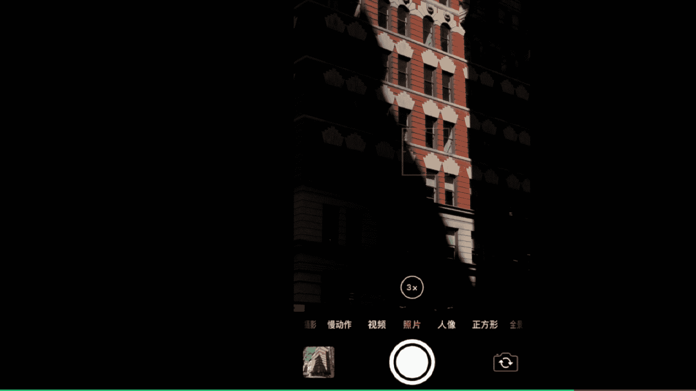
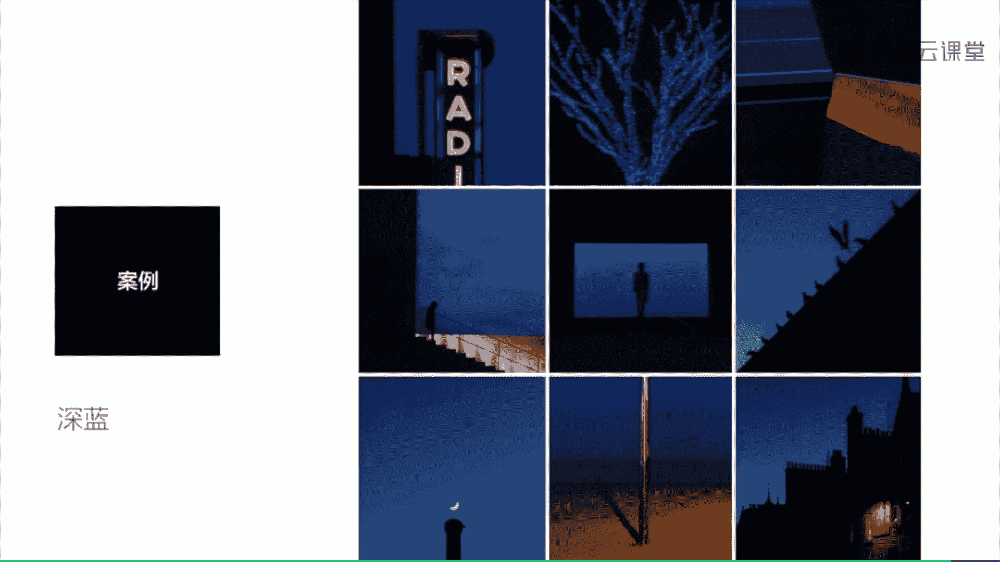

# 手机摄影：28：策划自己的拍摄项目

在本节课中，我们将学习如何策划并执行一个手机拍摄项目，同时解答一些常见的手机摄影疑问。课程最后，我们会一起回顾如何通过组照来提升观察力和叙事能力。

## 第一部分：手机摄影常见问题解答

上一节我们介绍了课程的整体安排，本节中我们来看看手机摄影中常见的几个疑难问题。

以下是几个最常见的问题及其解答。

**问题一：如何选择和使用VSCO滤镜？**

面对VSCO中庞大的滤镜库，许多初学者感到困惑。滤镜的选择并非简单套用，关键在于理解滤镜带来的影调变化，并结合具体照片的光线、色彩和元素进行尝试。

以下是我个人最常使用的几款滤镜系列：

*   **A系列（模拟胶片）**：其中A4和A6是我使用最多的。
*   **B系列（黑白）**：B3和B4是我常用的黑白滤镜。
*   **C系列（活泼鲜艳）**：C1到C3，以及C6到C8是我常用的彩色滤镜。
*   **01-010系列（经典）**：包含从黑白到彩色的10款滤镜，都很好用。
*   **H系列（多彩）**：适合调整色块丰富、场景简单的照片。
*   **HB系列（VSCO & HYPEBEAST合作）**：免费滤镜，适合营造城市蓝调、忧郁氛围。
*   **M系列（低饱和度）**：包含6款滤镜，适合营造低饱和度、性冷淡的欧美风格。

**问题二：街头摄影时感到尴尬怎么办？**

关于在街头拍摄时可能产生的尴尬情绪，我推荐阅读一篇名为《在街头拍照如何能不被人打》的文章，该文章发表在我们的“原画册”公众号和知乎专栏中，可以提供很多实用信息。

**问题三：安卓手机如何实现慢门（长曝光）拍摄？**

对于非苹果手机用户，实现慢门拍摄有以下方法：

*   **华为/荣耀等机型**：可以使用手机内置的“丝绢流水”或“流光快门”功能。
*   **其他安卓机型**：推荐使用 **Camera FV-5** 这款软件。操作方法是：点击界面上方的“S”图标，选择“控制曝光”，即可打开快门并设置具体的曝光时间。点击左侧的三个点，可以进一步调整任意曝光数值。

慢门曝光适合拍摄流水、天空云朵、瀑布等题材，能将动态场景凝结，产生特殊效果。

**问题四：如何培养“摄影眼”？**

除了技巧，审美眼光的培养同样重要。以下是几个小建议：

*   **扩展审美外延**：尝试从不同角度观察普通物体。例如，凑近观察一排杯子，可能会发现它们连成一体，形成具有几何美感的竖线排列。
*   **学会阅读抽象**：从日常场景中发现抽象美感。例如，电梯按钮上的圆形连成一线，形成一种几何延续的视觉感受。
*   **阅读真正优质的作品**：观看摄影大师的作品是提升审美的有效途径。我推荐几位大师：
    *   **亨利·卡蒂埃-布列松**：决定性瞬间理论提出者，擅长捕捉街头情绪爆发的瞬间。
    *   **何藩**：作品注重人物与环境、建筑、光影之间的形式美感。
    *   **史蒂夫·麦凯瑞**：以色彩和形式见长，作品氛围迷人，如著名的《阿富汗少女》。
    *   **亚历克斯·韦伯**：马格南图片社摄影师，作品以多重主体和复杂层次著称。
    *   此外，马格南图片社众多摄影师的作品都值得学习。

**问题五：手机拍的照片画质不好，是手机问题吗？**

近两三年出的手机，画质都非常出色。我曾将手机拍摄的照片冲洗成50厘米 x 50厘米的大小，效果依然很好。感觉画质不佳通常源于以下原因：

1.  拍摄时手部不够平稳。
2.  拍摄时光线条件不佳（如夜晚、傍晚、阴天）。在光线较暗时，更需要保持手机稳定，因为任何轻微晃动都可能导致画面模糊。这一点并非手机独有，单反相机在同样条件下也会面临挑战。

---

### 第一部分要点总结

1.  **手机摄影学习的一大误区**是认为后期只是简单套用滤镜。实际上，**分析原片的影调与色彩问题**，才能决定后期调色的正确方向。
2.  **手机摄影的核心在于眼光**。好的眼光能带来好的构图和元素构成，也能在后期调色时提供更优质的判断。
3.  **培养“摄影眼”最有效的方式**是找到真正优质的摄影资源，反复观看甚至达到“洗脑”的程度。

## 第二部分：如何策划自己的拍摄项目

了解了常见问题的解决方法后，本节我们来看看如何用手机策划并执行一个完整的拍摄项目。

用手机拍照也可以拥有自己的拍摄项目。策划项目可以遵循以下步骤：

1.  **找到一个拍摄主题**：可以是一种物体、一种颜色或一件事情。从一个小的切入点出发，发展出一组照片。
2.  **设定一个时间框架**：可以在一次旅行、一年甚至更长时间内，持续进行一个更大的拍摄项目。例如，我记录一对情侣朋友周年旅行的项目，就是通过长期积累完成的。
3.  **进行选片、编辑与发布**：拍摄完成后，挑选照片并编辑成组发布非常重要。常见形式有微信朋友圈或微博的九宫格。更进一步，可以将照片设计成画册，这能使拍摄逻辑更加清晰。

---

接下来，我们通过几个实际项目案例来具体说明。

**案例一：壁上光影**
在纽约街头下午四五点，阳光照射在建筑表面形成狭窄的光影。我将镜头对焦在亮部并降低曝光，使周围变暗，突出光束打在建筑上的效果，形成一组高反差的光影照片。

**案例二：街角小店**
记录地铁角落里的一个个小店。这组照片源于我儿时想成为小店店主的梦想，感觉店主仿佛坐镇在自己的城堡中。

**案例三：天空组照**
天空是瞬息万变的绝佳拍摄题材。可以单独拍摄天空组照，也可以将其作为“天、地、人”等更大主题组照的一部分。

**案例四：街头睡姿**
在世界各地捕捉街头打瞌睡的人。他们沉浸在自己的小世界里，与周遭环境形成有趣对比。

**案例五：暮色蓝调**
在傍晚时分，捕捉街头出现的冷蓝色调氛围，形成一组色彩情绪统一的照片。

---

### 第二部分要点总结

1.  **拍摄组照可以避免**将“好看”作为拍照的唯一目的。策划并执行组照，能够有效**培养我们的观察力和用照片叙述的能力**。
2.  通过组照，可以真正发挥手机**记录生活**的潜力，因为组照往往带有一定的叙事性。

---

本节课中，我们一起学习了如何解决手机摄影的常见问题，并掌握了策划个人拍摄项目的方法。从寻找主题、长期坚持到编辑成组，每一步都是提升摄影观察力和叙事能力的过程。本套课程到此结束，感谢大家的学习。

我是韩松，谢谢大家。

