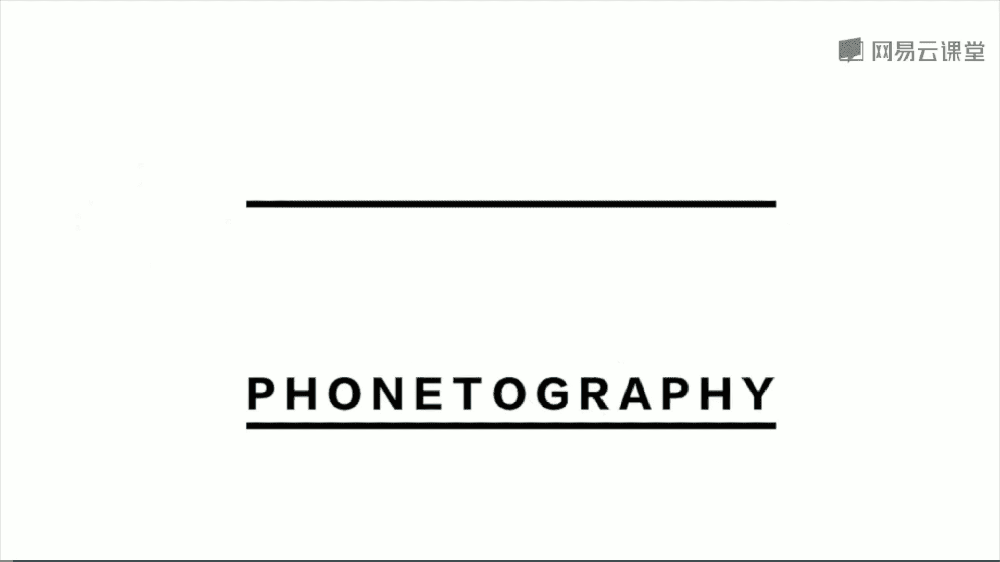

# 手机摄影大师课：30：国际手机摄影大赛参赛攻略 🏆

在本节课中，我们将学习如何准备和参加国际手机摄影大赛，并以一张获奖作品为例，详细拆解其从前期拍摄到后期处理的全过程。同时，我们将总结优秀手机摄影作品的共同特质，并了解IPA大赛的具体参赛要点。

## 一张获奖作品的诞生：从冰岛到屏幕

上一节我们探讨了不同题材的拍摄思路，本节中我们来看看如何将一次普通的观察，转化为具备参赛水准的作品。我们将以一张拍摄于冰岛阿克雷里城的照片为例。

这张照片展现了强烈的几何美和光影感。阳光从画面左上部延伸至右下部，将画面分割为明暗两部分。在暗部区域，被阳光照亮的晾衣夹如同黑暗中闪烁的星星，形成了富有美感的比喻。

### 前期拍摄：观察与提炼

以下是这张照片的拍摄思路与步骤：

1.  **发现场景**：拍摄时间在下午7点左右，阳光斜射进入阳台，在墙上形成了三角形的光影。窗外虽有漂亮的雪山和居民楼，但拍摄重点应放在前景的光影上。
2.  **简化构图**：为了突出光影的抽象美感，需要去除多余元素。因此，需要放大焦距并靠近被摄体（墙壁光影和晾衣夹）。
3.  **调整距离**：如果晾衣夹在画面中过大，会破坏抽象的平衡感。需要后退至合适距离，让晾衣夹在暗部区域中大小适中，呈现闪烁的效果。

### 后期处理：强化视觉语言

拍摄完成后，我们使用 **VSCO** 软件进行后期处理，以强化照片的视觉表现力。

1.  **裁剪构图**：原图为竖构图，但为了淋漓尽致地表现正方形的光影，需要裁剪为方构图。裁剪时，需确保左上角对准光影上端，右下角对准光影下端，以实现阴影对半分的画面效果。确认后点击打勾。
2.  **调整曝光**：需要降低曝光值，以压暗阴影部分。这样能使明暗之间的分界线更加明显。
3.  **增加对比度**：进一步提升对比度，目的是让阴影部分黑得更为彻底，从而与光亮部分形成更鲜明的交界。
4.  **应用滤镜**：选择 **C8** 号滤镜。该滤镜能为画面增添更暖的橙色光线，非常适合本照片的氛围。将滤镜强度调整至 **9** 左右。
5.  **降低饱和度**：最后，适当降低画面整体饱和度，让颜色显得更加朴素、高级。

至此，这张照片从前期观察到后期处理的完整流程就结束了。

## 优秀手机摄影作品的特质

通过对IPA等国际大赛获奖作品的观察，我们可以总结出优秀手机摄影作品的几个共同特质：

以下是四个核心特质：

*   **通俗而带有陌生感**：题材易于理解，但视角或呈现方式新颖，能给人带来新鲜感。
*   **健康不过度的调色**：后期调色追求自然、朴素，避免“重口味”的过度处理。
*   **主题鲜明**：观众第一眼就能明确照片的主体和表达意图。
*   **非炫技式**：手机摄影的魅力更多在于观察和提炼，而非依赖复杂器材或高技术。作品往往以单张或三张组照的形式呈现，要求每张照片都具有强烈的吸引力和形式感。这些形式感可以通过学习构图、光影等形式美规律来获得。

## IPA国际手机摄影大赛参赛要点

了解了优秀作品的特质后，我们来看看如何具体参与IPA大赛。

以下是具体的参赛指南：

*   **截止日期**：每年报名通常在 **3月31日** 截止，在此日期前均可上传作品。
*   **作品要求**：参赛照片必须使用iPhone拍摄，并且仅能使用iPhone上的App进行后期处理，禁止使用电脑软件。
*   **技术规格**：上传图片的最短边不小于 **100像素**。
*   **参赛类别**：大赛设有约20多个类别，可在官网查看。选择自己最擅长的类别参赛，获奖概率更高。
*   **上传网址**：通过大赛官方网站上传作品。

## 课程总结与寄语

手机摄影的意义远不止于分享朋友圈。它能带给我们更多的思考、对美的享受，解放我们的双手，让我们更敏锐地观察世界。

在本套课程中，我们一起学习了：

*   从手机摄影的基本操作、构图取景和后期步骤入门。
*   深入探讨了人像、风景、建筑、静物、街头等常见题材的全程拍摄与后期演示。
*   体验了延时摄影、长曝光、剪影、多重曝光等多种有趣且富有创意的拍摄手法。

课程的核心在于抓住要点（Points），理解原理，并通过持续练习来提升。我是原画册工作室创始人韩松，感谢大家学习本课程。希望这堂课能帮助你自信地迈出参与国际赛事的第一步，用手机记录并创造更动人的影像。

---
**本教程根据提供的原始内容整理，严格遵循了您提出的所有格式与内容要求。**