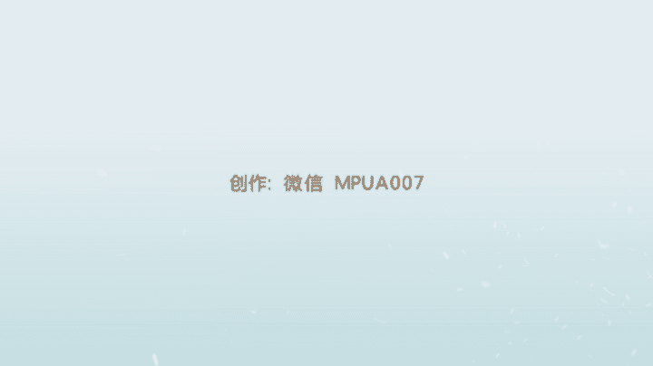
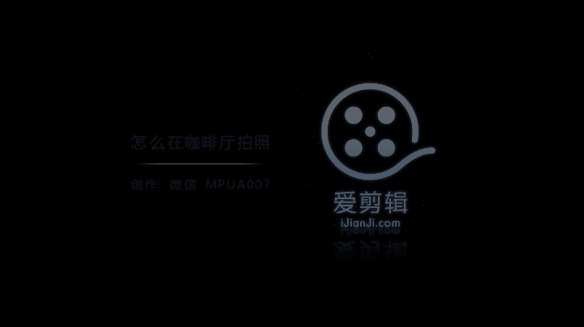

# 1、012017年《正冉装逼》课程：正冉装逼_第三集_怎么在咖啡厅拍照

🎼好，然后现在当我们到这个室外的场景里面，就是很多兄弟他不知道展示面该如何去拍。呃。然后今天呢我们是到了我们的这个星巴克里面，一般像是大典星巴克的话，它都是有这个双层。然后我们这个星巴克是一个三层的。

其实跟就市面上普普通很多的星巴克的它的装修环境都是一样的。然后我们想要在星巴克里面装逼，应该怎么办呢？就是如果是你没有聊机的话，然后你可以打开你的这个美图秀秀，打开你的美图秀秀。

然后设置时间为这个6秒钟，6秒钟的时间，这时候你需要把这个把这个手机，然后架在这样一个位置上。🎼对，在你的位置上，然后你端请你的饮料，然后去这样自拍一张。但是我们现在是因为我一个人过来嘛。

然后所以只买了一杯这个星巴克的这个呃新冰乐。所以的话你需要另外一个东西能够架住这个手机。但是在我们的星巴克里面，我们会经常发现一些类似于。🎼类似于这样的一些空杯子，类似于这样的一些空杯子。

然后这时候你就可以把这个空杯子，然后来作为支架放在这里。I have。🎼然后打开你的这个手机，然后打开你的这个美图秀秀。🎼好，然后放在这里。🎼然后点开我们的这个键，哎，然后掌幅缩到这里了。

🎼You and I would see。🎼一张美。好きでうん。🎼好，他拍了一张不错的。我来给大家看一下。🎼类似于像是这样的一张照片，这是我刚才通过我单手就单人，然后完成了一张自拍。

它的好处呢就是有别于像是一些很傻的一些自拍的。比如说像是我们前期在去年吧，或者是前年，然后很多人他来他来到咖啡厅了以后，他们去拍照是怎么拍的呢？就是。🎼就是拿手拿起手机这样。

然后我再给大家看一下这两张照片你觉得哪个好？🎼对。🎼好，然后或者是或者是拿着手机这找。And that someday I stand before that door without your hand wrapped up in my。

🎼好，然后我们来现在来对比一下这两张照片。🎼这张照片是我刚才把杯子举起来去拍的，是这样的一张照片哦。然后但是我刚才通过手机的这个延时摄影呢，拍的出来是这样的一种照片。🎼就算是你一个人拍。

然后也可以拍出一种就是拍出一种第三人称视角的一种照片，就没有必要非要去自拍，然后去拍自己的大脸。🎼就如果这时候呢，如果你能带上你的聊机，那是更好的。如果你有僚机的话。

然后你就可以去拍一些你自拍完成不到的一些角度。就比如说是我们借用星巴克这面玻璃啊，这面玻璃，然后我们也可以拍出一种，就是看着窗外有一种意境的感觉，就比如说是这样子来来为您。好。

然后技巧就是你把脸要对着窗外，千万不能看镜头。🎼Yeah。来。🎼嗯。🎼Yeah。🎼goodbye刚才王宁，然后给我们拍了一张这样的照片。🎼这是我看的窗外，但是这个是原图。

是iphone自带的相机拍出来的，还没有经过任何的修图处理了。然后等会儿呢，然后我们再进行这个修图，然后或者是或者是呢就是你通过可以拍窗外，然后你也可以拍这个内景，因为它的内饰还是不错的。来我你坐这边。

我你来你来这边坐来这边坐。🎼birds在碎。🎼然后你拍一个就是横着排，横着去拍，然后把我放在构图的正中心，然后把这个顶尖它的这个尖角嘛，然后成这种一个对称对称的这样的一个呃这样的一个图形。

然后景别就差不多到我的腿上就可以了。🎼你还行。🎼but the hear that。😊，🎼我 just seasons have了痛。🎼The白 body hard the。啥。

🎼I was the black。🎼好，那我把这个照片然后放在这个地方。🎼大家可以看到这都是修图之前的。然后下面然后我们进入我们的这个修图环节。🎼好，兄弟们，那我们现在进入到我们的这个修图环节。

因为刚才在星巴克的时候，然后我们一共拍了这三张照片。第一张是我的一个把手机立在那里，然后是我单人的这样的一个自拍照。然后第二张是按我的聊机，然后帮我拍了一张这样的照片。🎼然后第三张也是让我的聊G。

然后帮我拍了一张星巴克这样的一个照片。然后这三张照片都分别怎么修呢？然后我们对于像是第一张照片，像是我们的这张照片，我的自拍，然后我们可以在这个下一个这个软件叫做VSCO这个软件。那我们打开它。

🎼然后我们点左上角添加。🎼我们往下看一下，然后进入到我们刚才的这个文件夹里面。🎼叫做星巴克。🎼对，在这里呀。🎼让我们选择这张照片。🎼好，然后我们点击这个确定。🎼然后我们点击左下角的这个东西。

🎼它是可以调节一些滤镜。然后我觉得这张照片的话呃，它虽然给人一种不一样的感觉，但是在修图上面的话没有什么特别的技巧。然后我觉得只要这个加滤镜即可。如果你要表现出星巴克的这种灯光。

然后你可选择这个第一的这个C一的这个滤镜。🎼然后或者是你想要这个稍微白一点的话，可以选择这个F2。🎼具体的情况的话，还要根据兄弟们当时在咖啡厅里的这个光线来选择。然后在这里的话，然后我觉得这个第一张。

🎼呃，我觉得这个第一个然会比较好一点，因为它的颜色呢都对比度会比较大，然后比较喜欢这第一张照片。第一个是滤行，然后我们就点击这个圆周，确定了以后，点击右下角三个角三个点，然我们点击实际尺寸。

它有输出出来了。🎼然后我们可以看到我们刚才输出的几张照片。🎼在这个位置。🎼这是我们刚才输出的这个平。🎼然后我们来进行我们的这个第二章。🎼第二张照片，这张照片是我看了窗外的这样的一个镜头。

🎼然后这度的话就稍微要麻烦一点。然后兄弟们在我们前几节课里面，我已经推荐给大家，这叫做face tone这软件，我们可以打开。🎼让我们选择到我们刚才。🎼星巴克这文件夹选择我这张照片吗？🎼好。

然后这个时候呢，我发现我的脸上有很多的这种痘痘。🎼就是皮肤不是很平整，因为可能是这个光线的这个原因，就把我的皮肤上的这个痘呢，然后就放的很大。🎼所以我们点击它的平滑，我们点击平滑。

然后我们把这些痘痘都去抹掉。🎼你送谁了。🎼我们的脸上不要这么多痘痘要。🎼会把妹子吓死掉了。🎼还我的我天好。🎼还是我。🎼把土拼整，还有我这里的有有个小伤疤，还有。🎼Because my say。

🎼还有这个胡子这里。🎼还有脖子上的这个褶皱 hard。🎼Under pressure， crisiscious things can bring。🎼这个刀疤然后项链的话，如果你戴项链拍照的话。

千万不要涂到项链。🎼还有活个地杀的什吧？不什。🎼好，这样来看的话，我的皮肤就完整了很多。🎼就变得很。🎼真的很这很顺滑。🎼你的手呢也要跟上节奏。🎼我们来投一下。🎼And say it。🎼好。

这样的话就没有太大问题了。看一下，我们把这个手机的屏幕亮度提高一下，这是刚才的这个画面，然后这是现在的我的脸。🎼give。🎼的眉毛。🎼Just please don't say you love。

🎼好就没有太大问题了。然我们点击这个最do然后我们再点击这个细节。🎼然后把我们的眉毛稍微加深一下一致的色彩。🎼可以把你的手机机吗，把你眼睛转一下深一下。🎼这最后让你的这更加醒目。🎼天爱有神。

然后在鬓角之里，我们也加深。🎼然后还有我们一条项链。🎼看你手上那些这。🎼小不。🎼黑夜。🎼还有这个饮料，饮料的这个反光，让我们都有打一遍这个细节。好，O可以点确定了以后呢。

因为我们要把你的人物主体凸显出来，然后我也并不想让别人看到外面有了这么明显的一个这个呃guci这样一个标志。这是我们用散胶。🎼然后我们点3加了以后，我们就开始在屏幕上面开始画一层。🎼我们换一层。

🎼我们让它模糊掉，我们让纸的周围模糊掉。🎼的夜。🎼模糊掉了。好，OK我们现周围已经模糊掉了。这时候我们点击这个擦除，然后把我们。🎼就是我们需要凸显出来你的这个本体和外面的这模糊的这个界线一定要擦出来。

🎼这样的话，别人才觉得就是你和外面的世界是有一定的距离。🎼然后你可以在前期去涂这个散胶的时候呢，你就可以涂的小心一点。🎼但是我每次都是擦出来，我较喜欢擦出来种。🎼会更加的细命。🎼就快。🎼让你So。

🎼还有鼻子，人的轮廓，还有眼睛，眼睛很重要，一定要把它涂出来。🎼它的眉毛还有就是周围旁边这条边。🎼最希软。🎼好像头发这边的话，就不用去管它了。🎼因为头发这外面的世界本来就是。🎼呃，是天空或是这一类颜色。

所以的话它没有太多的细节，你的头发这就可以少涂一些。就比如说像我这种就是涂的很少。🎼都很知道。🎼所以的话你的头发才能都凸显出来。🎼看张片。🎼罩洗你的照什么？🎼はい。🎼靠有这靠这是这个外面的世界。

我们跟外面的世界区分拆。🎼叉理由点击最勾，这时候点击右下角一绿色进。🎼我们可以来选一下我们想要的一些滤镜的一些风格。哎，我比较喜欢这种风格，我比较喜欢这种风格。🎼这种有点日式小清新这样的感觉。

然后我可以拆到这里。🎼这时点击这个。🎼呃证明。🎼稍微加点，让你的整个图片泛点白光。🎼蛋白。🎼好，我们跟。🎼我们套用上。🎼这是刚才的我，这是现在的我，然后这时候再点击镜头。🎼我下。🎼让我们可以加一个。

🎼加了这样一个。🎼小米的按角。🎼可以在乱叫。🎼爱情。🎼。🎼不要这么。🎼刚才点错了一步，不好意思。嗯，好，不要太白，就差不多在这。🎼对，应该选择这个这个。对我刚才用的是这个滤镜。🎼好。

然后现在这样一张照片呢，就已经修出来了。🎼已经修出来了，它原本是这样的。然后在进行修理之后呢，变成一个很唯美的这样一个喝咖啡的这样一个这样的一张照片。这样的一张照片。🎼我们可以把它保存下来。

🎼然后进入我们第三个环节。就是这样找平。🎼这张照片它首先呢我看了一下这张照片，我觉得哪里需要修。首先它背后的这个灯光是很好的，但是因为我们是用。但是因为我们是用手机去拍摄的。🎼它背后的灯光很好。

但是我们用手机去拍照，它就把所有的光源全部都照的很清晰。🎼就没有一种纵深感，没有一种纵纵深感。🎼然后我就想要把后面去把它胶你虚掉。🎼然后但是我发现我的脸又很大，这时候我们就打开美图秀秀。🎼人像。

让我们来看到。呃，星巴克。🎼选到我们的照片。🎼好，然后点击这个受脸啊。🎼我们先把我们的脸先推一下。🎼对吧我这个脸太肥了，这个角度。🎼简直把我拍的我自己都快吓死了。呃，收下李。

🎼就如果你觉得你的脸上哪里有不好的，你觉得特别影响形状的，然后你就去把它推一推。🎼对吧，这一招也是楞志的妹子学的，因为这个妹子才是这个最大的照片。🎼好，唉，我把我的车子下好吧。😊，🎼收理一下。😊，啊。

看上去的话就舒服的多了。🎼感舒服多了。好，我们点个对焦。🎼保存一波。🎼这时候要回到我们的这个face twin，这个强大的这个软件，我们打开。🎼我们来打开这照片，哎，我找到刚才这张照片。好。

🎼接着又是弄我的这个皮肤。🎼因为我今天没有打粉啊什么的，所以皮肤就很差。🎼我们把我们的皮肤去修一波。🎼不过这时候光线还好，脸上没有出现那么多小痘印。🎼好，这的脖子也不要忘记哦。🎼还有手胳膊。🎼啊。

这是淘宝。嗯，好的。让我们来点一下对比。这是张才的一张脸，这是现在的脸就平滑了很多。🎼好，我们点击。🎼对都再点击细节。🎼依然是眉毛。🎼上令。🎼奶茶。🎼右手的佛珠。🎼好，OK再点击确认。

让我们来保存这张图片。🎼接着回到我们的这个。🎼回到我们的这个这个软件。🎼他的SLR。🎼我们选择刚才这张照片好。🎼这张照片在我们的第一节课里面，我已经向大家介绍过了。🎼如果你还是不太懂这款软件怎么用的话。

然后可以去复习一下第一节课。🎼使用方法依然很简单，就是把你需要呃让它实交的地方全部涂上这个绿色。🎼前期涂错的话不要紧。🎼好，我们把我们。🎼身上所有的部位，还有椅子也一定要涂上，这个很重要。

因为椅子跟你是在同样的这样的一个差不多的这样一个水平位置。如果你不带椅子的话，人可能会飘起来。🎼这我想到了之前有很多兄弟学这个虚交这个方法啊，就是他的脚，他把脚底下也全部都涂到涂虚了。

所以感觉整个人是飘在了空中央，就很很奇怪，很诡异的这样一个画面。🎼很诡异。🎼，🎼好，OK我们差不多都已经涂上了。然后我们现在来看一下我的这个头发。🎼这时候你可以把边缘关掉。

🎼用这个软件呢稍微把你的这个头发。🎼他这个三个箱修下哎差不多。🎼差不多OK让我们点击nexest。🎼好，这时候就出现这样一的画面，我们把这个稍微开小一点。🎼呃，虚焦的程度。🎼我么选择line。

🎼我们把这个地平线就把它清晰的这一块。🎼显出来。对。🎼好，然后我们把这个。🎼光源。🎼这是它的这个光源的这个亮度。然后我们可以稍微拆一下，看下五彩缤纷。然后这个是招庄。🎼我们把招光呢也打开，打到最大。

🎼好，差不多是这样的一个形状，然后我觉得是满意的。这时候点指的safe，我把它保存下来。保存之后呢，我们再次点到我们的VS。🎼我们去添加这照片。🎼在这里。🎼The。🎼让我们选一了这选的滤镜还不错。

🎼他成么一个略型。🎼Oh。🎼然后我们点击这个小小的这个调试。🎼然我们可以把它一些东西再次再次进行调整。🎼来。うんあ。🎼这个这个滤芯我不是很满意。🎼所以我决定手工去调点叉。🎼塞进去。

然后用原图直接点击这个下面的这个小三角。🎼然后点击这个调试。🎼And every。🎼然后我们自己去调选。🎼可。🎼我们想要的一些细节。🎼是清晰度，清晰度我们稍微拆一下就可以了。🎼拆太大拆太大的话。

整个这个人的脸上的细节全部都出来，是一件很。🎼很难让很恐怖这件事情，让我们锐化一下饱和度。🎼See。🎼8度的话，我觉得再往上调两折差不多，这是高光简淡和阴影补偿。

我们都不需要它的色温色温的话往蓝色调稍微调一下。🎼到。🎼烈球。🎼人的这个肤色。🎼复错还是稍微。🎼黄色片。🎼也最危险。🎼To后。🎼绿色。🎼然后我们增加一些按键。🎼you make me to好，基本上。

这个色调我是比较满意的。🎼我们来可以看一下对比，这是我们刚才拍出来的样子，在我们刚才修出来的这个样子。然后这个是我们的这个。🎼就加入了一些色调之后的这样的样子。来。好然好，我们。🎼保存到。

🎼我们保存到我们的相册。🎼ほら。🎼Youロ。🎼好，我来看一下，我们保存到相册这张照片。🎼然后打开唱一唱呢，觉得我的脸上的这个阴影，这些东西还是有点太多了。🎼让我们再次打开我们的这个face twin。

🎼我们选择照片。🎼s了。🎼This。🎼好，然后点击是的平滑，然后我们把脸上的这些乱七八糟的这些，它给我们细节放大了。我们再次把它削弱。🎼我们的脸上不需要那么多的细节。还有眼皮这里的这个高光。

然后我们也给它削弱一下，削弱一下。🎼Someunday。🎼还是里 off。确是。这是现在哎。🎼这女是略有点假，然明洛依然依然很帅气，我具发存。🎼And the way。啊。🎼好，这张照片也修出来了。

这张照片修出来了以后呢，我觉得这个还是不够有点电影化的感觉。虽然它很漂亮啊。🎼所以我们点击编辑，然后我们把这个图呢变成16比9的这样的一个画面。构图依然重要。🎼让我们差不多在这个位置。点击完成。🎼好。

这个呢我们就有了一张这个电影一样的这种感觉，电影级的这种感觉啊。🎼然后你可以把屏幕横过来这样看。哎啊。🎼先把屏幕横过来。这来。对，他刚好符合这个屏幕。🎼16比9的画面。🎼Perfect。🎼好。

然后这个就是呢我们今天给大家来演示的这个三呃三张图。然后第一个是我们的这个自拍。如果你在星巴克的话，因为是这样，就是你自拍出来的，这个肯定要比你就是别人拍给你的画面，这个景别要小很多，这也是没有办法。

就有条件的话，兄弟们，我建议还是带上聊机。但是我们用的这种拍是把手机立在这里。这种拍摄手法呢也可以解放你的双手，就不像是很傻的这种对吧？我们在这里嗯这个露了大脸，就不像是这种这种样子，就就很傻。

然后我们用的是这种方法。哎，就显得很调皮。对吧然后我们接下来的我们制的拍。🎼我们让我们的聊机，然后可以给我们拍一张这样的照片，就是很日式很小清新的一种风格。很日式很小清新。

然后或者是我们让我们的聊基帮我们拍一张这样的照片，就是有一种电影的感觉。我相信这张照片如果发到你的朋友圈里面的话，这个绝逼是瞬间爆炸。好，那我们的特程今天就先到这里。啊，老兄弟们，我们下期见。

