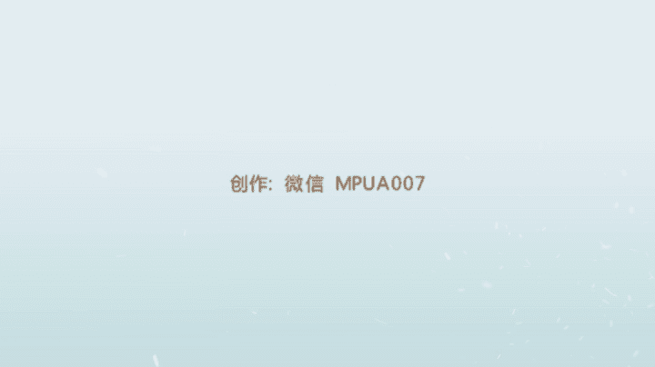

# 1、012017年《正冉装逼》课程：正冉装逼_第四集_如何站着装逼

好，兄弟们呃，然后我们今天来讲是一个什么呢？我们今天来讲怎么样去在一些公共场合或者是一些私密的一些场合，怎么样去装逼，就怎么样去摆姿势。就因为我现在看到我们很多群里面的一些兄弟。

包括我在我的朋友圈里面看到很多我们一些没有报我们课程的这些兄弟呢，他们的呃在户外的一些拍照就很游客很游客。比如说他们走在一片地方，然后可能就这样傻傻的站在这里。嘿嘿这样子，然后就咔嚓照一张相。

就显得会会很傻。然后其实就是真正的想要照出一种大片儿感觉呢，它是有专门的一些拍摄方法的。然后让我们现在来讲给大家呃，我们现在呢是在我们的这个成都的太古里，然后这边的环境，这边算是个小商圈，一的大商圈。

这边环境啊什么的，然后装扮都是不错的。我相信你在你的城市里面也可以找到，像是这种相同的这些环境。啊，所以的话我们现在看到了。😊，因为那边的人很多。

然后我不希望在我的照片里面会有很多乱七八糟的一些杂人被拍到这张照片里。所以呢所以我现在选择了一个就是寂静没有人，然后但是又是属于环境很好的这样一个位置，是在这里。对，大家可以看到这个通道。

然后就非常的幽静，然后有一种泛着这种幽幽的蓝光在这儿，然后这是我特别想要呃去追逐的一种氛围吧。然后包括像是兄弟们的着装，也然后也可以去注意一下，就像是我们一般夏天，然后像男孩的话可以穿的很干净整洁。

就比如说像是我的这个外面，然后又穿了一件白色式的T恤，然后很阳光，然后因为我问过很多女孩，然后他们都是很喜欢穿，就是看到男生穿这种白T恤的。然后裤子呢我穿一条这样的黑色的这样的一个收脚裤。

这条裤子在zaara可以买到，就在zaara可以买到，然后脚上呢，然后是穿了一双这个篮球鞋，篮球鞋是这个AG的。然后呃。那我们现在就开始吧，然后不多要注意的一点就是当你在拍照的时候，你或者是有的聊。

其实在帮你去拍这种全身照。然后这种大背景的时候，在我们第一节课里面讲的很清楚，就是越是这种全身照，他对于背景的要求越高。但是对于脸的要求越低。所以你可以通过穿衣的风格和你自己的一些这种姿势的一些白发。

然后可以反映出来你这样的人是一种什么样的感觉。一定要记住，在拍照的时候，就是相框的最底下，千万不能去切到你的脚。就是我们第一节课里面讲的会有一种肢被肢解掉的感觉。然后还有就是你在拍的时候。

这底下的地板这个留的空位也不能太大，要不然的话整个人会显得很短。最好的方法是，如果我的脚在这个位置的话，然后在我们的这个相框的最底下的边缘差不多是在我脚前面一点点，差不多在这个位置。

然后拍出来感觉是最好的。好，那我们现在来拍一张吧。😊，好，我们让我们的这个呃神聊机。好，哎，你对着这个镜头嘛，给兄们看一下。好，然后我现在做一个这样的一个动作吧，仰天看这样会显得人的身高比较高一些。好。

蹲上嗯，来吧。然后我再拍一张这样的照片吧。啊，这是我们刚才拍到这样一张照片。哎，你把将距对一下。就是这样的一张照片的风格是很好的，就像我刚才说的脚底板，脚底板的这个这个最上面，或你不要离开近对。

在这儿脚脚底脚底板的最下面这条边缘呢，刚好是在我脚的最下面。然后我整个人看起来就特别的高大。然后这个背景呢也是泛着一些这种悠悠的光，然后有这种太阳光下来。就是如果你的个子不是很高的话。

我建议穿这样的风格就穿一个稍微高帮一点。然后一个收脚裤，这样会整个把你脚部的这个曲线会拉长。然后再加上我的头是仰天看，然后又增又拉高我的很很大的一个这样的身高的一个比例，整个人看起来就非常的就是高大。

然后非常的帅气。好，然后这个是我们在在这样的一条小地方里面，然后给大家做的这样一个全身的演示。然后但是我们拍照的时候要注意，就如果你要拍出一些比较小全身，比较一些文艺的一些照片的话。

要切记这个脸还是要眼睛还是要少看着镜头。好就眼睛不要去盯着镜头看眼睛，你可以看其他地方，你可以看左看右，看上看下，对吧？然后甚至这样看后面都是OK的。但是千万记住，眼睛不要去盯镜头，因为眼睛盯镜头的话。

就会有一种就是他一下变到了第三个人称的这样的就是第二人称这样视角，就变成我跟照片里的你看我的照片，这个人会有一个视线上的这样一个对接，然后就很容易出戏，然后妹子看的时候一看，哎这个照片。

这个人怎么看着我，所以就不好，你要给妹子看到的一种是呃是第三人称的视角，就是他在他发你的朋友圈的时候，他在观察你的生活，而不是每张照片，你都在跟他对视。那兄弟现在让我们进入到我们刚才的这个修图环节。😊。

在刚才呢我们看到了我去在太古里的这么一条小巷子里面，然后选择了个这样的一个拍摄的一个呃背景吧。背景。然后我换了很多不同的姿势，然后去拍一张照片。然后我个人最满意的，然后是一张。是。摄张照片。是这张照片。

其实还有令我比较满意的是低头的这张照片，我觉得也是OK的。但是但是我低头的话会显得我整个人会很短。就是我的这个底下的这个比例从这里，然后到这里，然后到我的这上面，然后整个人会显得很矮。

所以我并不是喜很喜欢这样的一张照片。然后我觉得把我把头抬起来这张照片反而会显得更好一点。因为我的头部，我的颈部，然后整个把我身体拉的很长，然后头显得很小，身体显得很大，从而显得我很高，看起来。

看起来有一种这个这个1。9米的即视感啊，1。9的即视感。啊，好，然后我们来讲一下这张图呢，然后我们怎么去处理。首先还有老规矩，我们打开我们的VSCO对我最近异常喜欢这款软件，就特别的就是感觉特别的好。

然后我们选择到我的这个图片，这是我们这是我刚才添加进去的，然后我把它打开。好，然后在这里面呢，我们依然是可以看到有很多的滤镜，有很多滤镜。但是现在的我呢比较喜欢去首条的风格。

因为这些滤镜它的风格化实在是太严重了，就让别人一眼就可以看出来你是这种去修过的这样一张图。然后我不是很喜欢这样的，我喜欢就是看起来很自然。所以我们就点到这个最原始最左边的这个图。

然后我们点击去这个修一下。好，然后我们依然就是我每次在修图之前，我先会打开对比度，然后把对比度加到二，让它颜色更加加重。然后像是这度呃像是其他的像是这的曝光的一般我就不会我就不会去调了。

因为你把它调大的话，光会特别的爆，整个人也会特别的明朗。然后太小的话，然后光就会特别的这个光圈就特别的小。你可以理解成光圈。呃，在这张图呢，然后我觉得。对，差不多让光稍微爆一点，然后会比较好的。

但是我一般在修图的时候，我的光是不会去调的。因为我在前期拍摄的时候就会想。清晰度呢我们调到2吧，千万不要太高，太高的话，整个人的皮肤也会不好。然后我们锐化一下，让这个图呢更加的清晰。更加的清晰。好。

然后饱和度这就很重要，这是决定于你整个照片的这个呃色彩的方向。如果你的这个饱和度越往右边，然后它的就是越大。然后越往左边的话，然后整个颜色越素。然后我看一下这张图片。

我决定稍微我们走一点这种比较素的风格。所以我往我往左边调两个。然后这个高光减淡和这个阴影呢，然后我都是不是太常去用。就如果你拍摄的东西很曝光，就光很曝的话，然后你可以把它唉高光减淡一波。对。

然后如果你拍的东西很暗，然后你可以把阴影补偿打开，它就会把这个图会变得很亮。但是在这张图上呢，我们这两种都不用。然后我们点击这个色温，色温是决定这个整个图片的这样的一个也是色彩的一个方向吧。呃。

然后你往越往右的话，它的就是越偏黄，就是越偏红色。然后越往左边的话越偏蓝色。还有这张图呢，我们选择我我们往左边偏两个，我们要有一种比较蓝的感觉。好，这个是色调，色调就呃这张图呢。呃，看一下色调的话。

色调我们稍微往。我们稍微往之了呃绿色，这个被往之的紫红色这个方面稍微走走这么一点点，这样会话会显得我皮肤会稍微OK一些。好，然后这是肤色，肤色的话就是把黄色的东西去调。如果你越往这边的话，它越黄皮肤。

如果你越往这边的话，皮肤就越红。然后我决定让我的皮肤稍微红一点，会看起来更好。然后这是暗角啊，一定要加了这样的暗角，暗角加上以后会突出整个你的人物的主题。然后我们再稍微涂一下色。呃。

差不多这样的一张照片。很阳光很干净，人很白，我们来保存一波。保存在相册。嗯，好，我们来烫一下。诶。这样照片就变成这个样色了。嗯，然后我很我很阳光的这么一个形象。我们看一下张才的原图。照原图是这样子的。

很黄人很黄，然后这个就感觉一种黄黄的感觉。哎，这张图片就变得很清晰，人脸很白，很明亮，很干净。很明亮很干净。呃，刚才我们给兄弟们演示过如何在就是拍正面，就是如何去拍一张正面的这样的照片。

然后那么现在呢我们来给大家演示一下如何去拍你的背面，拍背面跟正面一样，都是你必须要就是抓好整个环境。然后根据整个环境呢，然后我们来选择我们去拍的这个角度，还有站样的这个位置，包括你去做的这个动作，对吧？

好，然后呃我们现在呢炸到了一片这个许愿池。布拉格广场的许愿池，但是并没有人会投硬币啊，没有开玩笑的。我刚才是呃就是我们看到这样也有一片池塘，然后然后我就在思考，然后在想哎，我怎么利用去利用这个池塘。

然后来给我拍出一组就是不错的这样的装逼照呢？然后此时我就想到一个很好的办法，就是我去背对着它，因为因为因为如果你要拍一片池塘，然后你人站在这里，然后去拍后面的水就显得非常的傻。我一定呢是。😊，人看的水。

然后去拍我的后面，包括水，然后才是最好的选择。好，然后我们现在依旧是我按照我们刚才说的，我会站在整个这个食堂的这个V字形的这个角这里，站在这个角这里，然后同时让你的聊机，然后也是要蹲下来。

然后帮你去拍张照片，然后可以拍这种呃就是你可以把iphone手机这样横着拍过来。然后就是整个把它的全景都拍过去。但是这样拍出来的全身人会显得比较扁。

但是我们在后期然后我们来给大家来讲这个如何去把你的人变瘦。😊，好，然后现在呢我就站在这里了。站在这的脚招。然后手呢手我就不插袋了。好，哎，我就这样站着。好，唉，这张照片我觉得是不错的。

这张照片我把手机亮度放高点，最高了已经，能看到吗？对我觉得这样的一张照片是不错的，两边的池塘，然后也没有多少杂人，然后我站在屏幕的这个中央，虽然我会显得这个比较比较矮矬一点，但是呢但是也没有关系。

然我们后期来给大家来讲，如何去这个如何去把它修成一个很修长的感觉。所以的话就是这样，就是你一般我们中国人就怎么说呢？如果你前面身边大海的话，永远是背靠山面朝海，所以你在拍海的时候一定要记得。

就是你要你要是这得面对它，千万不能去拍它的就是千万不能这样去拍海，我我一直都觉得这样去拍海是一种很傻的感觉。就得你把那个某个明星当做背景墙，然后跑到去哎踏这样照一张感觉是一样的。呃。

所以还是要背对着这个海。然后你在背过来站的时候，然后呃这个姿势也是有技巧的。就你站过来，你千万不能驼背，你千万不能这样站。对吧然后你也不能这样东倒西歪这样站。

然后你可以尝试一只脚在前一只脚在后这样的感觉，然后或者是两只脚在后面，然后你脚尖这样垫起来。但是从后面拍照技巧比前面更加讲究的是你拍的时候一定还是要偏低一些，或者把你的人偏瘦一些。

因为我们在就是因为我们在正面拍照的时候，人会显得会会瘦一些。然后会这个立体一点。然后但是你在背面的话，人会显得就是背很大的一坨。然后包括你的屁股都在这个就都在你的身后面，所以会显得整个人会很胖。

所以的话这也是一个要注意的技巧不够，通过我们的后期修图都可以解决这些方法，解决这些问题。😊，好，然后这张图片完了以后，刚才呢我们还拍到了我们在。这个我们在水池旁边的这样的一张照片。我们在水池旁边。

当才我拍了很多张。啊，我看了一下哎。我觉得哪一张会不错，我觉得这几张都还OK。这种斜的就不要了，就是你要拍出这种V字形。如果你是在这种对成对角线的话，你要拍出他们对角线。所以我决定选这几张照片。

然后这张照片的话呃有的问题就是我的人呢看起来非常的胖。对，这个屁股也很大。呃，这可能是因为我手放了钱包的原因，还是什么原因，就显得我屁股很大，然后人就变得很。很粗很短的样子。

而且他的这张图呢也是一个这种长方形的这样一张图。所以的话把整个人的招度更加不能写出来，但是没有关系。然后我们继续用我们之前教的一款软件，叫做face tune。哎呀哎呀，这是什么照片？好。

我们打开这个face tune。然后我们找一下刚才我觉得哪张照片是不错的呢？呃，我们试下这张照片哎呦。这张照片。上这明还是不太好。这张啊这张怎么样？对，车长还要拆。然后我们人很胖怎么办？

这时候这时候我们又来了，这里有一个绿色镜。然后我们选择镜头。哎，我们可以看到。这种感觉。对他会把你他会把整座图，然后往里去凹一波。哎，这个人看起来就细了很多，然后整座大全景，然后也全部都尽收眼底。

尽收眼底。哎，这两个人这是他吗这两个人骑了两个人个叫什么呢？这个这个这个这不双轮双轮车还是越野版的吗？

