# 1、012017年《正冉装逼》课程：正冉装逼第一集

啊，欢迎大家来到我们的装逼课程第一节课拍照。就很多兄弟一直在问我图片该怎么样去修。可以说我看了一下他的照片啊，发现他连前期的这个拍摄，然后都是拍的很烂。就无论去怎么样去修，都很难达到一个很有逼格的样子。

所以我们的课程呢前几节呢我都会讲一些就是拍照啊，构图选环境摆姿势的一些这样的方法。呃，然后这个我们的这个拍照的一开始呢就很重要的。第一点就是要明确主题。

就一张好的装逼照片都有一个很明确很鲜明的这样一个主题。无论是表现人或是表现一个事物，或是表现一个故事，甚至表现一个情节，都必须要主题要明确，然后毫不含糊，是别人一眼就可以看到你的逼格所在。

第二点呢就是主体与加分项之间的关系。想要使别人看你的这个初步，就是看你照片之后，初步留下这样的印很好的印象，或是使人看完留后留下比较深度的印象。首先你要设法把你的这个主体跟你的这个加分项。

然后要放入你的这个照片当中产生这样一个互动，达到无形装逼最为致命这样一个效果。第三点呢是构图这个构图画面。就如果你只是想随便去拍一拍这样子的呃，就纪念一下啊，我到自己游啊，摆了叶咔嚓这样照一张照片。

然后那你可能不用去考虑什么什么主题啊，构图之类东西。但是如果你想利用手机拍出不一样这种大片的效果。那么你肯定需要注意，就是对焦啊，像是一些选光的光源呀，角度啊，构图之类的这样的方面。这东西的话。

我在下面会详细的讲到第四点是什么呢？第四点就是我们的美化，就美化也就是我们的这个修图。这个东西呢我会贯穿就是整个我所有的这个课程就不会就呃可能不会单独拿出来几节特的专门讲修图这样的。

我可能会把很多很多的案例，然后融入到我的课程当中，因为毕竟修图并不是很重要的，也是很重要的一点。但是并不是装逼照片里面最重要的一点。这最重要的还是前期的这个拍摄。然后后期呢只是这样一个润色而已。呃，好。

那么首先呢呃我们说一下我们的这个主题，这个明确主题，明确主题的意思就是说你要把你想要传达给妹子的这样想让他们知道的这种东西。然后告诉他们，就听起来比较绕口。所我再说一遍，就是主题明确的意思呢。

就是你你就是你所要传达给妹子，你想让他们知道的B格。就比如这像是美食，就是一个很好的点。但现在好像不是很流行在。记得朋友圈里面9张图全部都是美食，偶尔有一张比较有特色的美食，还是OK的。

就吃东西是一方面，发朋友圈定位在哪儿也是非常重要的。就如果你就发的吃的走的是这种高端路线，那么定位点进去一定不能是什么大众点片人均消费七八十这样的地方。这样妹子会觉得。

就你就就你就一点开就会觉得你一天到晚都吃这种东西，然后你也好意思发朋友圈嘛，就low。所以或者是你要走这种就特色好玩的路线。这种定位的大众点评，人均消费当时越便宜越好。

但是毕竟要有特色又好吃的这种东西是比较难找的。呃，好吃美食是一方面嘛。然后朋友圈里面最重要的就是你的人，你的人物的形象特征对于人来说是非常重要的。就首先你的外形不能搓，千万不能搓，一定不能搓。

就我说的搓，不是脸或者是身体的搓，而是你的穿衣打扮，就是你自己的风格，我之前就是走这种小清新加hihop风格，这种感觉，这种感觉也是我从其他男人当中脱颖而出，我自己的这样的一种呃风格或一种特点吧。

在妹子眼中辨识度会相对来说比其他人要高一些。人物除了不能挫以外，还有更重要，就是你的朋友圈里一定要用你自己的脸，你要把你的脸扑上去。这种脸可以。这种脸的表达可以是自拍或者是他拍，就我一般会选择他拍。

偶尔也会自拍。因为我觉得一个男生动不动就自拍会显得很怪异。除了一些呃比较好玩有趣的事情，我会自拍恶搞一下。其他的时候呢，我一般都不会去选择自拍。就是只要有身边有人我就不会去选择自拍。

还有的很重要就是你的肢体语言，就你朋友圈里面。啊，要有自己不同的警别。就什么是景别呢？就是我们对于人物的这样的一个取景的这样的一个大小。就比如说你的大脸，就我们称之为特写啊。

特写镜头就能够细微的表现你这个人的就人物的面部表情，就可以刻画你这人的就是这样的一个人物的一个形象吧。就将你的脸全部都瘫在照片的中央，不知道切记你的你的大脸，很容易就给你产生一些特定的印象。

就如果你很帅，然后特写的数量的话，可以加多一些。但是如果你长得一般，就像是我们这种的，你要是收拾打扮好，就不要太low，就现实当中很多人都是不上相的，就是帅的人不会有那么多，大多数人都是很频繁的一张脸。

像这种情况的话，脸就不用就铺满你整个的朋友圈，就是有一些就ok了。就呃就主要是除了脸以外要放身体的这种大全景。就还有呃还有这种近景，近景是什么样？就是比如说像是我这张吃饭的照片。

就差不多是到胸口肚子这里就很好的表现我除了脸部特征以外的这种肢体语言，还有我的着装。接下来是中景，就将你的个人照片的区景框最下面到你的大腿或者是小腿中间的这一块，就切记照片剪裁的线就一定不能在关节处。

就一定要在这个躯干之间，千万不能在关节截断，这样的话，人物就会感觉好像被就感于被肢解了一样的感觉就很诡异。然后呃中景呢就可以涵盖到就是涵盖到腿部的这样的肢体语言和你的腿部的一些服装，比如说你的裤子啊。

这样的就是很好的一点，可以将你的腿展示出来，就脸部的这个表现就会更加的减弱。但是人物的整体的形象就会更有特点。因为是你的整个人的身体都出来了。最后就是大颧景，大全举就是你整个人物都是在镜头里面。

这种做法很好的一点，就是你将你整个的身体服装风格肢体语言全部都暴露出来。你整体的人物的。辨识度就会更高。为什么这么说呢？因为我们在日常当中经常不会就不用看到脸就可以辨识出来这个人是谁。

很重要的一点就是这个人的服装风格走路或是站立的一些动作的肢体语言。呃，而且对于脸不是那么帅的同学们来说呢，比如说是我这种啊就会比较好。因为它是把你的脸部的特征就会减弱，减弱很多。

然后相对来说你的呃这个肢体呢就辨识度会更高，所以它是OK的。这种大全景的照片。但是大全景的不好之处就是背景，就是你要找到一个好的一个大片的这样的一个背景，这样人物在环境当中就不会显得太low。

关于背景的处理，像是大特写背景的话，就很简单，就背景一定要干净整洁，避免在一些复杂的环境照相。就比如说像是我的这张自拍，就它的背景呢看起来就没有这么的乱。因为我的大连也占据了整个照片啊。

我一般都会选像是这种近景或者中景，我一般都会选择就把背景去虚化了，呃，这个这里给大家推荐两款软件吧，一个是这个叫什么他的，应该是这样拼的叫DATADAA。SLR对。

然后还有一些叫做face tone这样的软件啊，就是我们前者这软件叫什么？它打SLR这个软件呢可以选择你的边缘，就选择你的边缘以外的这样的地方，然后把它虚化掉。

然后像是这个face tone呢就可以又可以去虚化你的背景，然后又可以去修你的脸，这两款都是付费软件加起来的话，可能就30块钱吧。在apple store上有时这个投资是ok的。呃。

像是大全景的这样的背景呢，也一定要保持干净，环境可以复杂，但是取景一定要干净。然后接下来呢我给大家来说一下这两款软件是怎么用的。好，那让我们来看一下这款软件是怎么用的。这个TADASR这软件。

首先我们先打开。

嗯，然后出现他的这个分面。进去了以后点左下角点左下角的这个小叉叉。

进去了后，它可以选择这个图片，然后我们点击这右下角我们的这个相册点开，然后我们随便哎选一张选一张这个浪着这个照片吧。这照片也是呃流传度很高，然后很多人去模仿这张照片，但是很少有人能拍出这样的感觉。

就是就算它拍出来也很难把它修成背景是模糊的。

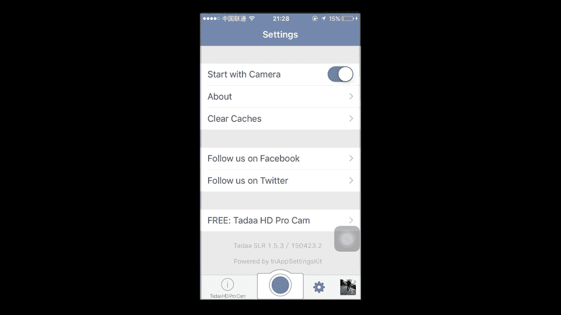

呃，这样的一张照片，我看很多人拍的是就很low，拿两条线，然后这样一弄把周围模糊，然后把人弄出来，这是很很很不好的这样的一个修图方法。然后这个是怎么用呢？首先这是左下角有一个must。

你的ma这个很好用。然后你要把这个边缘打开，就是这个按键。这个案件是他边缘的这个案件。然后让我们来画A。这个好处就是你所画到线的位置，然后它会把颜色相近相同的，然后它自动会计算出来。但是有些可能会花。

比如说像这边它也会花了，然后屁股这里有一坨的颜色也没有找到，然后这时你要把图片拉大，然后把它全部都拖均匀。像是这些外面溢出去的这个颜色的话，然后等会儿等会再来处理。然后我们先首先把这个大的方向。

把这大的方向A，这全部都打上了。然后肩膀胳膊。嗯。好，把它打好把它打好，然后再选择这个橡皮擦，再选择橡皮擦。然后边缘呢依然把它把这个边缘的勾打上，就让它自动去计算边缘。这样的话，它像是一些整个色块。

比如说像是大腿啊，这衣服连成这一片的颜色的。他就不会被你这个擦掉，要不然话你很容易会把它擦掉。然后这个腿中间的这一大片。那也推擦掉也推擦掉。好，然后还有脚印的这里脚印这里。小云。

因为他的鞋子他是片黑色的，跟鞋子的颜色很相似。所以的话就导致这个擦的话可能有是没擦好。哎，这是这是什么地方而且它一个皮带应该是打上的。好，把这个。我把F模式打开。对他应该是在这上面的。在这上面的。

还有头顶头发这里。擦掉。擦掉。材料。稍掉。好，然后这里擦掉。拆掉哎。哎，然后拿橡皮擦擦掉。好，这样的话，这整个人物都被我们打上这个颜色。然后接下来按这了奈。那呃叫什么呢？叫。让我们进行这个下一步。

下一步。然后这个时候整个人物都是清晰的，大家有没有看到整个人物都是清晰的，然后它会有两个这底下有个out，然后叫什么ciler，然后linear，然后off，然后off的话就把它去掉。

然后其他地方就全部都去掉了。然后cirtcle是这样一个圆圈圈。这样圆圈圈，然后你选中的部分它颜色会清晰，然后line是这样的直线，然后我们就选择line。然后我们为了达到这种逼真的效果。

然后首先我们把这底下的这个 line这全部都拖下去，然后把上面的全部留出来，把上面的留出来。哎，就有点像。就有点像是这样的感觉。对，就有点像是这样的感觉。然后你可以把这range开大一点。

把range开大一点。然后。把这个呃亮度抬高，这样它会有光闪出来。然后这时候我们会看到他这个他这里就是个肩膀这里还是有点小瑕疵，有点白色这样东西，但是不要紧不要紧。这东西的话我们会通过后期的别的途径。

然后再去修。这样弄完的话。哎，有没有等于整个？整个人物。整个人物就就亮起来了，然后这个脚他的脚下面千万不能出现这种的虚影。就是比如说往下拉，你们可以看到这整个人就会浮在天空上面。

就有点像86版西游记这样的感觉。所以的话脚底下脚底下一定要是实实心的。脚下一定是实心的。然后这最上面的这个呢是它的清晰程度，最上面这一栏。就你开的越低，它越清晰，你开的越高，它越模糊。对，哎。

我们选择差不多，导致的位置就可以了，然后再点击完成。然后它这后面还可以有有一些这样的修图的这些小工具吧。然后这里我们就不用它调制的，主要是变模糊，然后把它存下来。我们去储存。嗯。

然后储存完了以后，然后我们再用这个修图软件。然后这张照片的话是可以拿美图秀秀去修的。我们把美图秀秀打开。

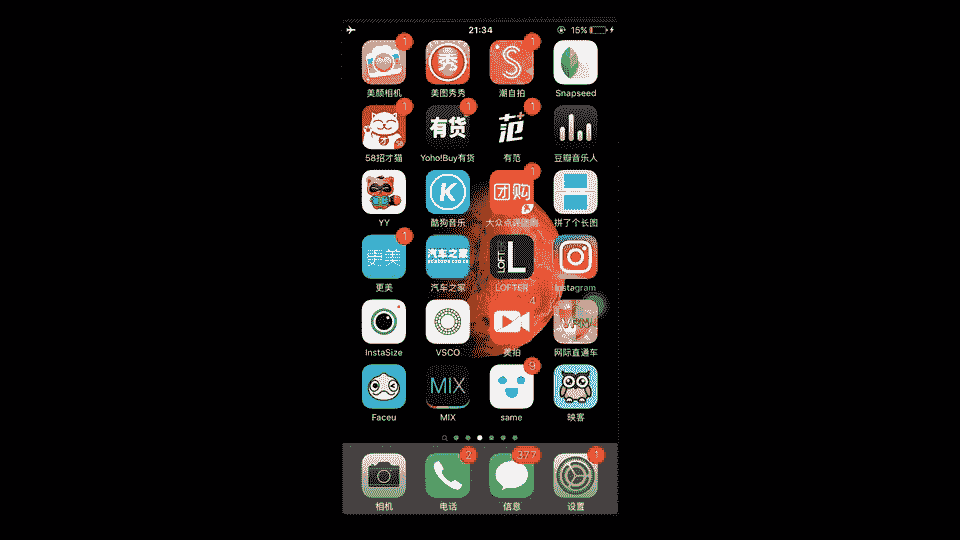

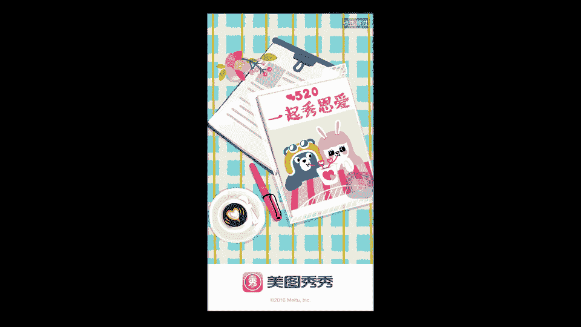

选择美化相片，哎，打开找到这张图片。

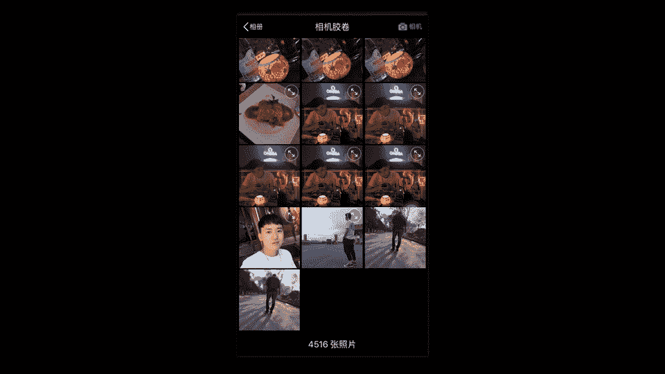

让后我们来看一下啊，首先呃加1个HDR。整座的这个。整个人物就变得很清晰。然后打的勾，但是它的颜色会变得很重，这时我们再加了壁波，然后我们把它拉小一点。这让画面看起来有点这种蓝蓝的感觉。然后之后呢。

我们再加一个，这个叫什么呢？这个淡雅。我把淡牙插低一点啊，这是关掉的样子，是打叉的样子，再加个小淡牙。好，哎，加上大雅，这个浪哥这头像呢。浪哥现在头像就就诞生了，诞生了以后，我们觉得这张图不好看。

因为它的底下这一片太空了，所以我们就调制的剪裁，调成正方形。

调成正方形哎。这就是浪读的这的头像，浪读头像，然后我们再保存一部。

保存完了以后，点击下面进入人像美容，再点开。

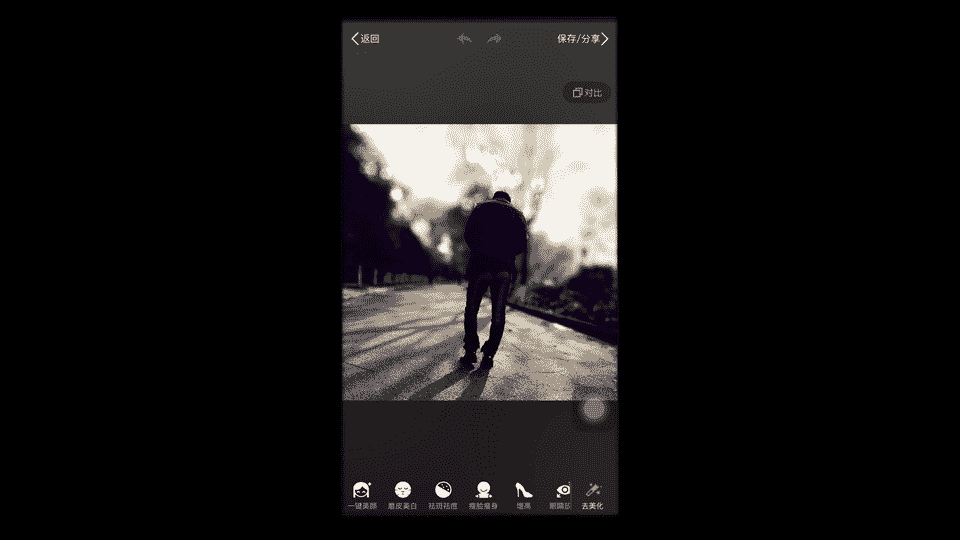

这里有祛斑，我们把祛斑打开，它这里有这种白色的这样一大片，我当时没有打上点了，对吧？然后我们就拿这个祛斑。然后就呃愉快的这么把它给去掉了。就这么愉快的把它去掉。哎，这里弄多了弄多了。点点。好。

还有像你头发这种头发，这有点像是反光感觉啊。

感觉像是缺了一块。对，还是有这毛比较好，有这毛表较好。这样的话，它像是因为他穿的是皮，所以它周围的这种亮点。

它周围的这种亮点啊都看起来比较像是这种皮衣的这种反光皮的反光。

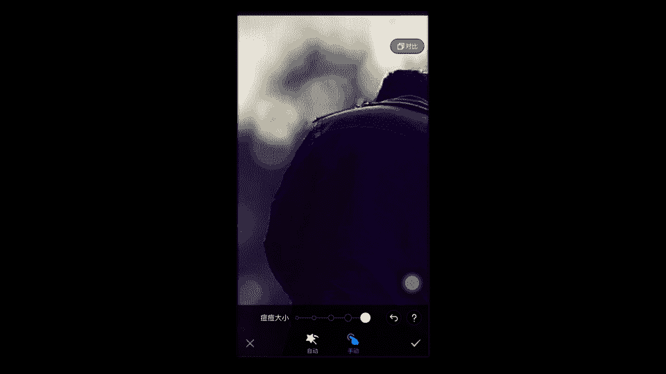

好，然后我们打周，然后最后再储存一下。

嗯。我们把这个打开。啊他这这张照片呢是处理前的。

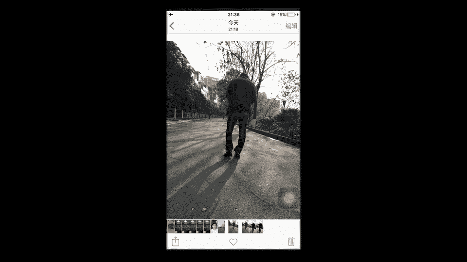

然后经过我们的这个处理，哎，就变成这个样子了。就显得很有逼端，浪流线以直拿这张照片作为他的头像，一直拿它作为头像。好，然后我们再来介绍下一块软件。

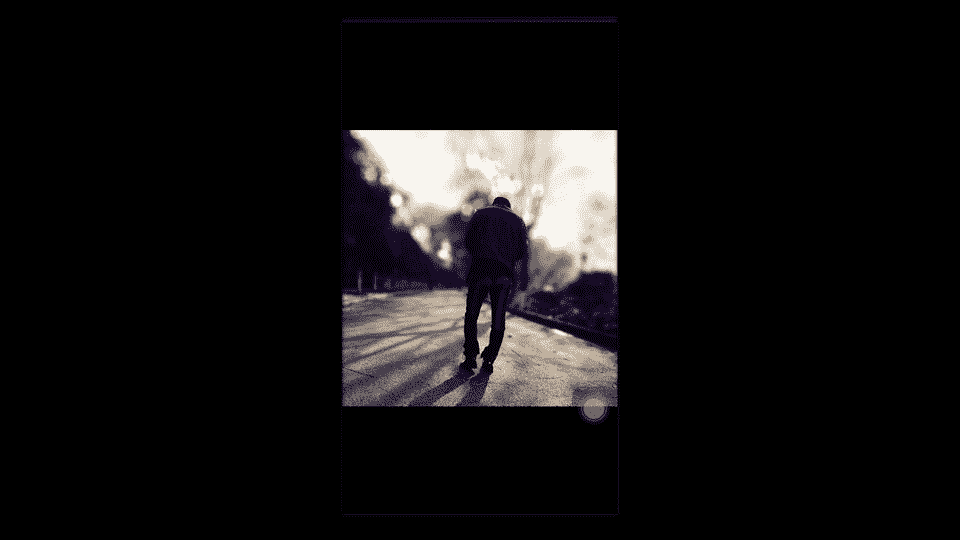

这是face to。首先打开faceto。呃，这是我刚才吃饭时候照的一张照片啊，然后我们点击这个点击呃这个左边的这个东西，小照相机打开照片，点开你的相册。然后我们看到了这张照片。我们拿另外一张照片作为。

一定是它是很好，他这个是又可以修脸，又可以修这种散胶，这里有个。这个很简单，就是你把它整个抹变质的屏幕。哎，你看这卡车，就是左边的这个路牌就看不清了。然后中国石油这全部都抹住。

然后你抹的时候可能会把人抹人也磨模糊，人可能也会被你抹模糊。但是没关系，不要紧，我们先把它给模糊了。我们先把它模糊了。模糊之后就有一个。擦处。让我们现在再把我们需要人的这个位置都擦出来。这个底下要注意。

就是因为你擦的时候可能会擦到这些路路啊、草啊这些东西。如果你一旦。把它擦掉的话，就会显就会变得很。就是它会会清晰出来，清晰出来的话就会很假。就是你的人的周围这块轮廓会是会是很。会者很清晰的这么一块。

所以的话你这是擦底下的话，要很小心的这么去擦。就像是这种边缘，要很小心唉。就有点差多了，等会我们再弄回来。然后你擦到上面的时候就可以无所谓了。因为上面的话都是天空，它不会就算你把它擦出来。

也不会有那么的清晰。然后这个我背上的这个画机它该清晰的地方一定要全部清晰出来。假证背景分割出。Ha。好，哎，整个人物就被我们这么擦出来了。他就把这个帽子连。这里擦清晰。整个人就从背景里面显显现出来了。

整个人从背景里面显现出来了。然后如果你觉得哪里，比如说像这种细节还是不太，还是被你周围给擦清晰的话，你再把图拉大，然后去抹一下，就通过多次这样的调整。比如说像我这个膝大角A。就通过多次调整。

就通过不断的模糊，然后把它擦清晰这样对让整个人凸显出来，然后我们再保存。我把它储存到相册。退出。

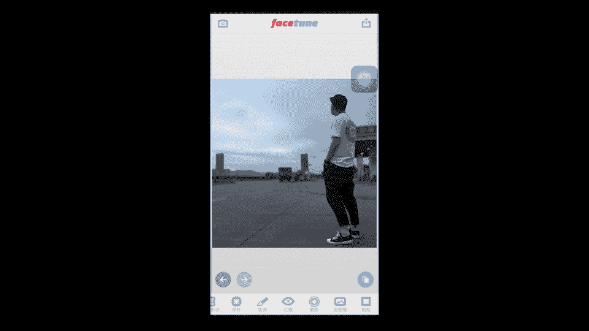

这张图片的话，我是用这个VSO修的。我们首先先打开。

好，这里全都是我修的这个图片，它会有的记录，我们点开这个我们的刚才所。锁变模糊图，然后点下面的这两条小的这样的一个东西。

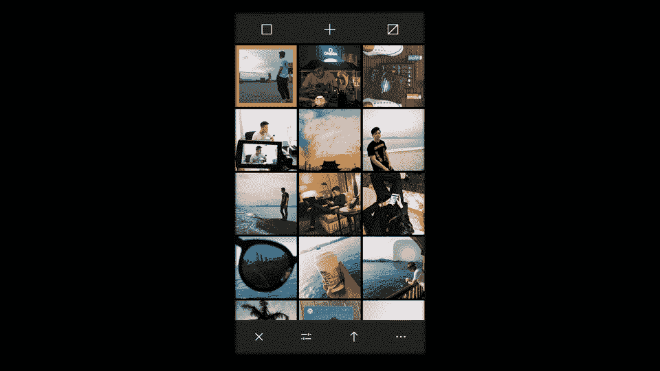

这也就是调滤镜。这里有条滤性。然后我觉得像是这种公路的这样的照片的话，是要蓝一些，就是蓝绿色这样的感觉。就这样的风格就是我比较喜欢的。让我们再点击这个工具。你可以细微的再去调一下。

然后我觉得这张图片呢有点过于的绿了，所以我打算去调一下它的色温。它的色温的话是指的白色的方框啊，是而不是这是它的饱和度啊。这它饱和度，我们把饱和度稍微。呃，降一下。对，降一。然后我们再来调了这个色温。

色温的话是指的吸管。对，色温。我们把色温往蓝这边。点一格把往蓝这边点一格。好，然后再加入一点按角。暗角就是图片四个角的这样的一个东西。

然后最后呢，我们点击。储存点击储存。

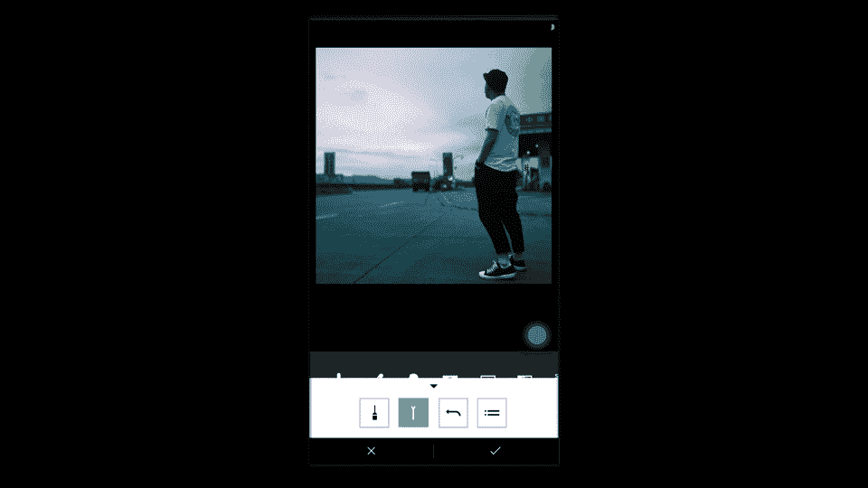

然后按右下角三个点的这个按钮。然后点击点击保存到相册，我们选择最大的尺寸。

然后退出这个软件。

打他打他美图失秀。打他美图失秀。

点击美化照片，再点开，再把这点开。点击编辑。点击比例正方形。因为我觉得我的这个脚露出来不太好，所以我决定把我的脚缩短一下。就差不多到这种一个近景。中景中景到中景的这样一个距离，我觉得是OK的。大家记住。

如果你要截断图片的话，千万不能从关节处。比如说我若要从这儿截断。就很就就会很怪异很怪异，所以一定要从小腿这里这段啊。好，我们从小腿这里斜断。嗯，到这儿点击确定。然后打点成对勾，哎，这样的一张图片。

这种大片的感觉就出来了，我们点击保存。

Yeah。我们退到这个最外面。

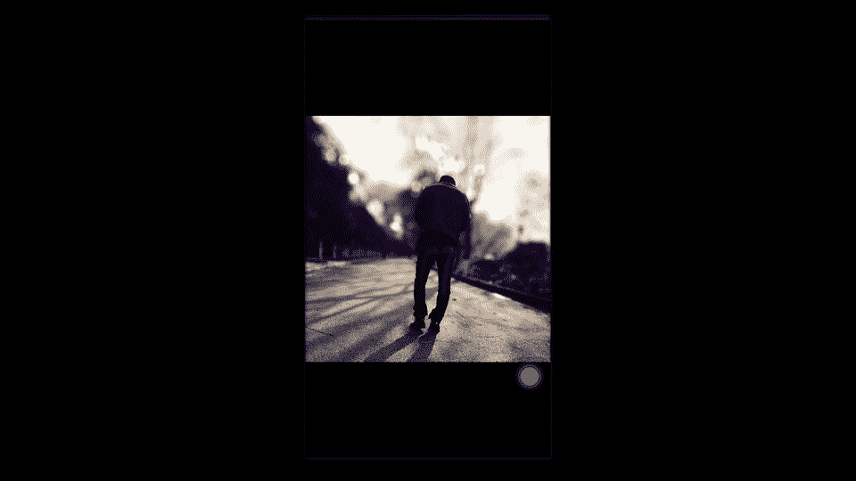

看一下我们刚才的。最早以前是这样的一张图片，很清晰。这车。串246647，这全部能唱到。

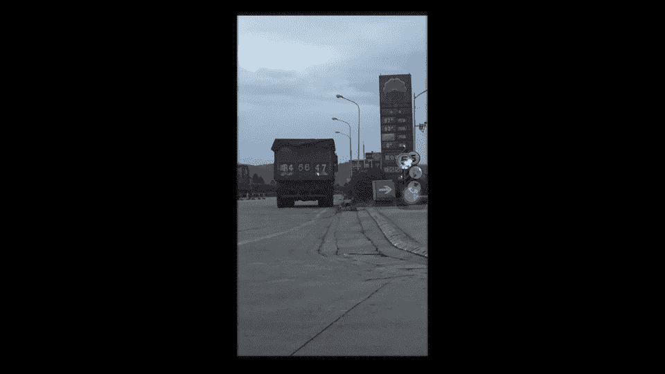

这什么都能看到。

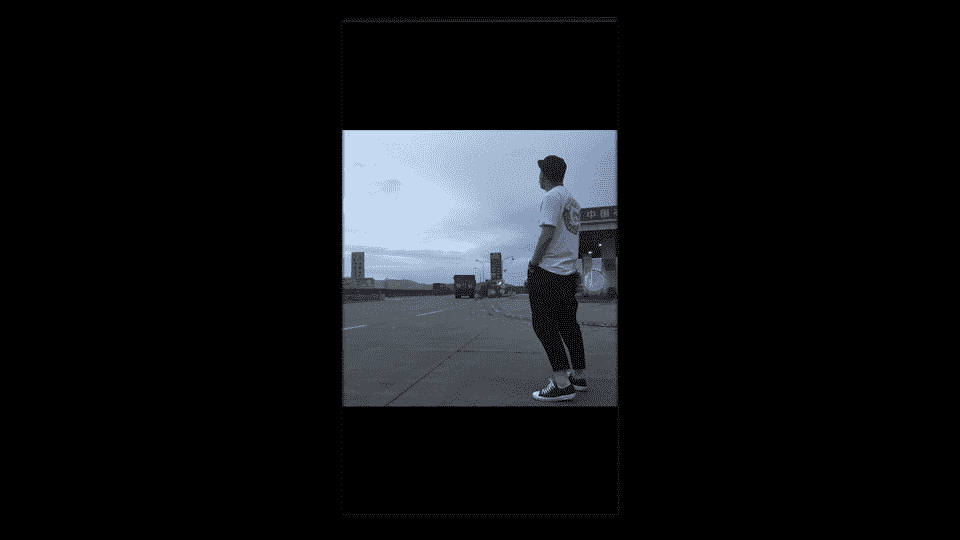

到众后纸张模糊。整个人物从镜头当中脱颖而出。再往后。家里的滤镜。整个变成一种大片的感觉，再到后面构图。然后整着一张图片出来了，整这一张图片出来了。

对，就就是如此的简单。好，那么这两款软件。先到这里。然后接下来的修图呢，我会在后面课程当中融入进去。

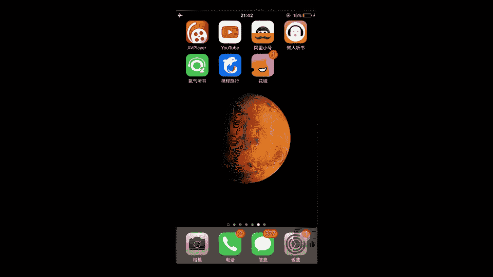

嗯。好，我们刚才演示完这两款软件了以后，接下来因为我们实物和人都说完了，还有一个很重要的一点就是一些比较具体的价值。比如说很多女生她们喜欢发一个朋友圈，就说又逛了一天街。

然后晒很多购物袋出来什么什么cucciLV之类的。呃，因为我没有什么奢侈品嘛，就奢侈品比较少，所以我一般也不会去晒，我更多的去晒一些不花钱的价值。比如说像我的文艺气息呃，什么树叶阳光蓝天咖啡书吉他的等。

然后或是一些风景，就贵重的物品，在我的朋友圈里都不会出现。因为奢侈品是配套的，就比如说你有的手链很贵，你的戒指一定要在差不多的等级差不多的价位，你的钱包，你的皮鞋呃，这个皮带一系列呃。

而我呢是这种枯藤老树昏鸦，小桥流水人家，对吧？很简单，因为这个没有什么钱嘛，就这个是就没有钱怎么拍出一些文艺的。这样的照片拍出自己的风格。好了，我们第一节课讲的明确主题就先讲到这里。

在前期的节课呢都是讲一些这个比较大的方面啊，没有很细节，很具体。但是在我们的后面课程当中呢，就会随之把这些大的点全部都剖析开来，就慢慢的深入。啊，谢谢大家观看我们的第一集。

然后请这个尽情期待我们的第二集的出现。对拜拜。

