# 1、012017年《正冉装逼》课程：正冉装逼第二集

哎，hello大家好，哎，我们今天讲的设这个装逼课堂的这个第二集。今天呢我们先讲如何拍自己的这个头像。就是微信呢是我们的这样一个社交工具，无法做到现实当中的这种面对面的聊天。妹子对你的人品啊判断。

包括这个全部都是来自于头像名字，还有朋友圈的内容，所以在我们的微信上呢，我们个人的这个头像是非常重要的。在微信这个社交平台呢能代表我们个人形象就是我们的这个微信头像。如果用微信来这个聊天交友的话。

那么就是用什么样的头像都可以，只要不违反微信平台头像规则都可以使用。如果我们用个人号来把妹呢就不能随便的选择。必须要选择一个符合我们POA的这样一个头像。

因为在微信这个世界里呢啊妹子微信里的人就是也也是很多，就跟我们POA是一样的，唯一能记住我们。😊，就是唯一能记住我们这种就是个人风格的吧。然后就是我们的是个微信头像。很多时候呢。

我们的妹子因为对我们的头像而产生好转而去看我们的朋友圈，然后去了解到我们。😊，呃，因此呢我们的微信头像一定要认真的选择，在选择好之后就不要轻易的这个改变了。呃，这时候我们朋友圈里面你你不怎么聊天的话。

就90%的妹子都都都不认识我们。然后微信里不聊天的妹子需要去重新认识。就如果你要把这个微信要是把这个微信头像要是换掉的话，因此我们要付出这个更多的这样的时间和经历。

然后将我们的这个微信头像就是重新建立起来。你换一次头像或者名字，我们的妹子就需要对我们再次的这样的一个记忆和重新认识。就当我当就是妹子看到我们头像有消息发给他，就是那底下弹出来的小一。

他心中是这样充满期待的，并且在第一时间能够打开回复阅读。然后这种感觉是非常好的这种感觉。呃，用微信把妹呢头像就是我们品牌的logo，所以就不能这样的随便的变更。

一定要选择一个就适合自己把妹的这样一个头像。微信头像内容会引导妹子联想出这个微信号背后，你是一个什么样的人。很多时候我们对于某个网友是否有好感，并非来自于跟他的聊天，而是因为他的头像或者朋友圈。

有些朋友的头像让别人看了以后就特别的不舒服。然后有些人看到这个他的头像以后会想这个他心里就会想这类人绝对不是什么好人。在我们浏览自己微信的这个通讯录的时候，经常会因为对对方的头像而记住他。

当然也会因为反感的头像而讨厌他。就说白了，在微信这的是社交平台上的头像就代表自己。每个人出门都是要把自己导饬的这个干干净净。微信头像上也是同样这样的道理，要让别人看到，然后并且喜欢到我们。呃。

就是像就是很多人去加妹子的这样一个微信嘛，然后基本上都是就是就是成功的一个微信的头像的话，就很容易去加到妹子。在生活当中呢，品牌有lolo都是经过专业设计的。为什么呢？因为品牌logo是一种记忆。

是顾客对产品机是一种信任。每一次出门的妹子也会精心的打扮一番，这又是为什么呢？😊，所以对于头像的话，我的理解是你要拍出自己的这样一个风格，就头像相当于人的第一印象。因为你给妹子每发一句话。

妹子就会看一次你的头像。如果你头像是这样子的，是这样子的，是这样子的。那我这个估计妹子跟你聊两句得和你拜拜了。估计你自己都看不下去，自己也得和自己说拜拜。好了，那我们废话不多说。

然后让我们开始我们的头像的这个拍摄之旅。好，然后那我们现在让我们进入我们的头像拍摄的这样一个环节。像是我们一般这样的POA用作头像呢，比如说像是这个大姚哎，在这里大姚，然后像是我们的成群哎在这里成群。

然后老童哎也在这里哎，我们的老童对，像是我们的这些POA呢，他们用的这个头像是用自己的生活的这样的一些自拍的照片。然后像是这样的照片呢，随着我们课程的推移，我们越想越深。然后大家这。😊。

兄弟们可能就会慢慢学习到像这样的头像是怎么样利用环境利用角度，然后包括你的这个衣着，然后怎么样去拍摄的那我们今天讲的是比较简单，就是我最喜欢用的这种照片，叫做这种的证件照，就比如像是这个浪德。

他经常用的一只个头像，就他的这个经过严重PS的这样的一张他的老干妈头像，然后而我呢也是经过一些小PS这样的一张头像。A在这里，然后呢，我们今天来讲一下怎么样去拍。就是首先呢你要找到这样的一堵白墙。

到有这样的白墙。如果你找不到这样的白墙的话，找这种就是呃会找这种灰色的这种的墙也是O的，找灰色这样的墙也是O的。然后这种白墙的话，它有一个很庄要的一点，就是你千万不能穿这种白色的衣服。

要不然的话你的整个人的身体跟白墙就会融入到一起。这时候你一定要穿一件就其他颜色的衣服。比如像我在这里就找到了我们这个摄影师的这个这样一个这样的一个黑色的这样的一个衣服。我们可以把它借用起来。

这样穿上的话，你的肩膀轮廓，整个就会增至了白墙，这个脱颖而出。然后我们现在灯光也不是很好，因为我们现在灯光就像是有点像是这种的就是我们照身份证照片这样的灯光就全是面光叭叭巴打过来。

然后我的脸上呢就没有这个太多的阴影，就整个脸是一张很平面很2D的感觉。但是我的脸是3D的，所以我要让这些妹子知道我的脸是3D这样的一个的形状，我不是卡通人物。这时候我们要把这个灯关掉。😊。

哎要把这个灯关掉，然后把灯关掉了以后呢，我们需要一束光，我们需要一束光。这样然后我们的这个。啊，我们是专业灯光式，哎，你可以从这边打过来。😊，对对，从这边打过来，因为我们这边是窗户，然后它打过来的话。

就正好把这边的亮度加深，这样你觉得O吗？然后我们这时候跟我们摄影师沟通一下，就是我我这边是比较亮的，然后整个有了影子在我的后面，对你可以稍微这样一点。有没有太亮，有没有太爆的感觉没有没有。好。

然后呢我们来这儿这样来拍一张。嗯，好，然后我们刚才已经拍出了我们想要的这样的一张照片。然后接下来呢让我们进入这个我们的修图环节。哎，hello。我们现在进入我们的这个修图环节。

这些照片呢是我们刚才是我们刚才拍了很多的这样的一个照片，然后我就选择了最后一张，随便选一张。然后呃拍出来大概是一个这样的一个感觉，就是呃很丑很丑。

然后给大家看一下，在经过我们刚才修理过的一张图片是长什么样子呢？是长这个样子。兄弟们有没有感觉到瞬间爆炸？兄弟们有没有感觉到什么叫做科技的力量？😡，车技的量，兄弟们。

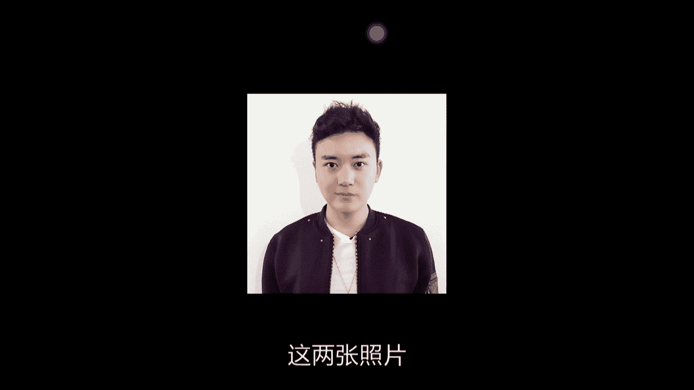

这两张照片我操，如果这张照片放到探探上去，估计他妈的这的没有人会点我。但是如果把这张照片同样的一个放到这个探探上去，估计我要被点分。这是什么？这是这个科技的力量，这个是会不会拍照。

会不会修图的这样一丝丝的这个失之毫厘，差之千里啊。😡。

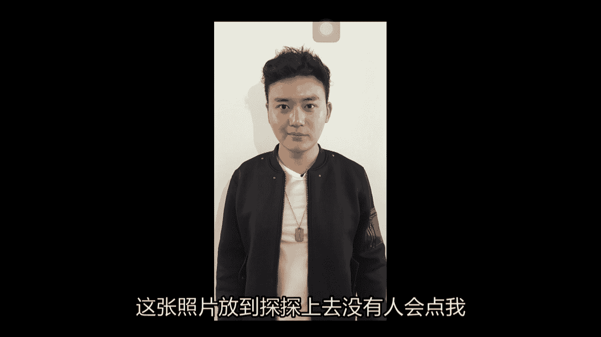

嗯，然后我们这个废话这个不多说。虽然刚才说了很多，然后让我们进入我们的修图环节。

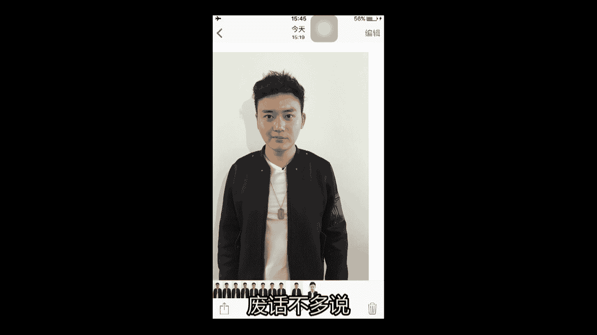

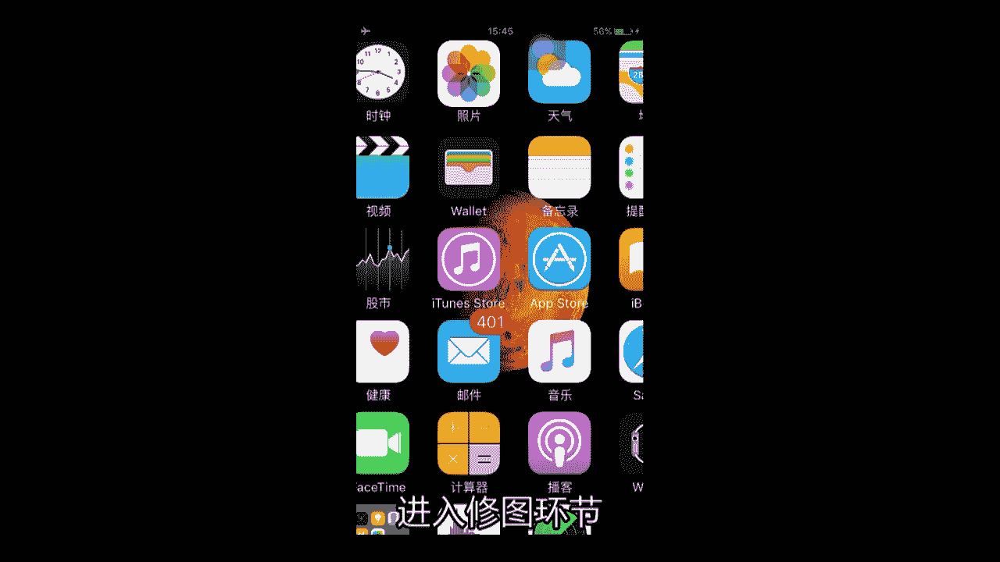

首先在我们的这个手机里面一定要有两款软件，一款是美图秀秀。然后另外一款呢是我们的这个face one，有这两个软件，基本上很多的图片都是OK的都是OK的。然后像其他的修软件，我的后期。

然后也会一一的给大家来介绍。

首先我们点开我们的美图秀秀，嗯，这个是我刚才这个修过的，所以我们就不看它。我们点到这个人像美容。

点了点出来，选择我们张才拍的这张照片。

首先打开这张照片了以后，我会整体的去看一眼我自己。我会整体的去看一眼我自己，我觉得哪里有点不对。首先我发现了我的一个不对地方呢，就是我的头有点不对。是我的发型的原因。为什么呢？

因为我现在的发型有一种平行四边形的感觉。但是我不喜欢我的发型是平行四边形，所以我点开我们的瘦脸，在我们的这个软件的最下面有个瘦脸瘦身。哎，我们点开把范围拉到最大。

这个软件它很好的一点就是你可以随意改造你身体的某呃任何的一个部位，然后去改变它的形状。然后我把它用来改变我的这个发型的形状。在这里我们看到一个大大包。我们首先这个不能让我们的每根头发都。都是个鹤力肌群。

我们要把这根头发推进去。

然后我在这里看到一个坑，然后我要把我的这个撑呢再推出来。え。那唉，我的这边头发呢。再往里面推推。就变成了一个这样的一个圆形。然后在这边呢，我看到一个包凸起来把它压进去，然后把这个凹的地方再弄起弄弄出来。

好，整个发型就没有太大的问题了。就变成这样一个圆形的这样一个发型，这是我比较喜欢的。接下来我们会去看我的脸，我脸有什么问题呢？我的脸它这里也是凸出来的眼A，我把它稍微往里推一下。这边同样道理。突出来了。

我又把它往里推一下。还有在这里，因为我的笑是一种很诡异的笑容，是朝一边在笑，所以它另一边呢就显得比较肥，我把它往上提一下。哎，再提一下。好え。嗯。好，这个是我的这个脸型呃，修改了一下我的脸型。

修改完脸型了以后呢，然后我把它这个放成这个最小的，然我们来看一眼它的整体还有什么问题。我发现我的肩膀特别的窄，因为这件衣服呢是一个M号的这样一个衣服，你的衣服是不是M号。对他的衣服是M号。

然后我是穿这个XXL的，所以这个肩膀就会显得很窄，就衣服会很小，不不是很合身，就导致我的肩膀很窄，头很大。但是呢我们觉得这个头一定不要太大，头是越小越好的。然我们把这个这的肩膀往外拖宽。

头为什么越越小越好呢？因为你头如果越小的话，再加上你的身体比较大，就会显得你这人比较高挑，就有点像是吴亦凡和老外的那种感觉。就很多老外，他为什么穿西装很帅，是因为他是九头身，就他的头很小，但身体很大。

所以就显得就会特别的看上去特别的舒适。但如果是你的这个头很大呢，身体这个很小，就会觉自己人会很窝囊，就很沉重的感觉。所以我们必须要让我们的头变小，但是我们的头不可能把它拉成就推成小的。

所以我们要把我们的身体放大，在这里就是我们的肩膀。我们把我们的肩膀这个尽量放大些。尽量放宽。对。然后记得肩膀的宽度呢，尽量跟你的头部的宽度是差不多是最好的。然后或者是尽量比你的头部的宽度再稍微宽一些。

是一个比较合理的这样的一种视觉上的。这个这个享受。

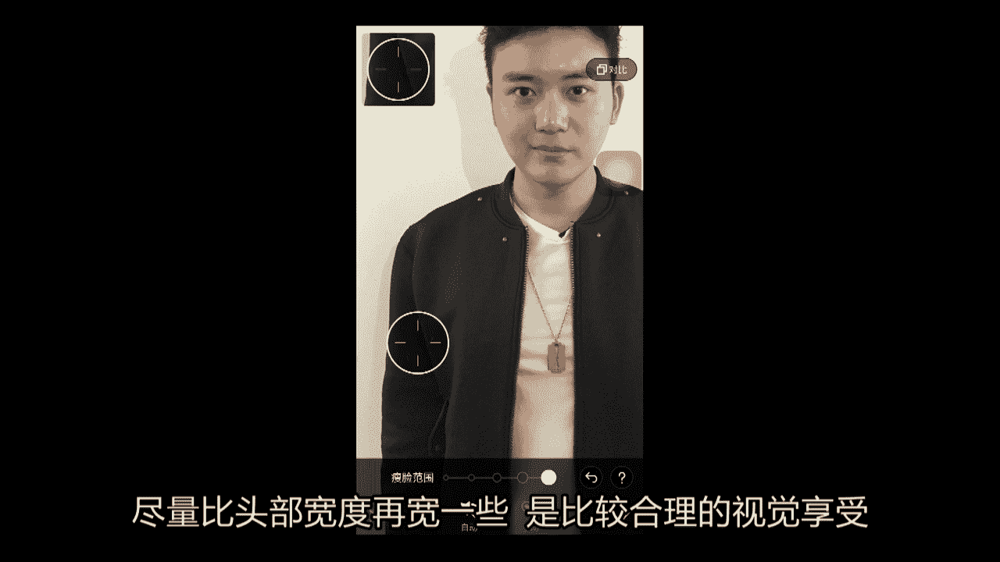

好，我们把我们的肩膀也已经拖宽了，嗯，本来很怂，对吧？哎，下肩膀宽了起来。肩膀穿起来。好，我们看了一眼，没有太大的问题。我们点击右下角的这个对照。啊，不对，这里我还发现了一个问题，我们继续点击收身。

我发现我的这个嘴唇是有点问题的，就是因为我是朝一边在诡异的笑容，所以的话我的嘴唇是有点歪。这时我把我的嘴唇呢要摆成这样的一个。很正的感觉。对，哎，他原本嘴唇这样了，现在嘴唇变这了。这样的话。

我的嘴唇就是在这个中间。哎。对。嗯。好，那我们点这个对勾。

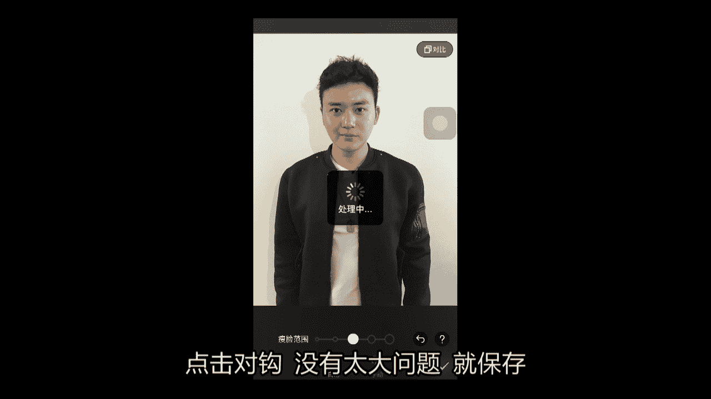

然后没有什么太大问题，我们就保存。

接下来我们点开我们的。Face tune。

我们的face to这张照片也是我刚才经过修理的，我们不看这张照片，我们点击我们张张保存的。这张照片是我们刚才保存的这张照片我发现一个问题，就是我的脸上呢有很多的高光地方，这是我脸上的这个油光。

就确会显得很邋遢，然后我们要把它处理掉，还有脸上有很多的这种的这样的这样的痘痘啊，就是什么皮肤这种东西。然后但是我们的头像因为是把你的脸放大，所以不能让这些东西都出来。所以我们点击左下角有的平滑。

更加平滑。然后把它抹抹匀，就千万不要抹到头发，就一定点要使你的脸，眉毛也要避开。然后这个的痣你可以涂一下，我一般是不会去涂眼睛，因为我觉得眼睛呢这个周围还像它这个颜色会比较暗，会好一点。

这样会显得很深邃。比如说像是黑色这种暗的地方，我都会不去动它。我准。动一下这样的H的发令纹要涂一下，因为发令纹会显得脸很老。像这种地方我都会涂。然后避开这个眼睛和鼻子这个地方。好。え。比如说。

鼻子里也涂上。然后这个时候千万不要放望记的脖子。就是你身体每一个露出来的部分都要去处理一下。好。哎，上上面有没有探出来的感觉？一下这个人呢。就变得比较帅。嗯，让我们看一下我们刚才是长什么样子的。

现在是长这个样子，刚才是长这个样子，差距很大。嗯，当你。呃，弄完这个地方呢，然后就点击右上角的角对勾，点击这个细节。就是我们这个倒三角这样一个符号，然后去把眉毛涂一下。眉毛涂一下涂完眉毛。

整个哎感觉脸上这的精气神儿就出来了。这时候我们再把我们的这个眼睛的这个眼尾这儿轻轻的涂一下，千万不要涂太重啊。我们把我们的这个上眼皮就有点像女生画眼影的感觉，我们稍微涂一下下。好。

这左边呢我们已显脱生了，我们拿这个相片擦擦一下，然后我们轻轻的往上再点一点。对吧。哎。是不是整个人的眼神就变得犀利？眼睛就凸醒了出来。然后我们再把我们的这个下巴和脖子这个交界处，我们才拿出的涂一下。

它会把你的这个下巴和脖子的区别，把你的整个脸会凸显出来。对，是一种这样的感觉，就非常的棒。然我们再点击右上角的小按钮，这时候退到我们的外面，再退到我们的美图秀秀。

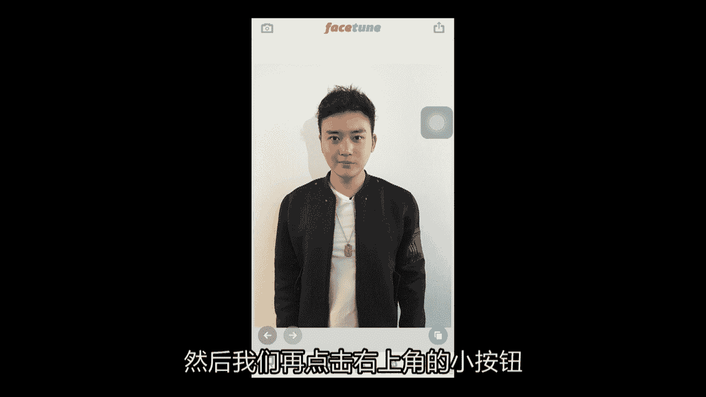

那么打开我们刚才从face。吞里面。

有一张照片，这张照片我有保存吗？

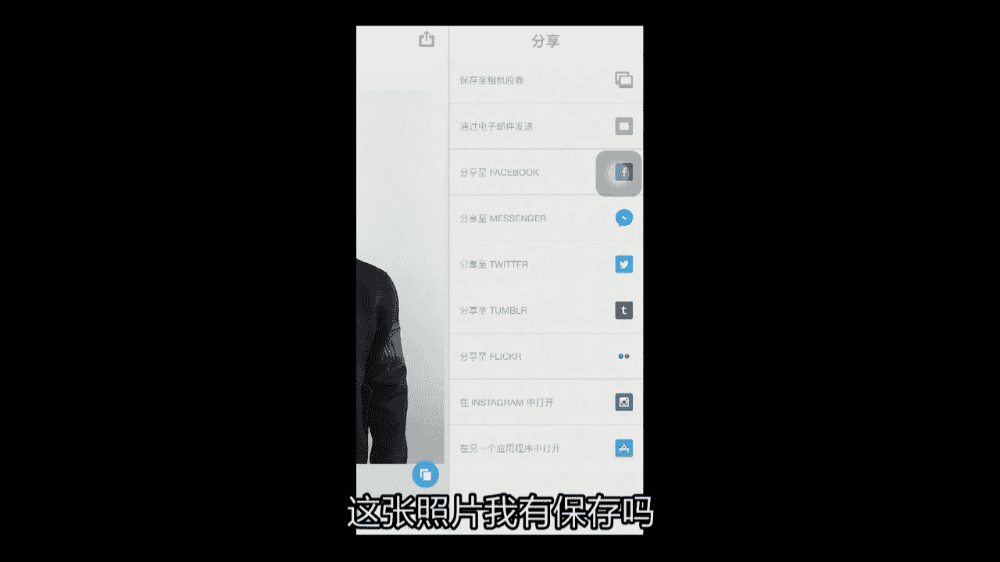

好，我保存啊。哎，怎么打开支付宝了？

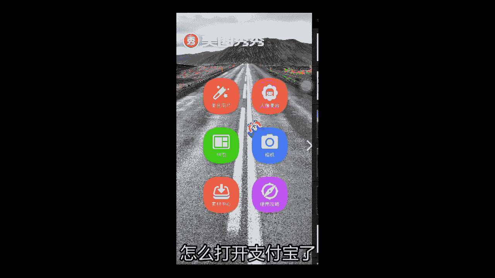

好，我们找到它哎找到这样再这这再找到我们刚才从face one里面这张照片，点击磨皮和美白。我们把磨皮呢尽量放小一点，因为你擦的越大。

你的脸上的细节就会变得越小。我们刚才打了光，所以我们把这头放到最小。

放最小。这样的话，你的脸上的这个阴影的细节依然是保留的。然后我们点击肤色，然后把它往这个稍微白色这边拖一点。美白呢我们稍微往下降一点。嗯。好，我们点击这个小对勾。让我们整个图片就会变得比较白。嗯。

就变得比较白。这时候我们再继续。

点击保存等我保存以后，直接进入米画相片。

进取了以后，我们点击特效。选择Lmo选择HDRHDR是把整个的细节全部都加深，就是凸显细节这么一个选项。我们可以把它往上调一下，整个A。看我们整个的这个颜色就会变深，就是照片的质感就会显示出来。

照片的质转，然后我们再点击特效，选择lowmon，这边有个壁波，那我们点击碧波。就如果你是往下的话，它人会很黄，整个画面也很黄。然后你往上它是有点蔚蓝色，就会显得比较白。就显得人会比较白皙。对。

然后我们差不多选择这个位置，然后点击对焦。对对对，然后我们选择左边的边辑。比例正方形，我们把它打造成这样一根正方形的照片，我们把它缩小。如果你直接就这样子剪裁的话。

两边的肩膀的位置会显得很空白就不是很好。因为你是要凸显你的脸嘛。所以的话这个时候你要把呃这个这个九宫折的这个构图的这个框放小。在它的最上面的第一根横线位置，在眼睛这里也是差不多的。然后在第二根横线呢。

在你的肩膀的这个地方。对，在你的差不多肩膀的这个位置，然后是最好的。然后在你的头顶稍微留点这样的小小空白。这个时候是构图是比较合理的这样一张构图。好，差不多就这儿，让我们点击。剪裁。点击对到哎。

这样呢我们的一张。

呃，点击这个保存啊。这我们的一张这个头像呢。

就完成了，我们头像就完成了。

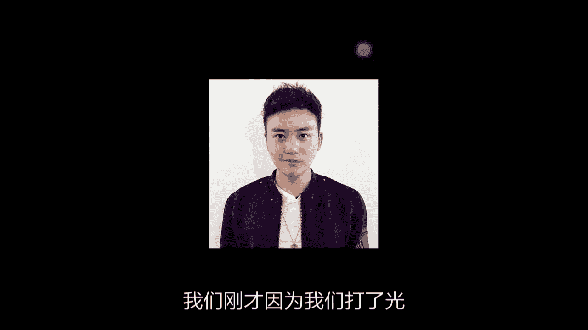

我们刚才因为我们打了光，所以我脸上的这种的阴影就全部凸显了出来。我的右脸这边。我的右脸，然后是这个主光源是比较白的，然后左边呢是外面的这样一个辅光源。然后在我的鼻子这里，然后我的阴影。

还有像是我的这个眼窝。还有我的这个嘴唇鼻子，然后还有我的脸的弧度，然后这边有一块阴影，然后这边会有的主动色很亮，就都把我的脸脸型然后全部都凸显了出来，把我的脸型全部凸显了出来。

在我的车背后也有这个影子。在我的背后也有这个影子。啊这样的一张照片呢就是就是非常好的这么一张非常好的这么一张就是头像使用的照片，这也是我推荐给大家的。因为大家在没有那么好的环境。

没有那么好的一些就是穿衣或者是一些好的拍照的一些想法之前，放上这样的一张很清晰的这样一个面孔干净整洁。然后妹子也会对你的印象会非常的深刻。😊。

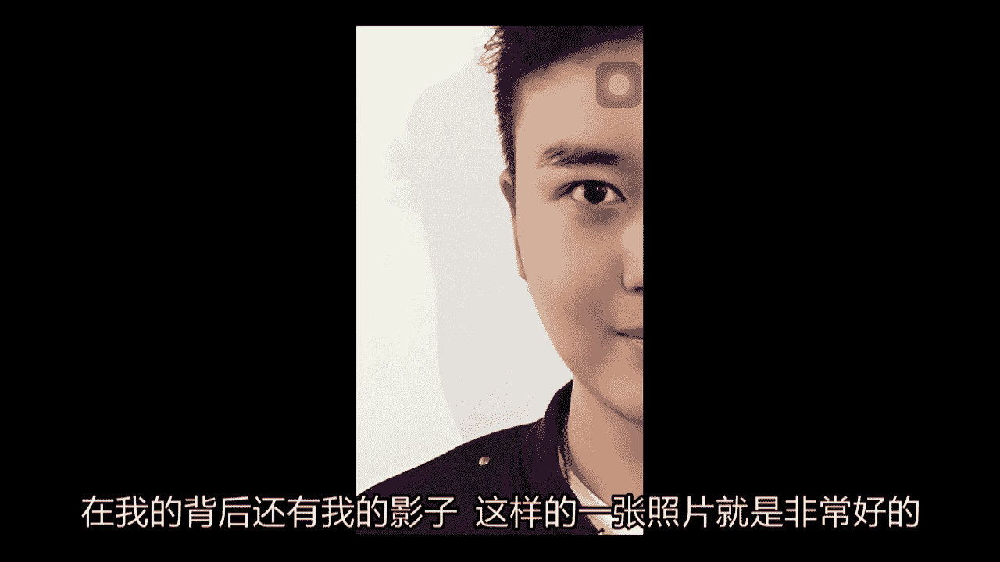

就会比较有好感，而且像是这样使用证件照这样的方式。

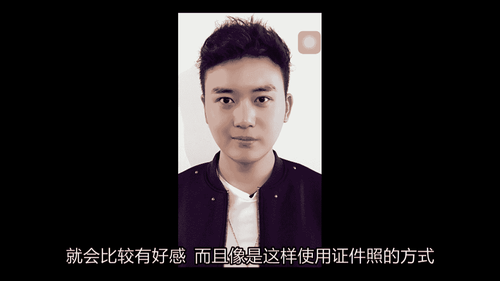

作为自己的头像的男生，毕竟还是少数。这样的话，在妹子的他的这个脑海当中呢也会留下一个非常留下一个非常深的这么一个印象。

好呃，那我们这个今天我的这个头像就先到这里，然后再多废话一下，就是我看到很多兄弟，他加了我的微信里以后，他也去模仿我的这个头像。他们主要有很大的这么几个问题是什么呢？就第一个问题，像素极其不清晰。

兄弟们，就如果你要去拍像是这样的一张这样一张头像的话，你的手机的像素至少要在这个800万以上，800万或800万以上。我的现在用的是iphone6。然后摄像头是800万，摄像头是800万。

然后如果你要是拿一个就是很像素很差的手机呢，就千万不要再去拍这样，要不然拍出来就会显得很low逼。就你的整个人就很模糊，是一种像素很差的感觉。

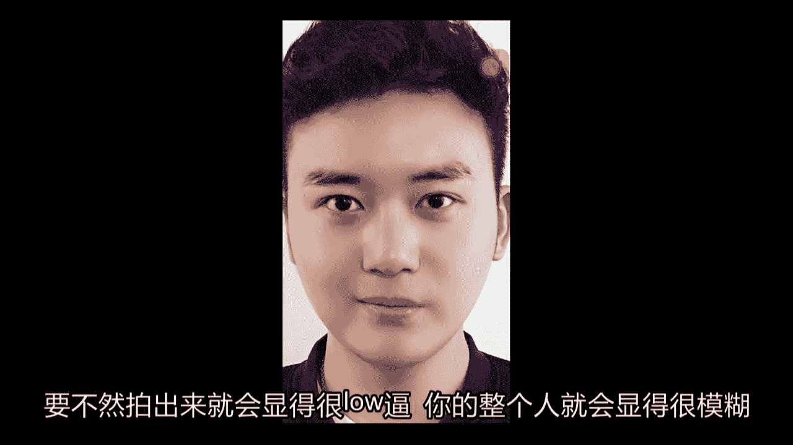

然后还有一点就是如果你是安卓用户的话，你一定要使用这个这个就是你把你的这个手机呃这个照片修好了以后，你传给你使用苹果手机端的这样的呃朋呃朋友或者是同事。

然后在上面在他们的这个苹果手机上去设置你的这个微信头像。因为安卓他跟苹果有的区别，就是安卓它的微信呢，就是你的手机可能像素很高，什么都是啊什么202200万这个像素就很高。

但是呢但是它的有的弊端就是安卓，它的微信客户端，它上传的图片本身就是一种很不清晰的感觉。所以你尽量使用的这个苹果手机的呃这个同事，然后把你的头像发给他们，让他们去帮你上传，发朋友圈也是一样的。

发朋友圈也是一样的。然后还有一个还还有一只的第二点，第二点是就第一点是像素嘛。我们第二点就是我们的拍照时候的这个表情，就很多兄弟他在拍照的时候，他的表情是很呆滞，就很呆呆的，就像我这的是呃稍微有点笑容。

然后眼神也是比较温柔的这样的一种，就是温柔加稍微有点犀利吧。呃，这样的感觉就是妹子看到你你的头像打开了以后，觉得你这个人，就是目光和和你的嘴角都传达出一种比较自信，比较简练的这样的感觉。

但是如果你是很傻逼的，就对着镜头。

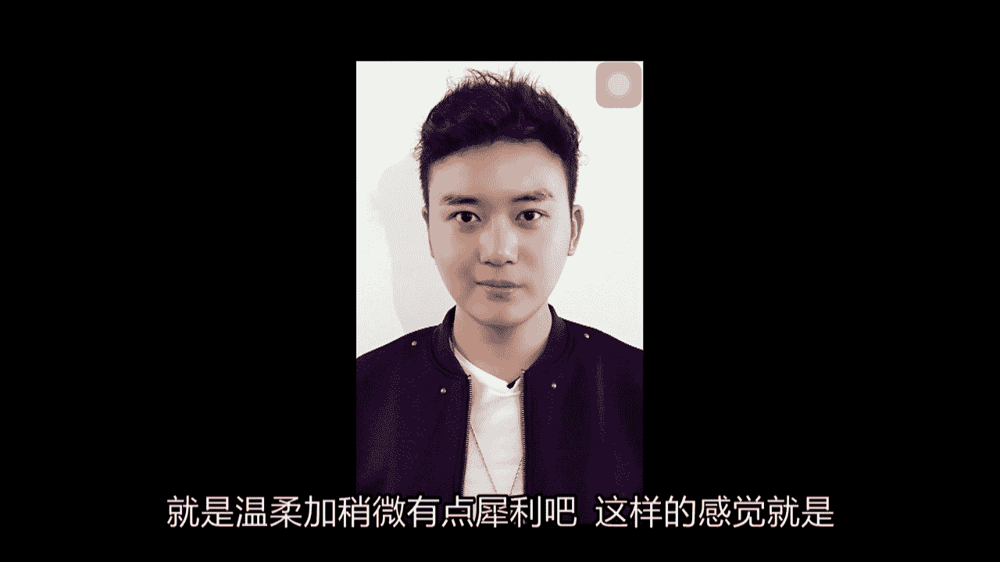

这么拍一张的话，就别人觉得你这人怎么这么刻板，这头像就真的真的变成身份证的照片了。这是第二点就是你的表情。😊，然后第三点就是你的这个图片的这个呃这个修理，就是很多人他的这个这个头像可能就是拿美图秀秀呃。

然后这样随便就照一张就放上去了，也不是很注重它的背景也不是很注意，背景都是那种泛黄那种的那那种一个背景，就也很low逼，就是就是不干净不整洁。

然后他的这个服装，然后也不是很好，就是很多兄弟他的这个服装也不是很好，然后比如说你可以挂一着这样一个配饰，对吧？然后穿的这样的一个衣服，这还有点小拉链，有这种金属的感觉，我觉得也是挺棒的一种感觉。

这一共就这么三个问题。第一个像素，对吧？第二个自己的表情。第三个你的服装啊环境啊，还有修图的这些东西。然后这只要你把这三个方面注意好了，这样一个好的照片呢，我觉得是不难的，是不难的。

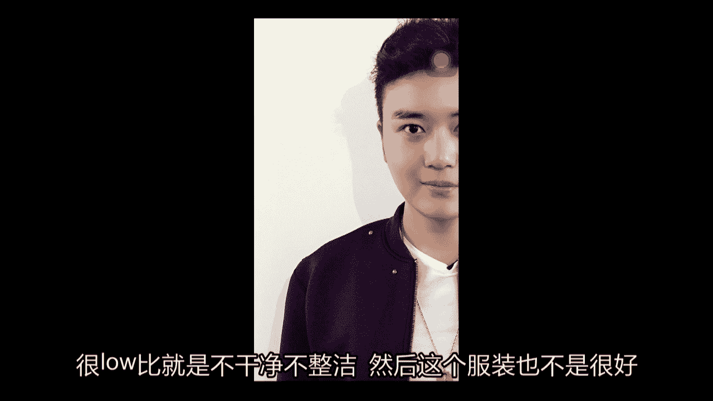

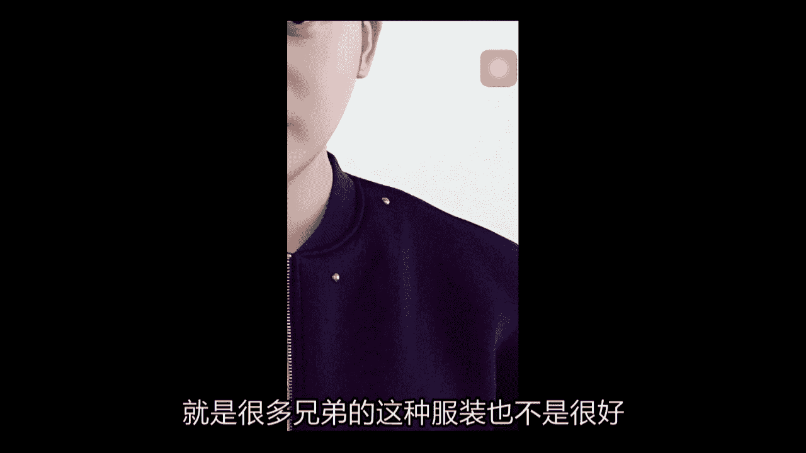

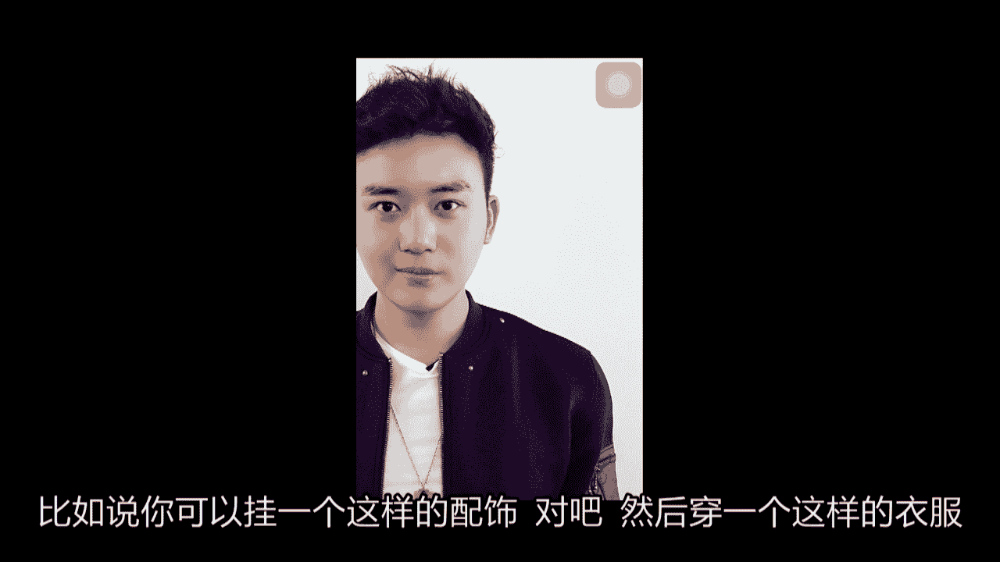

嗯，那我们先到这里。

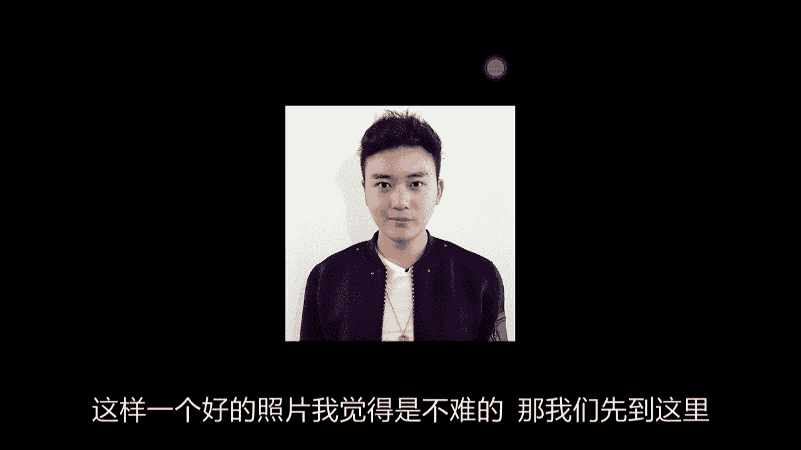

好，那我们刚才已经看完了我们的这个头像的拍摄。呃，想必你已经有一个头像的这样一个大概的认识了。然后那我们这个这一期的话我们是有作业题，就是如果你要在这个微信群里面。

然后问一些就是各种各样的什么拍照拍照问题的话，首先我不会去看你的问题，首先我会去看你的这个微信的头像。如果你的头像是令我满意的，是你进行拍摄，果是你进行设计过的头像，那我觉得我们可以进行下一步。

如果你就是在我们的微信群里面问一些问题，结果你的头像，还是一些像是花花草草或是我认为不及得的。然后我会提出来，就是呃让你去重新把这个头像去拍摄完成。直到你把头像拍好了以后。

然后再再让我们进入这个下一环节。嗯，好了，们这个这一期的这个头像的拍摄呢，我们已经讲完了，然后请期待我们的这个下一课有什么问题的话，都在微信群里面去艾特我，然后我尽量会在第一时间看到并且解答的。😊。

兄弟们，拜拜。

