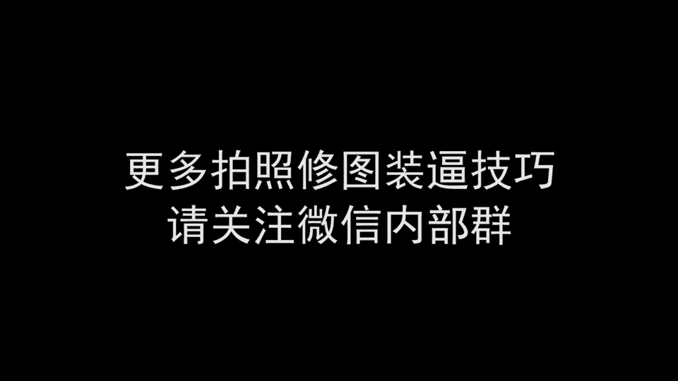
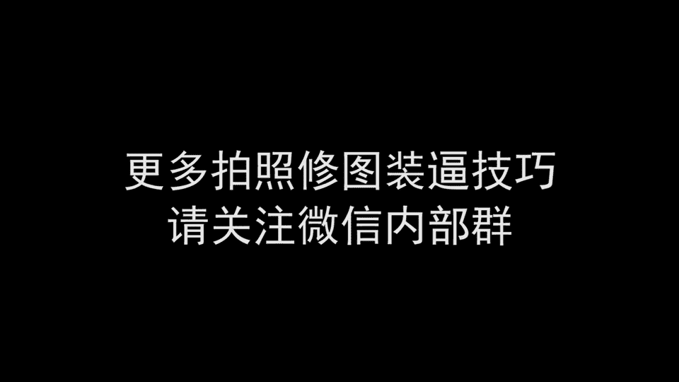

# 1、012017年《正冉装逼》课程：田正冉教你如何涨《装逼》（序）

大家好，我是郑冉。欢迎收看我们最牛逼的装逼课程。如今的社会呢，我们通过互联网这样的渠道去结识乐视这样的妹子。但是互联网本身就成就了个人的影响力最高的就是这个网红。

从最早的凤姐到现在的y这样网红们呢都有的非常牛逼的技能，就是拍得了照片，修得了图片，写得了段子，装的起高冷。个呃个个都是这个把魅撩汉这的大神啊，逼格也是满满的，这是因为这个原因。

我们诞生了我们的装逼课程。说到装逼，我们首先要提到的一个词就是逼格逼哥是什么呢？更专业的解读为就是装逼的档次，但是话说回来档次这的东西，他本身就很装逼。因为人这种生物很喜欢划分等级的事情。

因为有了等级的划分就产生了抬高自己和贬低别人的可能性。装逼者首先要做的事情就是将自己与。😊，与大众划分为不同的等级，并且把自己的等级抬高，以凸显自己的这个优越感，满足自己的虚荣心。

逼格指的就是不同的等级。逼格越高，说明你处在的这个装逼食物链的这个层次呢就越高。呃，能够凭借与这个低等级的人对比，然后而获得一种非常好的这种优越感。啊，好说这么多，有的没的总之，总结成一句话。

就是装逼指的高逼格是不会有错的。我们具体到我们把妹上面所有用到的逼格，首先是外在的这个照片的逼格，包括个人的形象，男生最主要的就是发型胡子，还有你的肢体语言穿衣风格，包括你的饰品。

还有你背后的这样的身处的环境。第二呢是内在的装逼的这个逼格。比如说你的谈吐，你的气质，你的思考问题的这种方式。😊，我们的课程呢将会细分以上所有的点，从个人的形象，穿衣肢体语言。

到包括我们拍照的这个角度选光，然后取景啊，包括像低成本高逼格的拍照的一些地点的介绍。然后该怎么样去拍。然后一直到我们的后期的这样的一个修图，还有朋友圈的配文，呃，还有这个内在的这个装逼。

然后这个谈吐气质，还有思讨问题的这个方式。我们在我们的课程里面呢全部都会涵盖的到。好了，请做好准备，让我们开始我们的装逼之旅。

