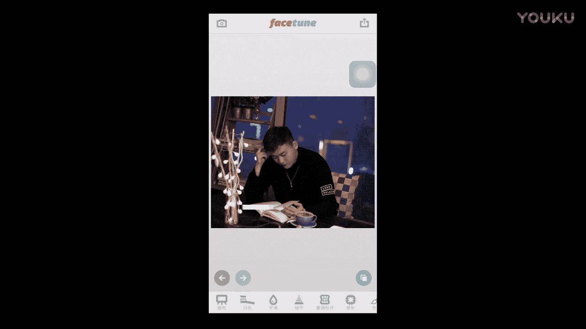

# 1、012017年《正冉装逼》课程：第九集_高空咖啡馆

🎼哎，好，知的大家好，现在呢我们来到了这个朗域上面的这个咖啡馆。然后那么我们在这个上面呢，本来我是想着过来拍一组夜景，但是结果上来以后发现这边的玻璃非常的反光。那么其实这个夜景呢也是不太好拍的。

但是没有关系。然后我们来讲一下这个如何去这个这个文艺装逼啊，文艺装逼。那么现在呢在这个咖啡馆，然后这里有两种色调，还是跟我在第二停车停车库里面讲的色调是一样的。我们第一我们有这个暖光的这个色调。

然后在这里作为陪衬。哎，那么后面呢我们整个是这个因为成都现在天黑了，外面很蓝。哎，那么我们又是这种冷冷暖光的这样的一个关系。那么现在呢我刚才从这个书架上面拿了一本书，然后点了一杯咖啡放这里。

然后以及我们的这个摄影师，然后所以的话这个时候你还是要要把你的聊机带馆，他们给你拍到一组不错的照片。然后我们就根据这三个观关系，还有我这个主体。🎼做的一个动作以及后面的这个环境的衬托。

然后会产生一种意境。好okK。🎼那我们来这个来我们这摄影师，我们还是照旧我们用这个手机先来拍照。🎼你你天。🎼好，然后呃那么像是我们在这种文艺的咖啡店里面装逼呢，就是也是我们所说的，就是你一定要自然。

就比如说你要利用你身边的这些物品，然后让自己融入进去。比如说我这里放的有一有有这个书架。那我们的手上是可以拿一本书，然后坐在这里去翻书的啊，这个其实也不会特别的装逼，那么特别的装逼，是是那种就拿一个书。

这样捧着这样看，就得很装逼。那么你特你特意其实在拍照的时候，你就拿一本书或者是端一杯咖啡在这里。🎼Mu。🎼就是你真正的去看这本书，然后真正的去冰和咖啡去看，然后不要不只是不要只是为了一个造型。

然后在那里假装去看。然后你的其实你的这个肢体呢一定还是要放轻松，所以你千万不能坐这一本正经的。🎼这样摆姿势就特别的傻，你一定还是要轻松。比如说这样。🎼对吧然后这用这样的姿势。

然后能够跟你增治的环境能够呃更好的能够匹配的上，能够融入进去。那么这个是我们讲的，就如何在这个咖啡店里面去装逼。🎼好，OK那希望这期节目呢，这个兄弟们呢也是能够炸到这些点。

因为我觉得像是种晚上的这种咖啡店啊，我觉得在你的城市里面一定有很多家嗯。🎼诶好嗯。🎼呃，那我们在拍完这个手机的照片里后呢，然后我会发现其实手机的这个光看起来不是特别的好。因为光有些这种的呃就怎么说呢？

就是偏偏红色这种感觉。哎，那么我们到了这个后期修图的这个环节。🎼好，我们刚才在这个咖啡馆里面呢拍了这么几张照片，拍几张这么这么的这样子的一个照片啊。然后那么我们现在然后来试着去修一下。

这是这是我们刚拿手机拍的，拿手机拍的就感觉很红这个颜色，因为它整个灯光都很红。🎼然后那么后面这几张呢是拿单反去拍的照片，然后它的颜色呢看起来相对就舒服一点。这还是我们刚才讲的。因为你在这个单反的时候。

你前期就可以把这些参数都设置好，就导致后面没有太大的这个后期的空间呢会比较这呃会比较大，比较容易去操作。🎼好，现在我们继续老规矩，先来讲知了先来讲知了那什么，先来讲制了手机拍摄。🎼呃，一旦有人像呢。

只要有人像出现，我一般想都不想，就直接face to打开。🎼这里已经成为我身体的一部分的条件反射。好，那我们打开这样一张照片。🎼呃。🎼打开了以后呢，我会看一下我脸上有没有什么需要去动的。比如说像这里。

🎼法令文laure。🎼这得我不要发令文。🎼但是可能很多人就有些人他也比较想要这个法令纹，因为因为显示他说话会比较有分量。🎼还能在开的玩笑啊。🎼还有这时候呢我们发现我发现我的脸有点大。

这时候呢我又试着的推。🎼推推推。🎼好，又推一波推了一波了以后，这时候眉眼之间稍微画一下。🎼Okay。🎼还有身上这种亮亮闪闪的地方啊，都要推一下。🎼好，OK那么我们这张照片呢就算是这个P完了。🎼接着。

🎼的 VSCOO。🎼我们可以把它保存进去。🎼那么在保存进去了以后呢，你这时候可以试下滤镜。我的天哪，这简直红的都不成样子了。🎼因为我们前期拍摄手机的手机呢，它的这个因为手机它没办法设置的色温。

所以导致我们这个整个都饱和度啊，这个乱七八糟都很红，它饱和度也不是特别高，只主要是置个色温没调好。🎼这时候不要怕，我们可以把它拉回来。这时候点击我们底下这两个小横杠。那么我们首先把清晰度再给它增加一下。

显得照片呢质感会比较好一些，锐化再开两折OK然后那么我们把这个色温可以往蓝色哎调一下，往蓝色，我们可以调到最高。🎼色调我们也可以稍微去调一下。往左边去调的-3。🎼OK然后这样呢就差不多。

最后我们把饱和度。给它降下去。让它看起来像是一张正常颜色的照片。🎼对，比如说像这种，然后看起来像是正常的正常颜色的一张照片，这样呢我就觉得还是OK的，稍微再稍微高一点啊好OK。

🎼那么最后有的对比度稍微对比度呢稍呃对比度我们就不拆了。而且这样的一张照片，它看起来就是一种。🎼平和的一张。🎼哎，呃好，这样OK啊，很平和的一张照片。我们可以把它保存下来。🎼保存下来以后。

我们再把这张照片加入进去。🎼然后我们给它叠几个滤镜，哎，你可以看到这几个滤镜呢其实还是不错的。🎼感觉呢还是到卫的。🎼比如说我比较喜欢这样的。🎼这样那种感觉。🎼对吧就是个feel。🎼或是这一张。

🎼你可以稍微调，你不需要把它拉最高，你就需要稍微给它加点颜色，然后我们每周都来试一下，因为没有哪张照片它是固定的，必须要这么去修。🎼好像是这样的一种感觉啊。🎼我觉得是挺好的。🎼那我们退把它保存下来。

🎼好，我们在这里来看一下我们与我们这两张的一个对比。🎼啊，原本是这样的一张照片，后来呢变成这样子。哎，还有原本是这样的。🎼然后哎原本是这样的，脸有点肥，那么后面呢变得脸有点瘦。

那么再到后来我们这样我们把颜色调的稍微正常了一点点，那么再给它加了一层滤镜。🎼这样的一张文艺的这样的感觉就出来了，旁边还放了一个单反。🎼好，那么我们又到了这个单反拍照的这个环节。

那么为什么说单反比这个手机效果要好呢？这个还是我们之前讲的，它有这个景深，然后有这个画面的层次关系。那么另外呢就是单反我可以手动去调我这个色温的感觉。所以我们在前期拍照的时候就已经把这个东西又能解决掉。

那么我们后期处理起来就会变得异常简单。好，那现在呢我们用用这个单反，然后再来拍这张照片。O吗？🎼好，那么我们再讲一下如何用单反去修啊，不是如何去修这个单反这张照片呃，道理一样，只要看到人像。

这个丝毫不要犹豫。🎼赶快调线神经反射，去打开这个VSO。🎼呃，我看一下单反里面呢，我比较喜欢哪一张呢？我好像没有特殊的一些。🎼特殊的爱好。🎼那么我们就选一张这中规中矩，比如说摸额头。🎼就边看书。

边拿手指自己的太阳穴。🎼好，我们还是老规矩，把这些乱七八糟的东西全部都磨掉。🎼我标要这个法令纹。🎼但是可能很多人都比较喜欢这法令纹，为什么呢？因为让他感觉说起话来比较有分量。🎼还有开个玩笑。

因为人在修土的时候是最安静的时候。🎼就人有两个时候是最安静的，一个是他特别饿的时候，呃，就无精打采的。另外一个时候呢，就是他在修图的时候。🎼好，我们老规矩，我们把脸往前推一推。🎼好有细节。

我们把细节把眉毛稍微弄一下，还有我们的项链，还有我们桌膊上的这个英文，对吧？我们把所有亮闪闪的东西全部都涂一下，还后这样就O了。那我们就保存到相册里。这首VSU打开。

🎼我来选一张。🎼这时候呢你也是同样，你可以先去选择一下滤镜，看一下哪个滤镜会比较好用。呃，因为滤镜是比较方便的嘛。🎼我大概看一下呢，我觉得像是。🎼这款滤镜是我比较喜欢的。🎼我只需要差一点点。🎼好。

我觉得这样子就是OK了，不需要修太多。因为单反的在前期就已经搞定了很多，我们可以把它保存下来。我们可以看一下效果放在手机里面。🎼呃，看效果的时候，你可以对比一下你之前的感觉，像我之前是这样的一个颜色。

颜色是这样的色调。其实我感觉原图呢就已经很不错了。那我稍微再加上一点朦胧的感觉，那么像是一种文艺小清新的感觉，就整体就出来了。🎼好，O。

