# 1、012017年《正冉装逼》课程：第八集地铁无间道照

好，那么我们现在呢又来到了这个地铁站。那么很多人呢他可能很多兄弟他可能都是上地铁去这个上班下班这样子的。哎，那么我们这时候还是需要我们的这个聊居存在，然后可以来拍一下这种地铁的这种感觉。

就是那种城市的那种很就是感觉很阴冷，然后很孤独的这种感觉，但是也会很帅，就是感觉是一组很走神的照片拍出来就很漂亮的。哎，那么这时候呢我们还是需要让我们的聊居上场。来然后这个时候呢这个构图。

最好从侧面的话去不要构他的全身，那么最好的话是拍这种半身照。拍有这种半身，然后把这个整个的这个纵深这个走廊要拍出来。然后呃你去摆造型的时候呢，你还你也可以继续这样是这种很放松的感觉。比如说这样子去摆。

或者是或是头往右边头往右边去探。好好，那我们我们刚才用手机尝试过，然后拍这照片。然后刚才我们也修过。那我们先来现在来看一下这个单反的效果，然后是如何。

然后怎么样去单反去单反的它的好处呢就是说它是可以去有一个呃有一个景身存在，就是我们刚才之前也是说过的。然后现在我们用的还是50的这个头，用的50这的头。那么在那么在这个时候呢，颈别也是这样子。

就尽量不要在侧面去照全身。嗯。这时候你可以眼睛朝前面去这样看的，然后头稍微这样稍微低一点，然后两手你可以抱在胸前。行。哎，好O。呃，我们刚才是拍了几张像是这种近景的这种的照片。

那我们还喜欢就是我个人还喜欢在地铁的时候去拍的全身，但全身的时候我拍的都是背影。呃，那么这时候还是需要我们的聊机来。呃，到时候拍的时候，然后就是用这种的就是用横屏，然后去把这个列车的纵深感拍出来。

然后你人呢可以站在这儿很孤独。很整啊噻。I。好，O拜拜。我们来看一下这个照片。好，哎，这个就是我们的这个在地铁的时候拍照的这种感觉。那我觉得这个最后一张，我觉得最后一张是不错的。好，到时我们来修一波。

好，那我们现在来讲一下这个单反，然后该如何去拍。那么这个单反呢去拍这个去拍这个照片呢，然后它的跟手机的效果差别不是特别的大，因为单反主要是能够营造出一种纵深感。哎，那么像是我们这张照片是比较平面的。

哎后但是我们也可以来尝试一下，用单反来试一下。产客。广西。嗯，还怎么样了？好，O。切了。好，呃，那么我们刚才呢用这个我们刚才拍侧面的这个像的时候，就是这种近深近景的时候，然后我们用的是50头。

然后我们单反的这个设置呢是快门是100。然后呃光圈是1。80，然后感光度呢是这个感光度是多少，是400，然后感光度是400，然后色温是3500。呃，那我们在在拍这个刚才在这个我在背影的时候。

我们用的是这24105的头，然后有没有有没有变化呢？应该是差差不多应该IOS往上调了一下，快门降了一下是吧？对，然后降了多少？快门是80呃，快门是804。的4。0的光圈。1600的掌光度呃。

因为我们的头不一样，所以导致我们的这个参数的设置，然后也不太一样。呃，那么具体的环境呢，也应该按照当时具体的这个光线的这个就是当时的实际情况，然后去设置，然后也不要一味的去按照这个这个参数来。

因为这个参数是我们觉得是比较好的，然后仅供于大家的一个参考。好，那我们这一集如何在地铁去装逼。那么这个到此结束，希望兄弟们能够学得到。现在立马回家的时候，你可以在地铁站里面让你的约上你的这个聊机。

然后可以来一组照片。啊，好，我们刚刚拍到了这个地铁地铁里面的这些照片，然后是在这里。

🎼有这些这是这些两张，真的这两张是拿单反去拍的，然后这些都是拿手机去拍的，拿手机去拍的。然后到这儿A又是单反嗯。

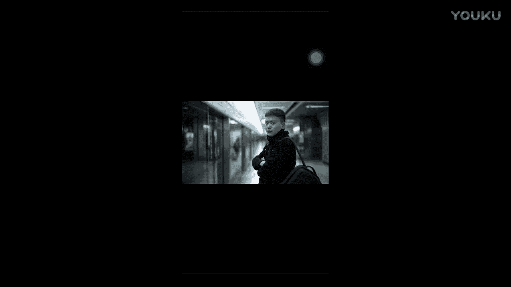

🎼好，这个是手机。那么我们又看到了这个单反跟手机拍照的这个区别呢，还是我们所说景身问题。比如说像我这张这个后面的人就很清楚。

🎼呃，那么我们再找一张同样的照片，比如说也是我往右边看的这样的一张照片。

🎼然后唉你会发现。

🎼因发现我这边全部都全部都是模糊掉了，全部都是模糊掉的。

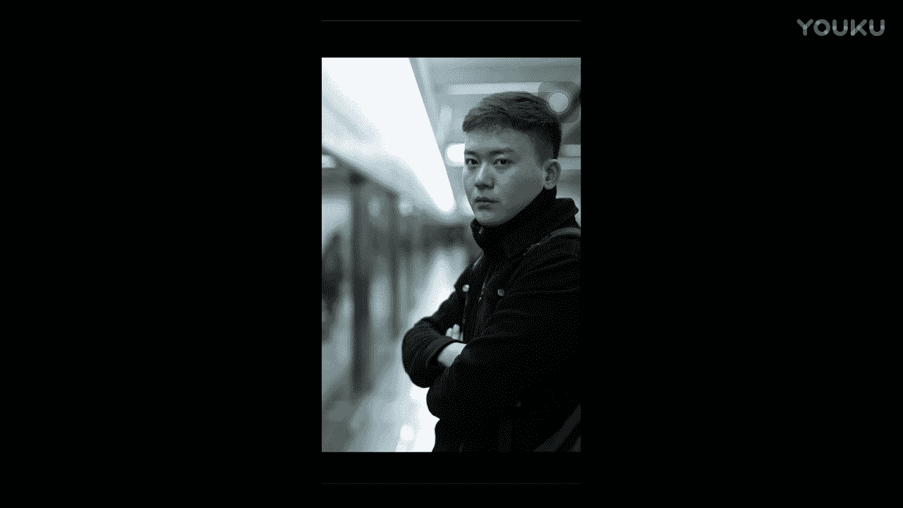

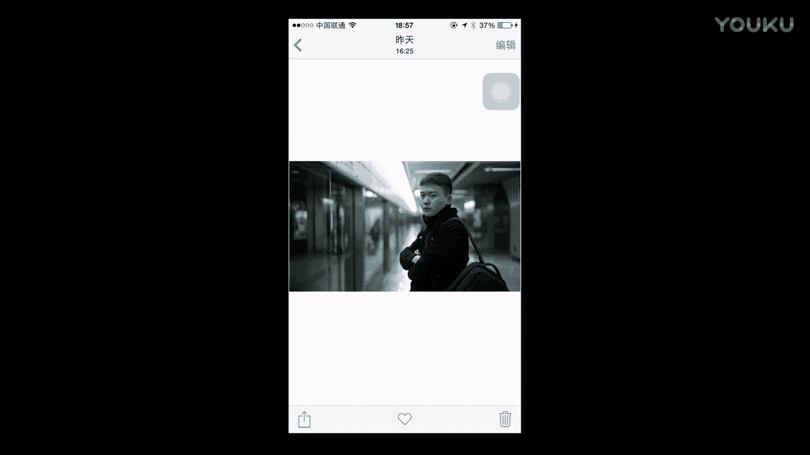

🎼好，那么这个时候呢我们就开始来这个修图了。那么我们依旧是从这个我们依旧呢从这个手机开始修起。那么我找一张手机，我觉得比较OK的。

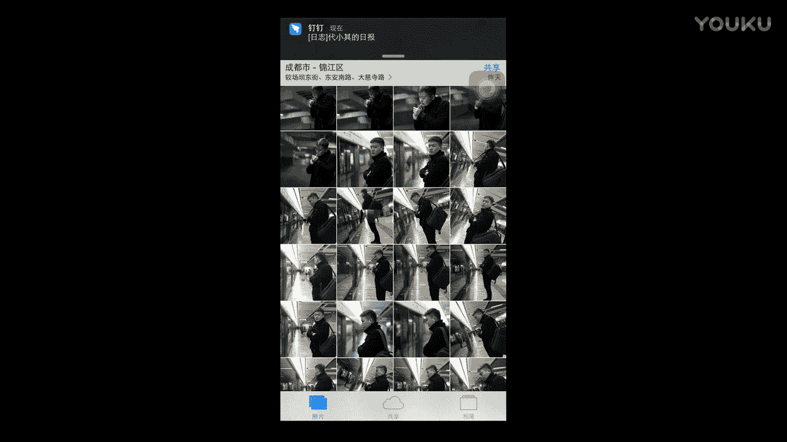

🎼呃，我看一下啊，手机拍的话还是我回头的这张吧。呃，我们还是用这张我们还是用这张，这一张呢我觉得还比较OK一些，还比较OK好。

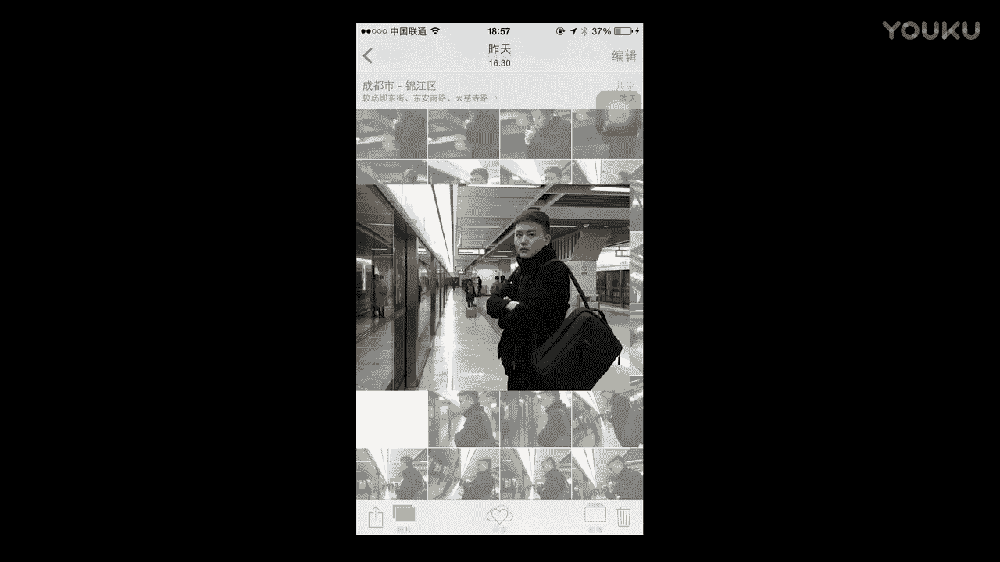

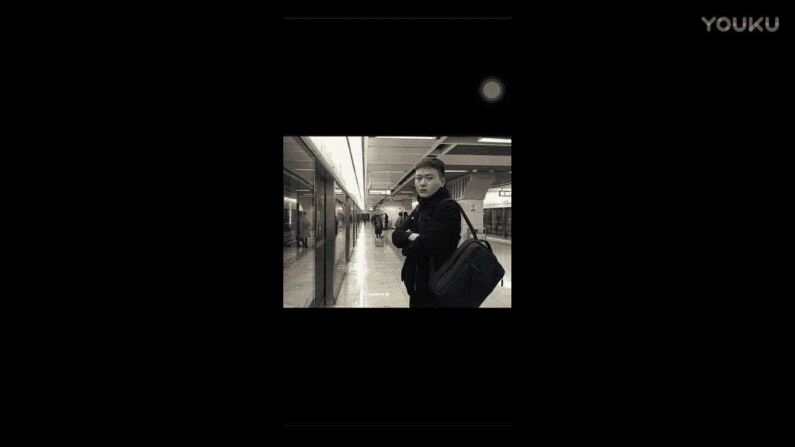

🎼那么老规矩啊还是老规矩，就是我们先是face tune来来一波face tune来一波。

Yeah。

🎼我们找到这张照片。

🎼看一下在哪里。🎼看车在哪？

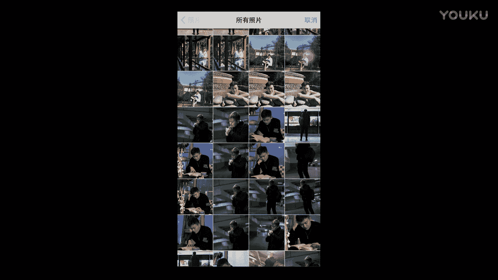

🎼石册里面啊。🎼在。🎼这儿对这张照片。

🎼好，像张照片。🎼那么这张照片呢我该如何去修呢？还是老规矩？🎼磨皮。🎼因为我的脸比较胖，所以我磨的时候尽量会把我的发令纹会抹掉。🎼这个在我们刚才的课程里面也是讲到过。

把这个发令纹抹在你的脸会视觉上面会会瘦很多。🎼然后注意啊，这个磨皮的时候，你千万不能把所有的阴影都这样磨掉，这样的话就会显得整个脸会很假。比如说像下巴这里的阴影，那么我还是要留出来。

像这种比较肥的这种地方，什么嘴角的肥肉。🎼这个我们全部都要去掉。尤其像这种有些黑眼圈。🎼这地方我们都是要重点去磨它。🎼重点去把它磨掉唉。🎼장あた。🎼好，然后基本上就。搞定了。🎼基本上到定了。

🎼大脑的皮就算是磨完了，我们可以看一下，这是磨皮，磨皮前后的区别是脸瘦瘦瘦了很多。那么紧接着。🎼看细节，我们把眉毛去稍微涂一下下。🎼然后以及我们身上文者的。🎼我们把身上的这些黑色部部分。

这种亮闪闪的地方全部都涂一遍。🎼那么会整个看我的身体会立体很多，我的身体会立体很多。🎼呃，那么接下来呢如果我们想要用作这个把这张照片看上去很有逼格，那么一定要虚化掉后面的背景。

🎼那么这个face tone里面呢有一个散胶。🎼好，我们把这个后面。给它全部都模糊掉。🎼こんば。🎼我们把后面全部都。我买后面全都。🎼处理掉。🎼OK就算涂到你的自己的本身，其实也不要紧。

但你要知道你大概哪些位置都被涂进去。比如说像是我们这张图。🎼还，基本上就算是吐完了。🎼完了像是这种要涂的话，就涂这种远景地方，像是这种近近的地方，然后就不要去涂它，让它保持一个清晰，让它保持一个清晰。

那么这时候我们发现我们的脸也被涂了，没关系，有橡皮擦。然后这个时候呢一定要注意细节，就把它的这个边缘要一定要全部都。🎼图出来。Yeah。Yeah。How。Yeah。🎼Okay。🎼后面1。

1点把这边缘突出来，这手不要心急。🎼F要升值。🎼好，我们把这些地方全部都涂出来。🎼还有这个像背带。🎼谢谢谢谢。谢谢。谢谢播放。还有衣服之力，谢谢。

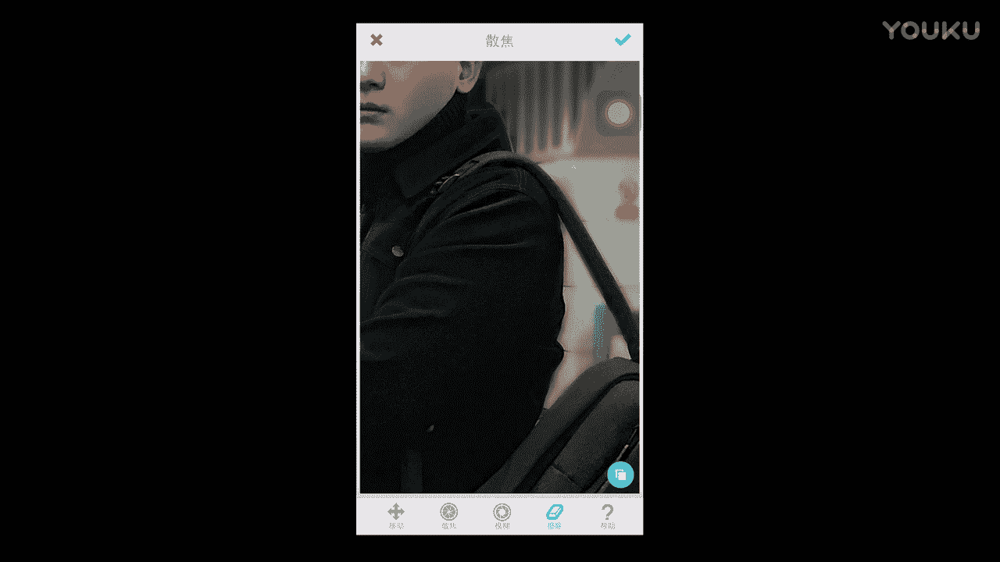

🎼他，基本上呢。Yeah。好，基本上都被突出来了。🎼基本上都被吐出来了。

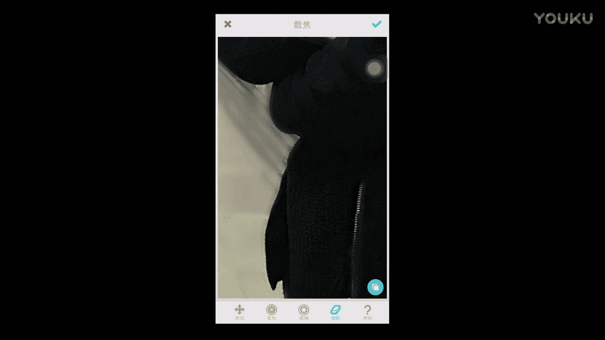

🎼好，你这样你再拉远看一下有没有地方比较假，比如穿像是我脸罩。🎼哎，好差不多。🎼感觉还差不多好腿。🎼好，我们这把保存下来。

🎼然后保存了以后呢，依然是我们的这个VSU啊。

Yes， he。🎼因为我刚才去尝试的修了一下这个图，所以的话这个里面有保存到我。

有称霸我的信息。

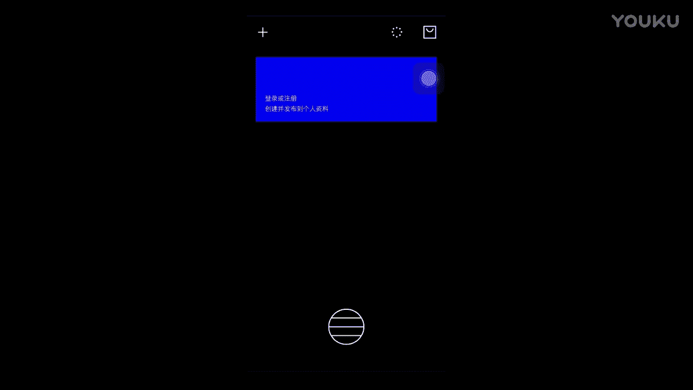

MHmm。🎼没有关系，我们再给大家来演示一遍。那么我们打开了以后，首先像我们说的，首先是试首先就是去试它这底下的滤镜啊。但是我试了一下呢，这个感觉也并不怎么好。

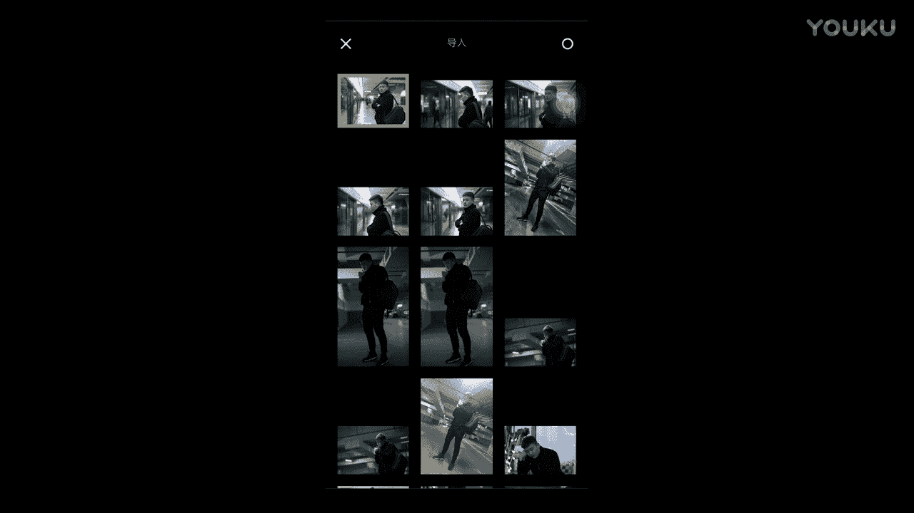

🎼感呃但是有些呢感觉还OK，比如说像市长感觉还O，但是我觉得还是我要自己来处理一下。哎，那么就是我们的手条。手条的话，首先我们选择的清晰度，我们把拉高一点点，让它看起来更加有质感。

然后呢锐化稍微开一点点，哎，把锐化打开。🎼呃，然后这里的话我们把这个色温，因为我们发现了这个地铁它是比较蓝，这种的比较好看。好有我们把色温这个开这个它呃稍微稍微拉起来一点，然后色调呢稍微偏绿。

色调偏绿一点。好，OK然后我们把这个暗角插大。🎼有一种电影的感觉，然后车粒呢我们差一个。🎼彻底我们开一乐，这时候我们把招装稍微把招装简淡稍微开一点点。大家可以明显看到这招装简淡这里的区别啊，这里都很亮。

我们稍微拆了两折，稍微综和一下。Okay。那么这时候对比度我们加深两格。🎼所以比如我们加深这个一格或是1到1到2轴之间啊。🎼那我们加深一格吧，加深一格，然后曝装。🎼啊，包装的话就不动它了。好。

我们在这样处理完了以后，我们再看一下原图，你就会感受到哎R。🎼有没有感觉有没有一种。🎼有没有一种这个电影的感觉？有没有种电影的感觉？

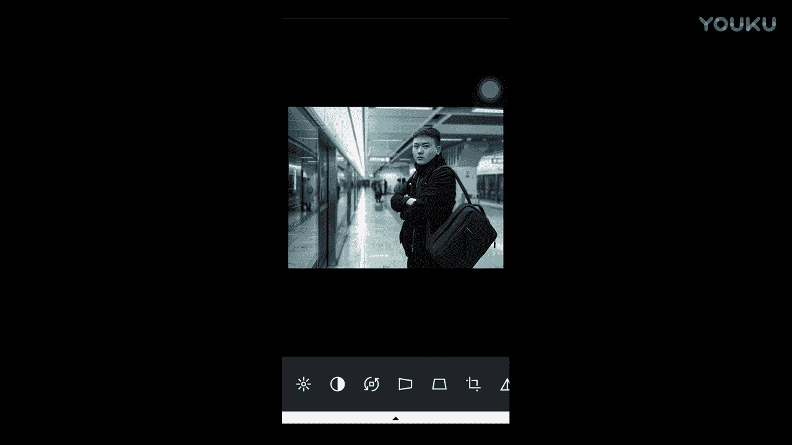

🎼那我们这个时候保存下来。放到相册里。

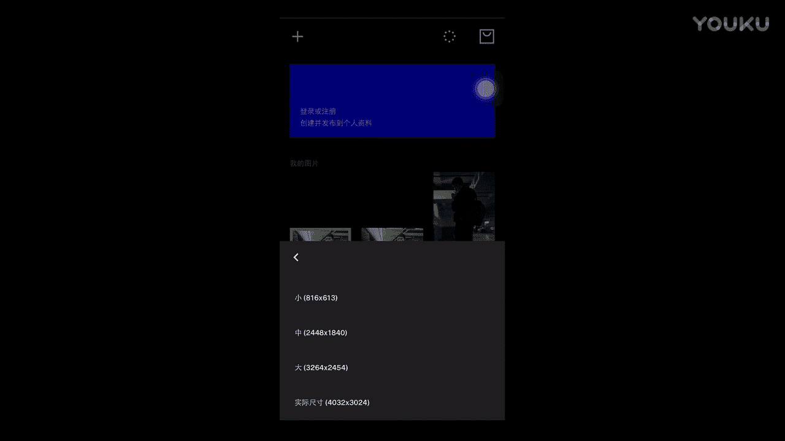

Yeah。えち？

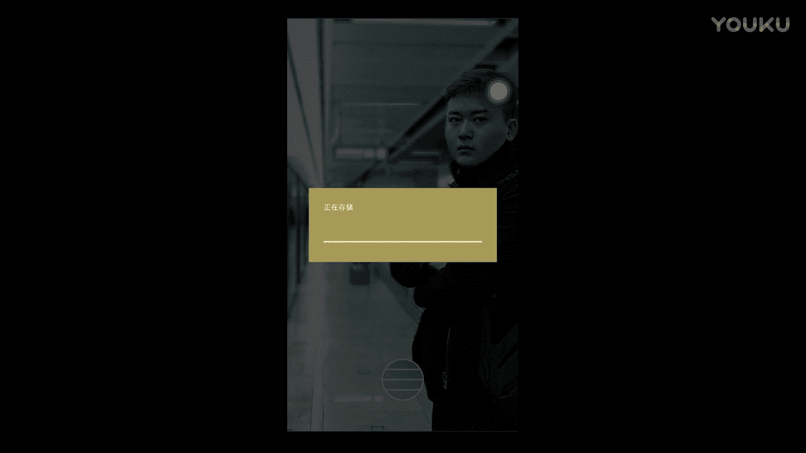

淘太储存。

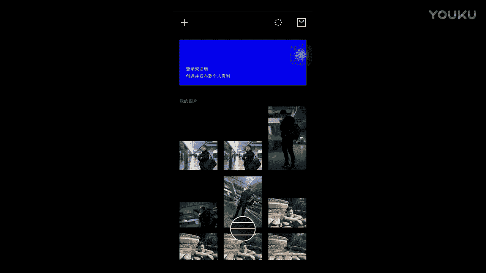

好，OK我们最后推到这个相册外面。

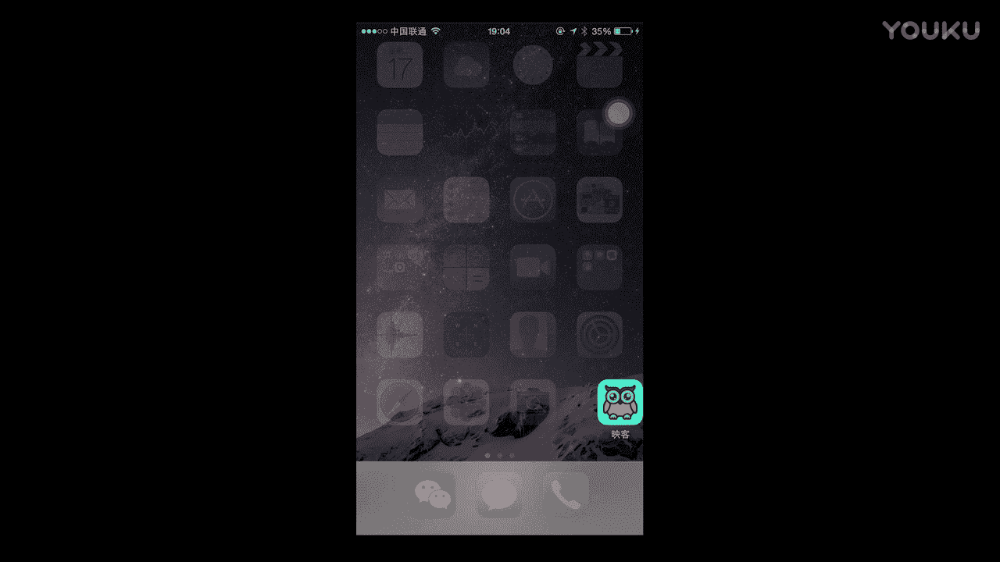

然后我们在这边发现。🎼我们刚才这个处理过这张照片，那么这时候它看起来呢这里比较像是这种电影的感觉，但是还是不漏电影。那我们点一下这个键，点一下编辑，然后我们把这个图呢换成16比9。

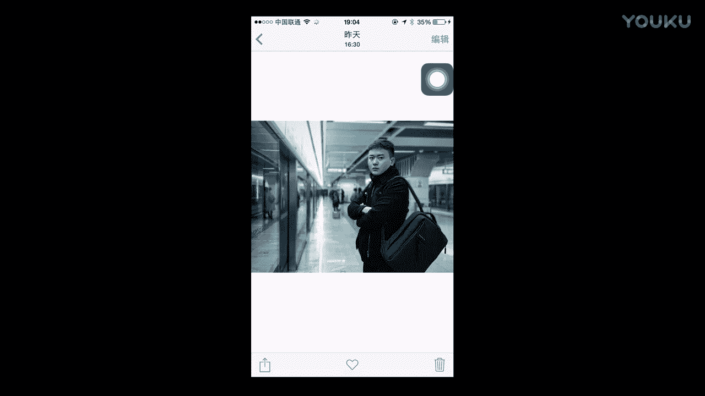

🎼唉，就这种感觉。🎼好，我们再点完成。好，这样看起来是不是就有一种。

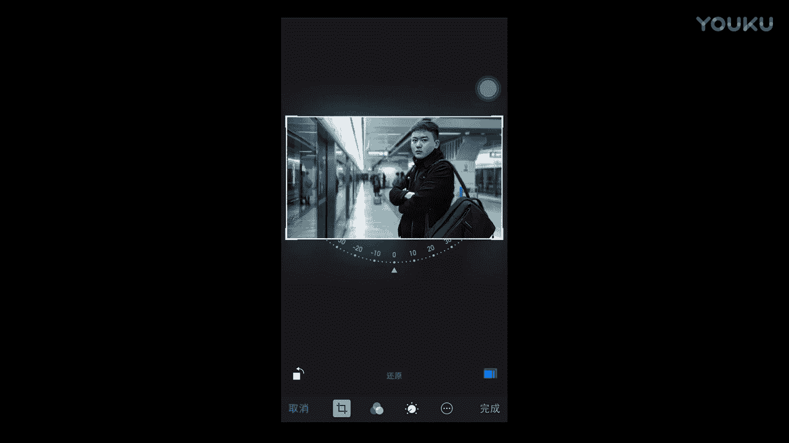

🎼是不是就有一种这个电影的大片子？🎼电影的大片子。🎼好，OK那么这个是我们的这个手机拍摄的图片。那么这样去修，那我们单反呢单反一样不例外，单反一样不例外。

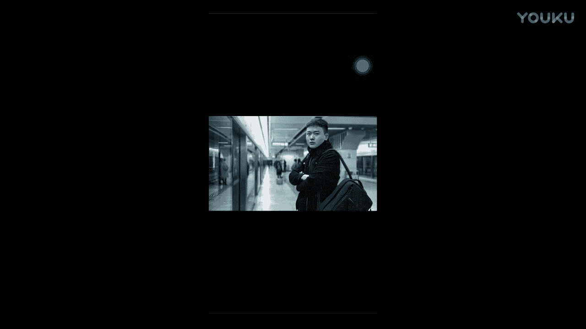

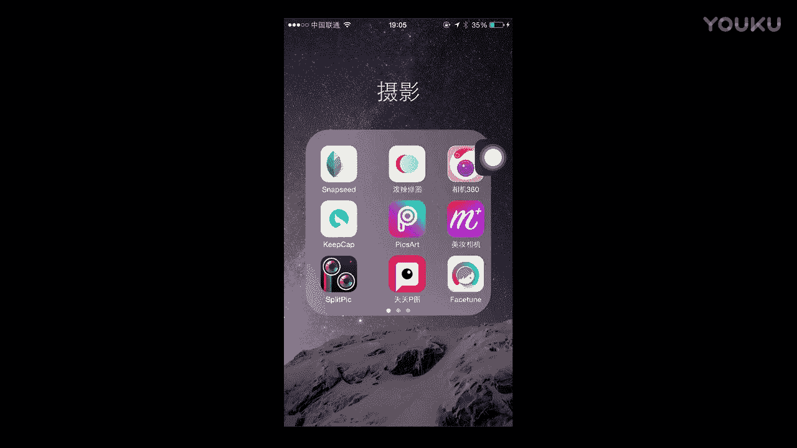

首先，faceto打开。

依旧去选一张。呃，比如说呢这次呢我就换一个。🎼呃，换一个是什么吧，这次我就换一个侧面吧，我我就换一个我就看一个侧面。🎼啊，我选。🎼就这一张吧，这一张稍的话你侧面。

🎼好，欢迎的侧面，这种呢依然磨皮，磨皮非常重要。🎼我们把皮稍微磨一下下，把这些痘痘全部都去掉。🎼还有嘴角的这个什么东西，嘴角这个法令纹。🎼全部都要去了。🎼嗯，不要这些脸上乱七八糟的东西。🎼O去了以后呢。

你可以看一下你的这个鼻色。🎼那么我想把鼻子稍微往上拉一点点啊。先把鼻子稍微往前拉一点点。🎼记住千万不要拉太多，要不然的话你的眼球会爆。🎼好像把鼻子往上拉点，最后后的小坑，哎，我们填一下下。🎼啊。

这这个鼻子。🎼唉，我们退后几步，我们推后几步。🎼诶，这鼻子很很能拉呀。😔，🎼啊，就这样。🎼就这样差不多。🎼Okay。🎼好，我们再把我们的眉毛稍微弄一下。🎼以及我们身上的这个衣服全部都它细节涂一下。

那这种保存。

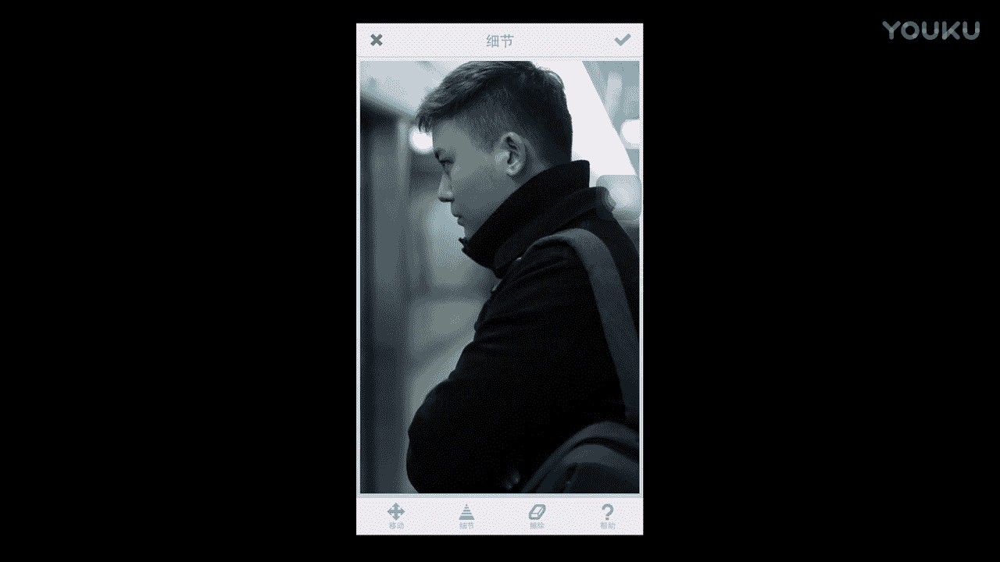

保存之后呢，就又回到了我们的这个face to。🎼点开进去。🎼选择。这是因为我们单反的这个色温是调过的，所以它本身它的颜色就不会跟我们理想。

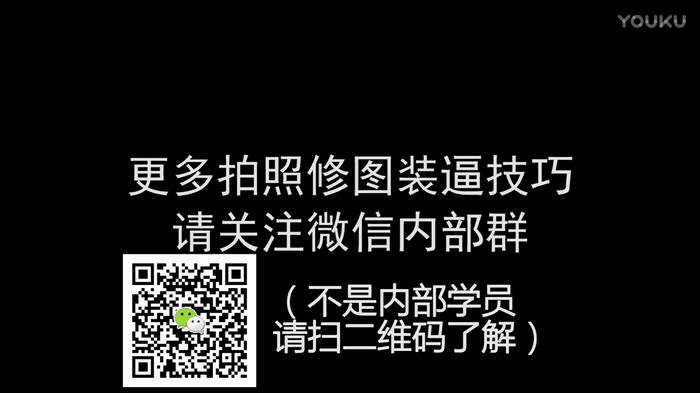