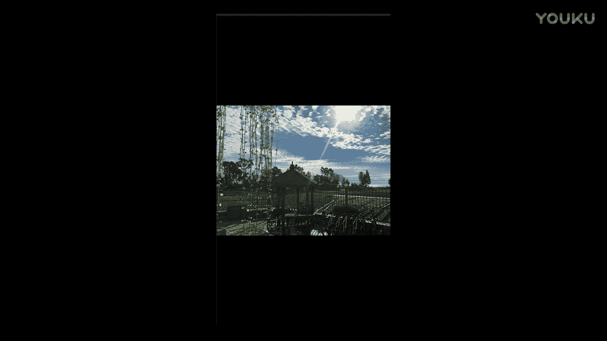
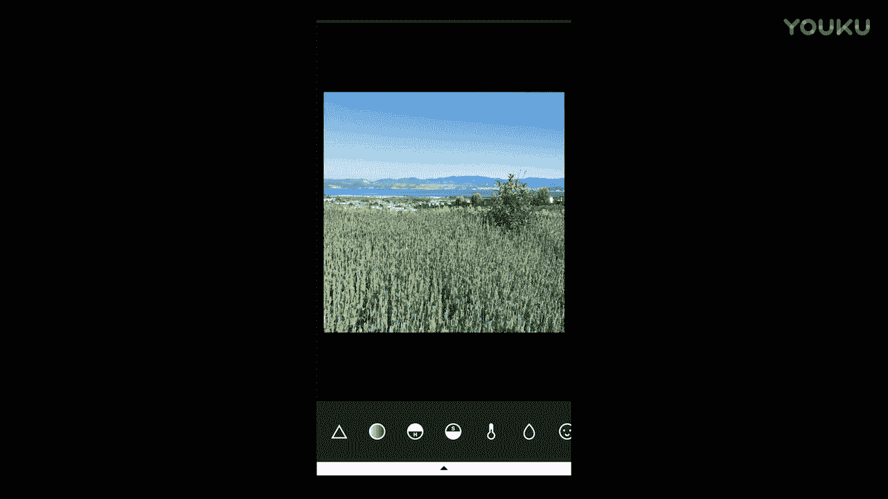
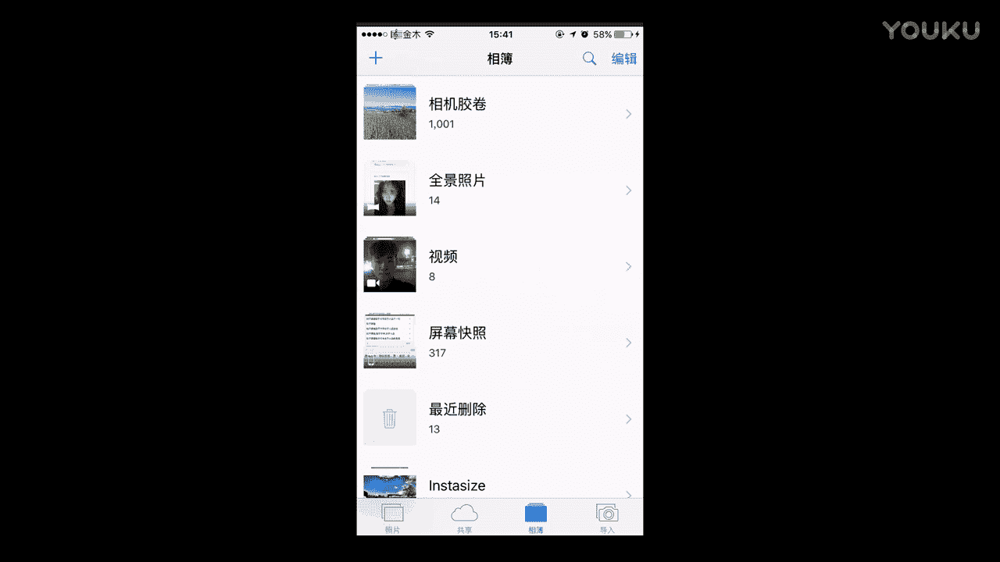
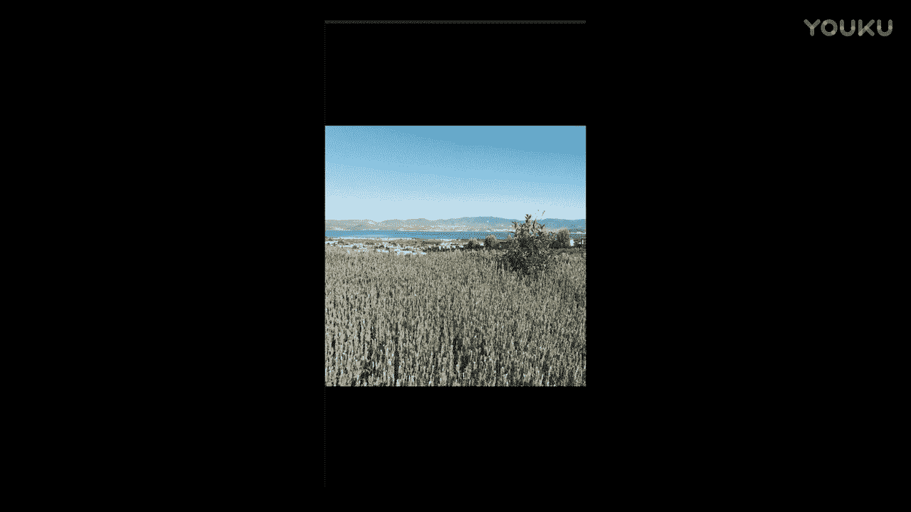
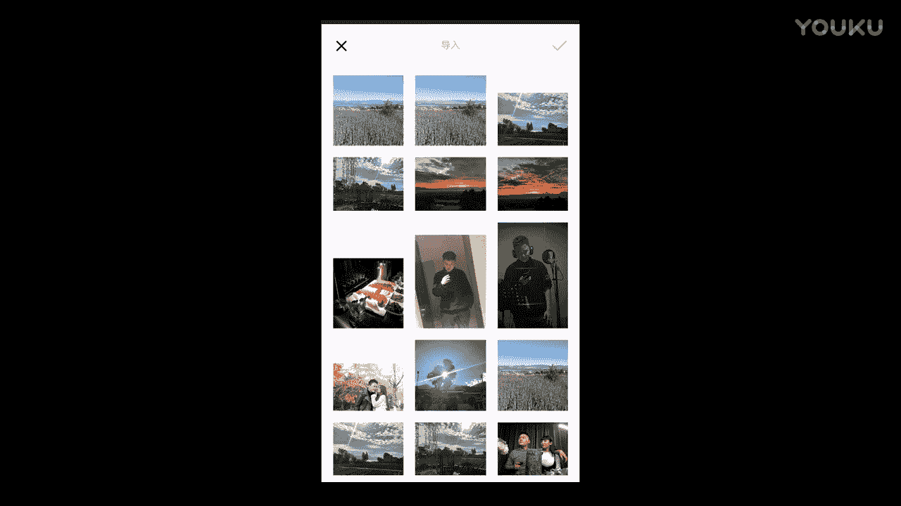
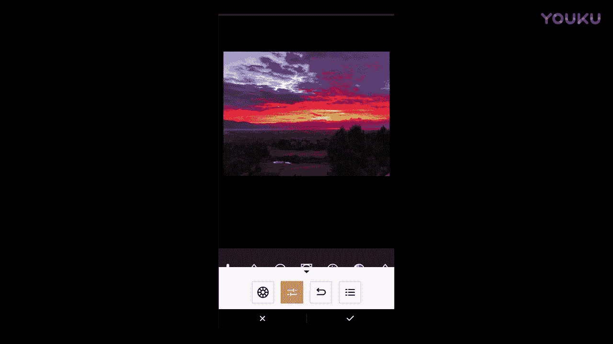
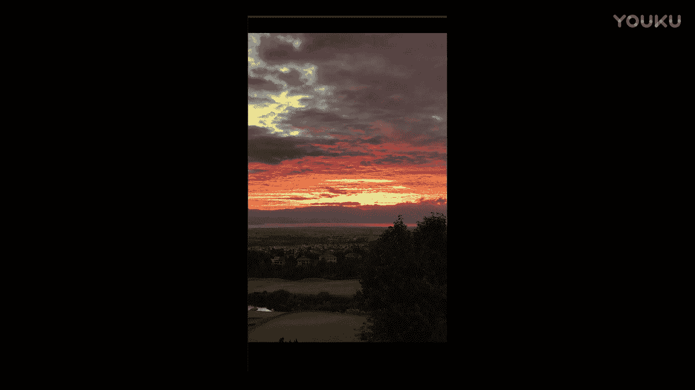
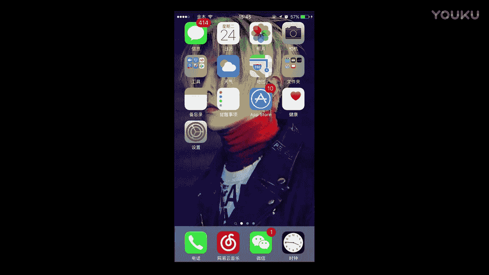

# 1、012017年《正冉装逼》课程：第十一集_如何修风景

好，那么今天呢给大家讲的是一个什么修图呢？讲的是这个怎么样去修这个自然风光。就是我们这里看到哎我有一张这样的一个照片，就是有这个阳光，对吧？然后有这个树叶，然后有这个云彩，有这个天空。

然后那么这张照片呢也是一样的，但是没有这个太阳，然后但是有蓝天，然后还有这个还有这个草地，还有绿树，对吧？然后这是这是有这个薰衣草的一张，然后也是置个薰衣草，然后蓝天对吧？然后这里是阳光这个剪影。

然后还有这个。

呃，这样一些山这些东西。哎，那么这个呢就是夕阳西下，夕阳西下的一个一个场景。那么如何去修这些自然风光呢？那么首先让我决定的是，今天我要2指的，大家给给大家依次来讲一下。那么像这张照片就很明显。

这张照片其实在我当时拿手机照的时候呢，它的阳光是正好的。然后树叶呀这些东西都很绿，然后天是蓝蓝的。但是因为我这是逆光照，所以就导致它整个的这个颜色都不是很饱和，不是很饱和。然后这张图片呢看上去有点歪。

哎，那么现在呢我们还是这个说到我们之前介绍的这个软件。这个手机呢它又不是我的然后所以的话它这个修图软件呢，大家看到的，上次又不一样。因为我的手机连制的东西，它显示不出来，这个画面很奇怪。

然后我接的是这个王宁的一个手机，我们还是用这个VSO，我们打开它。那，这是个非常好用的这么一个软件。好，那么打开它了以后，我看到这是王宁之前修的一些照片在里面啊，我们不用管他，我们直接点进去。

我们选到我们要修的这张照片。好，选入选入了以后打开就是我们打开的是就是我们还是老规矩。然后第一个呢是选着滤镜。我们看一下你的滤镜是最贴切。我们想要表达出来的这种意境的。但是我看完一圈的以后。

我发现并没有我喜欢的滤行，那么还是原图。这时候呢还是点右呃，指得指得左下角这两个小杠，我们点开它。然后这里面呢就是有一些选项，我带给大家带来呃都来介绍一下大家，这就是曝光。

这相当于是这了光圈的这样一个作用。就是如果你把它越小的话，它的光圈受的越小。然后那么它这个。曝装量就越小，它就整个画面就偏黑，只有招光段能才显出来。哎，那么如果你要往招拉的话，它就是光圈会差的差的很大。

就类似于光圈这么一个东西。然后它的光线呢就很足，所以画面就会很爆。就我们经常说唉画面这的爆了。然后那么第意思就是会出现一些死白的一些状况。然后所以这张图呢，我并不打算去动它的曝装，所以我选择还是零。

对吧？0，然后呢这个呢是它的对比度，就是它把它会把阴影加深，然后让亮地方越更亮。就是然后这个东西呢我也不打算去动它。好，那么接下来。然后这个呢就是去旋转它这个图片这个功能。但是我一般也不在这里面用。

然后这个呢是是把它诶这样子去放它。这个呢我也一般不用，但是有些特殊情况会用得到。那么这个呢是检查它的这个图，我一般也不会去用。因为iphone自带底有。然后那么这个个清晰度，哎，清晰度呢。

它就是呃就怎么说呢？它会把你这个。这个画面会风格，会处理的很风格化，就是他会把这个对比度，还有一些什么参数，它会调一下，然后就会变成一个这样的一个感觉。那么这张图呢我会稍微加一点点，但也不会太太高。

因为我不想让这张照片太过为风格化。那么第二个锐化。这也是增加一下清晰度，而我也稍微把它提一点点。然后那那么这就是饱和度，然后这张照片，因为它的天本来是蓝的，但是我照出来不够蓝，它的草本来是绿的。

我照出来不够绿，那怎么办呢？我只能去把这个饱和度给它拉到最高。哎，大家有没有发现很神奇，立马天空变得很蓝，对吧？草地很绿，就一首这个凤凰传奇的歌，像不像这个凤凰传奇的感觉。然后呢。

当我把这个饱和度拉最高了以后，我需要一点颜色来中中和一下它。那么这时候我们可以去调节一下色温，然后色温呢你越色温这越低，它画面呢就越偏冷。然后色温越高的话，然后它是整个画面，然后就越偏暖。

那么这张照片呢我会稍微选一个。稍微有点暖色调，这种感觉，就它本来饱和度都已经是这样的，让我稍微再偏暖，因为偏冷的话会看起来很奇怪。就稍微偏哎或者是你要是这种下午的时候，你可以选，但是现在太阳又是当头。

就选蓝色的话，就不是很符合这个画面。那么我会稍微差一点点。色温把它偏蓝一点。要把它偏暖一点。OK哎，那么这是色调。那么这张整个色调的话，然后我会稍微。偏一点点，这里颜色。再加2000块钱的就安家费。

那我唱一下啊。哎，好像这蓝色看起来稍微舒服一点啊，这样的话感觉有点。正一首车的不多。给我看一下啊。或是你降稍微降一点点，然后让整个画面看起来很清澈，也是OK的那我把这个往下降的话。

那么这了我就稍微拉拉这个往这边拉一点点吧。好，这样就差不多。好，这张照片呢我们就可以看到哎，是不是很神奇，你点一下原图，再点一下现在的感觉。是不是整个整张照片有一了很大的的变化？有了很大的变化。好。

这是我们这个修风景的其中一个绝招，就是哎怎么样把它的颜色变得更加的鲜艳，变得更加鲜艳。那么这张照片呢，我们就大概算是修完了。好，我们可以把它保存在相册。哎，这保存到了吗？大是那上车，还像树上两想车。

我们把相册再点开，就我之前在修张图片的时候呢，我注意到一个问题，就是他的画面有些斜，对不对？

那没有关系，你它右上角有个编辑，在编辑里面呢，我们可以旋转它。然后我觉得他有点斜，我觉得是呃他这样它自动的会正邪，然后我稍微把这个画面。调差不多一格。然后呢，他的这个照片，它的画幅就会被我切掉一些。

比如说你看我点原图的时候，他的画幅就会被我切掉一些，因为整个画面被我放大了一点，它会切掉一点画幅，但是不要紧，它的图片里面任何东西都是正的，那么就OK了。好，我现在就点完成。

它会自动保存成你这个切过的这样一张照片就很正。那么我们说的这第二张照片呢，我叫的风景的，第二张照片也是同理可得。

也是同理可得。那么这张照片的话，我会给大家演示的稍微快一些。那么我们就直接清晰度饱和度。哎，就是如果你这个照片修的很顺手，那么你就知道每张照片你再去调哪里，你就不会一类一的去试。稍微加点暗角。好这好。

原图，这个是修过的这是原图，这修过的是不是很神奇？Solomon。这个还有更神奇的东西啊，还有更神奇的。好，然后那么是这张是这样这的照片。那么还有一张风景照片，我们有这个薰衣草。我们有薰衣草的照片。

我们把薰衣草点开，那么薰衣草该怎么样去修呢？这个还是老规矩。我们首先去看一下我们的滤镜。我们看一下滤镜适不适合。哎，结实我发现我的这个滤镜呢有些也是挺漂亮。比如说这张这一张我我就很喜欢这种色调这种感觉。

那么还有这种的，我觉得也不错，这个呢也还也都谈可以。那么如果是这种的话，那我就可以随便选一个。就是我要看一下跟其他的照片符不符合。如果我只有这一张照片的话，我想怎么修就怎么修，就再风格化也不怕。

但是如果你一旦要跟人像组合到一起的话，那么你要考虑就是人的脸上的肤色，这是很重要的。我们在下一节特时，我们会讲到就如何去修人像。那么像关于这张照片呢，我就唉我觉得差不多这样就O了。这样的一个感觉。

我觉得挺小清新的，那我们就直接可以把它保存下来。我们就不用去调那么多乱七八糟的。对吧或者是如你想要调一点乱七八糟的也也是O的。那么你还是变成置的手动。对吧，这个稍微因为这个东西很密。

所以你就不用把他开大招，就甚至你不拆他都是OK的。好，我们稍微拉一点点。我们稍微把色调往冷色调稍微拉一点。啊，然后他有一个雾蒙蒙的感觉，就是这个东西。你可以拍个照。然后把这对比度呢稍微增加一点点。

然后他也可以出现只你想要的不错的这样一个效果。对吧是不是这是原图，这是修路的，它也可以出现你的想要的感觉。

对吧都是候吹的。就主要是看你想要修成什么样子，就是还有一个一点就是看你的人像，然后你要跟你的脸色要这个要相匹配。对，这个是这是我用的滤镜修出来的。那么这是我自己手调的修出来的这个特有这的特色。

就是看你想要选哪一张。

看选选想要选哪一张。好，那么我们还有一个就是我们的夕阳西下。像这种红色的这样的风景，然后该怎么样去处理。比如说像这一张。

就是说这样老规矩先是试滤镜，那么发现呢这滤镜没有一个是我喜欢的。那么就原图。嗯，原图之后呢。还是一样，就是因为我们像照风景的话，它最重要的其实是它的一个颜色，它的这个色彩的饱和度，这个是非常重要的。

那么你在这里也可以调你的色彩饱和度，你想让它偏成什么样的颜色？呃，我觉得呢这个还是像是这种夕阳呢，我觉得定还是把饱和度拆到最高。那么整个的色调呢，这是这这边是偏绿，然后这边呢是偏这种紫。

因为像这种夕阳的话，偏绿就太他妈傻逼了，感觉跟一坨屎一样。所以我决定还是把它偏到这个稍微偏红一点，就是让这种的晚霞去映照整个大地，映照整个村庄。这些照片都是我在大理时候拍的。诶。好。

然后我们再来调一下这个色温。哎，色温在我刚才说过了，色温越低越偏冷，色温越高呢越偏暖，那么们稍微往低开一点，对吧？我们让让它的颜色然后分层分出来。好，O然剩下你就不用再去处理任何东西了。

那么这时候你可以点击原图，你可以看一下。这个是原图。这个然后是修弱的，呃，至于好不好看呢？呃，就哪个好看，这个大家就是都有这的这个就审美吧都不一样。就你但是我把方法告诉大家。

就是大家可以修出自己想喜欢的这种的感觉。呃，我个人的话是比较喜欢我修图之后的这种感觉，是我比较喜欢的。但可能很多人觉得稍微颜色淡一点，然后或者是呃让天整能在阴暗点他觉得也会比较好，这都是OK的。

主要这是一个工具，看大家怎么样去使用它。还有那么晚啥呢，就打定了，你把它保存下来。

哎，如果你修图修的很熟练的话，像这种东西你一拿到你就立马可以修的出来。好，这是另外一张晚霞，他们两只不一样。那么你也可以试一下滤镜，这个就不用试了，因为它的颜色太就是太过于这个。这个色调太过于强大了。

所以导致你放什么样的滤镜都不好看。那么还是我们手动来修。对我们手动来修。对啊，像风景的话，其实能用到的来来回回也就这么几个。嗯。但其实并没有很复杂。他其实并没有很复杂。好，哎。

他又变成了我喜欢类似一个色调对，这是修图之前的这是修图之后的。修图之前修图之后有没有感觉修图之后有一种世界末日的感觉，那么就对了。因为我很喜欢这种感觉，末日风。好，车那我车把报存下来。呃。

那么这整个呢就是我们的这么几个就是大的这样的一个消图的风景。就关于风景啊。哎，我们有这一张它的原图长什么样的原图，这得吓死大家了，原图长这两。那么这张照片呢也是的原图，他修过之后呢，还是这个样子。好。

然后这薰衣草呢本来风景就还不错，所以它单独看也还是OK的。那么在你经过处理了以后呢，它会变成这种感觉。大变这种感觉。好，那么晚霞就是这是我拍的一张晚霞，也其实也是挺漂亮的。就你不修的话还是挺漂亮。

很自然。

就是你要是在现场的话会感觉很震撼。那么你修过了以后呢，就会变得更震撼呵。好，OK那么这个呢是我们的风景的修图。好，这是希望大家能够学会。

