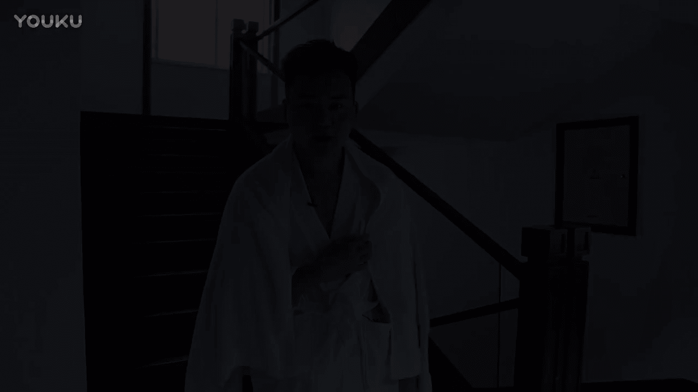
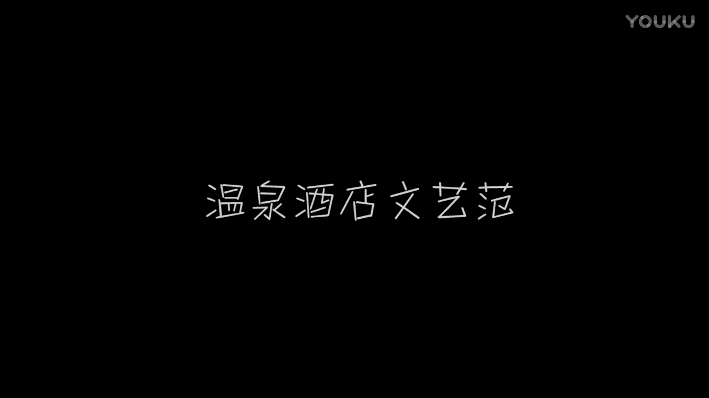

# 1、012017年《正冉装逼》课程：第十二集_温泉文艺范

🎼哎，hello大家好，这个我们久违的装逼特呢，现在又开始更新了。那么今天呢我们是借助这个浪迹一分钟。然后我们来到了一个这个雅安的这么一个温泉酒店里面。那么我就想办法，哎，怎么样在温泉酒店里面装逼呢。

现在刚好是置了我们拍摄最后的这个最后一天，然后马上要回去了，现在是置了中午的这个一点钟，那么在一点钟的时候，雅安这个阳光还是非常明媚的。但是因为我们这个酒店，然后比较这个背朝阴。

然后所以呢这整个的环境看起来，然后设置的比较这个比较阴冷的。那么比如说像是我住的这边，哎。🎼像像这边的一个像这边一个环境，就看起来是非常阴森，非常暗冷的这样一个环境。然后那么我觉得呢像冬天里面。

然后发一条这种非常阴冷的这样的照片，就不是很好。在朋友圈里面，哎，那么我们选择在这边的这个走廊，因为阳光正好能打到这边，但这边呢又有一个问题，因为今天呢是差不多1至1点钟，现在服务员呢开始收拾这个房间。

所以过道里面堆了很多的这样的一些这样的一些毛巾。然后哎但是我们发现哎这里有这阳台，刚好这阳台是突出来，阳光又能照射的到。然后所以呢我就想办法，哎，我要在这里。🎼来RV的造型。

然后在这里来拍一条这个朋友圈，然后我觉得是非常不错的。那么怎么样去这个趴在阳台上面，然后趴在栏杆上面，然后去拍一组这种比较呃比较小文艺小清新的这样一组照片呢，哎首先呢你要把这个走廊的纵深感要拍出来。

然后那么其次呢，你不能把这些肮脏的这些东西带进去。那么我选择了一个这样的一个位置。🎼唉，像这样的一个像这样的一个环境，然后就是非常之优美的非常优美的。然我先拍一张，然后给大家来看一下。🎼这里有树叶。

有阳光，有木头，一种这个日式的这种这种这种忍者，然后经常在的这种一的地方。哎，大家能看清吗？但是这个美中不足呢就是这个地下，然后有一点这个这个白色的毛巾铺在地下面。那么我们等一下，然后把它只能拿走。

就O了。好。🎼嗯，好，我们把这个毛巾扔到这边来。那么我们这个时候呢，记得找一个聊居来民歌。🎼好，然后就从我刚才的这个景别，然后呃这个斗图呢要对称，然后他这个上下还是要带上一点点。

然后尽量的让他就是把手机伸出去，然后让它保持这样的一个水平状态。因为他要不然这个栏杆会斜就不太好看。好。然后那么我那么我这时候应该做什么呢？🎼这时候你就可以哎有两种。

要么你是对着镜头这种哎把你的头这样露出来，然后在这里去拨洒一下自己的头发，然后或者是这个呃去点一根烟，或者是在这里玩手机，哎，要么你可以坐在这个地毯，哎，坐在这个叫什么呢？就这这凉席子个垫子上面。哎。

要么你可以选择这种侧面的方式，然后对在这儿。哎，这样看。如果你这时候手里面有一杯咖啡，然后是最好的是最好的。好，哎，我们来这拍几张照片。😊，🎼我们到时候来选一张呃。

兄弟们剧组像这种拍这种照片凹造型的时候呢，哎机尾怎么到这边来了？就是就是像这种拍照片的时候，然后一定要自然就是你多去凹一些造型。像我们一般的话就要拍了20张里面选出来一张是一件非常很正常的事情。

所以的话这时候你要跟你的这个摄像师，然后一起去沟通，对你的聊一些沟通，哎，摆什么样的造型比较好看。明德。😊，🎼摆了抽烟的啊，发型怎么样？🎼好，这是我们来这个抽一根烟，这个我也不是提倡大家抽烟啊。

我只是作为这个道具。🎼好像是抽烟的时候呢，我带了一盒火柴，那么火用火柴抽烟是一种非常装逼的方法。Proister。哎，那么你可以趴在这里。这是怎么样？是不是脸上有什么影子？现在呢。嗯。はい。🎼天始。

🎼哎，好，兄弟们，那么在我们刚才让我们的这个聊机帮我拍几张照片之后呢，哎，我发现有这么几张不错的照片。🎼呃，我看了一下呢，大概有这张，这张还算是不错。🎼对，然后我看了一下，还有呃还有这一张。🎼哎。

这一张感觉还好啊感觉还好，这一张呢也还可以。🎼那么我是比较喜欢的是这一张，那为什么呢？因为这一张呢它有一个景深存在。哎，那么这个时候呢我们就要学会的这个贴图的这么一个功能，就是在我们的这个手机。

因为这个手机它现在不是我的，是我去用海神的这个手机。🎼那么它的系统呢是呃没有升到这个十没有升到十0，但是也同样有这个功能，在它的这个右上角有边辑。那么如果你是一升到十0的话。

在它的这个右下角就垃圾桶旁边，它会有一个横的三条横的小斜杠叫横杠，那么也是可以去调的那我们现在点击右右上角的这个边辑键。然后它最底下取消的旁边，这里有一个方形的这么一个东西，就是你可以去裁它的这个图片。

那么我们把这个图片呢，我们选择这个我们选择这4比3。然后我们把图片拉小，我们把图片拉小，把我的人物放在这个正中心。🎼把我人物放在这正中心，然后稍微正中心偏低一点的这样一个位置。哎，差不多就是这里。

那么这样呢我你就可以探到一个整个庭院的一个景深的这样的一个存在。🎼哎，我们把它放到这个构图上啊，放在这里差不多。🎼这样这样的一个感觉是这样的一个感觉。🎼好，然后呢我们现在点击完成。🎼在我们完成之后呢。

然后你可以打开你的修图软件，这是海神的手机。它有很多的修图软件。那么我们第一个需要用到的是什么呢？当然是我们处理脸部的这个face to这个东西呢，在我们前面的五节课里面我们也有介绍到。🎼好，哎。

我们现在打开相册搭配相册啊。🎼我们可以来看一下。🎼我们选择的这个图片呢是这张。🎼我们选中他。🎼How， okay。🎼那我们我们选择这个底下这些东西我们也都介绍过。我们现在用平滑，先用平滑来处理一下。

处理一下我脸上的这些乱七八糟的这些阴阴影阴影啊。🎼啊，稍微处理。但是它这个因为这个磨皮，因为我当当时在阳光底下照，所以它这个磨皮就磨的很好，所以也不需要我怎么去修啊，我总觉还是非常满意的。

但我的脸有点胖，我们现在选择这个调整，我们把我们的这个脸呢往里稍微的推一推。🎼把我们的脸往里头微推一下。🎼照片嘛，照片来稍微推备一下。🎼好我感觉还是点血啊，再再推下张。🎼哎呀，好，哎。

差不多就是这样的感觉。哎，我的脸一下立马这里就小了很多。🎼脸立马就小了很多。🎼好，那么我们再推小一点，有点过了，有点过的话，你再把它拉出来。🎼在这个是子就是慢慢调整的这么一个过程。🎼好哎。

🎼这样呢看起来也还OK。那么我们点击确定。那么这时候呢，你在右呃最下面的细节细节呢就把把你的眉毛去涂深一点，把你的眉毛去涂深一点，这样的话眼睛看起来会比较有神。🎼哎，好，哎，基本上就是这个样子。好。

我们把它保存到。🎼把保存到相册，然后我们再退出来。🎼然后用到我们之前介绍的这个VSCO，这是一个很强大的文件，我们打开它。🎼出有一点略微的漫啊。You。8。好，ok。🎼呃，这是海神他之前P过的一些照片。

我们选中我们刚才选择的这个。🎼然后我们点击下面这个按钮，我们打开。那么像一般这种人像的时候呢，其实我一般都是选择微调的，我一般都是选择微调。就是但是但是因为它这个整个树叶和这个环境感觉还是不错的。

所以我首先呢不方便，我会先去试一下滤镜，我会先试一下滤镜，大。🎼那么我觉得A其中的有益滤镜呢是像正率镜，它就。🎼IYou think you。🎼但是有点过名。🎼哎，调成这个样子。🎼差不多到。

🎼Gister。🎼到这儿不了。🎼比较好的，这时候你可以有你可以点击一下你的图片，看一下，看一下对比对比之后，我选择我觉得是OK的。那么我在选择这张玩图片呢，我点击保存。🎼把它保存到相册。

🎼但是我依然觉得不够。那么这时候呢你再把那张图片再调整来，就是你刚保存一张图片再点开。然后现在呢你的这个原图呢，就是你刚才已经加入滤镜里的一张图片。那么我们现在我们再加一个这样的滤镜，这里有点高。

那么我们可以把它稍微的。🎼稍微的调低一点。🎼好嘞，基本上就是这样一个感觉。🎼那我们可以把它保存到相册里。🎼好OK那我们来看一下刚才。🎼干嘛？🎼刚才最后去过的身照片。🎼最常现就这两样子。🎼成长。

🎼没有屁股的。🎼你再看一下我们没有苹果的图，我没有果的图吗？是假的。🎼这个是我们妙去的原图，我的脸是这么回事。🎼去过了以后，脸颊变得如死之瘦。🎼唱。🎼好，兄弟们，那么我们这个第二个。

然后如何在这个在这种像是度假的这种温泉酒店里面，如何去装逼呢？哎，那我们现在来到这个户外场景来户外场景。那我们在这个一片草地当中呢，哎，我在这发现了发现了一个这个一个秋千，哎。

那么我们就可以坐在这个秋千上面，然后去装逼。然后其实我们一共有两个秋千那边有一个来给个镜头嘛。

🎼那边有的秋千，那么这边有着秋千，那么我们为什么要选择这边呢？因为刚好这边是正对着阳光的，正对阳光的话，哎可以把人的脸照的非常的白，然后自带这种的磨皮美颜效果，尤其是用手机照。

然后我我就可以想办法哎坐在这个上面，然后如何去装边的。这时候呢一定还是要让你的这个聊机除码，因为只有让别人拍的话，我觉得才会正好如果你自拍的话，因为你的手的距离是有限的。

这是在我们之前的课程里面也讲到过，就是你永远是拍不到一些全景的，就是除非你把手机固定在那里，但是也没有人会来帮你调，那么这时候呢我们这个聊机哎要出动了。来明哥。🎼呃。

刚好呢刚好我们这个椅子后面是一个温泉酒店，刚才我来这里比了一下构图，就是把这个摇篮放在这个中间，我人坐在这上面，然后面刚好突出来了一个这种酒店的一个呃屋呃这个屋顶的一个小尖尖，然后是最好的。哎。

那么明德到时候你就可以用这种方式，然后来帮我这个拍一张。🎼那么坐这里的话，如果你不蘸点什么话，是非常尴尬。那像我刚才说的，你可以端一杯咖啡，然后或者是准备一本书出来，然后在这边可以翻书。

然后你还要跟挚的摄影师去沟通。哎，明乐，你觉得我怎么样会好一点？左边做一点点，你的你的左边对吗？🎼呃，是这样的，就是我们刚才呢得到了几张这个人像的这个照片。啊。

那么如果你不想让你总是出现在你的相片里面的话，那么你可以去拍一些风景的照片。那么你拍风景的话，这个风景里面一定要有内容。就比如说像是这边的树林的话，就是因为是人工种植的，然后也没多久。

树上面还有很多白色的这个防防虫的这种的突漆，然后这个拍出来就没有那种自然风光的那种森林那么好看。哎，那么我们所以的话这个照片里面一定要有这个主题。那么我看就是刚才我们所说的那个背光的这个呃秋千。

然后是一个比较好的选择。那么们可以这个绕过来。🎼好，哎，我们可以去拍这个。🎼这个背光的这个秋千。🎼哎，你能看到我的镜头吗？🎼啊，也可能有点反光看的不太不是很清啊。因为它刚好这秋千是在树的阴影下。

然后前面的草地里面又铺的有阳光，所以那个秋千就会显得格外的注目。而且它跟周围的景物的话，这个都不太一样。因为它是一个这种呃一个这种铁的这种一个构造出来的这样的东西，它不是这种木头切。如果是木头切千的话。

可能会更搭一些。🎼好，那么我们刚才呢一共有拍了这些张的照片，一共拍了这些张的照片。那么我要从中间选出一个我觉得不错的，然后来修。我大概的看了一下呢，我觉得最后这两张是不错的。最后这两张是不错的。

是可以一修的。好，那我们还是老规矩，人像呢我们继续用到我们的face twin。

🎼我好我们打开这张图。🎼我来看一下。🎼好，最后一张。🎼依旧是老方法，先磨皮。🎼呃，就是像我们这种比较胖的，我们就要把发令纹去给他这个给它涂平。🎼然后这样呢的连一下就唉。🎼就个是感觉一下瘦了很多。

因为脸上没有很多的这些印子。🎼那么紧接着如果你比较胖或者是哪里比较瘦的话，你可以继续把它哎微调把你的脸稍微推一推，哎呀，推多头了。🎼啊，你推的时候你一定要自然啊，就千万不能推的这种坑坑洼洼。

就比如说像是我这个样子。🎼好，我们撤销一下。🎼我们重新来推。🎼通重什来推一下啊。诶。🎼感觉还是有点坑坑洼洼，怎么回事？是我可能收指头又比较大啊。🎼手头最近有点大。🎼呃，手指头一大呢就不太好。

🎼手指头一大就不太好推脸，因为你一推呢，它就会整个都会推进去。🎼哎，好。🎼基本上。🎼哎，好，基本上这个样子就是ok了。🎼还有那么我们依旧是眉毛，对吧？男人的眉毛一定是刀锋美。🎼好。

OK那我们整个脸呢就修完了。🎼一整个脸就修完了。🎼然后我们把它保存。🎼保存之后呢，我觉得它的这个构图呢还是有点稍微有点小问题，没有关系没用值得。🎼我没有我们最擅长的指导。🎼这这个这个东西来解决。

就是我们刚刚讲过的。🎼好，3比4。🎼这把稍微缩小一点点。🎼到这个位置。🎼好，这样的话就整个人稍会稍微变得大了一些。🎼变得大了一些了。🎼好，OK。🎼那么我们的最后一步呢，依然是VSO。🎼这软件很好用。

🎼我们把这张照片导进去，那么选择下面老规矩。首先呢第一步先是滤镜。🎼还有我试了一遍滤镜，我感觉呢因为我因为我要是发这一组照片的话，我肯定是温泉家酒店所有的照片起发。所以我想要让它的风格尽量统一。

🎼那么我还是会把这个加两个加上的4到5之间。🎼好，加完了以后呢，把它保存下来。🎼接着我们再导进去，在它的这个图片之上，我们再叠一层滤镜。🎼因为他这个系统有点老，所以不能够就是一呃一乐上面多叠两层。

所以的话呃现在的软件应该是可以这样子了。🎼好，我们再。🎼稍微加一点这种这个感觉。🎼感觉自己很有。🎼哎，好，这是我们的刚才修的是这样子的，我们现在修的是这样的感觉哎，还不错，风格呢统一。

那我们就把它保存下来。🎼好，我们最后来看。🎼这的呢是我们修图之前的样子哦。🎼我们消图之前。🎼那么这个是我们修图之后的。🎼那们收购之后感觉。🎼有没有感觉一下屌丝变高富帅？

🎼Perhapss be awful trial。🎼哎，好，这位兄弟们，我们现在我们刚说我们在一个这个温泉的这样的一个酒店里面嘛，果你是一个身材非常好的这么一个男生，那你就是可以各种去摆姿势。

然后怎么样去秀肌肉，怎么样帅，怎么样去拍。那像我这个像我这种身材呢就不太适合，然后出现我的这个全身的裸体在里面。那么所以的话你在这个温泉里面装逼，然后去拍照的话，然后那么有这种两种方法。

那么首先的一个呢就是规避掉你的这个扬长臂短啊，这个这个避掉你的这个缺陷。那么我的手臂比较长，因为我的身高比较高，那么我手臂比较长，那么你可以延展看你的这个手臂看这个菲尔普斯样。

这时候我们又需要这聊基出场了。来明哥。🎼然后你可以这个双手展开这大棚展翅，然后把你的这个背影这个拍进去。它这个两是量不过给你，现在是量谢谢高通，绝对是上面还有资识疗解检查不个考业。😡，🎼好，O。

🎼那么像是刚才这种的话，就就可以照出一种这种日本温泉。然后这种老大。如果你背后还有纹身就照出来就非常的好看。那么第二种呢，然后是如果你要把脸发出去的话，那么这个就是我们就就是翻译的面。

就是刚才是这个背面，然后那么现在是正面，那么正面的时候，这个关键点又来了。那么这时候呢，如果你要端一杯这个饮料或者是一个什么呃就冷饮啊，这种的，然后上面有这个比如说像是一些柠檬，就柠檬汁。

然后上面插一片柠檬，像这种东西的话，然后就是特别好。如果你有墨镜的话，就正好。那么今天我过来的时候，这个没有戴墨镜，没有戴墨镜，然后所以的话这里也不能给兄弟们演示这个呃就是带上墨镜。

然后端上这个柠檬水到底是什么样的一种风格。但是我们可以大概演示出这种的一个姿态。🎼那么这个制乐的也是很简单。那么首先你还是要跟你的摄影师沟通，就是你可以把你的脸稍微拍的尖一些，拍的尖一些。哎。

那么你就要跟记的摄影师去沟通去调整。哎，现在该怎么样拍呢？明哥。🎼然后把手大开。🎼联路。这种是要。打话要去。拿下去之后直先查看一下货。🎼好，那这个是我们刚才在温泉里面拍的照片。在温泉里面呢。

我们都拍了哪些照片，我们都拍的是。🎼这样的照片拍的是这样的照片。🎼然后我大概的看了一下呢，我觉得这几这些照片我大概看了一下，我觉得这些照片呢。🎼呃，其实像这样的感觉还是O的。

但是如果我要把它们一起发的话，它的风格可能就不太统一。呃，为什么这么说呢？我给大家来看一下，因为像是背后的这种的照片的话，我一定是要凸显它这样的一个肌肉感的。🎼哎，照片到哪儿去了？照片在这里。🎼好。

把它点进去，就是因为这样的照片的话，你去很普通的去修它，我觉得不是特别的好看。🎼啊，比如说露这样子等你来一下，你可能就会感觉。🎼别如说我这样子。🎼有没有种那种日本漫画的感觉？🎼好，我这样再走。

🎼有没有种日本大佬？🎼有没有种日本日本大佬的感觉？🎼あ。🎼呃，这样的感觉是挺好，但是他不太适合跟我的前几张配在一起。🎼呃，那么如果你觉得OK的话，你也可以这么去调，对吧？

然后把它的图片的风格呢调成跟以前的是一样，也是OK的。呃，但是我发的时候，我并没有发这一张，我发的是这一张。🎼哎我发的是一个迷之微笑。🎼我发的是一个迷之微笑。那么我们说到人脸呢。

我们还是要用face tune去修。🎼呃，我没有回到这软件。🎼然后找到你刚才觉得O的那张图。🎼还有这张图，那点进去了以后，老规矩先磨皮。🎼对，稍微先磨一下下，这个也不要磨的太多。

磨的太多的话容易比较失真。🎼好，磨完这个皮了以后呢。🎼稍微把你的脸往里推下。🎼哎，好，这然后这个时候呢细节。🎼打开细节，然后把眉毛腿加深。🎼好，我们对比一下对比一下，可能也看不太出来有太大的区别。

但是它还是给人营造一种比较好的感觉。🎼然后这个时候呢我们再打到这个VSO里面。🎼我们把这张图片保存。🎼好，那我们如果是要发成，就是当前面两张一起发的话，哎，那么你还是可以选择这样去叠滤镜。

那么我首先还是叠第一个滤镜，让我的整个颜色看上去比较深。🎼Haao。🎼最后呢把它保存起来，保存到相册。🎼接着我们再导。🎼再把刚才你导出的照片，我们再导进去，再给它叠一层滤进去。🎼我们开到差不多6。🎼好。

OK我们把它保存起来。🎼好有这时候他又在你山彻底。🎼那么也可以看到的是这张。🎼是这个这张是没有屁股的。🎼头上有一些这种的。🎼好的这种东西。🎼对吧，然后那么这张呢是我们磨纹皮，磨纹皮里就光滑了许多。

🎼那么紧接着我们点两寸滤线，到最后呈现这个样子。🎼有没有一种这个成都成都呃吴亦凡的感觉？嗯。

