# 1、012017年《正冉装逼》课程：第十五集_用手机拍酷炫视频

好，那我们最后一堂课呢就教大家一直都特别感兴趣的，就如何去拍一点自己的小片子。就是我在广州分享会的时候也说过，就是我们的视频呢是以后作为这个主流，对于自己的名片来说，是作为一个主流这样的形式。

然后来发布的，就是我们现在有很多秒拍啊，快手啊美拍啊，小什么小插秀。而且现在微信呢也支持这个10秒钟的就是录制好，并且制作好的视频，你也能够把它发到朋友圈里面去。

所以的话我们视频呢在之后呢就会越来越重要。那么这一次呢我给大家来呃这来这个讲解一下，就如何去拍一段很酷的打斗戏。那么首先呢我们要找到一个跟你对打的这么一个对手，我们的这个后期兄弟大庆，然后呢。

然后我们要需要找一个场景。那什么样的场景会显得这个比较有电影感呢，我们发现了这样一条走廊，对吧？然后现在呢我们是把因为为了方便单反的拍摄。然后我们把里面的灯打开了。就如果你不打灯的话，也用这个手机去。

然后他有一种这种感觉。那么我去呃想的这个画面应该是怎么样的？就是我们两个人在这在在在这里对打，在这里对打。那么我们的手机呢就已知了纵深感，已知了走廊纵纵纵深感这慢慢的退，慢慢的退着，或者慢慢的往往前进。

就有一个摄像机的一一个运动感。然后我们在这里来设计一些镜头来。好，这时候呢你还需要一个聊机，就我们一共三个人才能操作这件事情，至少要三个人。呃，那这样子嘛，那那个文强呢就顺着这边，然后就慢慢的往前来拍。

然后我们要拍的是一个全身拍的全身。然后我们两个打斗呢呃就是这样吧，就是我们首先来设计一下动作就是我第一拳，然后可能会这样打。然后后面呢，然后你就这这边你就这样子来反手，然后来打我，然后我就一边就往后退。

然后我们就退到墙上，然后那我们第一条我们就拍拍的这个好，怎么样准备好了吗？好，那我们就开始了。来，你你喊你来喊嗯，321开眼。哦。好，那么我们第一条镜头就算是拍完了。呃。

然后我们第二条镜头呢应该怎么样去拍，就是你拍完以后，你一定要回去看一下，就是我们的这个我们这个拍摄的这个内容。那我们在这里为了节约大家的这个时间，我们就不去看了。那我们第二的呢就是我们拍的稍微近一点的。

就是他就是他因为我刚才有的顺势，我不是过来嘛？然后这时候呢你就抓住我的领子，然后一下把我推到墙上来，然后我呢就会把这个手打开，然后去踢你一脚。好，然后们那我们那我们不要拍到脚，我们首先拍上半身的动作。

好来预备给来喊2一开始。😊，好，那我们现在拍的是这个动作。那我们下的动作呢就是你来拍我的脚，然后你就是往后退的这种感觉。来，你先过来，然后我就是这一下，你的你的摄像机呢叫你的手机叫跟着我的脚起来。

然后再下去，就是这样一个画面。好好，我们先在墙上好来。😊，好，321走。好，怎么样？啊，OK然后呢然后下一的画面呢就是就是我们摄像机就在唉在在载这的位置吧，就在我的身后。

就兄弟们记住就是如果要拍这种东西的话，就是我们有的叫月轴，千万不能越轴越轴什么意思呢？就是我们现在以面对面是一条轴线就虚拟的轴线。那么如果你要拍这整场戏的话，除非这个呃要你特殊想要去跳这个轴线。

那么一般情况下呢，我们都要在轴线的一侧，就只有到特定的一些时候。然后那么你可以用一个月轴，然后来表达这时候的关键点。那么现在就还是一连串的动作。那么现在还是在这就个轴线的这一侧，然后在这里拍好。

然后你就是过肩，然后我就拍个这样就打就就是猛的打你这样的动作。好来好好，准备321开始。好好，然后这个动作完了以后呢，然后我们摄像机再切到这里，就一般来说去拍的这样的话。

起码要好几台摄像机同时去捕捉动作。然后最后靠剪辑在一起。但是我们现在只有一个机位，所以的话你的就要不停的去换的机位，然后你要把整套动作呢，你要先要写好，或者想好，然后就按着这个，你也要剪的这个片段。

然后来拍摄。那我们现在用这个角度来，那我再打完你了以后呢，然后你就来反手，然后就来就来打我，然后就又把我打回到这个墙上去啊321开始好。哦。あ。ああ。好，然后这刚才呢有个小技巧，就是我的身体。

在打我的时候，我一直在按动这个开关，然后让这个整个的光线有一个变化，然后再加上它是在打击的。因为因为我们现在用手机录呢，他没有办法去加音效，所以你必须要在现场去配些音。

就比如说像是比如说他在录视频的时候呢，旁边就有一个人一直在这。是这样子，然后去模仿去模仿这个声音，这个效果是更好的那我们这条拍完了以后呢，然后现在呢我要使用一个绝招，然后来把这个来把这个对手要Q掉。

那我们用什么呢？就是如果你有道具枪最好了。但是因为我看河南的有几个兄弟，然后他们在摆置的摊，然后摆制的打气枪最后被抓进去，认定是一。8焦2以上，都算是枪支。所以我话我现在只能拿手机了，来给大家演示。

然后我就把手机放这里，然后你不是在这里打我嘛，然后我就下了动作，我就会把你这样推一把。然后我手过来了以后，然后我拿着个手对着你，然后来开枪，假装开枪这个动作，然后你就往后弹一下就OK了。好。

那我们的摄像机呢，然后继续用这样的运动来。呃，这个时候摄像机用全呃用全景还是用还是还是还是置景别呢？哦，对，这是用全景。对，这里是用全景的。就是我我这样完了以后，然后你的画面不是要倒那边去吗？好。

那我们就拍群点，你把我们两个人动了进去了。这个时候呢还是跟大家讲到的，就是如果你侧面站样的话，你的脚最好不要这样子，两条腿千万不能重，你一定呢还是要把这个腿要打开，让别人看到哎，他的这两条腿在这。

你的两条腿在这里，我们两个人然后在这里再动作。好，那么预备就你你来喊开始嗯。2一开始。哦。好，这这是一个动作。然后那么。那么这个动作完了以后呢，然后下一个镜头呢就要需要拍一个，我打了它了以后。

他要有一些东西出来。但是我因为我们还是不去用电脑特效，我们全部拿手机去完成。所以说这时候你要准备两个道具，就准备两个小打火机，有打火机吗？好，要两个打火机，就是它这边一打火，然后你往后弹一下。

然后我的手呢就从这儿这样子抬起来。好了，预备，哎，我这里要怎么按呢？321开始。怎么样？OK吗？好，我们我们再我们再来试一遍啊，因为这里要查关键点，就是你火光亮的一瞬间之后，你再抬手，然后它才往后弹。

嗯，好，等一下，我把手机拿出来。321。开始哎等一下等等等一下等一下，我没打卡。😊，开始。好好OK好，那我们这边又拍进去了。那么最后呢然后我需要一个定场动作。因为你的这条朋友圈里面发的是你。

你要领你的妹子去展示，而你有这样的一个特殊的这样的一个技能。那么最后你的脸一定要露出来。呃，那然后我们就选择这个外面，就是因为我们刚才在拍的的时候呢，我们刚才在拍的时候，这边的光线都很亮。现在到晚上了。

所以可能有点黑。到时候兄弟们尽量选择在下午的时候拍这样的一条视频。好，那我们还是照刚刚才来演一遍。来啊。好，然后这时候呢你就可以这样走出来，然后有的定场，那么你可以拿一根烟，然后放在嘴上。

那么整个就结束了。呃，基础制的时间一定要控制在10秒钟之内，千万不能越过10秒钟。因为微信的小视频的话，它只能发10秒钟。好，那么这个是我们刚才所拍摄到的这些一系列画面。就是在你去剪它之前呢。

你首先要看一下你都拍了些什么。让我们来看一下啊。

好，这是一条。好，这是一条。啊，这是一条我们再看一下。啊，就是我们刚才拍摄的这个画面。这是一结的。两跟着我的脚哈稍微高一点。

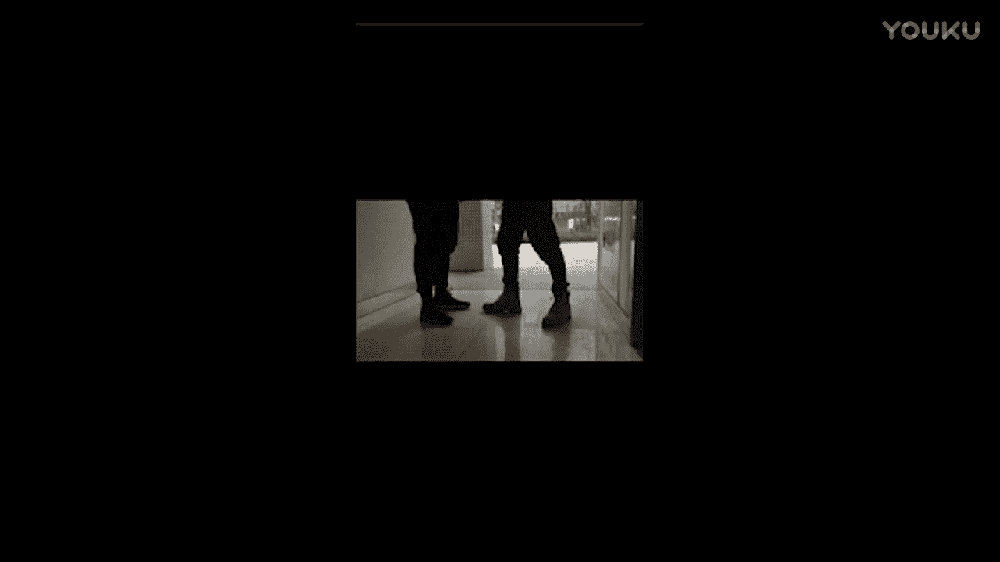

好，我们看一下。好，可以了。好，就我走出来。好，OK那么你最后看完了以后呢，你就可以来进行先先制先选一个软件叫做life这个软件。

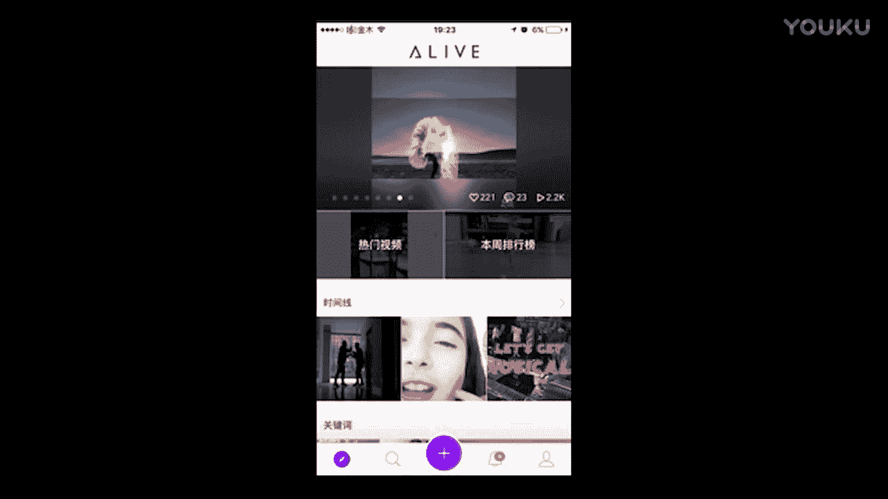

呃。

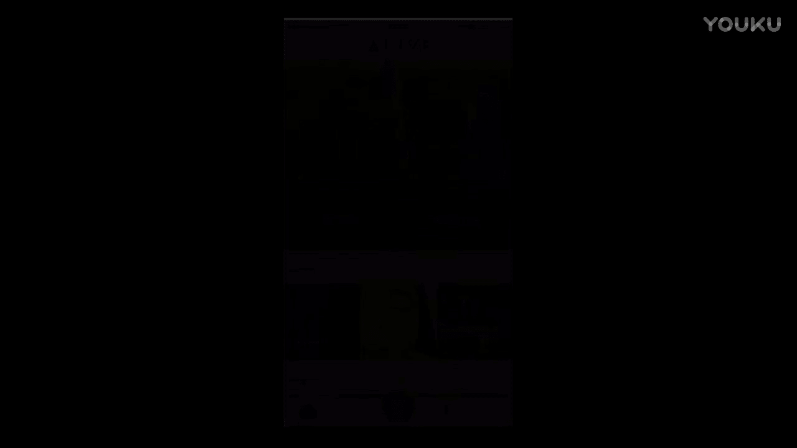

我先把这个手机打开啊。

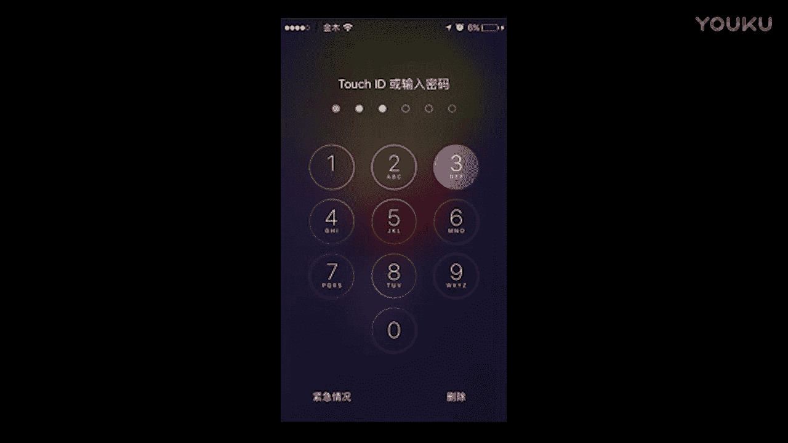

呃，暴露了这个王宁的手机密码，然后。这个软件呢你打开了以后，你首先需要去注册一下，叫做live，它的这个图标呢是长这个样子的，就是这个就是左下角有一个小一这个符号。

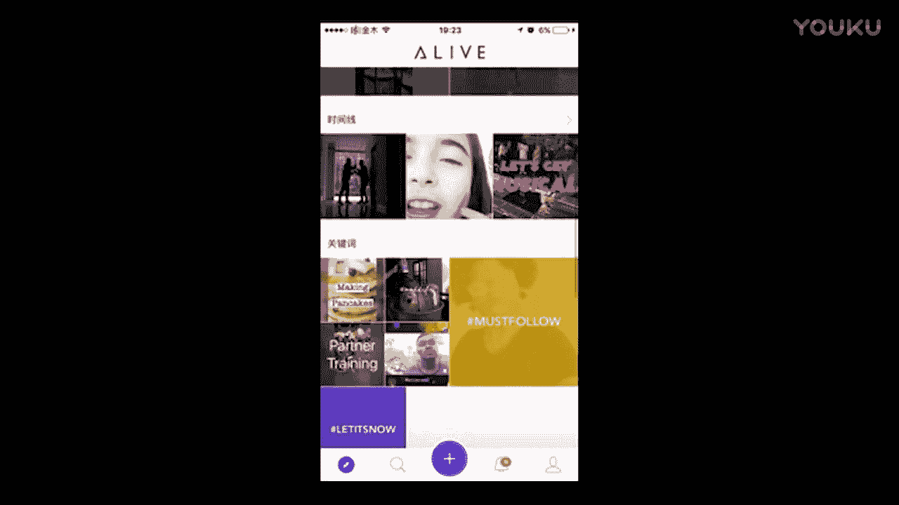

啊，就是这就是这个就是这个。呃，aive，然后下完了以后，你把它点开，需要去游邮箱注册。注册完以后，它最底下有个小加号，那么你可以点它这个小加号。

然后呢，你可以选择用两种方法拍摄。那么第一个呢是用这个屏幕去直接用这个软件直接去录制。那么第二个呢是你可以用拍好的视频进行剪辑。那么我一般推荐的是第二种这个方法，就先去把它先先拍到手机里面。

然后去再去剪辑。

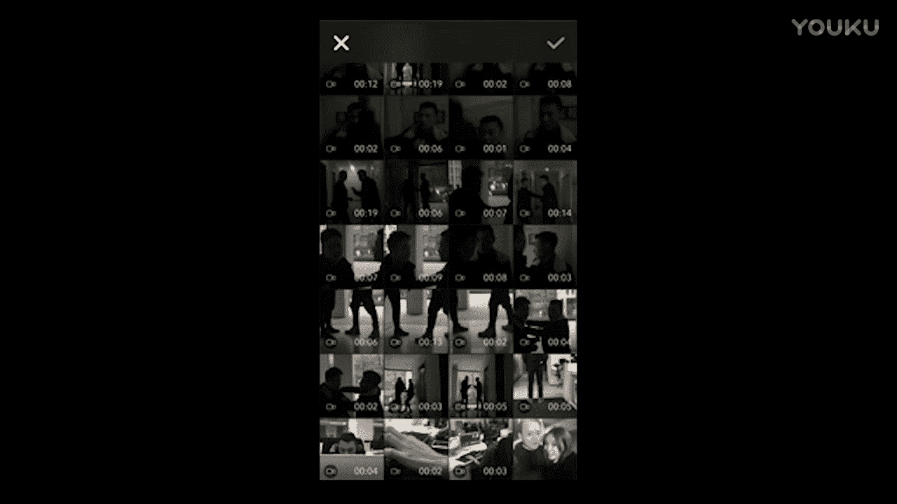

那我们现在开始跳画面，一般的话你需要一个分镜稿。那么因为我们拍的这个东西比较少呃，所以的话就是我一般都是就是直接唱脑子去记。那么这是第一个。第二个他把我推落去。第三个我弹脚，然后。

然后谈讲完了以后，第四了是我去。呃，去打他打完了以后呢，然后这个第五的画面呢。打完他以后呢，然后他一。哎，我看一下。打完他了以后，对他又打完他了以后，他又把我这个推回去。嗯。开先两下。哎。

我想看一下这个画面是不是。是不是对的？第三个。😔。

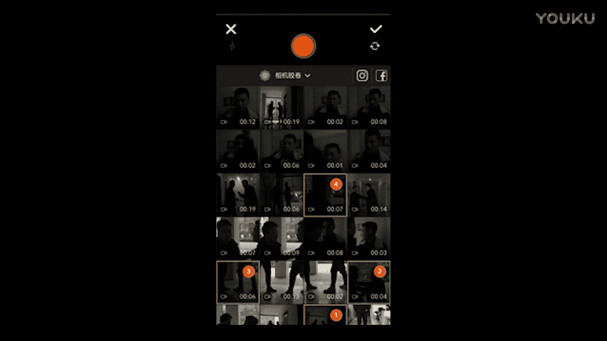

嗯，这个画面啊看一下。好，开始。

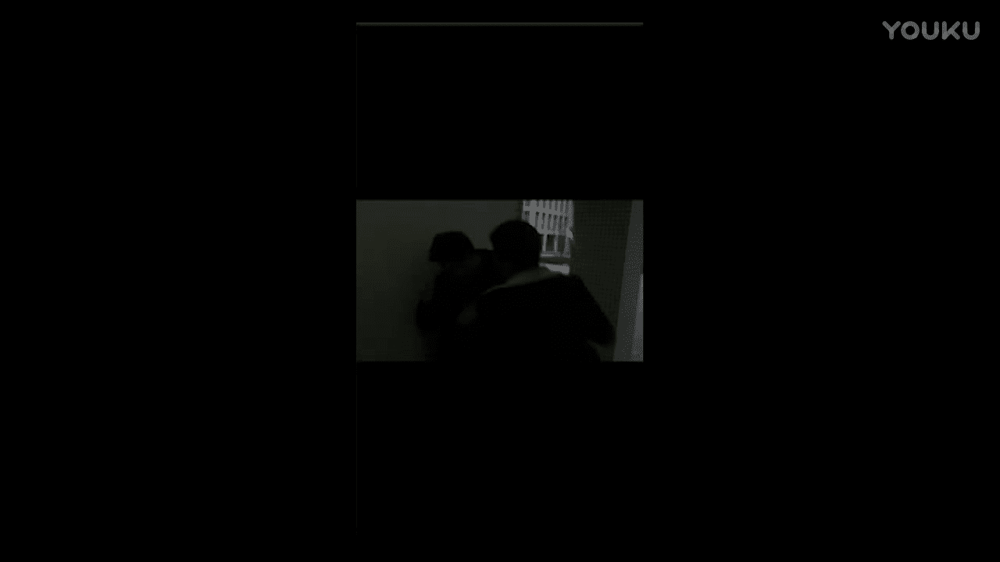

好这还没是对的。那就是这个画面，然后。

呃，下一个呢是是这样的一个画面，是我把它要这个推回去。然后最第三是指了最后一个是我最后打完一个完美收场。好，你马上你把这个画面点这个右上角对都有，它就全部加进去。

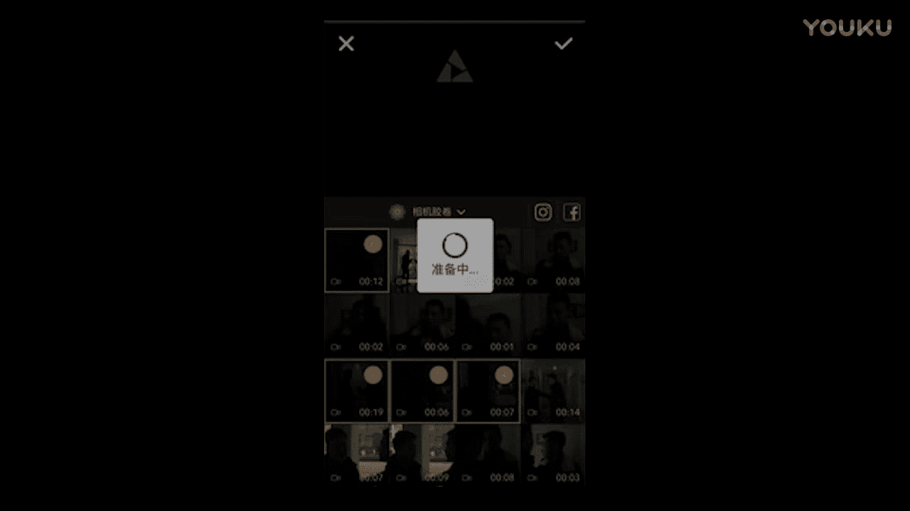

那么加进去以后，你可以剪辑，你可以按左边这小剪刀按一下，它就会变成这样一条视频。那我们就可以来剪急。哎，我把它打回去。好，打完了以后，然后就从这儿开始。那我们就要把中间的这个部分要把它剪掉。

那么我有个洞势在往后，对吧？那我先就把它打这里，然后我身体还没有挨到墙。那么这个时候呢，这个我们换了一个警别，他又要开始往后。好，就到这儿，让一些把爸墙上让我一个动势，哎，我去踢他。我去踢他那一瞬间。

定嘱。把减掉，让我们从这开始提。好，我们开T来这角这样有的动势在这里。有了动视。从这说的。一下。然后就从这就没了。然后。嗯。然后呢这也是个动势。这是我的这个拳头一下上去。好。

然后然后我我在这打了一拳他以后呢，然后他又把我给推回去了，看到没？他我一下就一下推回去，然后开始打我。叫他他他。他这大。嗯。这个灯一明一暗。就是我们刚才录的那条。好，然后再打个照。看。

然后我们就开始进行这个反杀状态啊。我们这开始反杀状态。好大勿下，我就一下对着他。这我把这个。枪这手机就指着他，然后紧接着。我们就是那个打火机的画面。好，这时哎，这时火火打响。好火大招。

那我们就从这个画面开始啊。我把这个拉过来哦。把这个不需要的画面。都给它减掉，我们只要这一下。就是怕。好，我们找要这一个画面。然后完了以后呢，然后我们再接最后一个画面。好，我们就从这儿。我问一下那个。

承然。然后这样一枪把他打下去。最后呢我就拿出了一根烟。然后放到嘴上面。然后这个整个一条视频就算是结束了。好，就定在这个位置。然后我们点击这个这个最下面的这个勾，我们点完了以后呢，我们就挑滤镜。呃。

调完滤镜了以后呢，我们可以来看一遍。我讲完。然后整奏就结束了。那么这时候呢画面会显得很干，你需要配一个音乐在里面。哎，好，然后我们接着往下走，就是我们选滤镜以后呢，然后我们需要选一个音乐。

就是音乐其实也是挺重要。那我们选我们挑了一首它自带的音乐啊，我们现再来看一遍。好，然后基本上呢这一条视频就算是找定了，基本上这条视频就是找定了。

呃，然后呢我看一下，然后这时候呢你就可以点击这个完成。对吧，然后他就会保存进去，保存进去以后，你把它这个下下来就OK了。但是我觉得这里还是在我剪辑的这个过程当中呢，我觉得还是缺了一点什么东西，我再来。

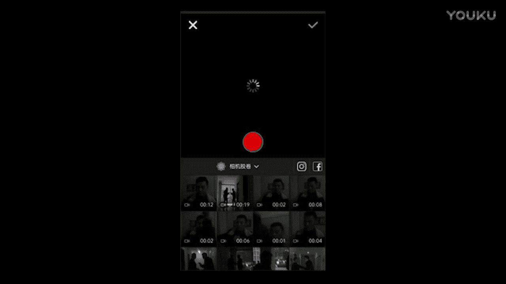

再来尝试再来检一遍啊。嗯。123。

啊，是。我。5。

6。等一下，他把我推过去了后。这个画面。王力宏在。

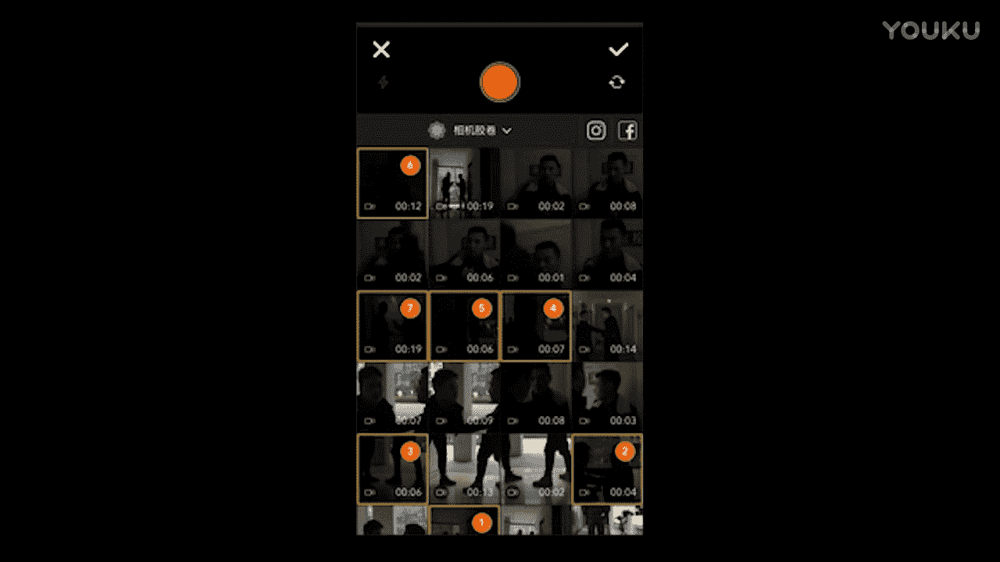

好。好，最后呢。最后他会到这里面。最后他会被加到这里面，然后你把它给下载下来。

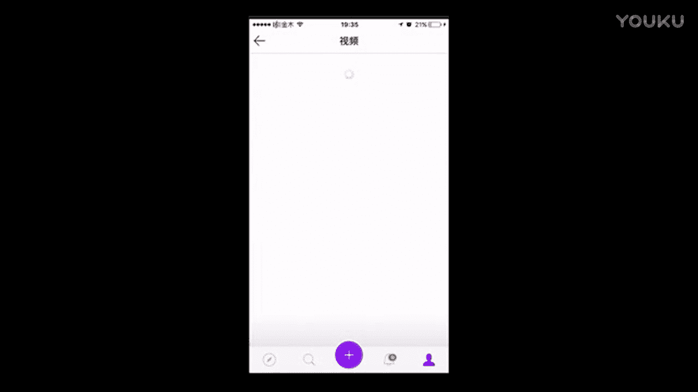

然后他又会保存到你的。

这在相册里。

还有。

哈。好，这一条视频呢就这个制作结束制作结束。好。

