# 1、012017年《正冉装逼》课程：第十集__如何修人像

好，那么我们呃上节课呢讲了如何去修风景。那么这节课呢给大家来讲一下如何去修人像，去修这个人像啊，这个人像其实是很重要的一个。因为你的画面呢就是不能太过于风格化，不能太过于风格化。就比如说像是这张照片。

那么我该如何去修呢？好呃，也因为我首先觉得它的色调就不是很好啊。那么这时候我觉得我再看一眼。

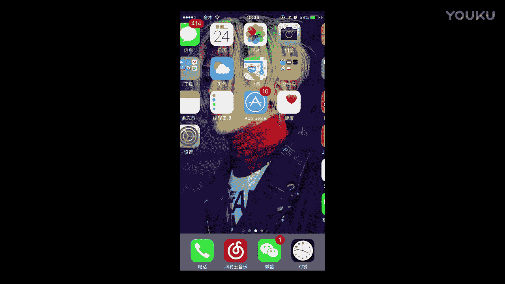

我发现我的脸其实并没有什么可以修的成分在，因为我这个头都已经养成这个样子了，所以的话也没有什么正脸，也不用去修这个女的那长长得有点难看。但是呢。

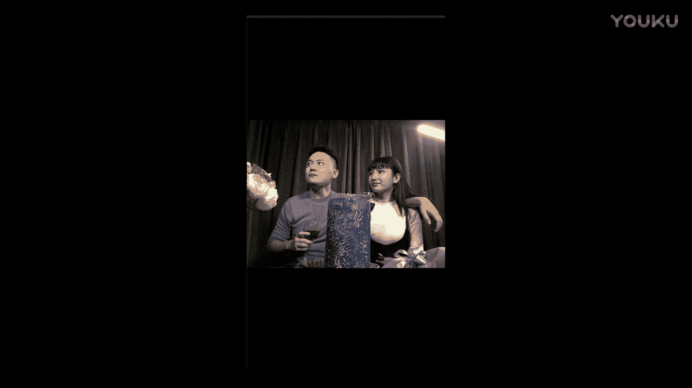

呃，从知识角度啊有点像阿凡达。那我们两个阿凡达在这里。

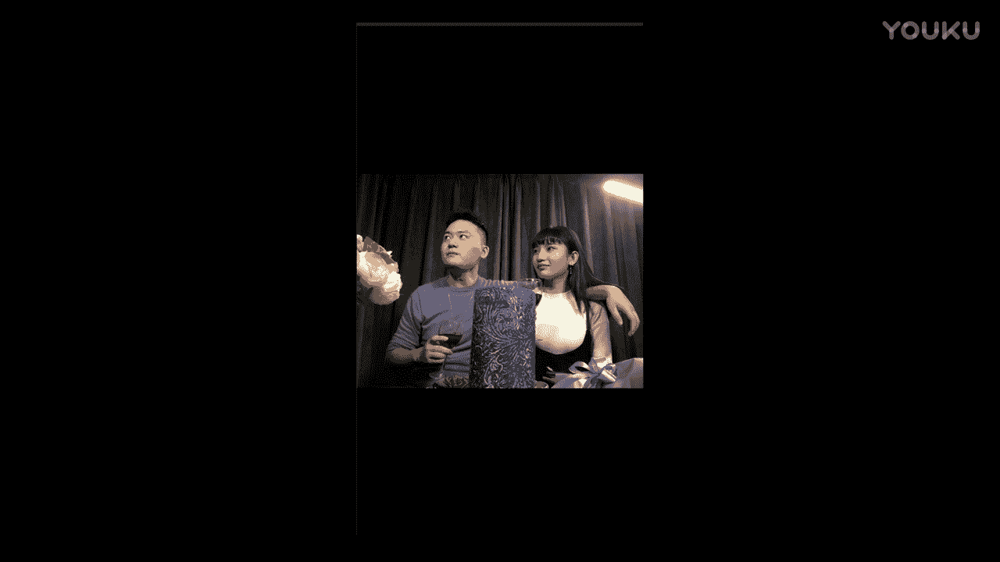

它的色调肯定不是这个样子的那我们来继续来讲这个人像该怎么样去处理。那么处理人像的时候很重要的一点就是人的这个肤色。就是因为你调这些风景照片的话，你可以随便去调它都是没有关系的。但是一涉及到人像呢。

它就会有一个肤色存在。

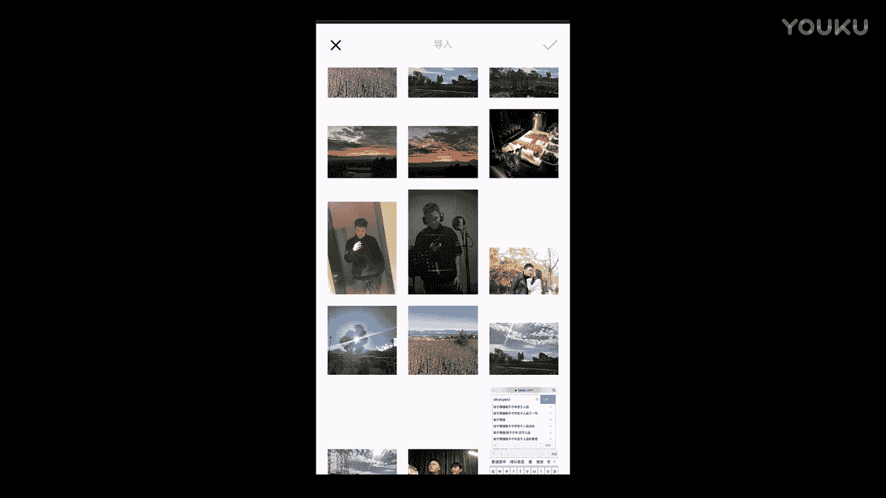

就比如说像是这种的，哎，我的头发也看不到了，发发现了没有？如果我一点滤镜的话，我的头像就融为一体了，跟后面就只有一张脸在这儿就很奇怪。那我们怎么样去把它色调移移成正常色调呢？我觉得这色调应该。

有点偏暖了，我觉得稍微应该冷一点。首先我增加一下我们的清晰度啊，这人像的话，你就要稍微小小增加一下下就可以了。然后饱和度饱和度我看一下，饱和度不用去动，它的颜色都是正常的，除除了它的色温。

那么我们现在来调色温，我把它调冷一点。哎，我稍微把颜色往冷调了一点。好，然后。把合动呢稍微偏点暖，把肤色稍微中和一下。综和一下肤色。那么色调呢。色调的话，你可以稍微往绿色，往绿这里稍微偏一点点。

就蓝绿蓝绿的。How诶。好，我再抬点按角。好，OK大家有没有看到我们的原这是我原图。然后现在呢是修座的。原图修做的。也没有冷觉很。有没有等于恒？有没有感觉？有没有感觉很神奇，这是肤色，就是你肤色它越高。

你的整个像是这种肤离肤色很近的，它又会越偏黄。那么如果你越往这边呢，它越稍微偏红点，我觉得就是稍微往红偏一点，但是也不要那么红，就差不多这个样子。好，大家可以看一下对比的图。大家可以看下对比图。

立马一下整个的人物就有一个层次感，又有一个层次感。

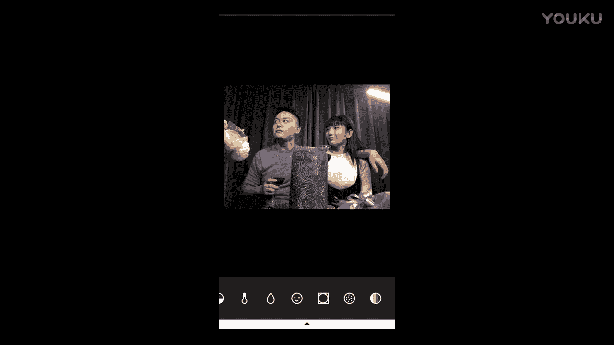

好，可以把它保存下来。好，那么第二个我们来讲一下这个。我们来讲一下这个脸。这个脸该怎么修呢？这是我这里有一张照片，这有脸啊，这脸该怎么修呢？这是说到脸就更简单。

就我们刚才有说过一个叫做face twin的软件，在我们的课其他课程里面也讲到过，但是王宁智的手机它没有face twin，那怎么办呢？这里有美图秀秀也是OK的。但美图秀它有一个缺点。

就是它会把你的身就是把你修好的图片呢，就你变得很小，就画画质可能有点模糊。比如说像这张是用单反去拍的照片。用单粉去拍照片，然后它本来是有这么几兆的，但是你如果修出来的话，可能只有几百K。这样说吧。哎。

那么修脸的话，像是我这种比较肥胖的这种的选手呢，就首先第一步瘦脸。好，如果你发现你经常把脸修歪的话，那就证明你这个放的太大了。你稍微往要要缩小一点，让指头这个选择范围稍微大一点。好。

这我把这脸稍微修了一下下啊，大家可以看到哎有很大的变化。这简直是掉了一块肉呃，掉了一块骨头，应该是。So。照片嘛？好。搞定了以后呢，就是比较烦的呢，就是他这个这这个他这个东西除皱。

他这个除的不是特别的好。嗯。感觉也还行啊，但他这只能一条一条的去处理。那比如说像这样子，他有时候也会弄得很奇怪，但是领。就没有那个face twin抹的那么匀称。啊，比比如说你修理以后就会变这两样子。

所以人决定返回啥。好还继续出证。嗯，把这个除了。嗯，稍微出点这的手的。这太假了，还有点这个法令纹还是要有。哎，差不多这样吃吧。好听。那么他因为这个他呃就他就这个因为这个东西他只能就直接就磨皮。

它一磨就整个画面都要磨。所以这个就是我很不喜欢的一点，它一磨皮就磨的太大了。还美白美白啦关了，肤色肤色就正常。我的皮就稍微被他整体把画面磨砺到。好，然后那么之后呢，你就要选到这个。啊。

亮眼对我们把亮眼打开，我们把我们眉毛对吧？稍微加深一下下。诶。我们把眉毛稍微加深一下。然后呢，这像衣服上这些铆钉comp扣s、拉链都给它加深一下，加深一下。OK那我们就可以保存下来了。

其实我觉得这张图的原图也挺好的。你其实并不需要去调色。那么如果你要调的话，你应该怎么样呢？首先我们看滤镜啊，这滤镜呢我也没有一个是我喜欢的。因为我觉得人像它不能太假。

我想就我想让他这张照片显得更加的自然。

那我们只要稍微调一点点东西就够了。嗯。然后把合洞呢稍微往暖开一点点。都要把它头稍微往暖差一点，但是让又不能让他脸上的肤色变得很奇怪。如果这样的话，我们脸成了脸就红了。就微稍微差一点。把厚度差一点。

然后色温稍微差一点。好，然后然后这个肤色呢就稍微往。往红这边偏一点点。色调色调呢我们也是稍微往这个。右边偏丁点吧。あと。我觉得这样看起来呢。是OK的，它只因为它整个颜色会变得很黄。

但相反我们的人的脸呢也会变得稍微黄一点，但是整体灿起来呢是OK的，就不太要紧。

就如果我要会修这张图片的话，我会这样我会这样去调它的颜色。就其实我觉得这张照片本来就挺好的，就不需要调。

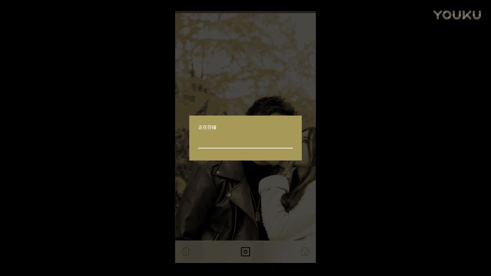

好，那我们在晚呃弄完那里以后，我们再看。我们这里还有两张照片。

那么我们选择这张，就首先我选择这张了以后，我要看一下。

我要看一下脸，那么我觉得脸是O的，就整个脸是O的，就照的刚好光很好。可能因为我手机屏幕是打开的。呃，然后那这张图图片我要怎么调呢？我们首先是选择这个滤镜，我们看一下啊。那么滤镜的话，诶，我点了第一个。

和第三组，我觉得这都挺好的。就其实这张照片我当时修的时候，我只是调了一下这个。对我觉得这我觉得这种忧虑忧虑的颜色就就挺好的，就本身就有一种厚重感。就是如说我的话，我会直接就选择致滤镜。

然后我就直接用制滤镜了。但是如果兄弟你想修的话，该怎么样呢？就还是老规矩啊。我们先来看一下这个曝光有没有影响到我们。这个曝光其实并没有影响到到我们这个曝光是正好的。因为它在前期拍摄的时候。

它的曝光量也是正好。那么对比度呢，我们看一下对比度，我们可以稍微去做一下手脚，我们可以稍微差一点对比度。然后差对比度了以后呢，我们把清晰度也要打开，但是千万不能太大，要不然的话整个人会显得很假。好。

然后我们来看一下饱和度啊。然后头我们稍微往提亮点，让整个人和这的画面把它分出来。整个人和画面人和墙给它分出来，让我们调色温，我们可以稍微往蓝加一点点蓝。那么主要呢我是想让它偏绿一点。

主要我是想让他拼绿点。好，然后他的按角本来就很大。Okay。还要看一下，这是休休前，这是休后的。修钱的时候，他整个画面会很平。然后呃没有什么特别的这样的感觉。但是你修之后呢，画面会变得很很很凝重。

就有一种就是电影的感觉，就是电影的这种即视感。然后或是你还可以做一些这种小处理，可以加点子噪点啊，对吧，噪点边也不要太太辣，稍微太小一点。带点小颗粒对吧？然后制了呢褪色就千万不要去用了。

这个因为在暗环境用的话，它有点奇怪。就我个人啊感觉。好。嗯，那我们可以把这张照片保存下来，这样照片是OK的。

好，那我们这里还有一张人像，我们还这里还有一张人像是我在。这留一个洗手间内的自拍。那么这张人像我家如何去修呢？我首先也是看了一下所有的滤镜，我觉得并没有一张滤镜是我喜欢的啊。我首先还是看一下我的脸啊。

我的脸呢也没什么地方要修的，所以就正好。那么这时候呢。哎，不对，我还是要把我的脸这个还是要处理一下啊。那么他没有face twin，我就只能用美图秀去处理。好，我打他了美图秀秀。那么继续选择这亮眼。

那我去把哪里亮下，我把眉毛亮一下。哎，这种刀锋没。好，然后把我的这个项链呢也亮一下。然后整个的这个衣服服装。这些地方都把它都把它凸显出来。还有我这个毛衣的它毛衣的这个织的这个花纹。

这里也是相当有质感的一个东西。我先把那个钱。好，我把吐出来。哎，还有我的这个底下的这个。哎，等于是不是还是很大的。开玩笑啊。等一下。好，把我的毛衣稍微涂深一点。OK我们就可以保存下来了。

那那么在保存下来了以后，你就可以继续导入进来，就导入你最新的对导入这张照片。

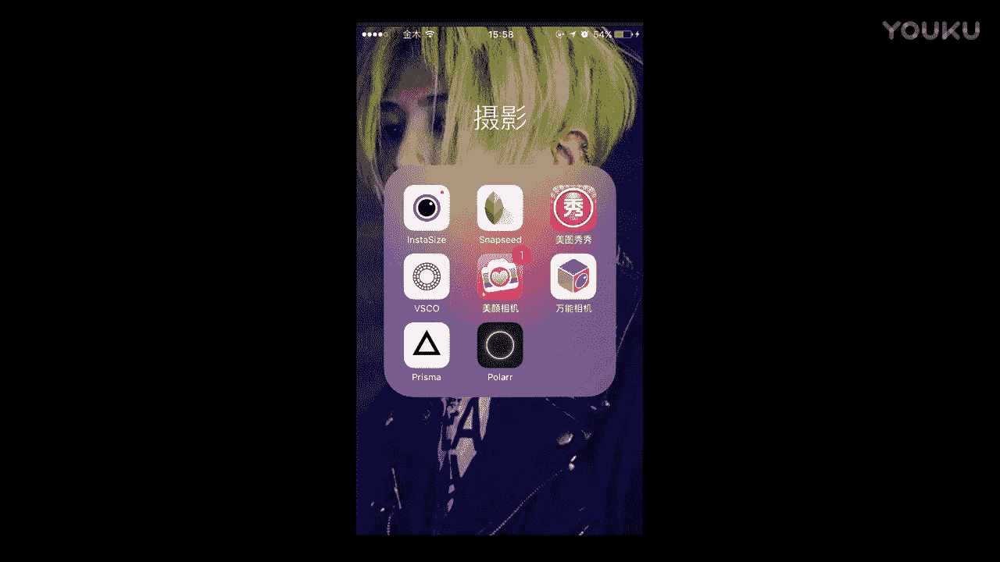

他之前的这张照片那就得删了。好，我们选择这张照片A。

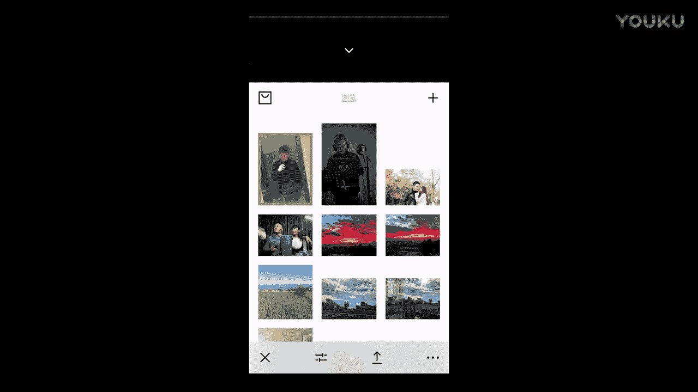

嗯其实黑白的感觉还是挺好看的，但是。还是不是很喜欢黑白。毕竟这个马上要过年了嘛。然后我们继续来，我们可以让这张照片，就我我刚才介绍两种是比较自然的这种人像。那么如果你想让你的照片更加风格化的话。

怎么样去弄呢？就是把这的清晰度差到最大。这就非常具有风格化。有没有发现？然后呢，其次你把对比度稍微再开加深一点点。好，然后饱和度呢饱和度我看一下，饱和度就也不要增加太多。然后色调。稍微绿一点点。

然后色温。可以稍微偏冷一点。Right。就是这种感觉。稍微开一点点按角。这光你可以爆一点或者是暗一点，都是OK的。稍微暗一点点吧。靠特粒再加点颗粒进去。这样风轴话呢，你叫正风着。好。

OK那么这戳一下原图。那么这张是原图，然后这张呢是很具有风格化的一张照片，就很有漫画风格。那么感觉呢也是帅帅的对吧？那么你可以保存下来。

Okay。

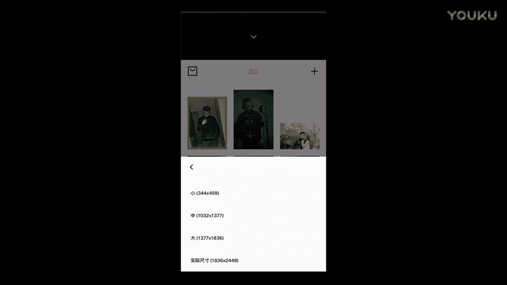

那我们就是关于这个人像的这样的一个风格化的这样一个处理啊。

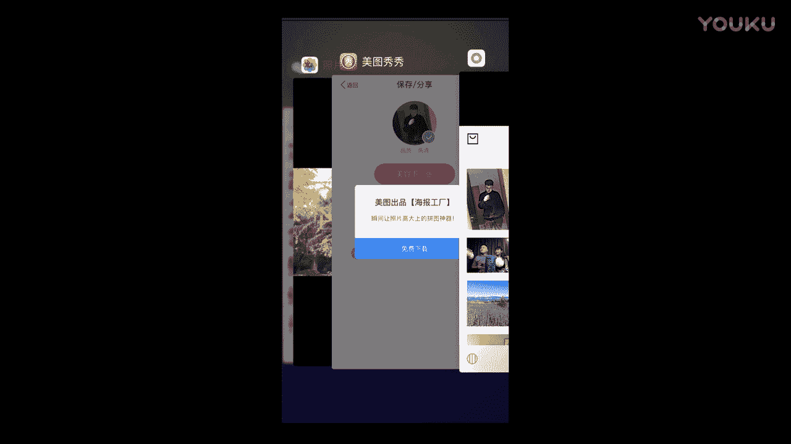

它原本之前呢是这个样子，不就是在之前，它是原本是这个样子的。那么经过你的封轴化处理了以后呢，它变成这个样子了。

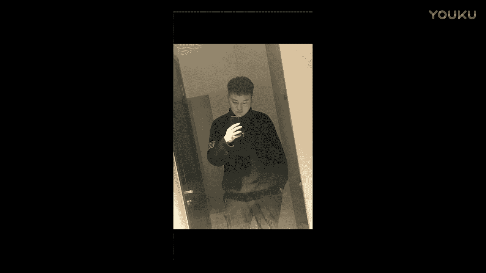

好，这也希望大家还是有所这个获得。好，我们这节课先到这里。

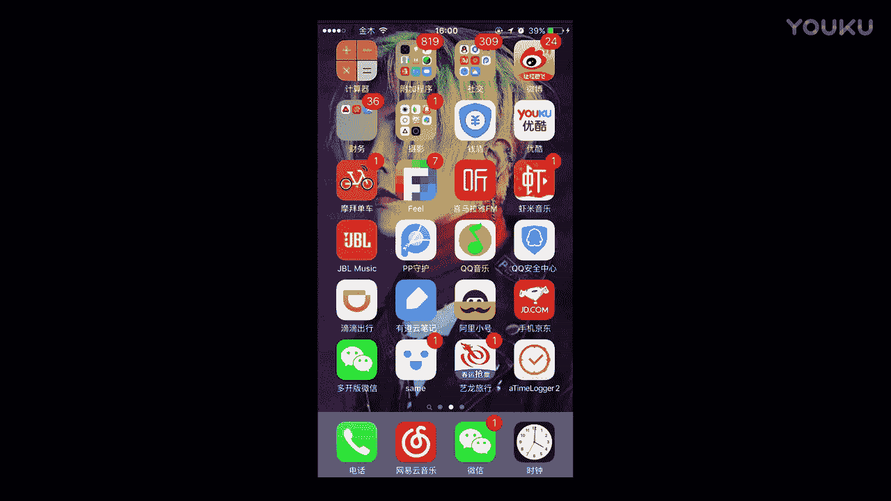

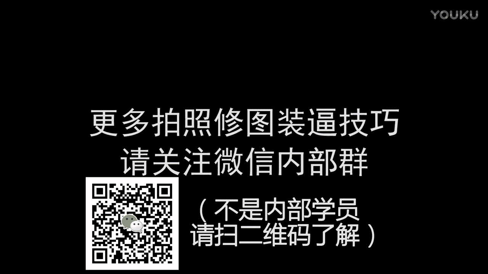