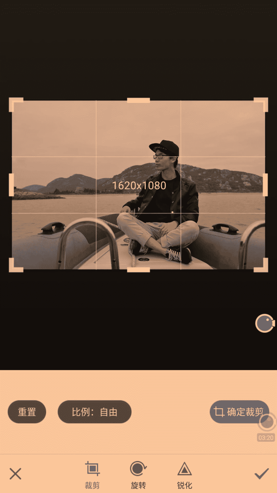
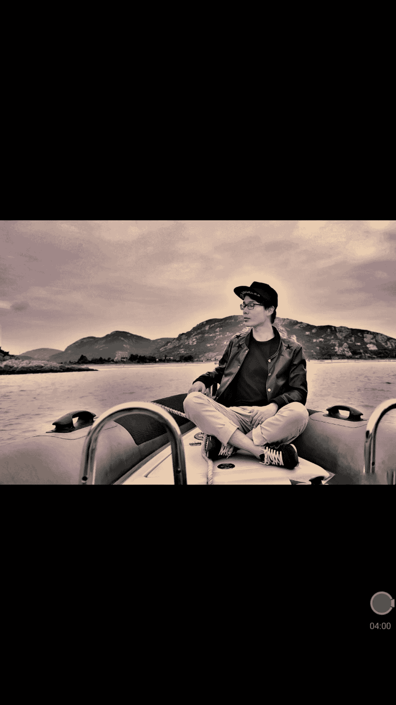
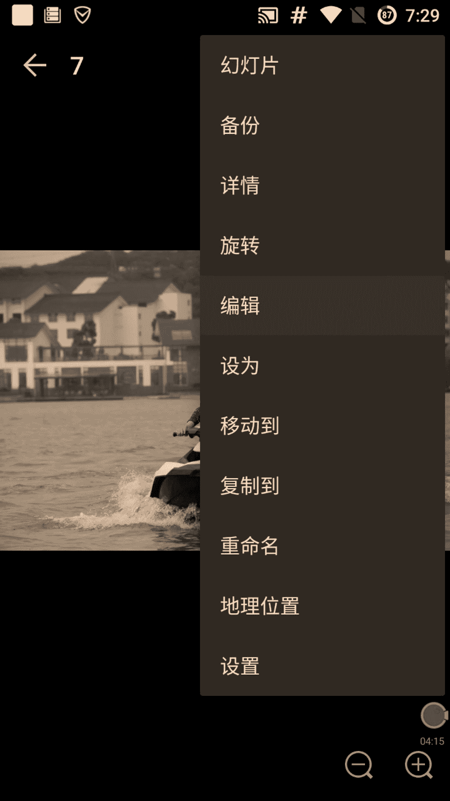
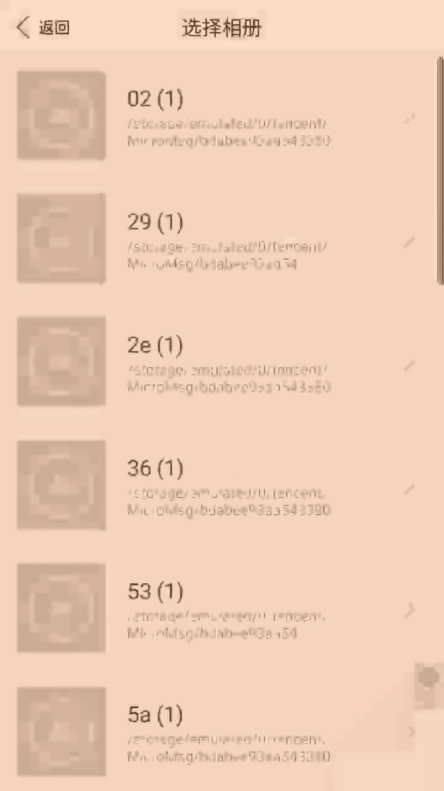
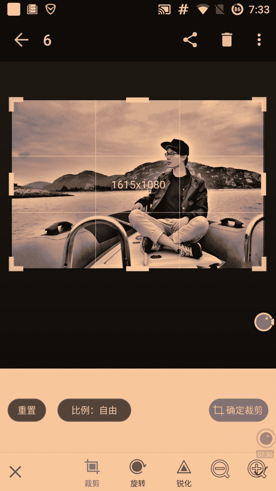
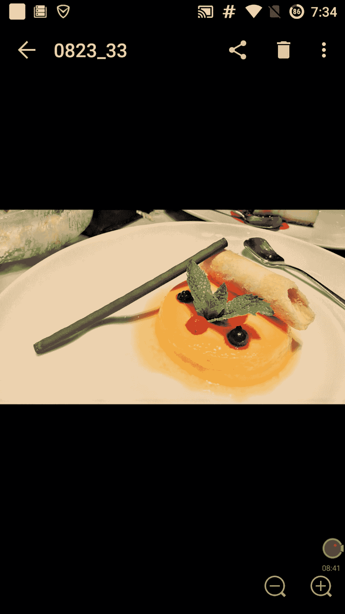
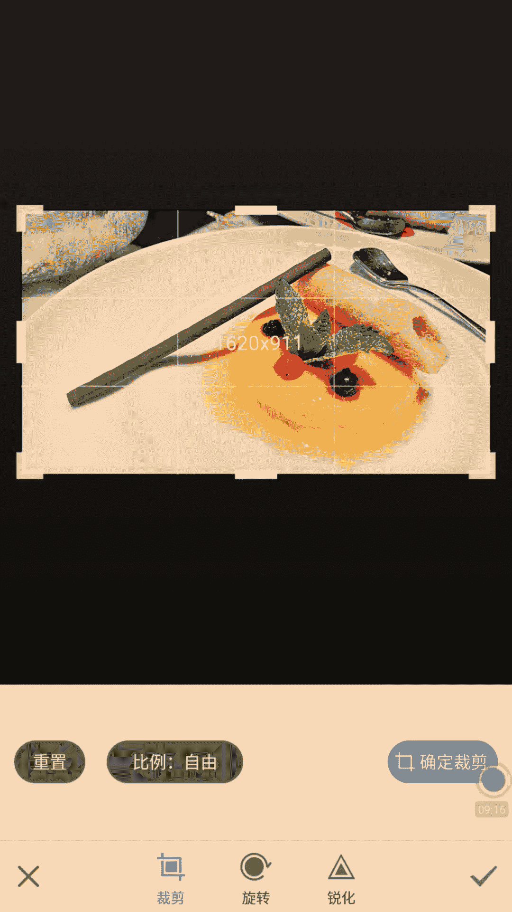
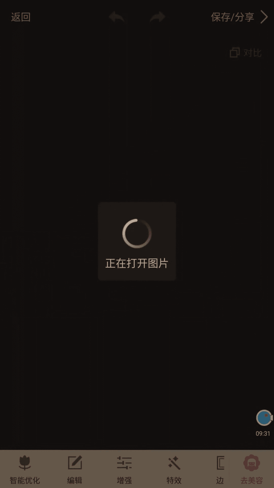
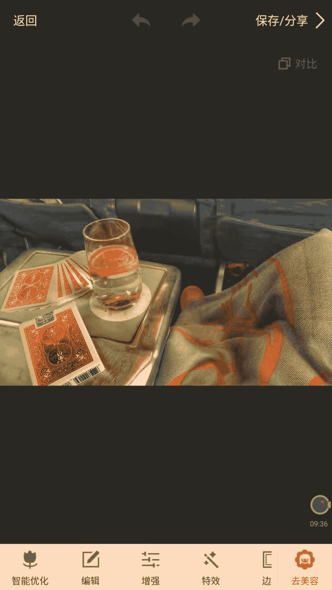
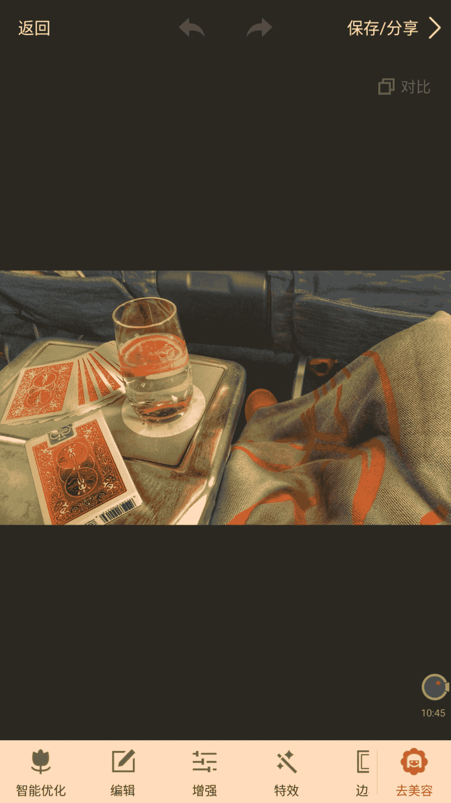

# 1、02niss《修图黑科技》：第一节，基础构图与剪裁构图（12分钟）

嗨你好，我是miss。今天呢是我们的修图课。第一节。但是第一节修图课我们不会去讲修图，而是来讲一个构图。构图是以呈现一个好照片的一个基础。那很多的人哎跟我说，哎，miss啊，我也跟你一样。

也是拿手机拍照片，我的所有照片都是拿手机拍的呀，轻松修一下，对吧？一分钟2分钟就可以修好的这也是我这节这个一系列的视频要教你们的。就是说你们上完这个视频课程之后呢。

你们也会你们的所有照片也会像我的这个一样，包括去拍呀，包括去修啊，而且很快整个过程就一两分钟就OK了。😊。

啊，那很多人也是用手机拍，我也是用手机拍，我所有照片都用手机拍。但是为什么拍不出那个感觉，拍不出那个效果，拍的就很杂乱，食物没有食欲，东西没有逼格，哎，感觉就不很不是很酷。为什么？因为他们不会构图。😊。

构图是一个潜在的一个东西，它是一个感觉，但是它也有很多东西是可以学习的。今天呢我要来详细的告诉大家如何去构图，而且非常的好学，非常的简单。为大家总结成一些非常嗯。😊，非常非常好理解的方式来给大家讲解。

😊，大家先看一下我们这个呃发朋友圈的时候，哎，这是我们平时会用到的一些照片啊，那这些照片呢实物让你有食欲。那好玩的东西呢会让你觉得有趣，这样子很酷酷的东西，让你觉得很酷。我们来看一下。

你觉得那些朋友圈里面发那些照片都很酷的人，你是不是也会觉得他们这个人就是一个很酷的人，是这样的吧。你看那些美女，她们发一些很高逼格的照片，你会觉得啊这个姑娘是很有逼格的。😊，那同样的。

如果你也发一些这样的照片的话，姑娘也会觉得你是一个很酷的人啊。那废话手说，进来我们来看一下什么是构图。首先。😊，构图的话，首先我们拍照的时候哈，我建议大家去用这个东西，这个叫构图线来看这个地方。😊。

这四个点看1234啊，这四个点是这两个横线交叉的地方。那这四个点我称之为关键点。那打开构图线非常简单，我们拍照的时候，在相机设置里面打开一个叫网格线或者构图线的，你们就会出现这个横竖这样的格子啊。

那格子之之中呢会有这四个交叉的点。那这四个交叉的点是关键点，为什么叫关键点。因为我们要把这个重要的东西放在这个关键点上面来看，就是这四个点嗯，四个画圈的点，我们来感受一下，首先这是一张原图没有修过啊。

构图也不是特别好啊，然后下一张就是稍微修了一下，然后改了一下构图。大家看这两张照片其实是一张照片啊，是一张。你们看人的位置其实是有变化的啊，那这个具体怎么做，下一节里面会教大家啊，那叫变形构图。

是一个非常黑科技的技能，能让你的构图变得更牛逼。那这一节呢我们教大家一个基础构图和一个新的构图方法，叫剪裁构。😊，构图就是你本身照片拍的不是很好，但没有关系。我们通过后期的剪材来让你的构图变得很好啊。

那么先来看一下这个例子，看这就是一个普通构图，这就是一个比较好的构图。你看整体的感觉就不一样。后面的这张明显更让你感觉大气舒适，前面一张就感觉有点憋屈，感受一下。那为什么呢？

我们来看一下前面这张呢能大家能看到吧，这个两个关键点上面都没有东西，我人也不在关键点上，所以你并不知道我这一张张照片呢主体在哪里，你又觉得哎很奇怪，莫名其妙的一张照片。但是这张照片呢，我们看一下。😊。

两个点两个关键点上面看。都是我。所以大家很明显的可以看到这张照片的主体呢，就是我你能感觉到啊你的注意力就集中在这一条线上面啊，然后你能看到这里就是照片的主体。😊，然后你会感觉整个照片非常的磅礴大气。

这个船的方向前进的方向，你看船是尖的，所以这个照片。😊，就有一种那种往前前进的那种感觉，明白了吗？前进的方向正好是这个两个线，就是这两个点构成了一条直线啊，那么来进行一个实际操作啊。

就是说你看我们有一张这张构图不是很好的照片啊。😊。

构图很歪，那我们怎么办？我们先首先我们来介绍这下软件吧。我们这个整个系列视频呢，我们会用到三个软哎，就其实就用到两个软件，一个就美图秀秀，看这个叫美图秀秀。😊。

啊，非常简单，大家应该手机里面都有啊，我们后面还会介绍一些黑科技的功能。那还有一个叫snapseed，这是一个非常好用的一个软件，非常全能。它其实可以在呃除了美美颜，美颜不如美图秀秀以外。

其他的方面都是可以替代美图秀秀的。但是因为我们有的时候需要美颜嘛，所以我还是要用到美图秀秀啊，而且美图秀其实很方便，比这个snapsed有些时候要方便啊。那么这也先用美图秀秀来进行教学。😊。

打开美图秀秀之后呢，我们来选刚那张照片。😊，刚那张照片在哪呢？看一下啊，第一节构图与剪裁OK。

刚那张照片在这里看。😊，我们先来看一下这张照片的构图是什么样子的，非常的不好啊。看我们四个关键点上都没有东西啊。😊，啊，这张照片如果我们要在关键点上凸显东西的话，就很奇怪，看就会成这个样子，它会很奇怪。

所以这个时候我们要用另一种构图方法。我们第一一开始讲的这个四个关键点的这个构图方法是第一种构图方法。第二个构图方法呢是。😊，让这个东西呢出现在这两条线，看这两条线之间或者上面这两条线。

也就是说出现在这个四个关键点之间，一个东西平均的出现在这个4个关键点之间。首先我们要调整构图的话，我们要选一个画面比例。那比较不错的比例是大家可以选择16比9这个比例看在这里选择比例，正常是自由的嘛。

我们给它选成16比9OK这是一个比较好看的比例。😊，电影的话正常都是这个比例的。然后如果是电视的话，大家一般都是16比10。大家看我们这个明显这个地方右边是偏着的，右边大，那左边呢就太窄了。

所以我们要把这个框缩小缩小缩小缩小。哎，往上缩。OK这样差不多大，因为整个我这个模子艇呢是在转弯的，所以我这个右边可以稍微大一点，给大家一种想象的空间，对吧？我在往右转的这种感觉，左边可以稍微紧一点。

大家可以看到右边稍微大一点，左边稍微紧一点。然后接下来呢我们要。😊，把我们的重心凸显出来，我们的上面这条横线代表着我们的重心视觉的重点。那么我们一般把上面这条线呢对准我们的眼睛或者眉毛那个位置。

就差不多这个位置，眼睛稍微往上一点，接近眉毛的那个位置啊，看我们现在就在这里，然后只需要轻轻的一下剪裁，把。😊。

然后哎它就出现了，我们来看一下原来的照片是这样的，没有目的，没有重心，我们不知道他想表达什么。但是我们检查一下，突然哦。😊，重点就来了，你看这张照片的时候，你不会去看到别的任何东西。

你只会把重点注意力集中在我的身上。明白了吗？再看一下之前的照片，你可能看后面的楼啊，看看这里啊，看这个起重机啊，看一些乱七八糟的东西。但是你看这张照片，你只会第一眼就是可以看到我。

这就是一个非常神奇的地方。😊。

也就是我们这个呃修图，就是说剪裁构图的一个核心。通过这个四个关键点来定位我们的重心。我们可以通过这样的呃把那个重心放在这个关键线上面，关就是关键点连成一条线上面。

也可以把这个重心呢放在这个四个关键点之间，看正常来说这是四个关键点，我们把重心放在这里边，这样的话也可以很好的表现出来。那么只要稍稍的这样P一下OKB格瞬间就有了，是吧？😊。

那我希望大家能好好学习这件内容，只需要一个好很简单的一个剪裁，我们就可以做很多很多的事情。大家记住我们的这个四个关键点，要么我们把东西放在这个四个关键点上，要么我们就把东西放在这个四个关键点中间。

然后这个东西呢。😊，距离四个关键点，距离就是。左右相间的距离就是平等的。然后如果是这个东西，比如说像刚刚那样，我的那个模托艇是在往左转OK那我就。😊，往那个右边多加一些空隙，左边少一些空隙。

如果是平行直线行驶，那我就左右距离相等，明白了吗？要让大家有一种那种动态，要让大家感觉到这个东西是在往哪里行驶的。嗯，这种感觉那我们修实物也是一样的。修实物的话，我们可以看到我们。看啊。

给大家找一个例子。看这张照片吧。

这个是我拍的时候就会去想一个图，为什么呢？因为我拍的时候是开了网格线的，所以我能很轻松的去把这个图片给构造出来看。

我整个这个甜品。他的眼睛这个地方是卡在这个下点，然后上点是什么呢？上点是相当于这个下面这个黄块跟上面这个脆脆皮的这个交界的地方。所以你看到这张照片的时候，你的重点就会集中在这个地方。

你会集中在这个右边的这个黄色甜品上面，就会感觉很可爱。嗯，那们别的东西也是这样的，那我希望大家能够去多多去练这个呃构图，构图，明白了吗？😊。

这样的话能让大家有一种很好的这种直觉。那包括这张照片，我们可以看一下，拍的时候就要把构图拍好。那如果你没有拍好的话，我们可以在后期拯救，这都是OK的。我们看一下。

构图什么样的？看。

很明显就是这个柠檬水就是中心，对吧？我们再来看一下这张照片，你看的时候，你一眼就会看到这个柠檬水。😊，第一眼是柠檬手，然后第二眼是扑克，为什么会看到扑克呢？因为它的颜色比较鲜艳啊，还有这边的拖鞋啊。😊。

你们会看到这些，那么。😊，我们通过这个构图呢能够展现出来别人第一眼看到的东西。我们通过构图能够控制别人把注意力放在哪里。你看一个美女的时候，你假如说他那个身材特别好，你可能会看他的胸，看他的屁股。

对不对？如果她长得特别漂亮，你可能会看到的的脸，那姑娘可以控制啊，明白了吗？他假如说今天想让你看她胸的话，他把胸哎，故意这样堆的比较大一点，那你就看他胸了，对吧？那假如说他今天想让你看他脸的话。

他把脸画的漂亮一点，那你就看他脸了，明白了？我们现在也是要制造出这样的感觉。把这个通过构图来去凸显，我们要凸显的东西啊，那这是一个剪裁构图，下节呢，我们加入大家一个非常黑科技的技能，叫变形构图。

那么我们下节视频再见，我是，拜拜。😊。

