# 1、02niss《修图黑科技》：第三节，食物与景色修图大法（35分钟）

嗨你好，我是n。那今天来教大家如何去把这些可能是实物呀，也可能是这种景色这样的图给它修的比较有逼格，有特点，而不是说很普通。然后下节课会教大家怎么去把人像修的有感觉啊。

那其实我们去修图的话是有一个固定的一个过程的。但是修图之前你们一定要明白修图最重很重要的是一个底子。我一开始没有教你们怎么去拍照，而是我我拍照呢，怎么拍照这个角度姿势，我放在最后来讲，为什么？

因为这个东西你首先要知道什么样的照片是美的，把照片放成什么样子是美的，你才能去去构造这个好的照片。然后拍只是一瞬间的事情，明白了吗？先是去构造它找角度，然后去填充这个画面啊，那我们可以看这张我给你看。

就是举个例子啊，比如说我们要拍这个景物的话，就像这个那大家一看一重心就是重点，我看这个的第一眼，我的重心就在柱子上。为什么我们之前给大家讲过我们的构图线嘛，你们看一下。Yeah。他。看这个点。

这个点都在这个柱子上，两个核心点都在柱子上。那么你的重就是目目光一定会集中在这个柱子上。那我再给大家举个例子啊，比如说呃举个有趣点的例子吧。比如说这张图你第一眼看到他的时候，你的注意力集中在哪里？

你的注意力会集中在这这个牌上，就是这个7。这个牌上啊，那我只要把这个图呢稍微你你第一眼看到这个牌的时候，最吸引你眼球的是这个七方便7。然后第二页你可能看到排河啊，这个柠檬水什么的啊。

但是我们如果把这个图呢稍微的剪裁一下。

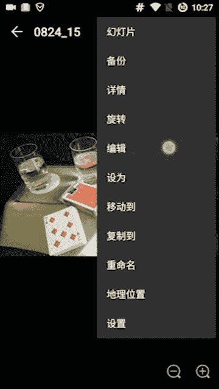

嗯。哎呀，我们按比例剪裁啊。按比例检彩。

如果我剪裁成这个样子的话，你看到这张图的第一眼，你的注意力就会集中在这个排河跟这个柠檬水上面，而不是这个漆上面。就同一张图我稍微检查一看，这张图第一眼绝对是在这7上面的。

但是这张图呢第一眼就在排河和柠檬水上面了，就是这个构图线的问题。大家可以看到。

哎，我这个构图线的两个重心重要点呢，一个是在这个水上面，一个是在这个排河上面。所以你们的注意力就会集中在那里。

这是一个非常神奇的东西啊，你们一定要明白这件事情，然后我们再去修图。因为你只有明白了这个这个就是构图的这个方式，你才能更好的去就像我们之前讲的去剪裁它，然后把这个实物因为你如果拍这个实物或者是景物的话。

你要突出的是一个重点是吧？也不可能比如说我想突出这个柱子，然后别人一看哎呀。😊，别人都关注点都在这个后面的小石石碑上面，那就完了，明白了吗？包括食物也是我们要突出这个东西它的好吃，对吧？

不能说突出一些别的东西，明白了吗？很多人他不会拍拍照拍的不好，不是说因为他怎么就是确实是烂，而是说他没有办法去突出这个主题。我看你照片的时候，我不知道你以想表达什么哦，那就完了，明白了吗？

所以我们要通过这个呃构图呢去控制大家，第一眼看哪里。然后我们来讲一下这个修图啊。

那么这些都是原图，大家可以看原图就一定要拍的很清晰，明白吗？这都是拿手机拍的原图。那你们可能一开始拍的没有这么清晰。那没有关系，我们来看一下啊，我们举几个例子，首先比如说这种的背景不白。

背景是偏黄或者偏暗的，就是这种偏暖色，就比如说蓝色呀，这种比较冷的，也这种叫比较冷的颜色，黄色呀、红色这种就是偏暖的颜色，如果背景不是白的，然后是这种偏。😊，暖的色。

比如说我们可以看到这个外边的这一圈都是那个黄色的那这种时候呢，我们用这个第一套修毒方法怎么样？你就先用美图秀秀打开它，你在美图秀秀里面打开，我从这直接打开也是一样的啊。先美图秀打开之后呢。

你先用这个特效。好的。看特效哈，你你就点这里有个特效，特效之后有个HDR。非常简单，你点一下它，然后这个调到70这个指针嘛，你调到70，不要太高，不要太低，就70足矣。然，确定一下，这是第一步。

第二步呢点这个智能优化。那智能优化。有的时候你看你看这个时候会让这个画面变得更黄，智能优化它是不一定，我们永远只用自动的就可以。因为美食的话，它发挥不稳定，明白了吗？我们自动我我就是修了这么多图了。

我感觉最稳定。我们会看到两种情况。你看本来这个图是这样的。那么用完自动优化了之后呢，它会变成更黄。这个时候是OK的，明白了吗？因为背景本身就是黄的，所以我们用自动用化让它变得更黄，这是OK的。

我们再摁一下这个自动优化。那是后来我们会讲到，如果背景是白色的话，我们一定要自动优化，把它变白。如果白色背景之后呢，它自动优化之后变黄了，那我们就不要用那个自动优化了。这个待会儿我们会讲的。

那么我们可以找到那张照片，我们的这张照片在这里。这个是刚刚那个经过美图秀秀一下的。但是这样的话，我们只是感觉这个照片呃比刚刚的那个更富有色泽了。但是呢它完全没有达到那种有逼格的那种要求。

所以这是我们要打开用snap seed打开我们这个软这个图片哈，大家可以直接点开用snapse，然后点开它。那我们接下来就是很重要的。我们用snapse，可以就是P出不同风格的照片。

我比较喜欢实物的时候，我比较喜欢用这个戏剧效果。看马上有逼格。我们一般的话，因为是实物的话，我们一般用这个戏剧二明白吗？人物的话一般来说会用戏剧一啊，实物的话，戏剧二会更有这种呃张力。然后看这是原图。

但是我们修成这样就太太差了，明白了吗？就成这样的话就太那个完全没有食欲啊，你感觉这是什么？就像给死人吃的一样，这不行。我们看一开始我们要往下滑这个屏幕往下滑，上下这样滑滑到饱和度这边。

那饱和度是干嘛的呢？饱和度越低的话，你看图片就会越黑白，就像一像一样，饱和度越高的话它就越偏红越暖，明白了吗？那所以我们如果P人像的时候，比你看我们的皮肤我们就不要把饱和度弄太高，不然的话。

我们的皮肤就会很红，很很不好看。那这张图呢，我们继续找这个点，一开始默认是40，默认是40呢，这个明显是不行的。我们要让这个红我们这个图，我们要表达的是什么。😊，突出这个红色，它的这个鲜艳。

这个红色的点和这个红色的点会突出它的食欲，明白了吗？为什么会这样呢？我给你看一下，这个就是我们之前讲的那个构图的重要性看我们的这个关键点在这里。关键点在这个红色的部分啊。

所以说我们这张图如果把红色突出了，那么OK你的食欲就出来了。我们来试一下啊。我这个说的话你们可能感觉不到，但是我们试一下这个一看呢不是怎么有不怎么有食欲，呃，是逼格是有的。我们把这个红色突出一下。

OK我们要控制这个度，因为我们P大了的话，红色是有突出。但是呢这个我们的手也变色了。所以我们要控制一个度。我们可以看到大概在这个8左右的时候是1个8九这样的时候是一个很好的值，我的手没有说变得很红。

然后我这个红色也有比较大的一个突出。我们可以看一下，这是原图，这是现在的图，我们会感到它就明显是更更有食欲。这种让你想去吃的这种感觉。看原图的话就很平淡，没有那种张力，没有那种招你过去的张力。

但是呢现在弄完了一下子。这是原图，一下子哇，现在有张力了。为什么？就是因为我们把这个红色变得更突出了，所以它就变得更有食欲了啊，你们理解了吗？你们可能不太理解，我们再来举几个例子啊，这是一种概念。

你们慢慢的去理解这个概念，不用着急，我们先找关键点，然后看关键点上是什么东西，然后突出那个关键点上，我们想要突出的东西啊，如果我们想突出的东西不在关键点上。

那我们通过之前讲的这个剪裁与变形去把我们想突出的移到关键点上，明白了吗？那我们刚刚看到了吗？这个关键点这张图的关键点就在这个红色的上面，所以我们突出这个红的，那么我们食欲自然而然的就来了。

它会勾引我们看就看到这这块红色的部分，看因为这2块是红的嘛，所以这块红色的部分会勾引你的食欲，把你就让你想去吃。😊，是这种感觉，哎呀，我先给保存一下。OK保存一下就OK了。那么我们再继续找一些嗯原图。

比如说我们找这张图啊，这张图其实拍的不好，为什么呢？因为它本身是竖着我第犯了两个错误，一个是竖着拍的。因为我们很多时候拍东西可能会犯错误，这个没有关系啊，一个是竖着拍的。

然后第二个是说大家可以看到上面这是有空的，但是下边呢就我们冲死了，而且下面没出来完整。如果下面这个糖出来完整了，我可以把上面这段给剪裁掉，但是下面没有出来完整，所以这张图构图其实是不全的。

那么这个时候我们要做什么，我们要做一件事情去拯救它，我们不能让大家去关注到这个构图的缺陷，我们要把大家的注意力呢集中在别的地方，我们来试一下怎么去做啊，说出来说的话太抽象了。

首先我们要把它的这个旋转一下。不然的话，你这竖着太难受了，你可以这么转，也可以这么转。但是我们对比了一下啊，明显是这么转更好看，对吧？😊，然后我们试着去剪裁它。ok。如果我们这么去剪裁的话。

我们可以看到。哎，稍微等一下。我们还需要再小一点。剪裁的时候一定要精细一些，我们把上面下边剪都就都剪剪平了。这样的话你会感觉到就是整个画面变得更好看。原来的话你会感觉很莫名其妙。

然后现在的话你会感觉舒适了一些。

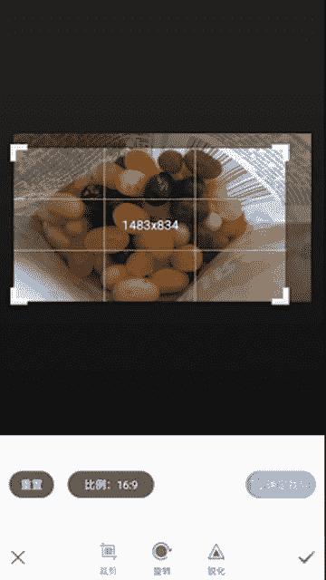

那么我们再看一下我们的这个构图的点，我们这张照片要干嘛？我们就像刚刚一样，哎呦，我把它拉过来。

我们看这个这张照片的核心点在哪里呢？核心点在这儿这儿这儿这儿是吧？我们要突出这些点的颜色。比如说我们这边这张图的话，我们可以试着去突出这个绿色。如果这个绿色有了，okK你们的食欲自然而然的就上来了。

我们来试一下啊，我说的话，你们可能感觉不到。那么我们P图的流程是非常统一的特效，然后HDR看唉这个绿色。😊。

它这是原图，而这个HCR了之后，绿色哦是变深了一些，我们可以选用它。然后在智能优化底下看一下。看哎，整个画面变白看，原来是黄的，就是大耳有点偏黄，然后变白了。这样的话能更突出对比，大家感觉到了吗？😊。

我用这个自动了之后，你看如果用美食的整体就偏黄了，那么我这个绿的地方跟外边的对比跟旁边的对比就很不明显了。看原来很明显一些。但是我用白的的话，你看我这个绿的跟这个地方的对比一下就明显了。

大家看一下原来不是很明显，因为黄跟绿其实很像。但现在呢我用了这个自动修图了之后，它变成白的了，白跟绿差的就多了啊。好的，那么接下来我们得到了一张看原图是这样的。哎，这样我们先艳多了。

但是先艳多了并不能满足于我们。这个只是那个呃幼儿园级别的修图，对不对？我们不能满足于那个啊，这是0到60分，我们再把60分的东西呢变到90分，怎么做呢？看我们刚刚的核心点是什么？把绿色调调亮，对吧？😊。

我们再用这个我们用刚刚的这个效果，我们看一下哦，那第二个这个挺好的，我们试着把这个绿色调出来。Okay。我们不能调太大，你因为你看调太大的话，这些橘黄色的东西它会抢镜明白了吗？橘黄色的东西抢镜。

所以我们把它稍微。看。原来是这个样子的，现在呢你看原来的这个对比就是绿绿跟这个蓝。你看原来的地方，大家看绿蓝，还有绿跟这个地方的对比哈，看原图是这样的，它其实有一点接近了。但是现在呢我们摁了一下。

就修了一下图之后呢，这个绿跟蓝绿跟这个紫，它们的对比就很明显了。所以这张图的食欲马上就上来了。大家感觉到了吗？这个就是我们关键点的一个非常重要的东西，我们把关键点那个点的颜色突出出来。

OK马上这张图就会变得抓眼球，实物就会充满食欲。大来对比一下。😊，这个是我们刚用美图秀秀修完的图，比原图已经好了很多了，对吧？因为它对比已经挺明显，但是我们再拿这个再来对比一下，哇，是不是差了很多。

明白了吗？原理就在这里，我们把关键点放大了。😊。

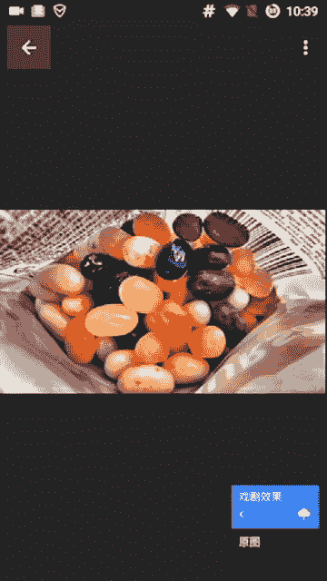

因为只有你明白了怎么去怎么去让这个东西变得更美味，怎么去让它变得更好看，你才能去调那个参数。不然的话，如果大家只是复制一个流程的话，是没有用的，明白了吗？我们再来看一些嗯什么照片呢，看这个照片吧。

这张照片就偏刚我们几张照片都是比较明亮一些的哈，这些都比较明亮啊。这张照片呢就比较偏那个。

叫黑色系啊，那黑色系的话，我们看一下，我们去还是一样的。我们用美图秀美化照片，我们看一下这个HDR好不好。哎，对，我们没画照片之前，因为我拍照的时候，我知道关键点选的是哪，但是你们现在不知道啊。

所以我们来看一下关键点呢，我们这张图用到的关键点是这个地方的相机和这个地方的这张牌王牌啊，它夹在这两个点中间。所以我们只要把这个王牌跟这个相机的这个。😊，嗯，感觉给突出出来的话，这张照片就会显得有逼格。

我们试一下HDR能不能帮我们突出这个感觉看。

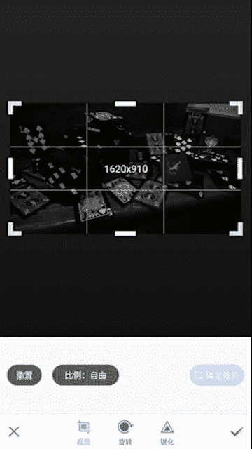

这个HDR呢跟原图的区别。哎，摁错了，HDR其实会好一些会好一些。原图的话，他们那个比较不清晰，用了HDR之后，它会稍微清晰一些。但是我们可以看到它是也是有损失的对吧？

因为这个黑色跟后面的这个区别就是颜色的区别变少了，所以我们试试这个哎看。

我们用这个自动了之后呢，我们的这个对比一下出来了。我们这里看这里的。颜色跟后边对比哎就有了。然后我们这个王牌也跟后面有了对比。我们看一下之前的话我们感觉不到这个照片的重心在哪里。但是我用了一下之后。

我会感觉到哦这个照片的重心就在这这个三这个地方和这个王牌这我们感受一下。之前的话我并不并不能就是一下子去抓住这个照片重心。但是这样了一下之后，我感觉啊这个他在跟我招手，这个三也在跟我招手，非常好玩。

这个就是一个构图的一个乐趣。

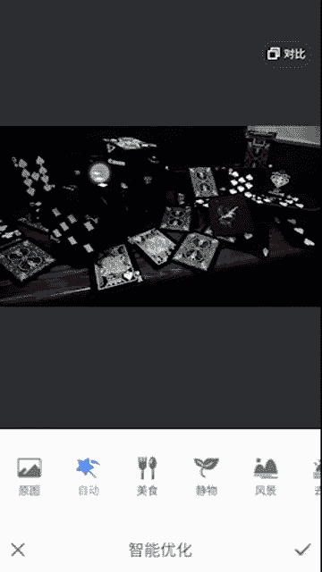

OK我们看这是原图。原图就是有点太朴素了啊，现在他在跟你招手了。

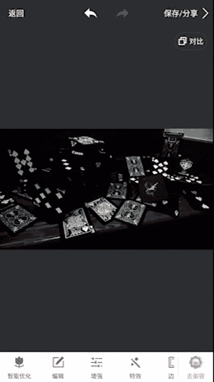

有活力了。但是这样我们之前讲了嘛，因为他只是到60分，60分再到90分，就是说我们需要把这个东西再给突出一下，我们再用s来。

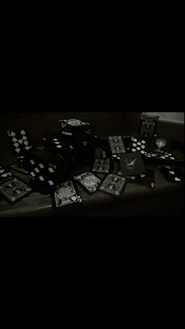

看我们还是用这个戏剧效果啊，我们试着用。但是你看我如果用戏剧效果到这个这个后边，如果用戏剧二的话，你看后边这个地方会变蓝，特别恶心，特别傻。所以我们就要用戏剧一。但是戏剧一的话其实也有点这样的效果。

大家可以看到这边有有有点这样的效果啊，所以我们把这个滤镜强度变小。😊，我们是置到后面那个那个效果呢不那么尴尬。你看如果最音强度太大的话，后面这个地方会很蓝，很不好看。我们试着把它调小。

后面就没有那么蓝了，然后呢，我们再把饱和度调上来一些。好，我们看一下我们这个原图呢，就是这个楼梯跟这边的颜色差别的就不是很大，因为都偏暗色系嘛，然后还有包括我的这边跟这边的差别不是很大。

但是我这样了一下了之后呢，它会有明显的分层。楼梯跟他有分层了，他跟他有分层了，他跟他跟他又分层了。所以这样的话我们的主题就会更突出。我看到这张照片的时候啊，就这里这里这两个点就是我关注的点。

那么这张照片还有一种别的批法，就是第一种啊第一种。把楼梯给弄出来，然后让照片分层。第二种方法是我们用这个暗黑的方式，就是昏暗，就是整个照片给人一种那种很风格化。因为第一种P图方法的话。

我们突出的是这个主题，我们是这个相机和这个牌啊。第二种P图方法的话，我们突出的是一种风格看。我们如果有这种这种的就是P图方法，我们可以选择换一换2都可以的啊。我们看一下，我们把这个滤镜强度稍微加大一点。

加大一点。因为它不会显让后面变成蓝色，所以我们加大了也没有关系，这个是怎么搞呢？如果我们想用这种突出感觉的这个P图方法的话，我们主要要做的就是这个黑。黑与白的这个对比，让白黑更加的这个突出。

试着去做一下。这个我们需要稍微去。感受一下。稍微等一下。这其实调对呃，饱和度没有什么。嗯。那先啊再等一下啊。好，那么我如果是这么P的话，你会发现我看这张照片的时候，我重点不在在这里了，也不在这里了。

我的重点在这个画面上，所有白色的部分明白了吗？因为我这个照片分层就不是很明显了。我那个关键点的颜色，我也没有办法突出出来了。不过没有关系，我突出了一种那种视觉的感觉，我会感觉这张照片很有逼格，为什么呢？

因为这张照片这个白的地方，黑的对方的对比非常的明显，明白了吗？这是两种风格，我如果按第一种风格来P的话，那么我的注意力集中在我的关键点的那个事物上面。明白了吗？你会第一眼看那里。那如果我这么批的话。

你就感觉不到我这张照片有什么重心了。你觉得这张照片没有重心，只是一个黑白的强烈对比，给你大脑中留下一深刻的印象，明白了吗？大家一定要去理解这种感觉。看之前的话，你可能会感觉到哦，这个我的重心在哪里哪里。

但是现在呢你就不会感觉到了。你就会感觉到一种风格啊，这就是两种这个修图的这个套路。它的一个原理啊，那当然这个还有很多种别的修图方式。比如说我们用这个HDR就太丑了。魅力光这样的也是可以的。

但是大家可以看到他其实并不能达到我们的那种呃想要的那种感觉。我我们可以去通过调整来让它达到我们的感觉啊。比如刚念的就太糊了。我希望大家能理解，就是我在讲什么。

这样的话我们这个东西就变成一个通用的东西了啊。他就不是说你必须要按用我这个滤镜，按我这么操作才能去P你你可以随意的去P图，然后展现出你想展现的东西啊。那如果你看。

之前的照片呢是这样的那这张照片呢有两个关键点，一个在这儿一个在这儿。那如果我哎呀。

。

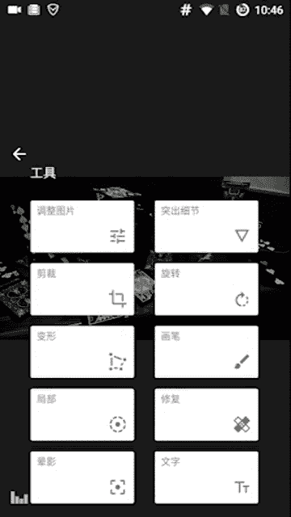

就有点尴尬。那之前的照片是这样的。那如果我现在这么一P的话，你会感觉这张照片的重心就在这儿，你第一眼就会看到这儿为什么？因为这个是关键点，而且它的这个点的颜色跟别的地方是不一样的。

你的照片就会你的注意力就会集中在这儿，而不是在这儿了。看之前的话，你可能集中在这两个地方，现在呢你只会集中在这一个地方，这是我们P图的这个作用，就是突出我们的关键点啊，我们不管是用什么滤镜，对吧？

我们包括用这些你看这这些的话，我们一看颜色我们就知道啊这个照片的关键点就在在这里这两个地方，那我们用这个的话一看就哇这个照片关键点就在这里，这是这张照片的核心。那么我们怎么P图，用哪个滤镜都是可以的。

那刚刚那两个的话，我觉得没有这个好，没没有这个这种风格感和这个前面的这个感觉好。前面我给大家P了吧。而且这个更简单。那我希望大家能明白我在讲什么？就是我们P图，不是说为了去让这个图的颜色好看。

不是这样的。我看很多人P图，他们会用，比如说像这样的什么就就就这样加一个这样莫名其妙的东西，对吧？你看如果加了个这个，那那这样的话就很尴尬，我不知道你想表达什么？你看我看了这张照片，我想表达什么呢。

对不对？你看这张照片，哎，我的关键点是在这儿的，是吧？但是如果你这个时候你就想说相机，那你就尴尬了，对不对？我根据我的这个文字的内容，或者我想表达的内容来调整我的P图风格，明白了吗？

大家可以看到我这些滤镜呢，外乎的我的所有关键点都是在这儿的，跟这边都没有什么关系。所以这样的时候就就很多人就不明白这点。所以他那个P图呢就属于是那种瞎P，就很尴尬，明白了吗？

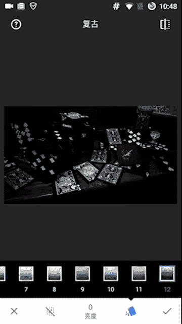

他不懂得去表现那个主题，他只是把颜色哎，这个是看着比较顺眼，但是。突出的点不一样嗯，那我们继续再给大家去呃实践一下，因为这个东西有点不太好理解。一开始我也不是很好理解这些东西啊。

但是后来慢慢的我就会去想啊这个东西应该怎么去搞。然后慢慢把它做好。那我们看一下这种呢是偏黄，就是是实物。但是后边这个底是偏黄的啊。

那这种时候呢，我们有两种风格要给大家示范一下。一种呢是这种偏黄的那种，就有点像怎么说呢？嗯，金灿灿的感觉。啊，一种是那种。OK我们就拿自动。这样。整个提亮了OK。一种是那种金灿灿的感觉。

一种是那种呃很有食欲的感觉。我给大家做一下那个对比。这个就很明显能感觉到那个关键点的作用。看啊，那我们看这张图的时候，关键点在哪里呢？关键点在这儿。所以我们可以去做。

因为我们看四个关键点都是比较模糊的边界，它并不是在哪个地方的上面，它是在桌子跟这个面包的边界上面。所以我们有两种风格，一种是突出这个桌子。一种是看如果我想突出桌子的话，怎么搞呢？呃是吃东西嘛。

我们不可能说吃的很冷色调的，所以我们要把饱和度变高，看饱和度变高一点之后呢，我们会突出这个桌子，我们会给人一种很金灿灿的这种感觉，明白了吗？这是第一种方法。看我突出的东西不一样啊，这是原图。

那现在呢你会感觉哇我这个整体的照片的感觉很那个金灿灿的啊，但你可能不喜欢这种，因为有的人不喜欢。那么们如果想让他变得有食欲一些呢，我们就换一种风格。😊，看这样的话，我们把桌子颜色调淡。

这样的话我们的关键点就会落在这个实物上面。你会感觉哦这个东西很有食欲，感觉到了吗？这是原图，然后这样的话你会感觉哦很有食欲，东西很有食欲。那之前的这种风格的话，大家也能看到吧。

我会感觉到哇这个这整个的感觉很精灿彩，这就是一个嗯关键点调色的一个很重要的地方。我通过关键点我突出的颜色不一样。那么我表现的东西也是不一样的。你们一定要理解这一点才能去好好的P图。那这种东西的话。

你看我用这个也是可以的。你看我用这些其他随意的滤镜，比如说我用这个复古里边复古里面这个很好用的，有一些比如说我用这个三啊，其实哪个都挺好用的，但这个这个一下明显，因为它是冷色调的嘛。

我们看这些冷色调的其实都不合适。我们吃的话，我们适合暖色调，或者是最后这个。😊，这两个黑白白这也都OK的。看我们如果有暖这种暖色调的这种滤镜，我们去调一下。Yeah。调一下亮度。

稍微有一点饱和度稍微加一点就行。吃的东西的话有饱和度好一些。这个不用太强，然后旁边加一个引，对，这样的话会更有那种集中的感觉。我相当于把我这个画面缩小了。看原来的话。

我感觉哇我的画幅是这就是我的画面是从这儿这儿这儿这儿开始的。那么我如果把它调大一些的话，我会感觉哇我的注意力就越往中心缩了，越注意力就集中在这个地方了，明白了吗？我这个调的越大。

我注意力越集中在这个地方？嗯，这是一个强迫的让大家去转移这个关键点的地方。那如果已经把注意力调到这儿的话，那我就是要就是围绕着这个吃的P图，我要把这个这个东西把它弄得好看一些，就OK了。

我们看一下怎么把它弄好看一些。怎么把它变得有食欲一些？Yeah。看这是原图原图的话，我的注意注意力其实还在那个四关键点上。但是我这样通过我下边的这个哎叫什么阴影强度，我强制性的把这个看原图的话是这样的。

我的关键点在四周，但是我通过加阴影强度的话，我能强制性的把这个视觉中心移动到这儿。你看这张图的时候，关键点就在这个中心上面明白了吗？这是一个很黑科技的东西，是不是大家可以去用到它。

这就是转移我们的这个视觉中心的一个核心技巧。看我现在把这个中间的东西P的有食欲。难道你会感觉哦这个整个画面都很有食欲，嗯，非常有趣是吧？

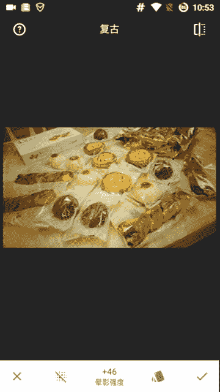

所以说这个P图它的奥秘它是很深的，它不是只是说调个色那么简单。很多人觉得哦我这个P个图就调个色，那那太low了是吧？我们P个图是要把它我们想表达的东西给它表达出来。我们再来最后一个哈。

我们看这种对比有颜色对比的呢。很明显，我们看这张照片，我们像别人看呃就是重点在哪里。😊，重点是在这个防晒霜上面，男士防晒霜。

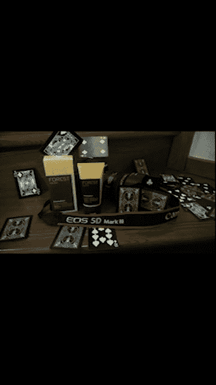

我们还是老样子哈，没化照片。😊，特效HDR对吧？很熟练。我们摁了一下HDR之后呢，我我们因为我们这个照片的这个重心呢，就在这个防晒霜上面。我构图的时候就是这样的看。就在这里。

那么看这个两个关键点落在这个黄色的地方，所以我们只要把黄色突出了。那么OK这个照片关键视觉中心就很明显锁定在那。你看这张照片第一眼看的时候，因为我这个黄色跟后面其实不是差别很大。

所以你并不能一下子集中在那儿，但是我只要调一下我后面变暗了，这个变亮了，它就非常的抓眼球，你们有没有看到这种感觉，感觉到了吧，很明显是吧？那我们再用这个字智能优化OK我们看到它又把这个这个东西加亮了。

所以我们可以用它。

自动看原来就是这样不眨眼球，现在呢一下我注意力就被死死就空在这儿了，明白了吗？这个就是一个调节这个关键点的亮度的一个用处，能把我们的视觉锁在那。那如果现在是现在其实已经挺不错的了。

但是我们讲了那只是60分，我们想做的在抓人眼球一些看这样肯定不行。因为这样的话，我们把这个地方变亮了。那么他俩的对比就小了，明白了吗？就我们P图不是说一味的去找一个滤镜啊，而是说我们要知道我们的目标。

我们达成目标的方式很多，明白了吗？我们可以调暗这个也可以调亮这儿，那调暗这或者调亮这都O的。但是我们一定要知道我们想要什么。不是说我调个色，那彩螺它饱和度越低的话，越暗。

所以我们要把这个饱和度调高让它变亮，明白了吗？戏剧效果的话，其实是这样的，它能增加你这个结构，就整个照片的结构。看这样其实并不是很好。因为我明显大家可以看到啊，之前这个东西的话很抓眼球。

但是现在并没有那么抓眼球了。为什么大家可以看到我把这个地方调亮了。感觉到了吧？这里跟这里的差别就变小了。之前的话，这里跟这里的差别很大，明白了吧？那如果你按我之前讲的就无脑那么批的话。

你完就意识不到这点，你就这么就结束了。但是这样不好，我们的目的就是把它去。调一下，所以我们要换一种别的啊，我们不用斑驳。我们平时用的就是这个戏剧效果和这个面女光晕，我们可以用看一下它都有什么效果。

我们P图是用脑子P啊，不是那种无脑子。哎，这个还不错，我看一下。Yeah。饱和度稍微高一点。好，这是原图，这是现在我们会感觉到哦这个东西看原图。现在啊这个上边稍微暗了一些，能感觉到这是原图。

这是现在上面暗了一些，然后下面亮了一些原图。现在O那这样的话，我们更接近于我们的中心了，更接近于我们的目的当中这么P图可不可以O没有问题。然后我们一般在用这个复古。

我们一般就用这个三个就是这个戏剧魅力光晕，还有这个复古么戏剧魅力光复古。那还有一个很好的这个叫突出细节，它其实就是跟我们戏剧效果一样的。大家可以看这有两两个上下滑会有两个，一个是结构，结构用大的话。

大家可感觉到这个颗粒感不是就就是每个东西的分离感变更强了，它不再互成一团了。这是原图，这是现在啊如果锐化的话会加一些，就是让你的边缘更好一些。那么这个到时候我们后边讲黑科技的时候再讲这个不是很好掌握。

不过没有关系。😊。

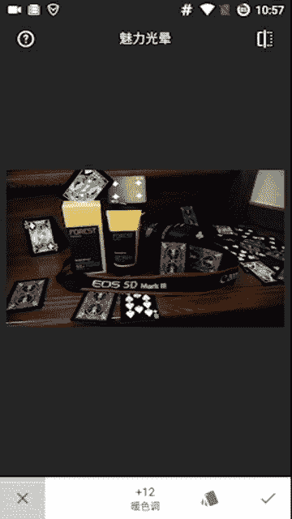

哦，我们的目的是什么？再看一下啊，看这个是不是很好的满足了我们的要求，它把后面变暗了，对不对？这个滤镜行不行，没有问题，这是圆图啊，这是现在它把后面变暗了，对吧？这边没变量，没有问题，对不对？

那么再看这个。😊，把，这后边的。这些这你看这个冷暖色的，你看这个照片，我们的主题色，哎呀，我怎么调了一下，这个照片我们的核心点在这个亮暖色的地方，所以我们要用暖色的滤镜，不要用这种冷色的滤镜啊。

这个别人都不会跟你讲，因为他们不明白这点。大家可以看我们这个。也是OK的，因为他一板后面变暗了嗯。这个也是OK的。所以我们就选择其实很多，我们怎么去做都可以。

只要找一个我们觉得最顺眼的那比如说我们拿这个去做。看这是原图啊，就是现在把这个变暗了，然后这个变亮，然后这样一下。看这是原图，这现在更抓就是你的眼球了，你的眼球就在这个和这个上面了，非常有趣。

我们把亮度稍微调一些，亮度调大的话，我们会把这个地方变亮啊，饱和度稍微来一点点1点点就够。晕影的话强制缩一下啊，也不用缩太。OK这是原图，这是现在。你看这原图的时候，你还视觉可能还有点分散。

因为后旁边这边也比较亮，但是现在呢一下就锁在这儿了，根本就不会往别的地方看，明白了吗？这个就是一个核心点。

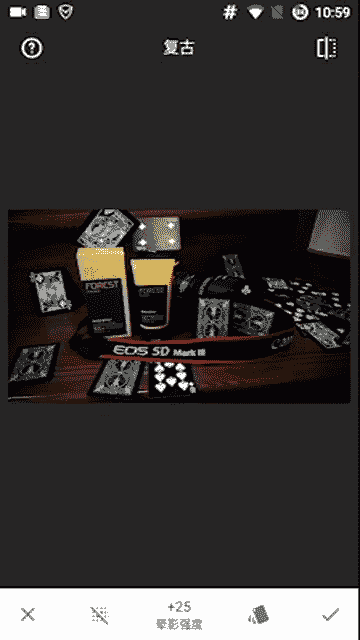

所以我希望你们能明白这个真正的修图的原理，不是说像别人那样什么用什么滤镜那，真的我就感觉就是他们就是用什么破软件，用那个教你几百个滤镜，那什么破玩意根本不懂原理，我们懂原理了，我们只要调一下色。

一两分钟的事情。我现在P图就是一两分钟的事事情，我一经有这个感觉了，一两分钟，我想突出什么，然后衰弱什么，对吧？我有这个目标了。然后我找一个合适的滤镜，很简单，明白了吗？嗯。😊。

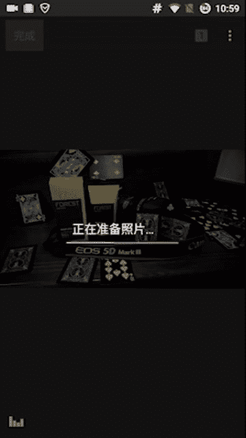

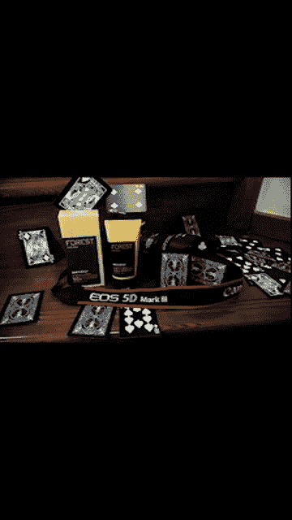

那这个这节的内容就到此为止了。那下一节呢我们再给大家讲这个人像，人像有很几很多种啊，一种是我们正脸的，一种是那种侧脸的，有意境，正脸的拍那种嗯五官。然后侧呃就近照的话，我们照的是那种五官，然后远照的话。

照的是那种意境。我下一节会给大家讲解啊。我希望这节大家能够明白我在讲什么，这是一个非常核心的一个原理，你们一定要掌握。如果你有不明白的地方直接在微信里面问我，不要不好意思，明白了吗？

有不明白的就问这节很重要，影响到你后面能不能把图修好啊，那本节的内容就到此为止。然后我是miss，我们下节视频再见，拜拜。

