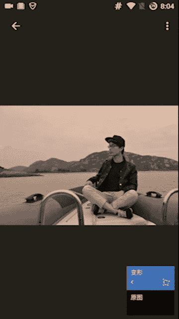
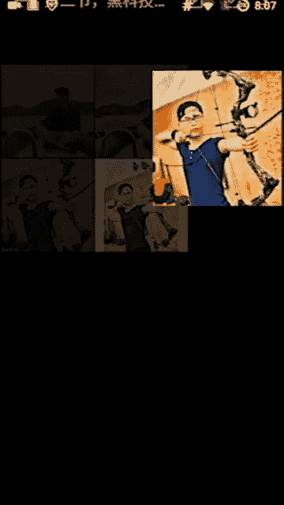
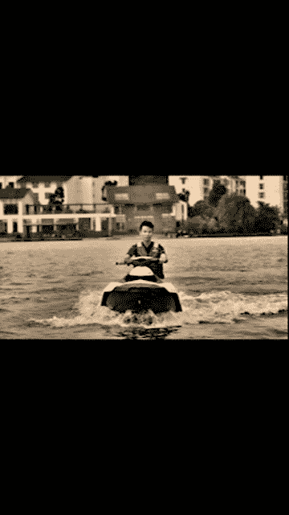
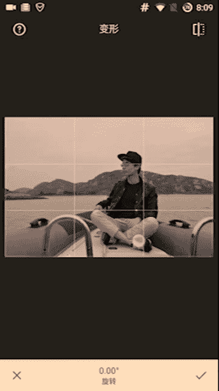

# 1、02niss《修图黑科技》：第二节，两个黑科技构图法（12分钟）

嗨大家好，我是n。那今天进入我们的这个修课的第二节，今天来讲一些黑科技的构图吧。那上一节呢我们讲了这个变形呃，我们讲了剪裁构图啊，那么这一节呢我们给大家讲一些我们的变形构图。

包括我们的这种呃不仅仅是改变图片内部形状的这个构图，还有改变图片外部形状的那构图啊。那之前一节的这个视频录制的时候有一些色差偏色。那么这次呢再给大家看一下这个效果图，就是说你们上完这个课程之后呢。

你们的照片都是这种感觉，包括这个拍出来的构图啊，包括这种修图的感觉都是这样的。东西呢很有食欲，食物有食欲，对吧？然后东西呢要有逼格。让人觉得食物让别人觉让别人觉得很好吃。

这样特别的东西呢让别人觉得很有逼格，这是我们的一个目的啊。之前的偏色，所以大家可能没有好好的去观赏到啊。对，东西要逼格，让别人觉得很向往。那么继继续我们来讲一下这个第二点，就讲这个黑科技变形构图。

变形构图有两种。第一种就是说像我们上一节讲的，哎，我们把这个图片内部变形。那还有第二种呢，这这个我们马上就要讲解，我们先简介一下。第二种是这样的，比如说我们这张照片它构图不是说特别好。

但是呢他如果是说这样的，比如说我们上传一些社交软件，比如说像什么陌陌呃，或者探探或者instagram这样的社交软件。他要求你是方形的图，它本来就不是特别好，然后它变成方形了之后，它就变得更差了。

这样的时候怎么办？我们可以加一个白边。用美图秀秀加白边来帮助做从外部来改变我们的这个构图啊，就是你们我告诉你们这张照片，不加白边的这张照片，构图跟这张加白边的照片的构图是不一样的。你们一定要记住这一点。

加布加白边会改变你的构图从外部。那具体是什么呀？我们待会再来讲啊，先来讲一下我们这个内部变形构图，不加白边的情况下，内部看我这个时候人在这儿啊。

到了到了旁边的位置，那上一节就是候我们讲了嘛？之前我们人是在这里的，哎，之前人在这里就在这个线的左边一点，然后我们把人移过去了，这个时候我们要怎么做呢？

就要用到一个我们之前要求大家下的这个snapse这个软件。我们整个教程只需要用到两个软件，一个美图秀秀啊，一个snapse两个足够了，其他那些什么滤镜软件的功能，用这他俩都能实现啊，我手机里之前有就是。

😊，就有几十个这样的修图软件，然后我用了几千个这样的滤镜组合这样的。我发现这两个软件可以实现其他软件的任何的一个效果，而且他们非常的简单易用。所以大家一定要就是把这两个软件用好就OK了嗯。我们来看一下。

首先是这张照片。我们要把它调整。首先我们打开这个看打开了之后，打开这个照片之后，我们点这个右下角这个画笔就在这里啊。点它之后呢，我们点这个调整照片的话，就是我们之前讲的剪裁构图。

那这里呢我们用剪裁构图是可以的啊，不是不是对不起，不是是这个剪裁，我们可以用剪裁构图，对吧？我们把人移到这里是OK的，没有问题的啊，但是这一节呢我们就不讲这个，我们讲变形构图。

看我们现在人离右边的这个两个中心点是有一些距离，在看离这个两个中心点有一些距离，我们要把人怎么样呢？首先我们如果是我们向上下滑动，因为这个如果是直接第一个看水平啊，垂直透视。

我们这样左右滑动会改变它的大小看这是上下的就是仰视俯视这样的一个角度，那我们之前讲了我们上面这条线呢，上面大家看上面这条横线，这条横线。是要对着我们的这个眼睛这个地方的，所以我们把它弄小一点。

对着这个眼睛。ok。😊，眉毛接近眉毛的地方okK差不多了。那接下来呢我们要把这个我的这个脑袋呢移到这个点上面往右移。所以我们要调到第二个水平透视。第A看我左右移它的效果是不一样的啊。能看能感觉到吗？

非常黑科技哈，它会自动帮你补齐边缘，所以非常的牛逼。😊，把它挪过来OK然后让我这个身子呢基本上就哎挪到这个地方了，看这是原图。原图我离那线很远，而且呃原图眼睛还不错。呃现在新图呢。

我直接就到了这个角落了，看我的人就直接在这个线上了，100有点稍微大稍微小一点。Okay。😊，看我的人就到了这个线上了，感受一下这个区别。😊，感受一下原图的就感觉漫无目的的船就停在这儿。

但是换了一下这样的角度之后呢，我就感觉船在行驶，在往前行驶，明白了吗？一下子有了动感，这就是构图的一个非常核心的一个定东西。而且我。这样做了之后呢，我整个的这个呃怎么说？

叫我的照片看起来就磅礴大气了很多嗯。OK我们把它保存一下，大家就可以看到了。这个时候我们要再P1一下，那P一下的话，它不不是因为人像嘛，人像呢它需要用到美图秀秀跟这个snapse的两个工具。

那如果一般实物的话，光用snapsed也可以，但是snap光用napse会慢一些。美图秀秀会更快一些。所以我推荐大家也是用美美图秀秀加snapse的这样的一个组合。那不管是人像还是别的照片。

那具体的P图方法，我们后边再讲，我们先前两节先讲这个构图，第一节讲剪裁构图，第二节讲变形构图嘛。😊，啊，那我们先讲完了这个内部变形构图，大家感受到了吧？这个区别啊，那我们接下来再讲一下。

大家再看一下这个区别，这是原图。这是改变之后，这区别很明显的啊。动感动感。

之后我们再讲一下这个外部的这个构图。这个外部构图怎么搞呢？外部构图就非常的好玩了，就是加一个边。你看首先原来这张照片它的我们来看一下像美图秀秀。我们加白边的话是要用美图秀秀的啊。

看首先我们来看一下这张照片原本的构图。大家可以看到我这个这个电横线呢是在我的眉毛上边一点，就是它如果再下来一点会更好。但是如果下来一点的话，我这个弓就显示不全了。

所以眼睛这个横线这个眼睛这个地方是没有问题的。但是呢问题在于这条线。他在我的这个照片里面的左眼就闭着的那个眼睛那边太偏向于那里了。如果他能往这里移一点的话，会好很多。但是现在问题在哪里呢？问题在于。

如果我往这里移一点，哎，看我这边线是移了，但是我这边右边的这个弓又显示不出来了，它就很尴尬。😊，我可以通过剪裁调整构图，但是通过剪裁调整了构图之后，我的照片细节。你看我这样做了之后，我整个人是更突出了。

但是我的功就没有了就不全面了。那这样的时候，我们就需要用到这个黑科技的白边加白边外部修改构图。我们不损失照片细节的同时，我们还能改变这个构图。好了，原来我这个大家看是这个线呢。

是在我的这个闭着的眼睛这边的。😊，但是当我们加了一条白边，白边在哪里看这里有个边框，看到了吗？这里有个边框。正常在这里啊划一下，有个边框。点一下边框。然后点这个白边框。OK一下就可以了。我们不需要缩法。

正常的话，我们不需要缩索法，它自动给你弄成一个正方形，这样的话你就可以直接上传到什么探探啊、陌陌呀、instagram上面了，非常好啊。😊，大家看一下啊，这个时候构图就改变了，我们什么都没有干。

直接加了一个白边构图就改看原来呢我们的这个线是在我的闭着的眼睛上边，但是现在呢这个线就到我的睁着的眼睛这边了啊，那么整体经过这样的稍稍的改变了之后，构图就变得非常好了。看。😊，就比刚刚好了很多。😊。

看你这样的话，你的整个照片的中心就到了我的身上。之前的话没有在我的身上，就有点嗯比较盲目一些。之前的照片是这样子的这之前的照片重心你其实抓不到，你不知道重心在公呢，还是在我身上。

但是经过我这个简单的加一个白边之后，一下子功就失去了这个照片的中心地位，就是照片的中心就直接到了我的身上，这就是一个外部通过外部的这个编辑来去修改构图的一个核心方式啊，就是加白边。😊。

那么大家如果是怎么那怎么判断我到底要剪裁还是加白边呢？大家可以看我们第一节的这个例子。😊，我们第一节的例子是稍微等一下。放弃。根据例子来看啊，看我们有的时候整体照片啊没有动感。这样的时候。

我为了让它有动感，让它更大气磅礴，我们会用到变形构图。就像这种这个例子是用变形构图的啊。

那这个例子用变形构图也行，也可以的嗯。

这个这种呢就比如说我的照片整体细节，就是你看啊我这两张照片有什么共同点？就是如果我从剪裁掉了的话，我照片会失去一些东西，明白了吗？我这两张照片都没有什么多余的东西。两张照片里面都是比较饱和的。

饱满的就剪裁掉任意一块都非常的可惜。这样的时候我们用变形或者加白边的方式去改变我们的构图。那大家都可以试一下，我先变形一下，看看怎么样，然后我再加个白边，看看怎么样。然后大家来对比一下，不要觉得麻烦。

这样的一个小的改变，会让别人眼前一亮，明白了吗？一定要做这个事情。啊，如果是说像这种看照片就有很多多余的细节，就后面的这房子什么东西啊，我都不想要一点也不想要，其实，但是没办法拍进去了怎么办？

这个时候我们就可以通过剪裁来把后面的这些东西给剪掉，明白了吗？这个就是我们的一个选择方式。如果我们照片不是很饱满。😊。

乱七八糟的废就是很废的东西比较多。那么okK我们就用这个剪裁构图。如果我们照片就是很很满了，然后我不想删掉任何一些东西，我们就变形，或者是这个加白边。那变形再重温一遍啊。

snap seat打开snap seat之后呢，点这个小笔点笔之后，这有直接有变形变形之后看第一个就是垂直垂直就是这样的这样的一个变化。上下上下变。然后第二个就是水平透视。那。

snapse的使用的话非常简单，大家只需要大概两三分钟就能入门了。入门一开始你可能有点懵逼，不会用，但是两三分钟之后你马上就会用了非常好用的一款软件啊。

然后加白边就是美图秀秀，打开美图秀秀之后这个美化照片，然后点击你想要这个加的照片，然后你加一个边框，白边框就OK了嗯。那本节的内容就到此为止了。那那我们我们下节内容再见。

