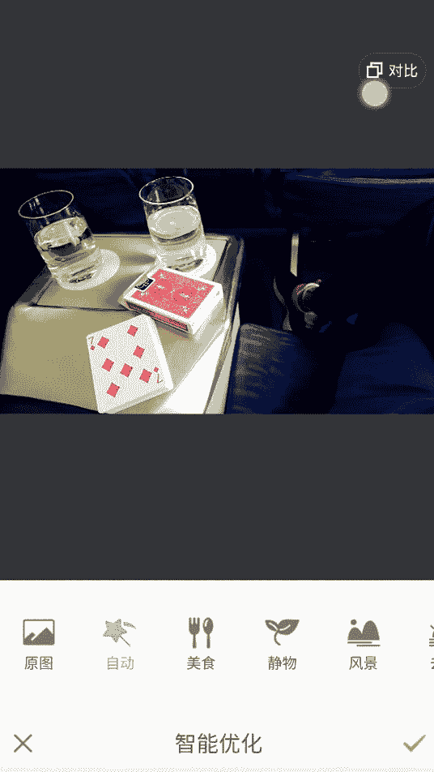
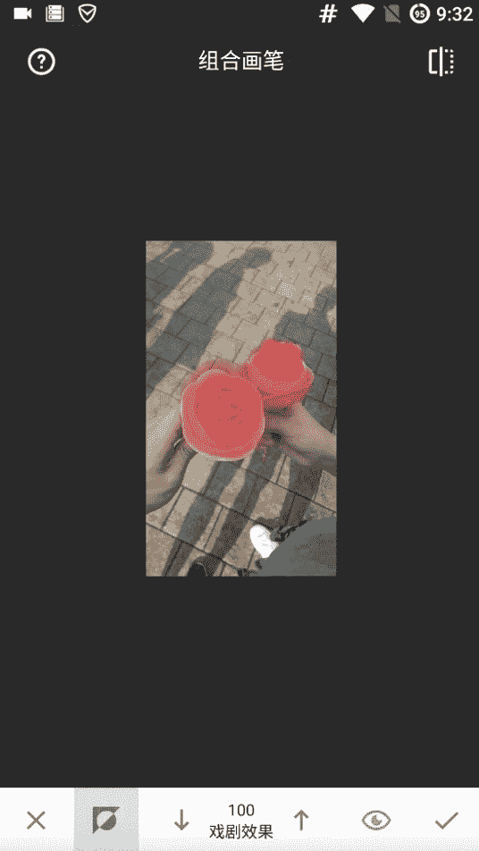
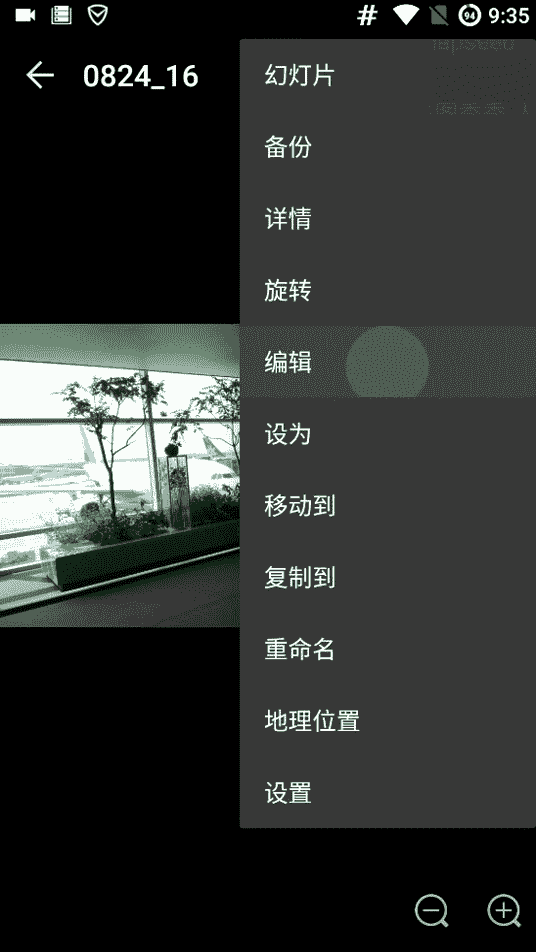
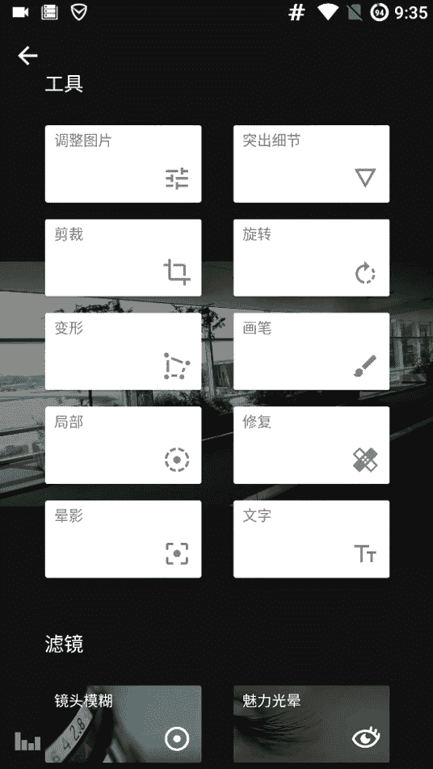
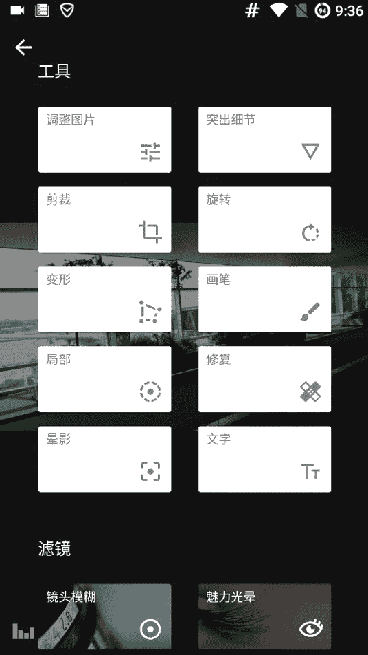

# 1、02niss《修图黑科技》：第五节，修图黑科技——图层

嗨你好，我是miss。今天来给大家讲，之前给大家讲了我们的构图啊也好，修图的方法。今天给大家讲一些黑科技的一个东西啊。就是说我们在修图的时候，可以用到一些黑科技的东西来让我们的呃图片变得更加的好看。

那在这里讲我们的第一个黑科技，我们的黑科技非常的多啊，我们讲第一个。这个东西呢这个黑科技叫。我管它叫涂层嗯。我们首先像正常的之前我们交的P图一样，我们来呃温习一下哈，先HDR，然后不错。

然后再用一个智能优化自动的OK。

看一下对比O。我们就把这个保存起来，保存起来之后呢，我们先用美图秀秀来批嘛。这个是警物的，然后再用sstepps。

snap的话，今天给大家教一个图层，图层怎么用的？比如说我想做一个很酷的一个效果，很酷的。比如说黑白。

黑白的效果。O黑白效果有很多，我找一个比较酷一些的。这个吧这个也好。就拿这个中性的中性的这个黑白，那么原图是这样的，它是这样的。但是黑白这样的话就是哎是酷了一些，对吧？你酷是酷。

但是并没有那种很有范儿的感觉啊，你知道什么叫有范儿的感，你我直接跟你说，你可能不明白哈。那接下来我再告诉你怎么去做成一个有范儿的感觉。那么OK我们可以看到这里这里显示了一个一，大家看到了吗？

那么我们这时候点击一个一的话，我们可以看到啊，这是原图，我们加了一个黑白效果啊。然后呢这个时候我们再点击这个黑白，这个图层这个功能是隐藏的一个功能。所以我们很难去找到正常用很能去找给大家讲解一下。

先再在来温习一下，哎呦，我闻错了，闻啊。对，OK我们先摁一下这个一摁一下这个一。右上角的一，然后点完之后呢，看这是第一步，就相当于第一步。我们图片导入进来是原图。然后我们加了一个黑白效果啊。

然后我们把这个黑白效果呢再点一下，点一下这个黑白效果，然后出现这个单嘛，出现这个单之后，我们点中间的垃圾桶是删除这个效果。然后这个呢这个调节是调节这个效果，明白了吗？

然后看中间的这个呢叫图层图层是什么概念。我们可以看到我们刚可以假设那个黑白是一个效果的话，我们可以看我们点这个键。😊，这里这里这个键的话，我们可以看到这个红色的部分呢都是添加这个效果的部分。

也就是说我这个黑白效果应用在这个所有的地方，明白了吗？应用到图片所有的地方，所以整个图片都是黑白了。那么如果说我把这个看我现在下边这有个值，这边下面有个值。我如果100的话，证明它是最红的颜色。

零的话它就是透白色，就是原色，就透明的色。这个是什么意思呢？这个就是说我如果100的话，我的黑白效果值是100。那如果我75的话，你大我先给大家示范一下，大家可以看到25的话，这个红色会淡一些。

看这是25，红色会淡一些。然后50的话，红色也会淡，比25深一些，但是比100要淡。那75的话是要比50要深，然100的话就是纯红啊，那么零的话就是没有效果，25的话就是4分之1的效果。

4分之1的黑白效果，50的话就是50的黑白效果。我这么说的话，你们呃很难理解，所以我给大家试一下，最左边我们是零的这个黑白效果，然后第二条呢，我们这边放着25的黑白效果。第三条我们放50的黑白效果。

第四条我们放75的黑白效果，然后给大家看一下，感受一下，你们能感觉到吗？这是个渐变。这这行是0，然后看这个是这是。😊，哎，稍等一下。这个是原图，然后现在呢这这一栏最右边是100的效果。

这是75、5025。呃，这是零黑白效果明白了吗？那么这个东西要怎么用呢？这个东西可以去突出一些我们呃想要突出的东西。比如说我们可以这么用。啊，首先呢我们你看一开始默认的。情景是这样。

就是所有的地方都不加黑白效果。然后我们点一下这个。最左边的这个按钮，这样的话我们就可以让它全加上黑白效果。那我们做一个效果哈，就是让这个排合排合是红色的嘛，它很艳。那我们先把这个黑白调到0。

然后我们去把这个排盒呢给它放放大一些，这样好描就把排合的这个地方红的地方给它抠出来，把它擦掉，擦成透明的。哎，大家可以看啊，我这样要先粗略的擦一下。把边擦一下。这个是因为是一个黑科技效果。

所以大家要有点耐心啊。O我这样粗略的擦了一下啊，把这个拍盒。然后接下来呢我们去做一个看看我们有一些做的不平整的地方。比如说我看你看哈，我把这个排合的这个蓝的地方也给弄没了。但这个地方要加上黑白效。

不然它就蓝了。所以我们给它画上画成红的，填成红的，就只留出来原来原来红色的那个地方，排合之中红色的地方呢哎。我把它调到0，然后把这个擦去。让红色旧是正好不覆盖那个。排河这个地方我们哎粗略的弄一下。好。

大家正常的话，我们可以把这个边缘呢都给弄得好一些。但是现在呢大家明白我什么意思就可以了。我先给大家。对，试着把边缘给你们弄好一些，让你们知道怎么做。那剩下两边我就不给你们做了。

那大家可以慢慢去磨这个东西可以精精细的去操作。对吧但是在这里因为时间原因，我称大家可以看到，我们先放大一下。这还是有一些瑕疵哈，不过我们可以看到这个整个图片呢红的地方，那些大红的地方。

喷雾的红色的地方都是看。加上了黑白效果，但是我们的这个红色的这个牌的地方呢，它没有加黑呃黑白效果。我们来看一下效果是什么样的。看整个图片都是黑白的，只有我们的这个红色排合呢，它是红色的。

这样是不是就特别有逼格了。那我们上一节大家如果注意的话，我们讲到了啊，那你们一定要注意对吧？我们讲到了我们这一张图片的视觉中心呢在哪里。😊，O我们先把它全都涂上。

我们这张图片的视觉中心其实是在这个七这个地方。所以我们在做为了呃我们可以把这个视觉中心的地方。如果它是一个艳色，比如说像红色这样的艳色，如果我们可以加个黑白效果，然后突出艳色，这样的话效果非常的好。

尤其是红色，这样的话有一种非常酷的感觉。我们加上黑白效果之后呢，我们来看我们把这个边儿描一下白的地方，因为黑白效果弄白了也是白的，所以没有关系。我要把红色这个地方，就是你看大家可以看到这个牌外边是黄的。

所以一定要把那个地方涂上黑白效果。不然的话效果就不太好了。我们稍微稍微惊喜。我们把这个牌上面的这个都给擦掉。好的。哎，这边我就我就先。看我给大家示范一下，这怎么去把这个边缘很好的处理掉。

就不要直接去擦这个边儿，直接擦边儿的话，因为它是圆形的，它旁边有一些扩散效果的。所以你只要哎看我没有移动到这个边上，我到这里的话，它已经把边擦上了，所以大家可以慢慢的擦看。就这样的精精致处理。

那那剩下这个地方，剩下这边呢我就不精致处理了啊。我现在现在先因为赶时间吧。大家也不喜望看我在这磨磨唧唧做这个，但是看一下效果。看因为我们的视觉中心本身就在这个红的地方，红方方片漆。

然后我们现在再加了一个这效果之后，啪整个照片就非常的突出了。你看这张照片的时候，一定就在看这个方片漆，明白吗？就是非常呃那种炫酷的效果，这就是一个图层效果，那图层效果还能用到什么地方呢？

同哎呀呃对我先把这个照片存一下。😊。

涂层效果还能用到一些地方。就比如说呃你看哈我这张照片，如果我想做一个我想用到那个。比如说我这张照片，我想让背景，哎，我们之前讲了吗？我们正常去修照片的时候，我们不要去用那个大家看这个戏剧二的效果。

我跟他讲了吧，因为这个阴阳很明显，但是我们现在其实是可以，因为如果说你看戏剧二的背景这个变化明显比戏剧一要更夸张一些，明白了吗？所以有的时候我们希望背景更夸张一些。

你看这个背景颜色质感比要比戏剧一更加的夸张，有的时候我们想要这种夸张的效果，但是呢我们又接受不了这个脸脸色呢变得太太诡异。那我们怎么办？啊，这个不是原图，这是修过的图。所以这样啊为了给大家演示嘛。

演示没有关系。这个图修过，然后再加个效果就不是很好看。大家看啊，我们直接讲了，我们先按一下这个键，然后这样的话整个画面都加了CG2效果。然后呢，我们把我们的脸和我们的手就是在阴阳的地方，我们给它刮掉。

我们给它擦掉。😊，我们只要把阴阳的地方擦掉呢，那我们就不会出现阴阳的效果了。那么阴阳的那个就是戏剧二的效果，整个戏剧二的效果都只会出现在这个背景里边。这样的话我们让背景变得更夸张了。

同时我们的脸呢又不会变得阴阳，这样就非常的好啊。这个黑科技我一般人我是不告诉他的。看精修，看把边上精描精描。O。大家看我就拿脸来举例子啊。看。看到了吗？这个就是我把背景都弄成那样了。

但是我的脸呢脸大正常的话，应该把皮肤包括我们的胳膊这边，你看这是原来的图，看我的脸是没有变的。这是原图，然后我松手就就是新的，看我的脸。是颜色没有变，因为它没有附加戏剧二的效果。

然后别的地方呢都附加了戏剧二的效果。这个东西非常的黑科技哈，非常的好玩。😊，嗯，退出吧。然后这个东西呢，它可以用在比如说我们这样的对比很明显的图，看这个东西我给它加一个。

就这个就其实就像刚刚那个红的一样，这种颜色对比明显的图呢，我们可以加一个这个黑白这样的效果，然后突出这个颜色。那么有的时候我们也可以拿这种实物的图去突出这个实物的颜色。就比如说。

呃呃，这是已经修过的。找原来的图。正常我们应该用美美图秀去HDR一下。但是我现在呃为了让大家看起来更舒适一些，所以我就不不不去做那个HDR了。我就直接拿这个呃snapnap seat来做。

OK那么有的时候呢，我们看我们加了一个效果之后。我们其实可以看这个美图秀不做HDR的话，背景就不是很好。看我们先把所有的地方都加上这个戏剧的效果。然后呢，我们把这个冰淇淋的地方。啊，应该给它精描出来。

精描出来。给大家示范的是什么呢？我们可以做多重的效果。看啊。首先比如说我现在这么做。这样的话我是看我可以这样。我摁一下，这个就是反向选择。看我原来是所有的，除了冰淇淋以外，所有的地方都加了戏剧的效果。

但是现在呢我只有冰淇淋加了戏剧效果，我们来看一下。

这样的话是不是更加的好玩了呢？就是你突出的东西变得更加的突出了，别的地方没有变，你就感觉这个图片里边这个冰淇淋变成了3D的那种感觉，别的地方都是2D冰淇淋变成了3D这细剧效果就只附加在这个冰淇淋上。

突出了这个冰淇淋。但是大家可以看到我们这这个边缘会有一些这个呃刚刚没有去精精修好的地方，这个大家可以慢慢调节，就比如说看我们感觉刚刚边缘你看这个边缘有瑕疵，对不对？我们就把它调到零，把它抹掉就可以了。

😊，这都不是事儿。小事都是小事。OK然后我们现在再来看看这个瑕疵就没有了。刚刚这个地方有一个瑕疵，现在就没有了，看这是原图。这是原图。再看现在。原图现在是不是感觉瞬间就有了那种感觉。

就我们不改变别的东西的情况下，我们去做这个。那这样的话，我们还可以去做多重效果。我给大家举个例子啊。比如说我们希望让这个背景呢变成这个样子啊，但是我又不希望这个东西加在朋我们在。把这背景调的更。

看我们希望这个东西。我们希望这个背景变成这个样子。但是你看哈我们原来冰淇淋是这样的，很亮。但是加了这个的话，冰淇淋就变暗了。我们这个时候怎么办？我们再按一下这个，现在是二了，因为加了两个效果嘛。

我们看可以看到这是一个原图，我们加了一个戏剧效果，只加给冰淇淋。我们在这儿可以看到只加给冰淇淋。😊，对吧然后呢我们再把这个复古效果呢，我们在除了冰淇淋的地方。都给加上。这就相当于什么？

我只给冰淇淋加了戏剧，然后呢只给背景加了复古。这样的话我们就可以实现同一个图片里边多个不同的元素，用不同的效果去做，懂吗？这个就是其他人家做不到的，对吧？那些什么滤镜软件。

我知道大家很喜欢用什么听一些人用什么VS这样的东西，那个没有这个snapse好用，明白吗？那个是。那个是入门滤镜，明白吗？这个是snap seat，呢，是更高黑科技的东西。你看。

这样一下子我们只给背景加了那个效果。然后呢，我们的这个冰淇淋也没有受到影响，我们的冰淇淋还是这么的3D，我们的背景也变得更加的呃那种昏黄的感觉。然后我们的冰淇淋跟这个背景的对比就更加的突出。

看原来是这样子。然后现在呢背景更你看冰淇淋一下瞬间变3D的感觉，哎，很帅是吧？所以这个就是多重效果的这个图层，我们可以给不同的元素加不同的效果。那嗯。就是这样。然后呢。

还有一个东西就是说呃要给大家讲一下，之前忘了给大家讲了，就是调节构图的时候，我们可以把一些东西呢给它做的这个斜一些。不是做的斜一写，就是我们可以通过倾斜它来去调整构图。

我们可以用这个snap seat打开snap seat，然后里面有一个旋转效果。

看它会自自动帮我们旋转。但是我们其实自己呢还是可以去。旋转它。看因为这个照片本本身拍的时候，你看它不会对正，你看它会自动给我对正到这个花这个不花坛吗？花坛的这个横沿，它会跟我的这个构图线看到了吧？

你大家再看一下它这个逻辑很好。

哎，他没有，你再看这样子，如果这个花坛跟这个构图线。弄平。的话我们就是另一种构图的感觉看哈。给大家看一下，感受一下，这是原图，是这种A感觉A。然后我们再把它旋转一下，它就成了感觉B。

那么我们平时拍照的时候呢，我们可以去让这个因为我们可以看到哈这张照片呢有两个地方，一个是我两个对齐方式，我们可以跟上顶看这个上顶平行，我们也可以跟这个花线这个花坛花坛的线平行。

我们可以用很多种的不同的方式，我给大家再示范一下。我们这个可以调整啊。假如说我们现在要跟上顶平行的话，我们是怎么样呢？OK现在的话我们就跟这个上顶平行了。看，就是每种对齐方式呢是有不同的这个效果的。

我们可以选择不同的参照物，不同的东西跟我们的这个构图线形成平行，这样的话会让我们的照片的观感变得更好嗯。

然后这个我们的这节黑科技的内容就到此为止了。然后接下来呢还会给大家介绍一些非常非常好用的这个黑科技的东西啊。那我们下节视频内容再见，拜拜。😊。

